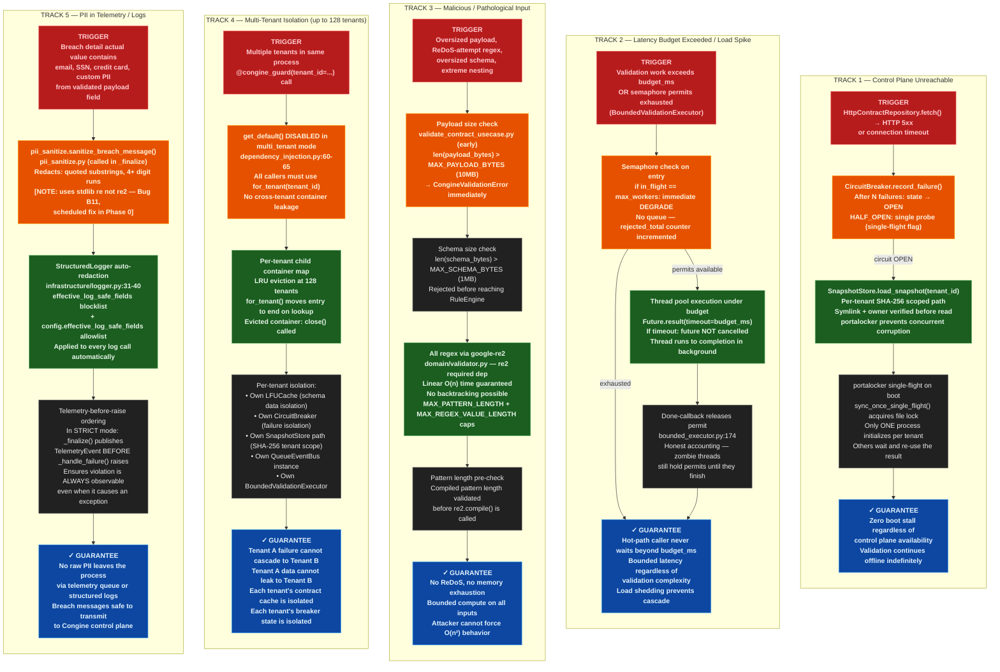

# CONGINE — COMPLETE ARCHITECTURAL DIAGRAM SET
## Four Mermaid.js Views | Paste Each Code Block into https://mermaid.live

> Instructions: Each diagram is a separate code block. Copy each block individually
> and paste it into https://mermaid.live. The left panel accepts the code;
> the right panel renders the diagram live. Export via the PNG or SVG button.
> All four diagrams can also be placed in .mmd files in your docs/ folder —
> GitHub renders Mermaid natively in Markdown preview.

---

## DIAGRAM 1 — The 6-Tier Hexagonal Layer Architecture
### What it shows: Every real file in the codebase placed in its correct architectural tier.
### Dependency rule: arrows flow FROM outer layers TO inner layers (L5→L4→L3→L2→L1→L0).

```mermaid
flowchart TB
    classDef l0 fill:#1a237e,stroke:#5c6bc0,color:#e8eaf6,font-weight:bold
    classDef l1 fill:#311b92,stroke:#9575cd,color:#ede7f6,font-weight:bold
    classDef l2 fill:#4a148c,stroke:#ba68c8,color:#f3e5f5,font-weight:bold
    classDef l3 fill:#004d40,stroke:#4db6ac,color:#e0f2f1,font-weight:bold
    classDef l4 fill:#1b5e20,stroke:#81c784,color:#e8f5e9,font-weight:bold
    classDef l5 fill:#bf360c,stroke:#ff8a65,color:#fbe9e7,font-weight:bold
    classDef planned fill:#1c1c1c,stroke:#616161,color:#757575,stroke-dasharray:5 5
    classDef port fill:#311b92,stroke:#7c4dff,color:#ede7f6,stroke-width:2px

    subgraph L5["⬡  L5  —  ADAPTERS  &  ENTRY  POINTS  (adapters/)"]
        direction LR
        guard["@congine_guard<br/>adapters/guard.py<br/><i>decorator: wraps any fn,<br/>intercepts return value</i>"]
        lch["CongineCallbackHandler<br/>adapters/langchain_handler.py<br/><i>LangChain BaseCallbackHandler,<br/>buffers streamed tokens</i>"]
        di["ServiceContainer<br/>adapters/dependency_injection.py<br/><i>SOLE composition root,<br/>multi-tenant LRU registry,<br/>bootstrap / health / close</i>"]
        mcp_srv["CongineServer<br/>mcp/server.py<br/><i>MCP tool server: validate_output,<br/>validate_code_change</i>"]
        mcp_tr["StdioTransport + HttpSseTransport<br/>mcp/transport.py<br/><i>MCP protocol adapters</i>"]
        cli_main["CLI: congine validate-diff<br/>cli/main.py + cli/diff_parser.py<br/><i>git hook & CI enforcement</i>"]
    end

    subgraph L4["⬡  L4  —  INFRASTRUCTURE  (infrastructure/)  —  Concrete implementations of L1 ports"]
        direction TB

        subgraph L4A["Cache & State"]
            lfu["LFUCache  O(1) get/put<br/>infrastructure/lfu_cache.py<br/>→ implements ISchemaStorage<br/>RLock-guarded, TTL sweeper daemon"]
            snap["SnapshotStore<br/>(per-tenant SHA-256 path on disk)<br/>atomic write, symlink/owner check,<br/>portalocker cross-process guard"]
        end

        subgraph L4B["Execution & Reliability"]
            bex["BoundedValidationExecutor<br/>infrastructure/bounded_executor.py<br/>→ implements IValidationRunner<br/>semaphore + thread pool, permit-on-done"]
            cb["CircuitBreaker<br/>infrastructure/circuit_breaker.py<br/>→ implements ICircuitBreaker<br/>CLOSED → OPEN → HALF_OPEN<br/>single-flight probe (_probe_in_flight)"]
        end

        subgraph L4C["Contract Repositories"]
            http_repo["HttpContractRepository<br/>infrastructure/http_contract_repository.py<br/>→ implements IContractRepository<br/>httpx fetch, 10MB cap, snapshot save"]
            file_repo["FileContractRepository<br/>infrastructure/file_contract_repository.py<br/>→ implements IContractRepository<br/>offline-safe, JSON+YAML local dir"]
        end

        subgraph L4D["Event Buses"]
            q_bus["QueueEventBus<br/>infrastructure/queue_event_bus.py<br/>→ implements IEventBus<br/>non-blocking enqueue, daemon drain,<br/>backoff, drop counter"]
            nop_bus["NoOpEventBus<br/>infrastructure/noop_event_bus.py<br/>→ implements IEventBus<br/>silent discard (telemetry disabled)"]
            sq_bus["SqliteEventBus<br/>infrastructure/sqlite_event_bus.py<br/>→ implements IEventBus<br/>WAL mode, durable history"]
        end

        subgraph L4E["Validators & Analytics"]
            jsv["JsonSchemaSemanticValidator<br/>infrastructure/jsonschema_validator.py<br/>→ implements ISemanticValidator<br/>JSON Schema 2020-12, breach cap,<br/>PII-sanitized messages"]
            ksd["KSDriftEngine<br/>infrastructure/ks_drift.py<br/>2-sample KS drift detection<br/>(lazy numpy import)"]
        end

        subgraph L4F["Infra Services"]
            slog["StructuredLogger<br/>infrastructure/logger.py<br/>→ implements ILogger<br/>JSON-per-line, sensitive-key redaction"]
            bsw["BackgroundSyncWorker<br/>infrastructure/background_sync.py<br/>daemon thread → runs SyncContractsUseCase<br/>interruptible sleep, swallows errors"]
        end

        subgraph L4G["Output Normalizers  [Phase 1A-norm]"]
            fmt_det["FormatDetector<br/>infrastructure/format_detector.py<br/>re2 heuristics: JSON / Python / SQL<br/>/ YAML / Diff / Prose detection"]
            py_norm["PythonNormalizer<br/>normalizers/python_normalizer.py<br/>AST-based: layer violations,<br/>imports, eval usage, secrets"]
            sql_norm["SQLNormalizer<br/>normalizers/sql_normalizer.py<br/>parameterization check,<br/>PII column detection"]
            prose_norm["ProseNormalizer<br/>normalizers/prose_normalizer.py<br/>guarantee language, disclaimer<br/>detection via re2 patterns"]
            diff_norm["DiffNormalizer<br/>normalizers/diff_normalizer.py<br/>git diff → changed file atoms,<br/>per-file change summaries"]
        end

        subgraph L4H["Contract Compiler  [Phase 1D]"]
            cc["ContractCompiler<br/>infrastructure/contract_compiler.py<br/>boot-time: raw contract JSON →<br/>flat CompiledRule list,<br/>pre-compiled fast_check fns"]
            chg["CorrectionHintGenerator<br/>infrastructure/correction_hint_generator.py<br/>table-driven, deterministic hints,<br/>no LLM, token_cost_to_fix estimate"]
        end
    end

    subgraph L3["⬡  L3  —  USE  CASES  (usecases/)  —  Stateless orchestration, no L4 imports"]
        direction LR
        vcu["ValidateContractUseCase<br/>usecases/validate_contract_usecase.py<br/>HOT PATH: size-guard → cache → executor<br/>→ RuleEngine → telemetry → fail-mode<br/>sync + async twins"]
        scu["SyncContractsUseCase<br/>usecases/sync_contracts_usecase.py<br/>fetch → prime cache → snapshot<br/>breaker-gated, portalocker single-flight<br/>sync + async twins"]
        hqu["HistoryQueryUseCase<br/>usecases/history_query_usecase.py<br/>get_violation_history(project_id)"]
        nou["NormalizeOutputUseCase<br/>usecases/normalize_output_usecase.py<br/>detect format → route to normalizer<br/>→ NormalizedOutput"]
        rcu["ResolveContractUseCase<br/>usecases/resolve_contract_usecase.py<br/>file_path + agent_id + format<br/>→ applicable CompiledContracts"]
        vau["ValidateArchUseCase<br/>usecases/validate_arch_usecase.py<br/>ArchGraph traversal → ArchViolations"]
        pdu["PatternDetectionUseCase<br/>usecases/pattern_detection_usecase.py<br/>violation clusters via KSDriftEngine"]
    end

    subgraph L2["⬡  L2  —  PURE  DOMAIN  (domain/)  —  Zero I/O, no infrastructure imports"]
        direction LR
        models["ValidationResult  ·  BreachDetail<br/>TelemetryEvent  ·  DriftResult<br/>domain/models.py<br/>all frozen dataclasses"]
        validator["RuleEngine  (6 rules)<br/>FIELD_PRESENCE · TYPE_MATCH · ENUM_VALUES<br/>RANGE_CHECK · NULL_GUARD · REGEX_PATTERN<br/>LocalValidator · CompositeValidator<br/>domain/validator.py  —  uses re2"]
        norm_model["NormalizedOutput · OutputAtom<br/>OutputFormat enum<br/>domain/normalized_output.py<br/>format-agnostic atom bag"]
        arch_graph["ArchGraph · ArchNode · ArchEdge<br/>ArchViolation<br/>domain/arch_graph.py<br/>live architectural dependency graph"]
    end

    subgraph L1["⬡  L1  —  PORTS  (ports/)  —  typing.Protocol interfaces ONLY  —  no implementations"]
        direction LR
        iss["ISchemaStorage<br/>ports/schema_storage.py<br/>get / put / clear / exists"]
        icr["IContractRepository<br/>ports/contract_repository.py<br/>fetch_active_contracts (async)<br/>load_snapshot / save_snapshot"]
        ieb["IEventBus<br/>ports/event_bus.py<br/>publish(TelemetryEvent)"]
        il["ILogger<br/>ports/logger.py<br/>info / error / warning / debug"]
        isv["ISemanticValidator<br/>ports/semantic_validator.py<br/>validate → List[BreachDetail]"]
        ivr["IValidationRunner<br/>ports/validation_runner.py<br/>run_with_timeout[_async]<br/>capacity / health"]
        icb["ICircuitBreaker<br/>ports/circuit_breaker.py<br/>state / allow / record_success<br/>record_failure"]
        ion["IOutputNormalizer<br/>ports/output_normalizer.py<br/>normalize(raw, ctx) → NormalizedOutput"]
        ifd["IFormatDetector<br/>ports/output_normalizer.py<br/>detect(raw) → OutputFormat"]
    end

    subgraph L0["⬡  L0  —  KERNEL  /  SHARED  —  Imported by all, depends on nothing"]
        direction LR
        cfg["CongineConfig<br/>config.py<br/>~45 fields, frozen dataclass<br/>env-driven, fail-loud on bad config<br/>FailMode · DeploymentMode · Region"]
        exc["Exception Tree<br/>exceptions.py<br/>CongineBaseException + 6 types<br/>+ 4 compat aliases<br/>(ValidationTimeout, TenantIsolation)"]
        sec["SecurityLimits<br/>security_limits.py<br/>MAX_SCHEMA_BYTES=1MB<br/>MAX_PAYLOAD_BYTES=10MB<br/>MAX_PATTERN_LENGTH · etc."]
        pii["PII Scrubber<br/>pii_sanitize.py<br/>sanitize_breach_message()<br/>redacts quoted substrings,<br/>4+ digit runs  [uses stdlib re — BUG B11]"]
    end

    %% ── KEY DEPENDENCY ARROWS ── (outer → inner, most important relationships)

    guard -->|"resolves container"| di
    guard -->|"calls execute()"| vcu
    lch -->|"resolves container"| di
    di -->|"wires concrete"| lfu
    di -->|"wires concrete"| bex
    di -->|"wires concrete"| cb
    di -->|"wires concrete"| http_repo
    di -->|"wires concrete"| q_bus
    di -->|"wires concrete"| jsv
    di -->|"wires concrete"| slog
    di -->|"starts daemon"| bsw
    di -->|"runs"| scu

    vcu -->|"ISchemaStorage.get()"| lfu
    vcu -->|"IValidationRunner.run()"| bex
    vcu -->|"IEventBus.publish()"| q_bus
    vcu -->|"pii_sanitize()"| pii
    vcu -->|"size check"| sec
    bex -->|"calls domain"| validator
    bex -->|"ISemanticValidator"| jsv
    vcu -->|"produces"| models

    scu -->|"IContractRepository"| http_repo
    scu -->|"fallback"| file_repo
    scu -->|"ISchemaStorage.put()"| lfu
    scu -->|"ICircuitBreaker"| cb
    http_repo -->|"on open circuit"| snap
    cb -->|"read snapshot"| snap
    bsw -->|"drives"| scu

    nou -->|"IFormatDetector"| fmt_det
    nou -->|"IOutputNormalizer"| py_norm
    nou -->|"IOutputNormalizer"| sql_norm
    nou -->|"IOutputNormalizer"| prose_norm
    nou -->|"IOutputNormalizer"| diff_norm
    nou -->|"produces"| norm_model
    rcu -->|"uses"| cc
    vcu -->|"correction hints"| chg

    vau -->|"traverses"| arch_graph
    pdu -->|"uses"| ksd
    hqu -->|"queries"| sq_bus

    %% L4 implements L1
    lfu -..->|"implements"| iss
    bex -..->|"implements"| ivr
    cb -..->|"implements"| icb
    http_repo -..->|"implements"| icr
    file_repo -..->|"implements"| icr
    q_bus -..->|"implements"| ieb
    nop_bus -..->|"implements"| ieb
    sq_bus -..->|"implements"| ieb
    jsv -..->|"implements"| isv
    slog -..->|"implements"| il
    fmt_det -..->|"implements"| ifd
    py_norm -..->|"implements"| ion
    sql_norm -..->|"implements"| ion
    prose_norm -..->|"implements"| ion
    diff_norm -..->|"implements"| ion

    %% All layers read L0
    vcu -..->|"reads"| cfg
    di -..->|"reads"| cfg
    http_repo -..->|"reads"| cfg
    jsv -..->|"reads"| sec
    validator -..->|"reads"| sec

    %% Layer styling
    class guard,lch,di l5
    class lfu,snap,bex,cb,http_repo,file_repo,q_bus,nop_bus,jsv,ksd,slog,bsw l4
    class vcu,scu l3
    class models,validator l2
    class iss,icr,ieb,il,isv,ivr,icb l1
    class cfg,exc,sec,pii l0

    %% Planned component styling
    class mcp_srv,mcp_tr,cli_main planned
    class sq_bus,hqu planned
    class fmt_det,py_norm,sql_norm,prose_norm,diff_norm,nou,norm_model planned
    class cc,chg,rcu planned
    class arch_graph,vau,pdu planned
```

---

## DIAGRAM 2 — The Hot Path Sequence Diagram
### What it shows: The EXACT execution order of every component involved when
### @congine_guard fires on a decorated function's return value.
### Includes the offline fallback path and the fail-mode enforcement decision.

```mermaid
sequenceDiagram
    autonumber
    actor HostApp as Host Application
    participant Guard as @congine_guard<br/>(adapters/guard.py)
    participant DI as ServiceContainer<br/>(adapters/dependency_injection.py)
    participant VCU as ValidateContractUseCase<br/>(usecases/validate_contract_usecase.py)
    participant SecLimits as SecurityLimits<br/>(security_limits.py)
    participant Cache as LFUCache<br/>(infrastructure/lfu_cache.py)
    participant SCU as SyncContractsUseCase<br/>(usecases/sync_contracts_usecase.py)
    participant CB as CircuitBreaker<br/>(infrastructure/circuit_breaker.py)
    participant HTTPRepo as HttpContractRepository<br/>(infrastructure/http_contract_repository.py)
    participant Snap as SnapshotStore<br/>(on-disk, SHA-256 per tenant)
    participant BEX as BoundedValidationExecutor<br/>(infrastructure/bounded_executor.py)
    participant RE as RuleEngine<br/>(domain/validator.py)
    participant JSV as JsonSchemaSemanticValidator<br/>(infrastructure/jsonschema_validator.py)
    participant PII as pii_sanitize<br/>(pii_sanitize.py)
    participant Bus as QueueEventBus<br/>(infrastructure/queue_event_bus.py)
    participant Caller as Return Value<br/>to Host App

    HostApp->>Guard: decorated_fn() returns value

    Guard->>DI: get_use_case() or for_tenant(tenant_id)
    DI-->>Guard: ValidateContractUseCase (wired with all ports)

    Guard->>VCU: execute(payload, contract_id, version)

    rect rgb(40, 20, 20)
        Note over VCU,SecLimits: GATE 1 — Input size guard
        VCU->>SecLimits: check len(payload) ≤ MAX_PAYLOAD_BYTES (10MB)
        alt payload too large
            SecLimits-->>VCU: raises CongineValidationError
            VCU-->>Guard: exception propagates
            Guard-->>HostApp: raises (STRICT) or returns degraded (DEGRADE)
        end
    end

    rect rgb(20, 30, 50)
        Note over VCU,Snap: GATE 2 — Schema resolution (LFU cache + fallback chain)
        VCU->>Cache: get(contract_id)
        alt Cache HIT (O(1) LFU)
            Cache-->>VCU: schema dict
        else Cache MISS
            VCU->>CB: allow() — is circuit CLOSED or HALF_OPEN?
            alt Circuit OPEN (control plane down)
                CB-->>VCU: deny
                VCU->>Snap: load_snapshot(tenant_id) — reads per-tenant SHA-256 scoped file
                Snap-->>VCU: schema dict (offline fallback)
                Note over VCU: portalocker prevents thundering herd on boot
            else Circuit CLOSED or HALF_OPEN
                CB-->>VCU: allow
                VCU->>HTTPRepo: fetch_active_contracts(contract_id)
                alt HTTP success
                    HTTPRepo-->>VCU: schema dict (capped at 10MB)
                    VCU->>CB: record_success()
                    VCU->>Cache: put(contract_id, schema, ttl)
                    VCU->>Snap: save_snapshot(schema, tenant_id)
                else HTTP failure
                    HTTPRepo-->>VCU: raises CongineSyncError
                    VCU->>CB: record_failure()
                    VCU->>Snap: load_snapshot(tenant_id)
                    Snap-->>VCU: schema dict (offline fallback)
                end
            end
        end
    end

    rect rgb(20, 50, 30)
        Note over VCU,JSV: GATE 3 — Validation under bounded latency budget
        VCU->>BEX: run_with_timeout(validate_fn, budget_ms=config.validation_timeout_ms)

        alt Semaphore EXHAUSTED (load shed)
            BEX-->>VCU: ValidationResult(degraded=True, timeout=True)
            Note over BEX: Permit NOT acquired — immediate degrade, no queue
        else Semaphore acquired — runs in thread pool
            activate BEX
            BEX->>RE: RuleEngine.validate(payload, schema)
            Note over RE: 6 rules in sequence:<br/>FIELD_PRESENCE → TYPE_MATCH → ENUM_VALUES<br/>→ RANGE_CHECK → NULL_GUARD → REGEX_PATTERN<br/>All regex via google-re2 (linear time)
            RE-->>BEX: List[BreachDetail]

            alt semantic_validation_enabled=True (off by default)
                BEX->>JSV: validate(payload, schema)
                Note over JSV: JSON Schema 2020-12,<br/>breach cap (DEFAULT_SEMANTIC_MAX_BREACHES),<br/>PII-sanitized messages
                JSV-->>BEX: additional List[BreachDetail]
            end

            BEX-->>VCU: ValidationResult(breaches=all_breaches)
            Note over BEX: Permit released via done-callback<br/>(honest accounting — zombie threads<br/>still counted until they complete)
            deactivate BEX
        end
    end

    rect rgb(50, 30, 10)
        Note over VCU,Bus: GATE 4 — Telemetry finalization (BEFORE fail-mode raise)
        VCU->>PII: sanitize_breach_message(breach.actual) for each breach
        PII-->>VCU: sanitized BreachDetail list
        Note over VCU,PII: Redacts quoted substrings, 4+ digit runs
        VCU->>Bus: publish(TelemetryEvent) — FIRE AND FORGET, non-blocking
        Note over Bus: Enqueued to bounded in-memory queue<br/>Daemon thread drains → POST /api/v1/telemetry<br/>Drops counted in _dropped_total if queue full
    end

    rect rgb(50, 20, 30)
        Note over VCU,Caller: GATE 5 — Fail-mode enforcement
        alt FailMode.STRICT and has breaches
            Note over VCU: Telemetry ALREADY published (telemetry-before-raise guarantee)<br/>validates_contract_usecase.py:225 publish, then :228 raise
            VCU-->>Guard: raises CongineValidationError(breaches)
            Guard-->>HostApp: exception propagates to caller
        else FailMode.DEGRADE or no breaches
            VCU-->>Guard: ValidationResult (pass or degraded)
            Guard-->>HostApp: original value (or ValidationEnvelope if wrap mode)
        else FailMode.ALLOW
            VCU-->>Guard: ValidationResult (always pass-through)
            Guard-->>HostApp: original value unchanged
        end
    end
```

---

## DIAGRAM 3 — The Five Safety Guarantee Tracks (Failure Paths)
### What it shows: The five separate defensive mechanisms that make Congine safe
### under load, attack, network failure, multi-tenant use, and PII exposure.
### Each track is independent; all five run simultaneously in production.

---

## DIAGRAM 4 — The Phase Roadmap and Component Evolution
### What it shows: What is BUILT NOW (Phase 0), what is PLANNED (Phases 1A–2),
### and what is DIRECTIONAL (Phase 3). Phase dependency arrows show what must
### be trustworthy before what can be built on top of it.

```mermaid
flowchart LR
    classDef done fill:#1b5e20,stroke:#81c784,color:#e8f5e9,font-weight:bold
    classDef phase1a fill:#0d47a1,stroke:#42a5f5,color:#e3f2fd,stroke-dasharray:4 2
    classDef phase1b fill:#1a237e,stroke:#7986cb,color:#e8eaf6,stroke-dasharray:4 2
    classDef phase1c fill:#4a148c,stroke:#ce93d8,color:#f3e5f5,stroke-dasharray:4 2
    classDef phase1d fill:#311b92,stroke:#9575cd,color:#ede7f6,stroke-dasharray:4 2
    classDef phase2 fill:#004d40,stroke:#4db6ac,color:#e0f2f1,stroke-dasharray:6 3
    classDef phase3 fill:#212121,stroke:#616161,color:#757575,stroke-dasharray:8 4
    classDef phaseLabel fill:none,stroke:none,color:#ffffff,font-size:16px,font-weight:bold

    subgraph P0["✅  PHASE 0 — HARDEN THE CORE  (COMPLETE)"]
        direction TB
        p0_core["ENFORCEMENT CORE<br/>@congine_guard decorator<br/>CongineCallbackHandler (LangChain)<br/>ServiceContainer (composition root)<br/>ValidateContractUseCase (hot path)<br/>SyncContractsUseCase (boot/sync)"]
        p0_domain["PURE DOMAIN<br/>RuleEngine: 6 deterministic rules<br/>LocalValidator + CompositeValidator<br/>ValidationResult · BreachDetail<br/>TelemetryEvent · DriftResult<br/>(all frozen dataclasses)"]
        p0_infra["INFRASTRUCTURE<br/>LFUCache O(1) · BoundedValidationExecutor<br/>CircuitBreaker (CLOSED/OPEN/HALF_OPEN)<br/>HttpContractRepository (10MB cap)<br/>FileContractRepository (offline)<br/>QueueEventBus + NoOpEventBus<br/>JsonSchemaSemanticValidator (2020-12)<br/>StructuredLogger (auto-redaction)<br/>BackgroundSyncWorker · KSDriftEngine"]
        p0_security["SECURITY HARDENING<br/>google-re2 as required core dep<br/>portalocker single-flight boot<br/>per-tenant SHA-256 snapshot scoping<br/>atomic temp-replace + symlink refusal<br/>MAX_PAYLOAD_BYTES + MAX_SCHEMA_BYTES<br/>PII scrubbing before telemetry emit<br/>loopback-only config exemption"]
        p0_tests["TEST SUITE  80+ tests<br/>Unit · Integration · Adversarial<br/>test_bounded_executor · test_redos<br/>test_pii_sanitization · test_tenant_isolation<br/>test_single_flight_boot · test_input_bounds<br/>conftest structural-typing fakes"]
        p0_tag["→ TAG: v0.1.1"]
    end

    subgraph P1A["🔵  PHASE 1A — MAKE IT INTEGRABLE  (Depends on P0)"]
        direction TB
        p1a_mcp["MCP SERVER<br/>CongineServer — stdio + HTTP/SSE transport<br/>Tools: validate_output · validate_code_change<br/>get_project_contracts · get_violation_history<br/>→ Claude Code / Cursor / Copilot connect here"]
        p1a_cli["CLI<br/>congine validate-diff --stdin --contracts-dir<br/>congine install-hook (installs pre-commit hook)<br/>Exit 0=pass · 1=violation · 2=config error"]
        p1a_ci["CI ENFORCEMENT<br/>GitHub Action: congine/validate-action<br/>Validates PR diff against contracts<br/>Blocks merge on violation (strict mode)"]
        p1a_sp["SYSTEM PROMPT TEMPLATE<br/>docs/mcp_system_prompt_template.md<br/>Injected into agent deployments:<br/>'call validate_output before writing any file'"]
        p1a_tag["→ TAG: v0.2.0"]
    end

    subgraph P1A_N["🔵  PHASE 1A-norm — FORMAT AGNOSTICISM  (Depends on 1A-core)"]
        direction TB
        p1an_domain["DOMAIN MODELS<br/>NormalizedOutput (frozen, format-agnostic)<br/>OutputAtom (key/value/source/location)<br/>OutputFormat enum: PYTHON · SQL · JSON<br/>YAML · MARKDOWN · PROSE · CODE_DIFF"]
        p1an_ports["NEW PORTS<br/>IOutputNormalizer (normalize → NormalizedOutput)<br/>IFormatDetector (detect → OutputFormat)<br/>IContractResolver (resolve → contracts)"]
        p1an_infra["NORMALIZERS<br/>FormatDetector (re2 heuristics)<br/>PythonNormalizer (AST: layer violations,<br/>imports, eval usage, hardcoded secrets)<br/>DiffNormalizer (git diff → changed file atoms)"]
        p1an_uc["NormalizeOutputUseCase<br/>routes any format → correct normalizer<br/>JSON dict fast-path (no change to existing)<br/>@congine_guard now accepts Python source,<br/>SQL strings, diffs — not just JSON"]
    end

    subgraph P1B["🟣  PHASE 1B — DURABLE PERSISTENCE  (Depends on P0, parallel to 1A)"]
        direction TB
        p1b_bus["SqliteEventBus<br/>implements IEventBus<br/>WAL mode SQLite · survives process restart<br/>validation events persist across reboots"]
        p1b_model["Extended TelemetryEvent<br/>+ project_id · agent_id · file_paths<br/>+ git_commit_sha · session_id<br/>(defaults, backward-compatible)"]
        p1b_uc["HistoryQueryUseCase<br/>get_violation_history(project_id)<br/>get_violation_history(file_paths=[])<br/>Returns durable List[TelemetryEvent]"]
        p1b_impact["STRATEGIC IMPACT<br/>Violation history = institutional memory<br/>Foundation for Phase 2 intelligence<br/>Foundation for DifferentialValidator (Layer 3)<br/>Accumulation begins from first deploy"]
        p1b_tag["→ TAG: v0.2.1"]
    end

    subgraph P1C["🟡  PHASE 1C — MAKE IT TEACH  (Depends on 1A)"]
        direction TB
        p1c_bd["Extended BreachDetail<br/>+ correction_hint: str<br/>+ token_cost_to_fix: int<br/>+ rule_tier: int"]
        p1c_fmt["ValidationResult.to_agent_format()<br/>Compact JSON for agent consumption:<br/>status · contract@version · actions_required[]<br/>sorted DESCENDING by token_cost_to_fix"]
        p1c_chg["CorrectionHintGenerator<br/>Table-driven, deterministic, no LLM<br/>Per (rule_type, output_format) template:<br/>'Cast field score to float. Got string.'<br/>NOT: 'The score field needs to be a number.'"]
        p1c_norms["Additional Normalizers<br/>SQLNormalizer: parameterization + PII cols<br/>ProseNormalizer: guarantee language,<br/>disclaimer detection via re2 patterns"]
        p1c_impact["TOKEN MINIMIZATION<br/>P_hint_correct ≈ 0.85+ for deterministic hints<br/>61%+ reduction in agent retry token cost<br/>$17k/day savings at enterprise scale<br/>90%+ prefix cache reuse on corrections"]
        p1c_tag["→ TAG: v0.2.2"]
    end

    subgraph P1D["🔷  PHASE 1D — CONTRACT LANGUAGE SOVEREIGNTY  (Depends on 1A-norm)"]
        direction TB
        p1d_cc["ContractCompiler<br/>boot-time: raw contract JSON → CompiledContract<br/>· $ref resolution (inline $defs)<br/>· flat CompiledRule list (pre-sorted by tier)<br/>· fast_check: pre-compiled Python fn per rule<br/>Cost: O(violation-complexity) NOT O(contract-complexity)"]
        p1d_apply["ContractApplicability<br/>file_path_patterns: glob matching<br/>agent_ids: which agent produced output<br/>output_formats: Python/SQL/prose/etc<br/>trigger_on: mcp_call/pre_commit/ci/runtime"]
        p1d_rcu["ResolveContractUseCase<br/>Given output + file_path + agent_id:<br/>auto-selects applicable contracts<br/>Agent does not need to specify contract_id"]
        p1d_format["New Contract Format v2<br/>rules[] array with tier assignments<br/>Backward-compatible: JSON Schema<br/>contracts still work unchanged<br/>New: format_scope + applicability"]
        p1d_tag["→ TAG: v0.3.0"]
    end

    subgraph P2["🟢  PHASE 2 — INTELLIGENCE  (Depends on 1B)"]
        direction TB
        p2_arch["ArchGraph Domain Model<br/>domain/arch_graph.py<br/>Nodes: files / classes / functions<br/>Edges: imports / calls / inherits<br/>Violations: illegal cross-layer edges<br/>Updated after every Python output validation"]
        p2_vau["ValidateArchUseCase<br/>Tier 3 structural rule evaluation<br/>validate_code_change MCP tool<br/>Returns ArchViolation[] per code change"]
        p2_pdu["PatternDetectionUseCase<br/>Recurring (contract, field, rule) clusters<br/>Per-file hotspot identification<br/>Reuses KSDriftEngine from Phase 0"]
        p2_diff["DifferentialValidator<br/>Uses Phase 1B violation history<br/>field pass_rate_last_1000 computation<br/>Skip re-validating fields at 99.9% threshold<br/>Layer 3 of token minimization stack"]
        p2_tag["→ TAG: v0.4.0"]
    end

    subgraph P3["⬜  PHASE 3 — ENTERPRISE  (Directional — requires real multi-pod trigger)"]
        direction TB
        p3_redis["Redis Distributed Cache + Breaker<br/>New L4 concrete behind ISchemaStorage + ICircuitBreaker<br/>No L2/L3 code changes needed<br/>ONLY when second pod exists in production"]
        p3_rbac["RBAC / ABAC<br/>Control-plane boundary access control<br/>Who can define contracts for which services"]
        p3_otel["OpenTelemetry + Prometheus adapter<br/>New L4 concrete behind ILogger<br/>Surfaces Congine's own performance metrics"]
        p3_tier4["ILLMSemanticValidator — Tier 4<br/>Async, NEVER on hot path<br/>Binary classification: YES/NO only<br/>Max 300 tokens per rule evaluation<br/>Result cached by rule_id + payload_hash<br/>Only for meaning-dependent semantic rules"]
        p3_siem["Durable Audit WAL → SIEM<br/>Compliance audit trail for<br/>SOC 2, ISO 27001, NIST AI RMF"]
        p3_note["⚠ DO NOT BUILD<br/>until real deployment signal exists:<br/>second pod OR compliance requirement<br/>OR enterprise contract with SLA"]
    end

    %% Phase dependency arrows
    P0 -->|"hardened core — v0.1.1"| P1A
    P0 -->|"parallel — independent"| P1B
    P1A -->|"MCP consumer surface"| P1C
    P1A -->|"format detection"| P1A_N
    P1A_N -->|"richer contracts"| P1D
    P1B -->|"history data source"| P2
    P1C -->|"correction hints"| P2
    P1D -->|"contract applicability"| P2
    P2 -->|"real deployment signal"| P3

    class p0_core,p0_domain,p0_infra,p0_security,p0_tests,p0_tag done
    class p1a_mcp,p1a_cli,p1a_ci,p1a_sp,p1a_tag phase1a
    class p1an_domain,p1an_ports,p1an_infra,p1an_uc phase1a
    class p1b_bus,p1b_model,p1b_uc,p1b_impact,p1b_tag phase1b
    class p1c_bd,p1c_fmt,p1c_chg,p1c_norms,p1c_impact,p1c_tag phase1c
    class p1d_cc,p1d_apply,p1d_rcu,p1d_format,p1d_tag phase1d
    class p2_arch,p2_vau,p2_pdu,p2_diff,p2_tag phase2
    class p3_redis,p3_rbac,p3_otel,p3_tier4,p3_siem,p3_note phase3
```

---

## RENDERING NOTES

**Mermaid Live Editor** (https://mermaid.live):
Paste each code block one at a time. The editor auto-renders on paste. Use Config tab to
set `theme: dark` for the color scheme to render correctly. Export via the PNG button
(top right) — SVG export is also available for vector graphics.

**VS Code** (recommended for ongoing use):
Install the "Mermaid Preview" extension (bierner.mermaid-markdown-syntax-highlighting
+ shd101wyy.markdown-preview-enhanced). Save each block as a `.mmd` file in `docs/`.
Preview renders in the VS Code panel. Commit the `.mmd` files to your repository.

**GitHub native rendering**:
GitHub renders Mermaid blocks in Markdown files natively. Paste any of these blocks
inside triple-backtick mermaid fences in a `.md` file and they render automatically
in the GitHub web UI — no plugin needed.

**If Diagram 1 renders slowly**: It is the most complex of the four. Mermaid Live Editor
may take 3–5 seconds to lay it out. This is normal for graphs with 40+ nodes.
If layout is unclear, try setting `graph TB` → `graph LR` and re-render.

**If Diagram 3 is too tall**: Each track can be pasted separately as its own diagram
to produce five focused safety-guarantee cards.
