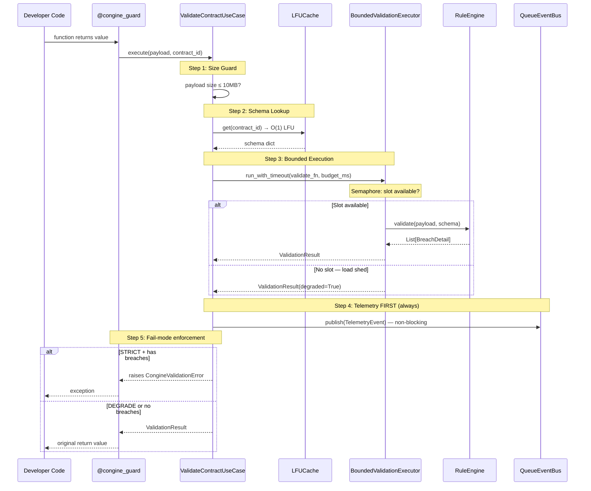
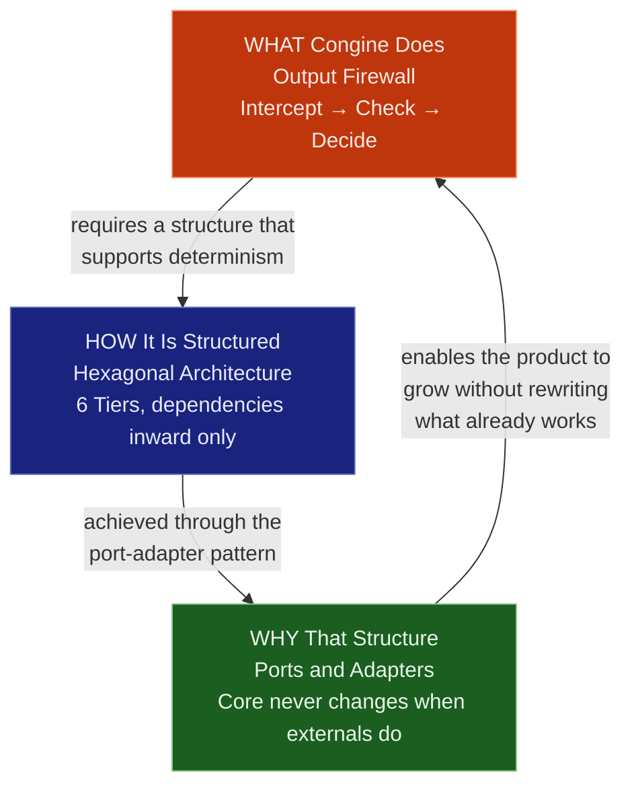

# CONGINE — THE MENTAL MODEL
## How to Think About Congine Before You Read a Single Line of Code
### Conceptual Foundation for Both Developers
 
> **Read this first. Before the study plan. Before any file.** This document builds the
> mental scaffolding into which every file you subsequently read will slot perfectly. Without
> it, the codebase is a collection of clever-seeming classes. With it, every file becomes
> obviously necessary and clearly positioned. Estimated reading time: 45 minutes.
 
---
 
## THE ONE TRUTH ABOUT CONGINE
 
Everything in Congine's codebase — all 36 files, all 6 layers — exists to make one thing
happen safely:
 
> **When a Python function returns a value, Congine intercepts that value, checks it against
> a predefined organizational contract, and decides what to do with it — in under 100
> milliseconds, without crashing the host application, regardless of what goes wrong.**
 
That sentence contains every concept in the system. Break it down:
 
"Intercepts that value" → the `@congine_guard` decorator, the entry point.
"Checks against a contract" → the `RuleEngine` and `JsonSchemaSemanticValidator`, the logic.
"Under 100 milliseconds" → the `BoundedValidationExecutor`, the latency guarantee.
"Without crashing the host application" → the `CircuitBreaker`, the snapshot, the fail modes.
"Regardless of what goes wrong" → the five safety tracks (failure paths).
 
When you feel lost in a specific file, return to this sentence and ask: "which part of this
sentence is this file responsible for?" The answer will always be clear.
 
---
 
## MENTAL MODEL ONE: THE OUTPUT FIREWALL ANALOGY
 
A network firewall sits between the outside world and your internal network. When a packet
arrives, the firewall checks it against a ruleset. If it passes, the packet is forwarded. If
it fails, the packet is dropped or the connection is blocked. The host network never even sees
a non-compliant packet.
 
Congine is this, but for the output of Python functions. The "packet" is the function's return
value. The "ruleset" is the organizational contract (a JSON schema document). The "firewall"
is the `@congine_guard` decorator. The "internal network" is whatever downstream code receives
the return value.
 
The most important property of a firewall is determinism: for any given packet and ruleset,
the outcome is always the same. Not probably the same. Always the same. This is why Congine
uses code-based rules (deterministic) rather than an LLM-based approach (probabilistic). A
compliance team cannot write "our AI agent outputs are 95% likely to comply with our
standards." They need "our outputs comply or they are blocked." Determinism is not a technical
preference — it is a commercial and organizational necessity.

```mermaid
flowchart LR
    subgraph HostApp["Host Application"]
        FN["AI Agent Function\nreturns {'score': 0.9}"]
    end
    
    subgraph Firewall["Congine Output Firewall"]
        GRD["@congine_guard\ninterceptor"]
        CHK["Contract Check\n6 rules + JSON Schema"]
        VRD["Verdict\nPASS / FAIL / DEGRADE"]
    end
    
    subgraph Downstream["Downstream Code"]
        USE["Uses the validated\nreturn value safely"]
    end
    
    FN -->|"return value\nintercepted"| GRD
    GRD --> CHK
    CHK -->|"checks against\ncontract JSON"| VRD
    VRD -->|"PASS: value forwarded"| USE
    VRD -->|"FAIL STRICT: raises\nexception"| HostApp
    VRD -->|"FAIL DEGRADE:\nreturns wrapped result"| USE
    
    style Firewall fill:#1b3a1b,stroke:#81c784
    style HostApp fill:#1a2a3a,stroke:#42a5f5
    style Downstream fill:#2a1a3a,stroke:#ce93d8
```
 

 
---
 
## MENTAL MODEL TWO: THE HEXAGONAL ARCHITECTURE
 
The word "hexagonal" is less important than the concept it names. Think of it this way: imagine
you are building a coffee machine. The core of the coffee machine — the brewing process, the
water temperature logic, the grind-to-water ratio — is pure physics and chemistry. It doesn't
know whether the user presses a physical button, sends a WiFi command, or uses a voice
assistant. The inputs and outputs of the brewing process don't change based on how the user
interacts with the machine.
 
In Congine: the "brewing process" is the domain logic (the `RuleEngine`, the `ValidationResult`,
the breach detection). It is pure Python logic. It does not know whether the validated output
came from a decorator, a LangChain callback, or an MCP tool call. It does not know whether
the result goes to a fire-and-forget queue or a SQLite database. It only knows how to evaluate
a payload against a schema and produce a list of breaches.
 
The "buttons and interfaces" are the adapters (L5) — the decorator, the callback handler, the
future MCP server. The "wires behind the panel" are the infrastructure (L4) — the cache, the
circuit breaker, the thread pool. The "specification of what button does what" are the ports
(L1) — the `ISchemaStorage`, `IEventBus`, `IValidationRunner` interfaces.

```mermaid
flowchart TB
    subgraph OUTER["OUTER WORLD — things that change: frameworks, databases, APIs"]
        HTTP["HTTP Control Plane\n(contract source)"]
        DISK["On-disk Snapshot\n(offline fallback)"]
        TELEMETRY["Telemetry API\n(observability)"]
        LANGCHAIN["LangChain Framework"]
        DECORATOR["Python Decorator\n@congine_guard"]
    end
    
    subgraph PORTS["PORTS — the defined openings (typing.Protocol)"]
        direction LR
        P1["IContractRepository"]
        P2["ISchemaStorage"]
        P3["IEventBus"]
        P4["IValidationRunner"]
        P5["ICircuitBreaker"]
        P6["ISemanticValidator"]
        P7["ILogger"]
    end
    
    subgraph CORE["APPLICATION CORE — things that never change: domain logic"]
        RULES["RuleEngine\n6 deterministic rules"]
        MODELS["ValidationResult · BreachDetail\nTelemetryEvent · DriftResult"]
        UCases["ValidateContractUseCase\nSyncContractsUseCase\n(orchestration)"]
    end
    
    OUTER <-->|"only through ports"| PORTS
    PORTS <-->|"the only dependency\ndirection is inward"| CORE
    
    note1["KEY INSIGHT: The CORE never\nimports from the OUTER WORLD.\nThe outer world changes; the core\ndoes not need to."]
    
    style CORE fill:#1b3a1b,stroke:#81c784
    style PORTS fill:#1a237e,stroke:#5c6bc0
    style OUTER fill:#2a1a1a,stroke:#ef5350
    style note1 fill:#1a1a1a,stroke:#616161,color:#9e9e9e
```
 

 
**The architectural rule in one sentence:** The core (domain + use cases) never imports the
outer world. The outer world imports the core. Dependencies point inward only.
 
**Why this matters for future development:** When you build the MCP server (Phase 1A), the
SQLite event bus (Phase 1B), or the Redis distributed cache (Phase 3), you add a new outer
component. You do not touch the core. The `RuleEngine` has no idea how contracts arrive in the
cache — it doesn't care. The `ValidateContractUseCase` has no idea whether telemetry goes to
a queue, a database, or `/dev/null` — it calls `IEventBus.publish()` and moves on.
 
---
 
## MENTAL MODEL THREE: PORTS AND ADAPTERS
 
A port is a promise. An adapter is a fulfillment of that promise.
 
`ISchemaStorage` (the port) says: "Whoever implements me, I promise you can call `.get(key)`
and get a schema dict back, or `None` if it's not there." The `LFUCache` (the adapter)
fulfills that promise using a Least-Frequently-Used cache in memory. Later, a `RedisCache`
could fulfill the same promise using Redis. The `ValidateContractUseCase` doesn't know which
fulfillment it got — it only knows the promise.
 
`IEventBus` (the port) says: "Whoever implements me, I promise you can call `.publish(event)`
to emit a telemetry event." The `QueueEventBus` fulfills that promise with a non-blocking
in-memory queue that drains to HTTP asynchronously. The `NoOpEventBus` fulfills that promise
by doing nothing. Both satisfy the contract. The use case doesn't know which one it has.
 
This is what makes `typing.Protocol` powerful. Python's structural typing means `LFUCache`
doesn't even need to declare "I implement ISchemaStorage" — it just needs to have the right
methods. The test fakes in `conftest.py` work exactly this way: they are plain classes that
happen to have the right method shapes, and Python accepts them as valid implementations.

```mermaid
flowchart LR
    subgraph USECASE["ValidateContractUseCase (L3)"]
        UC["calls self.schema_storage.get(contract_id)\nand self.timer.run_with_timeout(fn, ms)\nand self.event_bus.publish(event)"]
    end
    
    subgraph PORTS_COL["Ports (L1) — Promises"]
        ISS["ISchemaStorage\n.get() .put() .clear()"]
        IVR["IValidationRunner\n.run_with_timeout()"]
        IEB["IEventBus\n.publish()"]
    end
    
    subgraph ADAPTERS_COL["Adapters (L4) — Fulfillments"]
        LFU_A["LFUCache\n(production)"]
        TEST_S["FakeSchemaStorage\n(tests)"]
        BEX_A["BoundedValidationExecutor\n(production)"]
        TEST_T["ImmediateTimer\n(tests)"]
        QBUS_A["QueueEventBus\n(production)"]
        NOOP_A["NoOpEventBus\n(telemetry off)"]
        TEST_E["FakeEventBus\n(tests)"]
    end
    
    UC --> ISS
    UC --> IVR
    UC --> IEB
    
    ISS -.->|"satisfied by"| LFU_A
    ISS -.->|"satisfied by"| TEST_S
    IVR -.->|"satisfied by"| BEX_A
    IVR -.->|"satisfied by"| TEST_T
    IEB -.->|"satisfied by"| QBUS_A
    IEB -.->|"satisfied by"| NOOP_A
    IEB -.->|"satisfied by"| TEST_E
    
    style USECASE fill:#004d40,stroke:#4db6ac
    style PORTS_COL fill:#1a237e,stroke:#5c6bc0
    style ADAPTERS_COL fill:#1b5e20,stroke:#81c784
```
 

 
---
 
## THE HOT PATH IN PLAIN LANGUAGE
 
This is the most important narrative in the codebase. Read it once without thinking about code.
Just understand the story.
 
**The Setup (boot time, before any request):**
When the host application starts, it creates a `ServiceContainer`. The container assembles
all the parts — the cache, the circuit breaker, the thread pool, the event bus — and wires
them together. It then runs a boot sync: it calls the control plane (over HTTP) to fetch all
active contracts and stores them in the `LFUCache`. If the control plane is unavailable, it
reads from a local snapshot file on disk instead. Either way, the cache is primed and ready
before the first request arrives. This boot sync uses a file lock (portalocker) so that if
multiple processes start simultaneously, only one runs the sync — the others wait and then
reuse the result. This prevents the "thundering herd" problem.
 
**The Request (hot path, sub-100ms):**
A decorated function returns a value. The decorator intercepts it and hands it to
`ValidateContractUseCase.execute()`. The use case does five things in sequence:
 
One: It checks that the payload isn't too large (size guard). If it is, it fails immediately
without wasting any more resources.
 
Two: It looks up the contract schema in the `LFUCache`. This is an O(1) operation — it always
takes the same amount of time regardless of how many contracts are cached. If the cache misses
(rare after boot), it fetches from the control plane, subject to the circuit breaker. If the
circuit breaker is open, it reads from the on-disk snapshot.
 
Three: It hands the validation work to the `BoundedValidationExecutor`. This executor has a
fixed number of slots (permits). If all slots are in use, it immediately returns a "degraded"
result — it does not queue the request. This is load shedding. If a slot is available, it
runs the validation in a thread pool under a hard time budget. If the budget expires, the
thread keeps running (it cannot be killed) but the caller gets a "degraded" result back
immediately. The slot is not released until the thread actually finishes.
 
Four: The validation itself runs the `RuleEngine`. Six rules run in sequence. The rule engine
is pure domain logic — no network calls, no database, no I/O of any kind. It operates on
a Python dict (the payload) and a Python dict (the schema). It produces a list of
`BreachDetail` objects describing any violations.
 
Five: Whatever the result, the use case always emits a `TelemetryEvent` to the `QueueEventBus`
before deciding what to do with the verdict. This is critical: in STRICT mode (block on
violation), the telemetry is published *before* the exception is raised, so the violation is
always observable even when it blocks the caller. The bus drops the event onto an in-memory
queue; a daemon thread drains it to the telemetry API asynchronously.
 
**The Verdict:**
- DEGRADE mode: always returns the result, even if there are violations (permissive default)
- STRICT mode: raises an exception if there are violations (hard enforcement)
- ALLOW mode: always passes, ignores violations (bypass mode)

 
---
 
## THE FIVE SAFETY GUARANTEES — AS CONCEPTS
 
Congine makes five specific, verifiable guarantees. Understanding what each guarantee is
protecting against is more important than knowing which file implements it.
 
**Guarantee 1: Bounded Latency**
The problem: validation is useful only if it doesn't slow down the application. A validator
that sometimes takes 30 seconds is useless. Congine guarantees that no call to
`ValidateContractUseCase.execute()` will block for longer than `validation_timeout_ms`
(default 100ms). After that deadline, the caller gets a degraded result and moves on.
The concept: there is a hard budget, and when it's exceeded, the system degrades gracefully
rather than stalling.
 
**Guarantee 2: No Boot Stall**
The problem: if the control plane (the server that serves contracts) is slow or down at
startup, the application would stall waiting for contracts to load. Congine prevents this
with the circuit breaker and snapshot: if the control plane fails at boot, the system uses
the last known good contracts from disk and continues. The concept: the system has a fallback
for every dependency it cannot control.
 
**Guarantee 3: No Thundering Herd**
The problem: if ten application instances start simultaneously, they all try to fetch
contracts from the control plane at the same time, creating a traffic spike that could
overwhelm the control plane. The portalocker file lock ensures only one process runs the
boot sync at a time. The concept: use file-system primitives to coordinate between processes
without requiring a shared database.
 
**Guarantee 4: Snapshot Integrity**
The problem: a corrupted or tampered snapshot on disk could feed bad contracts to the system.
Every snapshot is written atomically (write to temp file, rename to final), scoped per tenant
with SHA-256 hashing, and verified before loading (symlink check, owner check). The concept:
treat locally cached data with the same skepticism as network data.
 
**Guarantee 5: No ReDoS**
The problem: malicious input can cause catastrophic backtracking in regex engines that use
backtracking (the built-in Python `re` module). If a contract uses a complex regex rule and
an attacker sends a carefully crafted string, the validation could take hours to complete,
effectively blocking the application. Congine requires `google-re2` — a regex engine with
guaranteed linear-time execution regardless of input. The concept: no user-controlled input
should ever be able to cause unbounded computation.
 
**Guarantee 6: Multi-Tenant Isolation**
When multiple tenants share a single process (up to 128), each tenant has its own cache, its
own circuit breaker, its own snapshot path. A failure or data leak in Tenant A cannot affect
Tenant B. The concept: treat tenants like separate applications that happen to share memory.
 
**Guarantee 7: PII-Safe Telemetry**
Breach details contain actual payload values. Those values might contain personal information.
Before any breach detail is included in a telemetry event, it is scrubbed to remove PII
patterns. The concept: the system never transmits data it has not explicitly sanitized.
 
---
 
## THE THREE CONCEPTS THAT CONFUSE MOST READERS
 
**Confusion 1: "Why is the circuit breaker in L4 (infrastructure) if it's so important?"**
Because its importance is behavioral, not logical. The circuit breaker is a piece of
infrastructure — it manages state about an external dependency (the control plane). The
domain layer doesn't need to know that circuit breakers exist. The port `ICircuitBreaker`
is what the use case sees: a simple interface with `allow()`, `record_success()`, and
`record_failure()`. The circuit breaker logic (the state machine, the probe timeout, the
failure threshold) lives in L4 because it is an implementation detail of how you protect
access to an HTTP endpoint — infrastructure knowledge, not domain knowledge.
 
**Confusion 2: "Why does the test fake satisfy the port without importing it?"**
Python's `typing.Protocol` uses structural subtyping. If a class has the right methods with
the right signatures, it satisfies a Protocol at runtime — without inheriting from it,
without declaring compliance. This is called "duck typing" with type-system support. The
`FakeEventBus` in `conftest.py` never imports `IEventBus`. It just has a `publish()` method
that accepts a `TelemetryEvent`. That's enough. This is intentional: it proves the ports
are real abstractions, not just base classes in disguise.
 
**Confusion 3: "Why does the permit release happen in a done-callback, not after the timeout?"**
This is called "honest accounting." If the timeout fires and the worker thread continues
running in the background (zombie), the permit must remain held until the thread genuinely
finishes. If you released the permit at timeout, you would allow more concurrent work than
the system was designed to handle (since the zombie is still consuming resources). Releasing
in the done-callback means the permit count always accurately reflects how many validation
threads are actually executing. The caller gets a degraded result, but capacity is not
overclaimed.
 
---
 
## HOW ALL THREE MENTAL MODELS CONNECT
 
The three mental models are not separate ideas — they are three perspectives on the same
thing. The output firewall describes WHAT Congine does (from the user's perspective). The
hexagonal architecture describes HOW it is structured (from the architect's perspective). The
ports-and-adapters model describes WHY it is structured that way (from the engineer's
perspective — it enables change without touching the core).
 

 
When you read `validate_contract_usecase.py`, you are reading the WHAT (the hot path) expressed
through the HOW (a use case in L3 calling L1 ports) achieved by the WHY (each port is
replaceable, and the use case never knows which concrete it got).
 
Keep all three in mind simultaneously and every file you read will make immediate sense.
 
---
 
## WHAT A PRINCIPAL ENGINEER NOTICES FIRST
 
When a principal engineer reads a new codebase, they do not read files sequentially. They look
for five things:
 
One: Where is the composition root? (Where is the system assembled?) In Congine: `adapters/dependency_injection.py`. This is the most important file in L5 — it is the map of the entire system.
 
Two: What does the hot path look like, and what are its latency guarantees? In Congine: `usecases/validate_contract_usecase.py` orchestrates the hot path, and `infrastructure/bounded_executor.py` provides the latency guarantee.
 
Three: What are the ports? Ports tell you what the system's dependencies are, abstracted. In Congine: the seven files in `ports/` tell you everything the core depends on (cache, repository, event bus, logger, validator, runner, breaker).
 
Four: What are the failure modes? In Congine: `02_FAILURE_PATHS.md` documents them exhaustively, and the circuit breaker + snapshot mechanism handles the most critical one.
 
Five: Where is the domain logic, and is it pure? In Congine: `domain/validator.py` and `domain/models.py`. Both are pure Python with no I/O. This purity is the system's most important property.
 
If you can answer these five questions confidently at the end of your 3-week study, you have
achieved principal-engineer-level understanding of Congine's Phase 0 architecture.