# CONGINE — THE 3-WEEK STUDY PLAN
## From Zero Familiarity to Principal-Engineer Understanding
### Day-by-Day File Reading Sequence with Methodology, Resources, and Exercises

> **Before you start:** Read `CONGINE_MENTAL_MODEL.md` first. This study plan assumes you
> have the three mental models (output firewall, hexagonal architecture, ports-and-adapters)
> already loaded. Without those, the file sequences will feel like a list of names instead of
> a story unfolding in the correct order.

---

## THE STUDY METHODOLOGY (READ THIS BEFORE DAY 1)

### The Three-Pass Method

Every file you read in this plan should be read three times. Not three careful readings —
three passes with different intentions.

**Pass 1 — Structure Scan (3 minutes):** Read top to bottom without slowing down. You are
not trying to understand anything yet. You are mapping the file's shape: how long is it, what
are the class names, what are the method names, what does it import? Your brain is building
a coarse structure to fill in later.

**Pass 2 — Intent Reading (10–20 minutes):** Read carefully this time, answering four
questions for every class and method you encounter: What problem does this solve? What does
it receive as input? What does it produce as output? What would break in the hot path if
this component disappeared? Don't move to the next method until you can answer these. If
you can't, that is a signal to re-read the relevant section of `CONGINE_MENTAL_MODEL.md`
before continuing.

**Pass 3 — Blind Summary (5 minutes):** Close the file. Write one paragraph (no more, no
less) describing what the file does. Do not look at the file while writing. This is the
most important pass — it is when your brain converts "I read it" into "I understand it."
If you can't write the paragraph, you need another Pass 2 before moving on.

### The Feynman Exercise (Daily)

At the end of each study session, each developer should take turns explaining one concept
from that session to the other without using the words "it handles" or "it manages." These
vague verbs hide understanding. Force specificity: "it receives X, does Y operation, and
returns Z" is always clearer than "it handles the validation."

### The Hot Path Trace (Weekly)

At the end of each week, both developers independently write out the full hot path (from
`@congine_guard` decorator to the returned value) as a numbered sequence, naming every file
and method in order. Compare your sequences. Any difference in order or missing step is
a concept to re-read.

### Session Length and Timing

Each study day in this plan represents one focused 90-minute session. Schedule it in the
morning before development work begins. Cognitive understanding is highest in the morning,
and you will retain more if you study before switching to execution mode. Never study for
more than 90 minutes in a single sitting without a genuine break.

---

## THE FILE READING SEQUENCE (THE WHY)

The sequence below is not alphabetical and not by layer number ascending. It follows the
principle of "understand dependencies before dependents." You read the things that are
depended upon first, so that when you read the thing that depends on them, every reference
is already familiar. The sequence also front-loads the conceptual architecture (days 1-2)
before any source code, because context makes code readable.

```mermaid
flowchart TD
    classDef doc fill:#4a148c,stroke:#ce93d8,color:#f3e5f5
    classDef l0 fill:#1a237e,stroke:#5c6bc0,color:#e8eaf6
    classDef l1 fill:#311b92,stroke:#9575cd,color:#ede7f6
    classDef l2 fill:#4a148c,stroke:#ba68c8,color:#f3e5f5
    classDef l3 fill:#004d40,stroke:#4db6ac,color:#e0f2f1
    classDef l4a fill:#1b5e20,stroke:#81c784,color:#e8f5e9
    classDef l4b fill:#33691e,stroke:#aed581,color:#f1f8e9
    classDef l5 fill:#bf360c,stroke:#ff8a65,color:#fbe9e7
    classDef test fill:#37474f,stroke:#90a4ae,color:#eceff1
    classDef analysis fill:#880e4f,stroke:#f48fb1,color:#fce4ec

    D1_2["DAY 1–2\nARCHITECTURE.md · README.md\nMENTAL MODEL + SECURITY.md\n(Docs, not source)"]:::doc
    
    D3["DAY 3\nL0 KERNEL\nconfig.py · exceptions.py\nsecurity_limits.py · pii_sanitize.py"]:::l0
    
    D4["DAY 4\nL1 PORTS — ALL SEVEN\nschema_storage · contract_repository\nevent_bus · logger\nsemantic_validator\nvalidation_runner · circuit_breaker"]:::l1
    
    D5["DAY 5\nL2 DOMAIN MODELS\ndomain/models.py"]:::l2
    
    D6["DAY 6\nL2 DOMAIN LOGIC\ndomain/validator.py"]:::l2
    
    D7["DAY 7\nWEEK 1 SYNTHESIS\nBlind summary + hot path trace attempt"]:::doc
    
    D8["DAY 8\nL3 HOT PATH\nusecases/validate_contract_usecase.py\n← THE MOST IMPORTANT FILE"]:::l3
    
    D9["DAY 9\nL3 BOOT PATH\nusecases/sync_contracts_usecase.py"]:::l3
    
    D10["DAY 10\nL4 CACHE + BREAKER\ninfrastructure/lfu_cache.py\ninfrastructure/circuit_breaker.py"]:::l4a
    
    D11["DAY 11\nL4 EXECUTOR\ninfrastructure/bounded_executor.py"]:::l4a
    
    D12["DAY 12\nL4 REPOSITORIES\ninfrastructure/http_contract_repository.py\ninfrastructure/file_contract_repository.py"]:::l4a
    
    D13["DAY 13\nL4 BUSES + VALIDATOR\ninfrastructure/queue_event_bus.py\ninfrastructure/noop_event_bus.py\ninfrastructure/jsonschema_validator.py"]:::l4b
    
    D14["DAY 14\nL4 SERVICES + WEEK 2 SYNTHESIS\ninfrastructure/logger.py\ninfrastructure/ks_drift.py\ninfrastructure/background_sync.py"]:::l4b
    
    D15["DAY 15\nL5 COMPOSITION ROOT\nadapters/dependency_injection.py\n← The wiring diagram of the whole system"]:::l5
    
    D16["DAY 16\nL5 ENTRY POINTS\nadapters/guard.py\nadapters/langchain_handler.py"]:::l5
    
    D17["DAY 17\nTESTS — ADVERSARIAL\ntest_bounded_executor.py\ntest_redos.py\ntest_tenant_isolation.py\ntest_input_bounds.py"]:::test
    
    D18["DAY 18\nTESTS — INTEGRATION\ntest_end_to_end.py\ntest_single_flight_boot.py\ntest_agent_workflow.py\nconftest.py"]:::test
    
    D19["DAY 19\nFAILURE PATHS ANALYSIS\n02_FAILURE_PATHS.md\n(complete, careful reading)"]:::analysis
    
    D20["DAY 20\nSYSTEM MAP VERIFICATION\n00_SYSTEM_MAP.md\n(STEP 3 and STEP 4 especially)"]:::analysis
    
    D21["DAY 21\nFINAL SYNTHESIS\nFull hot path trace + explain to each other\n+ identify remaining gaps"]:::doc
    
    D1_2 --> D3 --> D4 --> D5 --> D6 --> D7
    D7 --> D8 --> D9 --> D10 --> D11 --> D12 --> D13 --> D14
    D14 --> D15 --> D16 --> D17 --> D18 --> D19 --> D20 --> D21
```

---

## WEEK ONE — THE FOUNDATION (Days 1–7)

**Week 1 Goal:** Understand what Congine is, why its architecture is shaped the way it is,
and master the innermost three layers (L0, L1, L2) — the parts that never change because
they are the pure core.

---

### DAY 1 — The Architecture Documents (90 minutes)
**Files:** `ARCHITECTURE.md`, `README.md`, `SECURITY.md`
**What to read:** The documentation, not the code.

**How to read them:**
Start with `ARCHITECTURE.md`. This document states the design intent: the 6-tier layer model,
the rule about dependencies pointing inward, the list of what lives in each layer. Read it
as a contract the codebase was built to satisfy — you will later verify whether it does.

Then read the `README.md` focusing on three sections: the "What is Congine" section, the
fail-mode table (DEGRADE / STRICT / ALLOW), and the configuration table. These tell you
what the product looks like from the outside.

Read `SECURITY.md` for 15 minutes. It documents the explicit threat model Congine was
designed against: ReDoS, oversized payloads, PII leakage, snapshot poisoning. Understanding
the threats makes every security-related code decision obvious.

**Resource:** Martin Fowler's "Ports and Adapters" article — find it at `martinfowler.com`.
Search "Hexagonal Architecture Fowler". Read the first half only (up to the "Application
Boundary" section). 15 minutes. This will make `ARCHITECTURE.md` feel like a familiar friend
rather than a new concept.

**Key Questions to Answer Before Moving On:**
- What are the three fail modes and when would you use each?
- Which layer is the "composition root" — the only place all concrete classes are constructed?
- What is the one rule the 6-tier architecture enforces about import direction?
- What two environment variables put Congine in offline mode?

---

### DAY 2 — The Mental Model Document (90 minutes)
**Files:** `CONGINE_MENTAL_MODEL.md` (the companion to this document)

**How to read it:**
Read it once through without taking notes. Then read it again with a blank piece of paper
next to you. Every time you hit a concept you want to verify against the codebase later,
write it down. These are your "confirm in code" questions.

**Resource:** PEP 544 (Structural Subtyping). Go to `peps.python.org/pep-0544`. Read only
the "Abstract", "Rationale", and "Defining a Protocol" sections. Skip the full spec. 10
minutes. This explains why `typing.Protocol` is used instead of ABCs, and why fakes in tests
don't need to inherit from the port interfaces.

**Key Questions to Answer Before Moving On:**
- In your own words, what is the difference between a port and an adapter?
- Why does Congine use code-based rules (deterministic) rather than an LLM for validation?
- What is the "output firewall" and how is it analogous to a network firewall?
- What are the five safety guarantees? Can you name all five without looking?

---

### DAY 3 — Layer 0: The Kernel (90 minutes)
**Files (read in this order):**
1. `security_limits.py`
2. `exceptions.py`
3. `config.py`
4. `pii_sanitize.py`

**How to read them:**
Start with `security_limits.py` because it is the smallest and most concrete: it is just a
file of named constants. But these constants are not arbitrary — each represents a security
decision. Ask for every constant: "what happens if this limit is too high? what if it's
too low?" Understanding that `MAX_PAYLOAD_BYTES = 10MB` prevents both memory exhaustion (too
high means large payloads can fill RAM) and legitimate rejection (too low rejects real
outputs) is the kind of reasoning that matters here.

`exceptions.py` is the complete error vocabulary of the system. Read it by understanding
the hierarchy: one root exception that catches everything, six specific types for different
failure categories, and four forward-compatibility aliases that exist so future code can raise
distinct types without breaking current callers. The aliases (`ValidationTimeoutException`,
`TenantIsolationViolationException`) are promises about where the system is going.

`config.py` is the most important L0 file. It is a frozen dataclass (cannot be modified
after creation) with about 45 fields. Do not try to memorize all 45 fields. Instead,
understand three things: (1) it is the single source of all runtime configuration, (2) it
is env-driven (reads from environment variables), and (3) it fails loudly on bad
configuration — it would rather crash at startup than proceed with invalid config. The
`FailMode`, `DeploymentMode`, and `Region` enums define the product's operating vocabulary.

`pii_sanitize.py` is short. It does one thing: scrub values that look like personal
information from breach detail strings before they appear in telemetry or logs.

**Resource:** Python docs on frozen dataclasses. Search "Python dataclasses frozen". Read
only the paragraph explaining the `frozen=True` parameter. 5 minutes. This explains why you
cannot accidentally mutate a `CongineConfig` after construction — the configuration is
immutable for the lifetime of the application.

**Key Questions to Answer Before Moving On:**
- What is `FailMode` and what are the three values?
- Why is `CongineConfig` a frozen dataclass rather than a regular class?
- Why does the system fail loudly on configuration errors rather than using safe defaults?
- What is the exception type hierarchy? (Draw it from memory as a tree.)

---

### DAY 4 — Layer 1: All Seven Ports (90 minutes)
**Files (read all seven, in this order):**
1. `ports/schema_storage.py`
2. `ports/validation_runner.py`
3. `ports/circuit_breaker.py`
4. `ports/contract_repository.py`
5. `ports/event_bus.py`
6. `ports/semantic_validator.py`
7. `ports/logger.py`

**How to read them:**
These seven files are short. Each defines a `typing.Protocol`. For each port, you need to
understand one thing above all others: what is the *promise* this port makes?

`ISchemaStorage` promises: you can get a schema by key and put a schema by key. That's it.
`IValidationRunner` promises: you can run a validation function under a time budget.
`ICircuitBreaker` promises: you can check if calls are allowed and record successes/failures.
`IContractRepository` promises: you can fetch active contracts from somewhere (HTTP or disk).
`IEventBus` promises: you can publish a telemetry event without blocking.
`ISemanticValidator` promises: you can validate a payload against a schema and get breaches.
`ILogger` promises: you can log at different levels.

After reading each port, write its one-line promise without looking at the code. If you
can't, the port's purpose is not clear yet.

Read the ports in the order above because that is the order in which they are called in
the hot path: the use case first needs a schema (storage), then runs validation (runner),
with the circuit breaker protecting the repository, then publishes telemetry (event bus).

**Resource:** Python docs on `typing.Protocol`. Go to `docs.python.org/3/library/typing.html`
and search for "Protocol". Read only the "Protocol" section and the "runtime_checkable"
subsection. 8 minutes. Understand why duck typing is used (structural subtyping) rather than
requiring explicit inheritance.

**Key Questions to Answer Before Moving On:**
- For each port, what is the single most important method?
- Why is `ICircuitBreaker.allow()` a method rather than a property?
- `IEventBus.publish()` returns nothing. What does this tell you about how telemetry works?
- Why does `IContractRepository` have both `fetch_active_contracts` AND `load_snapshot`/`save_snapshot`?

---

### DAY 5 — Layer 2: The Value Objects (90 minutes)
**Files:**
1. `domain/models.py`

**How to read it:**
`domain/models.py` defines the four value objects that flow through the entire system:
`BreachDetail`, `ValidationResult`, `TelemetryEvent`, and `DriftResult`. These are all
frozen dataclasses — they cannot be modified after creation.

Spend the most time on `BreachDetail` and `ValidationResult`. For `BreachDetail`, understand
every field: what is `rule`? what is `field_path`? what is `expected` vs `actual`? Then
understand `ValidationResult.is_pass()` — this is the single boolean that determines the
fate of the output being validated.

For `TelemetryEvent`, understand which fields come from the validation (contract_id, breaches)
and which come from the system state (timestamp, tenant_id, mode). This tells you what
information is recorded about every validation.

The `DriftResult` is used by the `KSDriftEngine` (Phase 0's drift detection feature). It is
less critical to the hot path.

Pay particular attention to the comment about `TelemetryEvent`'s docstring claiming it is
mutable. This is a known bug documented in `03_SPEC_RECONCILIATION.md` (A6). The class is
actually frozen. This is an example of the kind of documentation debt that accumulates —
knowing it exists is part of understanding the current state of the codebase.

**Key Questions to Answer Before Moving On:**
- Draw the fields of `BreachDetail` from memory. What does each field represent?
- What is the difference between a PASS `ValidationResult` and a FAIL one?
- Why are all these objects frozen (immutable)?
- A `ValidationResult` with no breaches and no degradation — what does `is_pass()` return?

---

### DAY 6 — Layer 2: The Domain Logic (90 minutes)
**Files:**
1. `domain/validator.py`

**How to read it:**
This file contains the six rules of the `RuleEngine` and the validators that use them.
This is the pure business logic of Congine — what it actually checks.

Approach it by understanding each rule in English before thinking about how it's implemented.
The six rules, in the order they run:

**FIELD_PRESENCE:** Is the required field present in the payload at all?
**TYPE_MATCH:** Is the field's value the type that the schema says it should be?
**ENUM_VALUES:** Is the field's value one of the allowed values listed in the schema?
**RANGE_CHECK:** Is a numeric field within the min/max range specified in the schema?
**NULL_GUARD:** Is a field that must not be null actually non-null?
**REGEX_PATTERN:** Does a string field match the pattern specified in the schema?

After understanding each rule, understand why they run in THIS order. Field presence is
checked first because the other rules are meaningless if the field doesn't exist. Type
checking comes second because range checking and pattern matching are meaningless if the
type is wrong.

Then understand `LocalValidator` and `CompositeValidator`. `LocalValidator` runs the
`RuleEngine`'s six rules. `CompositeValidator` runs `LocalValidator` first, and then runs
`JsonSchemaSemanticValidator` if semantic validation is enabled. The `CompositeValidator`
is what gets wired into the use case when both structural and semantic validation are active.

**Resource:** The `re2` library's project page on PyPI. Search "google-re2 pypi". Read
only the first paragraph explaining what re2 is and why it guarantees linear time. 3 minutes.
Understanding the ReDoS threat makes the mandatory `re2` dependency obvious.

**Key Questions to Answer Before Moving On:**
- Why does FIELD_PRESENCE run before TYPE_MATCH?
- What is the difference between `LocalValidator` and `CompositeValidator`?
- A schema says `{"score": {"type": "number", "minimum": 0, "maximum": 1}}`. The payload
  has `{"score": "0.9"}`. Which rules fire, and in what order?
- Why does the `RuleEngine` use `re2` instead of Python's built-in `re`?

---

### DAY 7 — Week 1 Synthesis (90 minutes)
**No new files.** This day is entirely review and synthesis.

**Exercise 1 (20 minutes):** Each developer independently draws on paper (not digitally) the
L0-L2 component map. Include every file, every class, and the arrows showing which file
depends on which. Do not look at your notes. Compare the two drawings — differences are
the things to re-read before Week 2.

**Exercise 2 (20 minutes):** The Feynman Check. For each of the following concepts, each
developer must explain it to the other in under 2 minutes without using vague words:
- What is a `typing.Protocol` and why does Congine use it instead of ABCs?
- What is the dependency rule in the hexagonal architecture?
- What is the difference between DEGRADE and STRICT fail mode?
- What does `frozen=True` in a dataclass actually prevent?

**Exercise 3 (30 minutes):** Without looking at any file, answer in writing:
- Which files are in L0? What does each do in one sentence?
- Which files are in L1? What promise does each port make?
- Which files are in L2? What do models and validator provide?

**Exercise 4 (20 minutes):** Hot path trace attempt. Write, in numbered steps, everything
that happens between "the decorated function returns a value" and "the caller receives the
result." You will not yet know the full path (that comes in Week 2), but you should be able
to describe the first two steps: the decorator intercepts, the guard calls the use case.

---

## WEEK TWO — THE OPERATIONAL CORE (Days 8–14)

**Week 2 Goal:** Understand how Congine operates in production — the hot path use case, the
boot sync, and every infrastructure component that makes both safe and reliable.

---

### DAY 8 — The Most Important File in the Codebase (90 minutes)
**Files:**
1. `usecases/validate_contract_usecase.py`

**How to read it:**
This is `ValidateContractUseCase`. It is the orchestrator of the hot path. Every other file
you read in Weeks 1 and 2 either feeds into this use case or is called by it.

Read it in five passes (not three) because of its importance:

Pass 1: Look only at the constructor. What does it accept? Answer: the seven ports from L1
(schema_storage, logger, event_bus, timer, validator, config, pii_sanitize). It accepts
abstractions, never concretes. This is the single most important structural observation in
the codebase.

Pass 2: Read `execute()` (the sync version). Notice the five steps described in
`CONGINE_MENTAL_MODEL.md`. They are here: `_check_payload_size`, `_resolve_schema`,
`timer.run_with_timeout(do_validate)`, the telemetry publication, and `_handle_failure`.

Pass 3: Read `_resolve_schema()`. This is where cache lookup, circuit breaker check, and
repository fallback happen in sequence. Understand the order: cache first, then repository
(breaker-gated), then snapshot.

Pass 4: Read `_finalize()`. This is where PII scrubbing happens and the `TelemetryEvent`
is built and published. Notice: publish happens HERE, before `_handle_failure()` raises.
This is the "telemetry-before-raise" guarantee.

Pass 5: Read `_handle_failure()`. Three cases: no breaches (always pass), breaches + STRICT
(raise), breaches + DEGRADE (return degraded result).

**Key Questions to Answer Before Moving On:**
- What does `ValidateContractUseCase` import from L4? (Answer: nothing — only L1 ports.)
- In what order does schema resolution proceed when the cache misses?
- Why is telemetry published before the exception is raised in STRICT mode?
- What is the difference between `execute()` and `execute_async()`? Why do both exist?

---

### DAY 9 — The Boot Path (90 minutes)
**Files:**
1. `usecases/sync_contracts_usecase.py`

**How to read it:**
`SyncContractsUseCase` is the boot-time orchestrator. It fetches contracts from the control
plane, primes the schema cache, and saves a snapshot to disk. It is also the retry mechanism
when the control plane becomes available after being down.

Focus on `sync_once_single_flight()`. The "single flight" part means: if multiple processes
try to run this simultaneously, only one proceeds — the others wait and then skip it (because
by the time they get the lock, the cache is already primed). The file locking mechanism here
is `portalocker`, which uses OS-level file locks. This is why the thundering herd guarantee
works: the file system serializes what the application cannot.

Then read `load_snapshot_only()` — the pure offline path. This method doesn't attempt any
HTTP call. It reads contracts from the on-disk snapshot and primes the cache from there. It
is the fastest and most resilient boot path.

**Resource:** Read the Wikipedia article on the "Thundering Herd Problem" — just the first
two paragraphs. 5 minutes. This makes the portalocker single-flight pattern obvious.

**Key Questions to Answer Before Moving On:**
- What is a "single-flight" operation? Why is it important at boot time?
- What happens if the control plane HTTP call fails during `sync_once()`?
- What is the relationship between `SyncContractsUseCase` and the `CircuitBreaker`?
- Why does `BackgroundSyncWorker` (L4) call this use case on a daemon thread?

---

### DAY 10 — The Cache and the Circuit Breaker (90 minutes)
**Files (read in this order):**
1. `infrastructure/lfu_cache.py`
2. `infrastructure/circuit_breaker.py`

**How to read them:**
`LFUCache` implements `ISchemaStorage`. The LFU part means: when the cache is full and needs
to evict an entry, it evicts the one that has been accessed least frequently (not least
recently). Read the constructor to understand the two configurable parameters: max capacity
and TTL (time-to-live per entry). Then read `get()` and `put()`. The O(1) guarantee comes
from the frequency-bucket data structure — don't memorize it, just understand the property:
any get or put takes the same amount of time regardless of cache size.

`CircuitBreaker` implements `ICircuitBreaker`. The state machine is: CLOSED (normal operation,
all calls allowed) → OPEN (too many failures, calls rejected) → HALF_OPEN (after cooldown,
one probe allowed) → back to CLOSED (if probe succeeds) or OPEN (if probe fails). Read
`record_failure()` to understand what increments the failure counter. Read `allow()` to
understand what each state returns.

**Resource:** Martin Fowler's Circuit Breaker article. Go to `martinfowler.com/bliki/CircuitBreaker.html`.
This is a 10-minute read. The diagram in the article is exactly what `circuit_breaker.py`
implements. Read the article first, THEN re-read the code.

**Resource:** Wikipedia on LFU (Least Frequently Used). Go to `en.wikipedia.org/wiki/Least_frequently_used`.
Read the "Overview" section only. 5 minutes.

**Key Questions to Answer Before Moving On:**
- Draw the circuit breaker state machine from memory (three states, four transitions).
- What is the difference between LFU eviction and LRU eviction? Which is Congine using?
- When does the circuit breaker reset from OPEN to HALF_OPEN? Who triggers this?
- What happens to a cache entry when it expires by TTL vs when it's evicted by capacity?

---

### DAY 11 — The Executor (90 minutes)
**Files:**
1. `infrastructure/bounded_executor.py`

**How to read it:**
`BoundedValidationExecutor` implements `IValidationRunner`. This file contains the latency
guarantee and the load-shedding mechanism.

Read the constructor first. Two parameters define the contract: `max_workers` (how many
threads can execute concurrently) and `max_pending` (how many requests can wait for a thread).
The total permits = `max_workers + max_pending`.

Then read `run_with_timeout()`. The execution flow is:
1. Try to acquire a semaphore permit (non-blocking check)
2. If no permit: increment `rejected_total`, raise `TimeoutError` immediately (load shed)
3. If permit acquired: submit to thread pool, attach done-callback to release permit, wait
   for result with `future.result(timeout_ms)`
4. If `future.result()` times out: return degraded — but the future keeps running in background
5. The permit is released only when the future actually completes (honest accounting)

The "honest accounting" concept is the subtlest and most important idea in this file. Spend
extra time making sure you understand WHY the permit release happens in the done-callback.
The mental model: the permit counts "work currently being done by a thread." A zombie thread
is still doing work (even if the caller has given up). So the permit stays claimed.

**Resource:** Python `threading.Semaphore` documentation. Go to `docs.python.org/3/library/threading.html`.
Find the "Semaphore Objects" section. Read only the description of `acquire(blocking=False)`.
5 minutes. This explains the non-blocking permit check.

**Key Questions to Answer Before Moving On:**
- What is load shedding, and at what point does Congine perform it?
- Why is releasing the semaphore permit in a done-callback rather than after the timeout?
- What is the `rejected_total` counter tracking?
- What is the maximum number of concurrent validations allowed with default settings?

---

### DAY 12 — The Contract Repositories (90 minutes)
**Files (read in this order):**
1. `infrastructure/file_contract_repository.py`
2. `infrastructure/http_contract_repository.py`

**How to read them:**
Read `file_contract_repository.py` first because it is simpler. It implements
`IContractRepository` for the offline case: it reads `.json` (and optionally `.yaml`) files
from a local directory. The snapshot methods are no-ops here because there is no network to
fall back from. This is the repository you use in development and testing.

Then read `http_contract_repository.py`. This is the production path. It implements the same
`IContractRepository` port but fetches from an HTTP endpoint using `httpx`. The critical
details: the HTTP response is capped at `MAX_HTTP_RESPONSE_BYTES` (10MB) to prevent memory
exhaustion. The snapshot methods are fully implemented here — `save_snapshot()` writes
atomically using a temp-file-then-rename pattern, and `load_snapshot()` verifies the file is
not a symlink and is owned by the correct user before reading.

Focus especially on the snapshot security model. Why does it check for symlinks? An attacker
could replace the snapshot file with a symlink pointing to a different file, causing Congine
to load arbitrary data. The owner check prevents a different user's process from pre-placing
a malicious snapshot. Per-tenant SHA-256 scoping ensures one tenant cannot read another's
snapshot.

**Key Questions to Answer Before Moving On:**
- Why does `save_snapshot()` write to a temp file and then rename, rather than writing
  directly to the destination?
- What security checks does `load_snapshot()` perform before reading the file?
- What is the SHA-256 scope key and what problem does it solve?
- Why does `file_contract_repository.py` have no-op snapshot methods?

---

### DAY 13 — The Event Buses and the Schema Validator (90 minutes)
**Files (read in this order):**
1. `infrastructure/noop_event_bus.py`
2. `infrastructure/queue_event_bus.py`
3. `infrastructure/jsonschema_validator.py`

**How to read them:**
Read `noop_event_bus.py` first because it is three lines. It is the "telemetry disabled"
case — every event published is silently discarded. Understanding this simplest case first
makes the queue version make more sense by contrast.

Then read `queue_event_bus.py`. This is fire-and-forget telemetry. The key concepts:

The event is not sent to the API immediately. It is put on an in-memory queue. A daemon
thread drains the queue periodically, batching events and posting them to the telemetry
endpoint. Why not send immediately? Because an HTTP call on the hot path would destroy the
sub-100ms latency guarantee. The tradeoff: events are eventually delivered but could be lost
if the process dies before the queue drains. The `_dropped_total` counter tracks how many
events were discarded because the queue was full.

Then read `jsonschema_validator.py`. This implements `ISemanticValidator` using the
`jsonschema` library to do full JSON Schema validation. The critical detail: this is optional
and off by default. Why? Full JSON Schema validation is more expensive than the six deterministic
rules. The six rules handle the most common validation scenarios. JSON Schema enables advanced
features like `minLength`, `format`, `$ref`, and nested object validation.

**Key Questions to Answer Before Moving On:**
- What happens to telemetry events if the process crashes before the queue drains?
- Why is there both a `QueueEventBus` and a `NoOpEventBus`? When would you use each?
- What validation does `jsonschema_validator.py` do that the `RuleEngine` cannot?
- Why is JSON Schema validation off by default?

---

### DAY 14 — The Infra Services and Week 2 Synthesis (90 minutes)
**Files (read in this order, 45 minutes total for files):**
1. `infrastructure/logger.py`
2. `infrastructure/ks_drift.py`
3. `infrastructure/background_sync.py`

Then 45 minutes for synthesis.

**How to read them:**
`logger.py` implements `ILogger`. The most important feature: automatic redaction. The logger
maintains a blocklist of field names that should never appear in log output (password, token,
api_key, etc.). Any log message containing these field names has the values replaced with
`[REDACTED]`. This is not optional — it applies to every log call. This is PII protection
at the logging layer.

`ks_drift.py` implements the KS (Kolmogorov-Smirnov) two-sample drift detector. This is a
statistical tool that detects when the distribution of validation breach rates has shifted
significantly, potentially indicating that AI agent outputs are drifting in quality. You do
not need to understand the KS statistic mathematically — understand what it does: it tells
you when the pattern of violations has changed enough to be statistically significant.

`background_sync.py` is the daemon thread that periodically calls `SyncContractsUseCase.sync_once()`.
It keeps the schema cache fresh. It swallows all errors so the loop never crashes — a contract
sync failure is not worth stopping the application.

**Synthesis exercise (45 minutes):** Hot path trace Part 2. Write, in numbered steps, the
COMPLETE hot path from decorator to response. You now have enough knowledge to do this fully.
Include: which file each step is in, what is passed in, what is returned, and what happens
in the failure case for each step.

**Key Questions to Answer Before Moving On:**
- What is the KSDriftEngine detecting? In what scenario would you act on its output?
- Why does `BackgroundSyncWorker` swallow all errors rather than re-raising them?
- The `StructuredLogger` has a `sensitive_fields` blocklist. Why is this done at the logger
  level rather than in the use case?

---

## WEEK THREE — INTEGRATION AND SYNTHESIS (Days 15–21)

**Week 3 Goal:** Master the composition root, understand how tests prove the system works,
trace every failure path, and achieve full synthesis of the system.

---

### DAY 15 — The Composition Root (90 minutes)
**Files:**
1. `adapters/dependency_injection.py`

**How to read it:**
`ServiceContainer` is the most complex file in L5. It is the sole place in the entire system
where concrete classes are constructed and wired to ports. It is the "map" of the whole
system — if you understand it, you understand how all 36 files connect.

Read the constructor method completely. Notice the construction order: bottom-up. First L0
(reading config), then L4 concretes (creating the logger, cache, circuit breaker, executor,
repository, event bus, validator), then L3 use cases (injecting the L4 concretes as L1
port arguments).

This file also manages the multi-tenant registry (the `_tenant_map`). Read `for_tenant()`.
Each tenant gets its own child container with isolated L4 concretes. The map uses LRU
eviction at 128 tenants. The `get_default()` method is disabled in multi-tenant mode —
callers must explicitly specify which tenant they are operating for.

Read `bootstrap()`. This is what the host application calls after constructing a
`ServiceContainer`. It starts the background sync worker, runs the initial contract sync,
and starts the event bus drain worker.

**Key Questions to Answer Before Moving On:**
- What is the construction order of components in `ServiceContainer.__init__()`? Why does
  this order matter?
- How does the multi-tenant registry work? What happens when the 129th tenant arrives?
- What does `bootstrap()` do that `__init__()` does not?
- Why is `get_default()` disabled in multi-tenant mode?

---

### DAY 16 — The Entry Points (90 minutes)
**Files (read in this order):**
1. `adapters/guard.py`
2. `adapters/langchain_handler.py`

**How to read them:**
`guard.py` is the `@congine_guard` decorator. It is short. The decorator wraps the target
function and creates a `sync_wrapper` (for regular functions) or `async_wrapper` (for
async functions). Inside the wrapper: resolve the container (from explicit parameter or from
`ServiceContainer.get_default()`), extract the payload (using an optional `extractor` function
or the raw return value), call `validate_contract_usecase.execute()`, and handle the result
based on mode.

`langchain_handler.py` is a LangChain `BaseCallbackHandler`. It hooks into LangChain's
callback system: `on_llm_start` (when the LLM begins generating), `on_llm_new_token` (as
tokens stream in, bounded by `MAX_STREAM_BUFFER_CHARS`), and `on_llm_end` (when generation
finishes — this is when validation runs on the complete accumulated output). Note the Bug B15:
the example's offline fallback returns `action="manual_review"` which is not in the contract
enum, causing the STRICT mode example to raise on what should be a clean path.

**Key Questions to Answer Before Moving On:**
- How does `@congine_guard` determine which container to use if none is specified?
- What is the `extractor` parameter in `@congine_guard` for?
- Why does `CongineCallbackHandler` buffer tokens rather than validating each one?
- What is the Bug B15, and what specific line causes it? Why does it matter for first
  impressions?

---

### DAY 17 — Adversarial Tests (90 minutes)
**Files (selective reading — do not read every line, read the test NAMES and the comments):**
1. `tests/adversarial/test_bounded_executor.py`
2. `tests/adversarial/test_redos.py`
3. `tests/adversarial/test_tenant_isolation.py`
4. `tests/adversarial/test_input_bounds.py`

**How to read them:**
Adversarial tests are proof that specific attack scenarios are handled correctly. Read them
as executable documentation of security properties, not as code to understand line by line.

For each test, read: the test name, the docstring (if any), and the assertion. Ask: what
property is this test proving? Then verify: does knowing this property is true give you
confidence in one of the five safety guarantees?

For example, in `test_bounded_executor.py`, a test named `test_load_shed_when_full` is
proving the load-shedding guarantee. A test named `test_zombie_keeps_permit` is proving
the honest accounting property.

In `test_redos.py`, tests should prove that pathological regex inputs (inputs that would
cause exponential backtracking in `re`) terminate in linear time under `re2`.

**Key Questions to Answer Before Moving On:**
- Which tests prove the bounded latency guarantee?
- Which tests prove the multi-tenant isolation guarantee?
- What does the H1/H2/H3 classification in the test names refer to?
- What would break in the system if the `conftest.py` fakes needed to inherit from the ports?

---

### DAY 18 — Integration Tests and Fakes (90 minutes)
**Files:**
1. `tests/conftest.py`
2. `tests/integration/test_end_to_end.py`
3. `tests/test_single_flight_boot.py`
4. `tests/test_agent_workflow.py`

**How to read them:**
Read `conftest.py` first. It defines the fakes: `FakeLogger`, `FakeEventBus`,
`FakeSchemaStorage`, `ImmediateTimer`, `FakeContractRepository`. For each fake, confirm that
it satisfies its corresponding port WITHOUT inheriting from it. This is the concrete proof
that the ports are genuine structural seams.

`test_end_to_end.py` is the most valuable integration test. It constructs a fully wired
`ServiceContainer` with real L4 concretes (not fakes), runs a validation, and verifies the
result. Reading this test shows you what a complete wired test looks like — it is the
most realistic picture of the whole system working.

`test_single_flight_boot.py` tests the thundering herd protection — that multiple concurrent
boot attempts don't all try to fetch contracts simultaneously.

`test_agent_workflow.py` tests a multi-tenant agent workflow — multiple tenants validating
concurrently with isolation between them.

**Key Questions to Answer Before Moving On:**
- How does `FakeEventBus` satisfy `IEventBus` without importing or inheriting from it?
- What does the end-to-end test verify that unit tests cannot?
- Why is `ImmediateTimer` useful in testing?

---

### DAY 19 — The Failure Paths Document (90 minutes)
**Files:**
1. `02_FAILURE_PATHS.md` — Read in full, carefully

**How to read it:**
This is the most important analysis document in the repository. Do not skim it. Read every
failure path and for each one: identify which file handles it, verify that you know where
in that file the handling occurs, and confirm that the handling matches one of the five
safety guarantees.

The failure paths are organized as: CORRECT (handled properly), PARTIAL (handled but
incompletely), BROKEN (a real bug), and ABSENT (intentionally not handled in Phase 0). Pay
special attention to BROKEN paths — these are the known bugs that Phase 0 hardening must fix.

The most important failure paths to internalize:
- B9: Multi-tenant eviction lifecycle (the deepest correctness bug)
- B14: Silently ignored schema keywords (the highest-leverage user-facing correctness issue)
- B15: The LangChain example defect (the first-impression destroyer)
- A1: The Python version floor contradiction

**Key Questions to Answer Before Moving On:**
- For each known bug (B9, B14, B15, A1), which file contains the issue and what is the
  specific manifestation?
- Which failure paths are CORRECT (handled as designed)?
- What is the "telemetry-before-raise" guarantee and which failure path test verifies it?

---

### DAY 20 — System Map Verification (90 minutes)
**Files:**
1. `00_SYSTEM_MAP.md` — Focus on STEP 3 (Primary Path) and STEP 4 (Failure Paths)

**How to read it:**
By now, you should be able to read `00_SYSTEM_MAP.md` as verification, not as introduction.
Every claim in its primary path narrative should match your mental model from Days 8–16.
Every failure path description should match what you read in `02_FAILURE_PATHS.md`.

Read STEP 3 (The Primary Path, End to End) with your own mental model active. At each step,
pause and ask: "does my understanding of this step match what the document says?" If there
is a discrepancy, trace it to the source file and resolve it.

Read STEP 5 (Reconcile Against Intent) and STEP 6 (Assemble the Whole). These sections
place Congine in the context of its own specifications and prior audits. This is the full
picture — what was intended, what was built, and where they differ.

**Key Questions to Answer Before Moving On:**
- The document says the architecture is a "strict 6-tier hexagonal monolith." Can you now
  verify this yourself by checking five specific file imports?
- What is the "full-system narrative" in your own words? Can you explain Congine to a
  senior engineer in 3 minutes?

---

### DAY 21 — Final Synthesis (90 minutes)
**No new files.** This day is entirely synthesis, verification, and gap identification.

**Exercise 1 — The Complete Hot Path (30 minutes):**
Each developer independently writes the complete hot path as a numbered sequence, naming
every file and method in order, from `@congine_guard` to the returned result. Include the
offline fallback branch. Compare sequences — any difference identifies a remaining gap.

**Exercise 2 — The Architecture Explanation (20 minutes):**
Each developer explains the entire Phase 0 architecture to the other in 3 minutes without
notes. The listener interrupts if anything is vague or incorrect. The 3-minute constraint
forces prioritization — it shows you which concepts are truly internalized and which are
only superficially understood.

**Exercise 3 — The Five Questions (20 minutes):**
Answer these five questions (the principal engineer checklist from the Mental Model document):
1. Where is the composition root? (one file name)
2. What are the latency guarantees and which file provides them?
3. What are the seven ports? (list all seven from memory)
4. What are the five safety guarantees and which failure path covers each?
5. Where is the domain logic, and is it pure? What does "pure" mean here?

**Exercise 4 — Gap Identification (20 minutes):**
Write a list of concepts you are still uncertain about. These are your Phase 1 reading
targets — the things to re-read as you encounter them in development.

---

## THE TARGETED RESOURCE LIST

This is the complete list of external resources for the 3-week plan. Every entry has a
specific section to read and a time estimate. Do not read beyond the specified section.

| Resource | URL / Location | Section to Read | Time | Day Used |
|----------|----------------|-----------------|------|---------|
| Ports & Adapters (Fowler) | `martinfowler.com/articles/hexagonal-architecture.html` | First half only, up to "Application Boundary" | 15 min | Day 1 |
| PEP 544 (Protocol / structural subtyping) | `peps.python.org/pep-0544` | Abstract + Rationale + "Defining a Protocol" | 10 min | Day 2 |
| Python frozen dataclasses | `docs.python.org/3/library/dataclasses.html` | "frozen" parameter only | 5 min | Day 3 |
| Python typing.Protocol | `docs.python.org/3/library/typing.html` | "Protocol" and "runtime_checkable" sections | 8 min | Day 4 |
| google-re2 (PyPI) | Search "google-re2 pypi" | First paragraph only | 3 min | Day 6 |
| Circuit Breaker (Fowler) | `martinfowler.com/bliki/CircuitBreaker.html` | Full article (it's short) | 10 min | Day 10 |
| LFU Cache | `en.wikipedia.org/wiki/Least_frequently_used` | "Overview" section only | 5 min | Day 10 |
| Python Semaphore | `docs.python.org/3/library/threading.html` | "Semaphore Objects" section | 5 min | Day 11 |
| Thundering Herd Problem | `en.wikipedia.org/wiki/Thundering_herd_problem` | First two paragraphs | 5 min | Day 9 |
| JSON Schema Getting Started | `json-schema.org/learn/getting-started-step-by-step` | First two sections | 15 min | Day 13 |

**Total external reading time across 3 weeks: approximately 1 hour 21 minutes.**

Everything else is reading Congine's own files and documents.

---

## THE ANTI-PATTERNS (WHAT NOT TO DO)

**Anti-Pattern 1: Reading in file discovery order.**
Do not read files in alphabetical order, in the order you first encounter them, or in the
order they appear in a directory listing. The reading sequence in this document is carefully
ordered so that each file you read builds on what you already know. Violating the order
produces the sensation of reading a book that starts in the middle.

**Anti-Pattern 2: Memorizing code instead of understanding behavior.**
You do not need to memorize method names, line numbers, or implementation details. You need
to understand what each component does, what it depends on, and what depends on it. If you
can answer those three questions for every file, you have understood the file. If you can
recite the implementation but can't answer those questions, you have not.

**Anti-Pattern 3: Skipping the test files.**
The adversarial tests are executable documentation of security properties. The integration
test is the most complete single picture of the system working. Both are as important as
the production code for building genuine understanding.

**Anti-Pattern 4: Studying L4 before L1.**
Reading `bounded_executor.py` before understanding `IValidationRunner` means you will read
the entire concrete implementation without knowing what problem it is solving. The port
defines the problem. The concrete defines one solution to it.

**Anti-Pattern 5: Treating day allocations as maximums to fill.**
If you understand Day 5's content in 60 minutes instead of 90, stop after 60 minutes.
The study plan is structured around concepts, not time-filling. Understanding a concept
deeply in 60 minutes is better than understanding it shallowly in 90 minutes while trying
to fill the time.

**Anti-Pattern 6: Studying alone without the daily comparison exercise.**
The most powerful part of this plan for a two-developer team is the daily comparison of
mental models. A concept that both of you understand the same way is a shared capability.
A concept that you understand differently is a future architectural disagreement waiting
to happen. Surface the differences now.

---

## END-OF-STUDY SUCCESS CRITERIA

At the end of Day 21, each developer should be able to:

1. **Draw the 6-tier hexagon from memory**, naming every file in each layer, without any
   references. (Tests L0-L5 knowledge)

2. **Trace the complete hot path**, from `@congine_guard` through every intermediate
   component to the returned value, including the offline fallback branch. (Tests integration
   knowledge)

3. **Explain the five safety guarantees** to a new engineer in plain language, naming the
   specific file that implements each one. (Tests failure-path knowledge)

4. **Describe what changes when a new event bus is added**, step by step: which file to
   create, which port it implements, which files to touch in the composition root. (Tests
   architectural knowledge and extensibility understanding)

5. **Identify the four known Phase 0 bugs** (B9, B14, B15, A1) and explain what each is,
   where it is, and what would break if it were not fixed. (Tests code-quality awareness)

If both developers can answer all five of these confidently, you are ready to build Phase 1.
