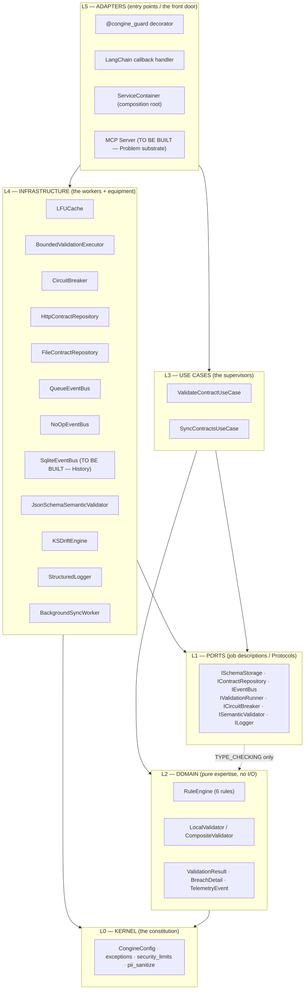
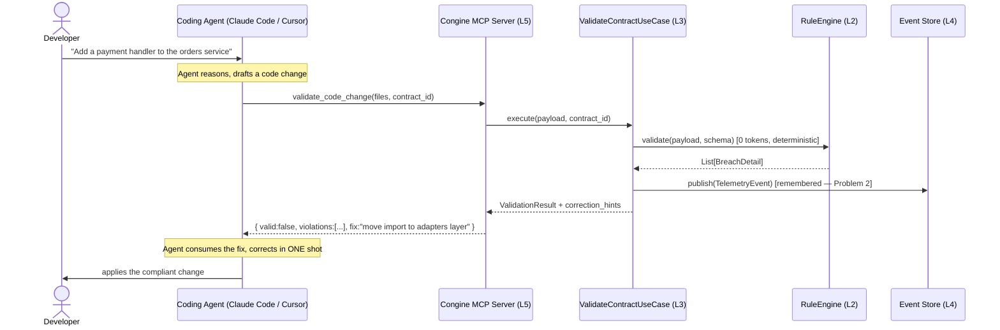
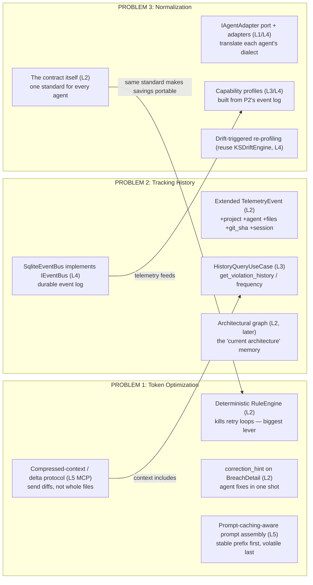
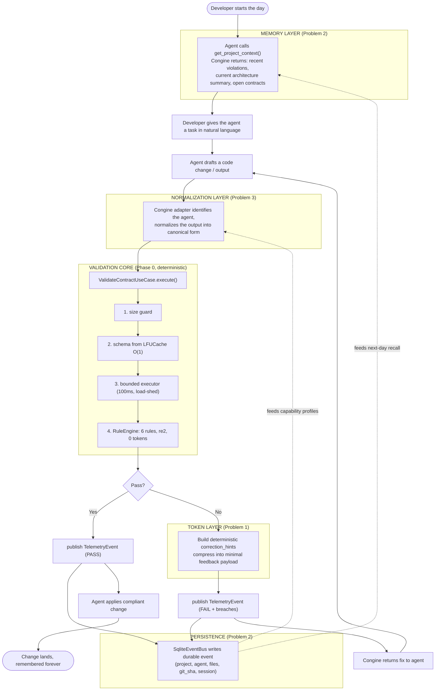

# 01 — CORE ENGINE ARCHITECTURE (Task 1)

**Purpose:** A single, complete architectural map of the Congine core engine, showing how each of
the three problems (Token Optimization, Tracking History, Multi-Agent Normalization) lives inside
the architecture, how a *real developer* passes work into the engine, how the engine talks to a
coding agent, and how the re-loop actually functions. Tone: technical, with an anthropomorphic
overlay where it aids intuition.

**Read `00_START_HERE.md` first.** This document assumes you have absorbed the three corrections,
especially Correction 2 (the engine is a tool the agent calls, not a proxy the prompt flows through).

---

## PART A — THE ENGINE AS IT EXISTS TODAY (the foundation you're extending)

Congine's Phase 0 core is a six-layer hexagonal architecture. You already have the deep tour of it
in `CONGINE_COMPLETE_ARCHITECTURE_GUIDE.md`; here is the compressed map you'll actually keep in your
head.



**The one rule that governs this diagram:** dependencies point *inward only*. L5 knows everything;
L0 knows nothing. The three boxes marked **TO BE BUILT** are where your three problems physically
attach. Notice they attach at L5 (the MCP server, a new entry point) and L4 (the SQLite store, a new
worker fulfilling an existing job description `IEventBus`). **You never modify L2 or L3 to add these
features.** That is the whole point of the architecture and it is the reason your timeline is
achievable — features are *additions*, not *surgery*.

---

## PART B — THE INTEGRATION QUESTION, RESOLVED

You asked, in several different ways: *"Once Congine is installed, does the developer give the prompt
to the coding agent and Congine processes internally, or does the developer give the prompt to
Congine and Congine talks to the agent?"* This is the most important design decision in the product,
so let's resolve it cleanly. There are **exactly two integration surfaces**, and they answer the
question differently.

### Surface 1 — The MCP Tool Surface (for closed coding agents: Claude Code, Cursor, Copilot)

Here the developer talks to the **agent** as normal. Congine does **not** hold the primary prompt.
Instead, Congine registers itself as an MCP tool the agent can call mid-reasoning. The control loop
belongs to the agent; Congine is a consultant it phones.



**Who holds the primary prompt?** The agent. **What does Congine do?** It answers `validate_*`
calls with deterministic verdicts and precise, machine-readable correction hints. **Where is the
"re-loop"?** It is the *agent's own loop*, now steered by Congine's feedback. You are not building a
new loop; you are inserting a checkpoint into a loop the agent already runs. This is the surface you
should build first (Phase B in `05`) and the one that raises funding.

### Surface 2 — The Proxy / Guard Surface (for raw LLM API calls and in-code enforcement)

Here the developer *does* route through Congine, because they're calling a raw LLM API or wrapping
their own function. This is the `@congine_guard` decorator and the LangChain handler you already
have. Congine genuinely sits in the middle and *can* re-loop the LLM itself.

```mermaid
sequenceDiagram
    actor Dev as Developer Code
    participant Guard as @congine_guard / Orchestrator (L5)
    participant LLM as Raw LLM API
    participant VCU as ValidateContractUseCase (L3)
    participant EVT as Event Store (L4)

    Dev->>Guard: call guarded function(prompt)
    loop until pass OR max_attempts
        Guard->>LLM: prompt (stable prefix cached + volatile suffix)
        LLM-->>Guard: candidate output
        Guard->>VCU: execute(output, contract_id)
        VCU->>EVT: publish(TelemetryEvent)
        alt output passes
            VCU-->>Guard: PASS
        else output fails
            VCU-->>Guard: FAIL + correction_hints
            Note over Guard: append hints to prompt suffix; re-loop
        end
    end
    Guard-->>Dev: validated output (or degraded/raised per fail_mode)
```

**Who holds the primary prompt?** Congine (the orchestrator). **Where is the re-loop?** Inside
Congine — this is the "re-looping and prompt caching so it does the work repeatedly until done" you
described. **But note:** this only works when Congine is the one calling the LLM. It does **not**
work for Cursor/Claude Code, which is why Surface 1 exists.

### The rule for choosing a surface

> If Congine can *see the LLM call*, it can be a proxy (Surface 2). If it can only see the *agent's
> file writes*, it must be a tool the agent calls (Surface 1).

Most of your enterprise value is Surface 1 (coding agents). Most of your *token-optimization demo
math* is easiest to show on Surface 2 (you control the loop, so you can measure attempts-with vs
attempts-without). Build both; lead with Surface 1.

---

## PART C — WHERE EACH PROBLEM PHYSICALLY LIVES

This is the heart of Task 1: the map from *problem* to *component*. Each problem has its own deep doc
(`02`, `03`, `04`); here is how they sit on the architecture together.



Three things to notice, because they are the "connect the dots" you asked for:

1. **Problem 1's biggest lever already exists.** `P1a` is your Phase 0 `RuleEngine`. You do not
   build the main token-saving mechanism — you *already have it*. What you add (`P1b`, `P1c`, `P1d`)
   makes it sharper. This should change how you talk about the product: you are not *promising*
   token savings, you are *instrumenting savings you already produce*.

2. **Problem 2 is the data spine of the whole product.** The event log (`P2a`) is not just a "look
   back at history" feature for humans. It is the **telemetry substrate** that Problem 3's capability
   profiles (`P3c`) are computed from, and it supplies the relevant context (`P2c`) that Problem 1's
   compressed prompt (`P1c`) injects. Build it early (Phase C) even though it's "Problem 2" in your
   list, because everything downstream drinks from it.

3. **Problem 3's intelligence is emergent, not trained.** `P3c` (capability profiles) is arithmetic
   over `P2a` (the event log): success rates, retry counts, per-(agent, contract-type) statistics.
   `P3d` reuses a component you *already built* (`KSDriftEngine`) to notice when an agent's
   performance shifts. There is no model training here in Phases A–E.

---

## PART D — THE FULL DEVELOPER-SESSION DATAFLOW (end to end, Surface 1)

Here is the complete picture of a real developer using Congine through a coding agent, with all
three problems active. This is the diagram to put on the wall.



Trace the loop labeled `RETURN --> DRAFT`: that is your "re-loop until the job is done properly."
It is deterministic (each pass through `RULES` gives the same verdict for the same input, so the
loop provably terminates or hits `max_attempts`), it is cheap (each retry ships a *compressed hint*,
not the whole context — Problem 1), and every pass is *remembered* (Problem 2), which over time
*teaches the router* which agent to trust for which contract (Problem 3). The three problems are not
three features bolted together — they are three views of one loop.

---

## PART E — THE CONTRACT: THE OBJECT AT THE CENTER OF EVERYTHING

You keep referring to "contracts" as the thing that gives control back to humans. Let's be precise
about what a contract *is* mechanically, because it's load-bearing for all three problems.

A contract today is a JSON document with an `id` and a `schema` (see `05_QUICKSTART_TEST.md`). The
schema is a set of **predicates** the output must satisfy. Anthropomorphically: a contract is a
*written law*, and the `RuleEngine` is a *judge* who applies the law identically to every defendant
(every output, from every agent). The judge never improvises — same law, same facts, same verdict.

For the three problems, the contract plays three roles:

- **Token Optimization:** the contract is *compressed intent*. Without it, the developer re-explains
  requirements in prose on every retry (verbose, re-sent each time, re-tokenized each time). With it,
  the requirement lives once in a structured object, is checked for *zero tokens*, and is surfaced to
  the agent only as a terse rule *when violated*. The contract is how you stop paying to re-say the
  same thing.
- **Tracking History:** every event is stamped with `(contract_id, contract_version)`. History is
  queryable *by contract* — "which contract is violated most in this file?" The contract is the
  primary key of memory.
- **Normalization:** the contract is the single standard every agent is judged against. It is *why*
  normalization is possible without understanding any specific agent.

**One critical debt to internalize now** (audit debt #8 / Bug B14): the rule engine only understands
a specific vocabulary (`required`, `type`, `enum`, `min`/`max`/`minimum`/`maximum`, `pattern`,
`null_forbidden`). It silently ignores `minLength`, `maxLength`, `format`, etc., unless semantic
validation is on. A contract can *look* enforced and not be. Fix this before you ship contracts to
users (Phase A). A firewall that silently lets packets through is worse than no firewall, because it
creates false confidence.

---

## PART F — WHAT YOU ADD, LAYER BY LAYER (the build surface)

To make the three problems real, here is the complete list of *new* code and *where it goes*. This
is the contract between this architecture doc and the roadmap (`05`).

| New component | Layer | Fulfills / extends | Problem |
|---|---|---|---|
| `mcp/server.py` (`MCPServer`) | L5 | new entry point | substrate for 1 & 3 |
| `mcp/tools.py`, `mcp/transport.py` | L5 | tool defs, stdio + HTTP/SSE | substrate |
| `ports/mcp_transport.py` (`IMCPTransport`) | L1 | new port | substrate |
| `cli/main.py`, `cli/diff_parser.py` | L5 | git-hook / CI entry | 1 (delivery) |
| `infrastructure/sqlite_event_bus.py` | L4 | implements existing `IEventBus` | 2 |
| extended `TelemetryEvent` fields | L2 | backward-compatible additions | 2 |
| `usecases/history_query_usecase.py` | L3 | reads the event store | 2 |
| `correction_hint` on `BreachDetail` | L2 | backward-compatible addition | 1 |
| context-compression logic | L5 (MCP) | delta protocol | 1 |
| `domain/arch_graph.py` (later) | L2 | pure graph | 2 (intelligence) |
| `usecases/validate_arch_usecase.py` (later) | L3 | graph validation | 2/3 |
| `ports/agent_adapter.py` (`IAgentAdapter`) | L1 | new port | 3 |
| `infrastructure/adapters/{claude,openai,oss}.py` | L4 | implement `IAgentAdapter` | 3 |
| capability-profile store + query | L3/L4 | stats over event log | 3 |

Every row either adds a new file at L5/L4/L1 or extends an L2 value object with backward-compatible
fields. **Zero rows touch the L2 `RuleEngine` logic or the L3 `ValidateContractUseCase`
orchestration.** If you ever find yourself editing `RuleEngine` to add token optimization or history,
stop — you've taken a wrong turn, because those concerns don't belong in the domain core.

---

## PART G — SUMMARY: THE ARCHITECTURE IN ONE BREATH

Congine is a deterministic validation core (L2/L3, already built and tested) wrapped in swappable
adapters (L1/L4/L5). The three new problems attach at the *edges*: an **MCP server** (L5) is the
mouth through which the engine consults coding agents; a **SQLite event store** (L4) is the memory
that remembers every verdict; a set of **agent adapters** (L4) plus **capability profiles** (L3)
built from that memory is how divergent agents are normalized to one standard. Token optimization is
mostly the *emergent consequence* of the deterministic core replacing probabilistic retries, sharpened
by correction hints, context compression, and provider-side prompt caching. Nothing clever touches
the core; everything clever surrounds it. That is why the plan is buildable, and why it is safe.

Next: `02_PROBLEM_TOKEN_OPTIMIZATION.md`.
