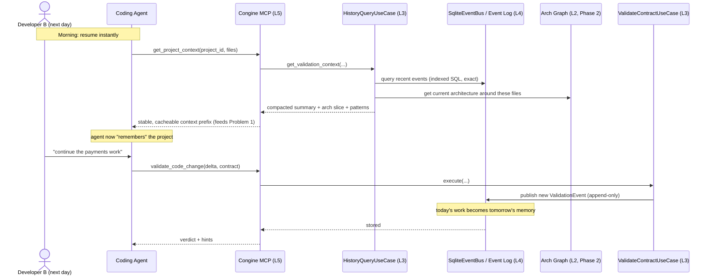

# 03 — PROBLEM 2: TRACKING HISTORY

**Purpose:** Rebuild why "memory" is genuinely hard (for both humans and machines), and design the
persistent memory system that lets a team resume instantly *and* lets the stateless agent act with
selective recall of the project's real architecture — without blowing the token budget. Two themes:
(1) logical reasoning behind the problem, (2) full technical workflow and where it lives in the engine.

**Prerequisite reading:** `00_START_HERE.md`, `01`, and `02` (history and tokens are the same coin —
you'll see why).

---

## PART 1 — THE REASONING: WHY IS "MEMORY" HARD?

There are two *different* memory problems hiding under the phrase "tracking history," and they have
different causes. Conflating them is why the feature feels vague. Separate them and it becomes buildable.

### 1.1 Human memory: teams lose context across time and handoffs

In any organization with more than one developer on a project, each person starts their day needing to
reconstruct *state*: what was done, why, what broke, what the current architecture even is. Developer B
picking up Developer A's work has to reverse-engineer decisions A made and never wrote down. Onboarding
a new engineer to "current reality" can take weeks (your own experience with the lost chat threads is
literally this problem — you're paying the reconstruction cost right now).

The cause is mundane but expensive: **decisions and their rationale live in people's heads and
ephemeral chats, not in a durable, queryable store.** When the head walks out (or the chat is deleted),
the knowledge is gone.

### 1.2 Machine memory: the agent is an amnesiac (same root cause as Problem 1)

This is the *same statelessness* from `02`. The coding agent has no memory of prior sessions. It doesn't
know your architecture, your past violations, or why a previous approach was rejected — unless you tell
it, every single time. And you can't tell it *everything*: the context window is finite and every token
costs money (Problem 1). So the machine-memory problem is really: **how do you give a finite-context,
stateless agent the *relevant slice* of a large history, cheaply?**

### 1.3 The synthesis

> "Tracking history" = build a **durable, queryable record** of what the system did and why, such that
> (a) humans see project state instantly, and (b) the engine can inject the *relevant* slice of that
> record into the agent's context on demand — giving the amnesiac selective memory without exceeding
> the token budget.

Notice (b) ties straight back to Problem 1: the injected history summary is exactly the "stable prefix"
that provider caching loves (`02`, Lever 4). **History is the content; token optimization is how you
deliver it affordably.** They are two ends of one pipe.

Anthropomorphic frame: you are building the project's **institutional memory** — the thing that
survives when any individual (human or model instance) forgets or leaves. A ship's logbook, a hospital's
patient chart, a company's official record. The individual crew changes; the log persists.

---

## PART 2 — THE TECHNICAL WORKFLOW: THREE STORES, NOT ONE

The single most common mistake here is trying to serve everything from one database. You need **three
stores** with different shapes because they answer different questions. (Your Codex laid these out
correctly; here they are with the mechanism spelled out.)

### Store 1 — The Event Log (append-only, immutable) — BUILD FIRST

This is the spine. Every validation/decision event is written here and **never updated or deleted**.
Immutability is what makes it a *trustworthy audit trail* — if you could edit it, it would prove nothing.

The record (this is your extended `TelemetryEvent`, backward-compatible additions to the existing
`frozen=True` model):

```python
@dataclass(frozen=True)
class ValidationEvent:            # extends TelemetryEvent
    event_id: str                 # UUID
    timestamp: datetime
    project_id: Optional[str]
    tenant_id: Optional[str]
    contract_id: str
    contract_version: str
    payload_hash: str             # SHA-256 of the payload — NOT the payload (privacy + dedup)
    result: ValidationResult
    agent_id: Optional[str]       # "claude_code" | "cursor" | "copilot" | "human"
    file_paths: list[str]
    git_commit_sha: Optional[str]
    session_id: Optional[str]
```

**Why hash the payload instead of storing it?** Two reasons at once: **privacy** (you don't want raw
outputs — which may contain PII or secrets — sitting in a log forever) and **deduplication** (identical
payloads share a hash; you can detect "the agent produced this exact thing before"). This is
**content-addressed storage**, and it's a security posture as much as a storage trick.

**The critical implementation detail — prime in place, never clear-then-refill.** This is the same
lesson your `SyncContractsUseCase` already learned for the cache (audit trace 5): a store that briefly
empties itself during an update creates a window where a concurrent read sees *nothing*. For an
append-only log this is naturally safe (you only ever add), but keep the principle in mind for any
derived view.

**Phase 1 technology:** SQLite in **WAL (Write-Ahead Logging) mode**. WAL lets readers and a writer
proceed concurrently without blocking each other — exactly right for "hot path writes events while a
query reads history." Single-node, zero-ops, durable across restarts. This is a new L4 class
`SqliteEventBus` that **implements the existing `IEventBus` port** — so the `ValidateContractUseCase`
doesn't change at all; you just wire a different concrete in the `ServiceContainer` behind a config
flag (`CONGINE_EVENT_STORE=sqlite`). This is the hexagonal architecture paying off exactly as promised.

**Phase 2/3 migration path:** when volume outgrows one node, the same `IEventBus` port lets you swap
in ClickHouse / TimescaleDB / S3+Parquet with zero use-case changes.

### Store 2 — The Architectural Graph (mutable, live) — BUILD SECOND (Phase 2)

This is the store that fulfills the part of your vision you kept circling: *"ask the coding agent to do
tasks with respect to the current architectural system."* The event log knows *what happened*; the graph
knows *what the system currently is*.

Model it as a directed graph:

```python
@dataclass
class ArchNode:
    node_id: str
    node_type: str        # module | class | function | service
    file_path: str
    layer: str            # domain | usecase | infrastructure | adapter | kernel
    contracts: list[str]  # which contracts govern this node

@dataclass
class ArchEdge:
    from_node: str
    to_node: str
    edge_type: str        # imports | calls | inherits | implements
    is_violation: bool    # does this edge break a contract? (e.g. domain -> infrastructure)
```

**Why a graph, and what it buys you:** your own architecture's core rule — "dependencies point inward
only" — *is a graph constraint*. "domain must not import infrastructure" is literally "there must be no
edge from a domain node to an infrastructure node." With the graph, when an agent proposes a change,
Congine can answer *"does this new edge violate the architecture?"* **without the agent sending the
whole codebase** — it consults the graph, which is Congine's memory of the structure. This is
architecturally the most differentiating capability in the whole product (no generic validation tool has
it), and it's pure graph theory: reachability, cycle detection, forbidden-edge checks.

**How the graph gets built and updated:** parse changed files (reuse the `diff_parser` you build for the
CLI/token work) into nodes and edges; update the graph incrementally as changes land. It's a *derived*
structure — you could always rebuild it from the codebase — so it doesn't need the same immutability as
the log.

### Store 3 — The Violation Pattern Index (analytics) — BUILD THIRD (Phase 2)

An aggregated view over Store 1: violation frequency, recurrence, per-file hotspots, per-agent success
rates. This powers two things: the human dashboard ("this file has been violated 12 times") and — the
part that matters most for the product — the **capability profiles that feed Problem 3** (which agent is
good at which contract type). You already own the perfect tool for the drift piece: `KSDriftEngine`
detects when a violation-rate *distribution* shifts (e.g., an agent that was 92% compliant is suddenly
60% — something changed). Reuse it.

---

## PART 3 — RETRIEVAL AND INJECTION: GIVING THE AMNESIAC SELECTIVE MEMORY

Storing history is half the job. The other half is **recalling the *right* slice and injecting it
cheaply**. Two rules, both important:

### Rule 1 — Use structured queries, NOT vector search, in Phase 1

Your Codex is right and I want to reinforce it: **do not reach for embeddings and vector databases
early.** That is over-engineering that will eat weeks. For "what recently happened in this file against
this contract," a plain indexed SQL query is faster, cheaper, exact, and debuggable:

```python
def get_validation_context(project_id, file_paths, contract_id) -> ValidationContext:
    recent = event_log.query(
        project_id=project_id, file_paths=file_paths, contract_id=contract_id,
        order_by="timestamp DESC", limit=10,
    )
    arch = graph.get_nodes_for_files(file_paths)        # Phase 2
    return ValidationContext(recent_violations=recent,
                             component_graph=arch,
                             pattern=detect_pattern(recent))
```

Vector/semantic search (cosine similarity over embeddings, ANN indexes like HNSW) earns its place only
in Phase 3, for fuzzy questions like "have we solved something *similar* before?" Structured queries
answer the exact questions that matter first.

### Rule 2 — Inject a *summary*, not the raw log (context compaction)

You cannot dump 10,000 events into the agent's context — finite window, huge token cost. You inject a
**compacted summary**. This is where light, careful summarization lives, and you use a **hierarchy**:

- **Recent, high-relevance events:** included verbatim (they're few and they matter most).
- **Older events:** rolled into a running summary ("this file has recurring RANGE_CHECK violations on
  `score`; the repository pattern was chosen for orders on 2026-05-02").

This hierarchical/rolling-summary approach keeps the injected memory *small and stable* — which is
exactly the cacheable prefix from `02` (Lever 4). **The history summary is engineered to be the
prompt's stable prefix.** That's the dot connecting Problems 1 and 2: memory is stored durably, then
compacted so it can be injected as a cheap, cacheable context layer.

A note on *where* summarization uses an LLM: prefer deterministic summaries where possible (counts,
"last N decisions," structured rollups — zero tokens). Use a small model to summarize free-text only
when structure genuinely can't capture it, and cache the summary so you don't re-summarize the same
history repeatedly.

---

## PART 4 — DATA FLOW FOR TRACKING HISTORY (the daily loop)



The loop is self-reinforcing: every validation writes to the log; the log feeds tomorrow's recall and
the capability profiles; recall is compacted into a cheap prefix. The system's memory compounds while
its per-call cost stays flat.

---

## PART 5 — SECURITY FOR TRACKING HISTORY

History is the most security-sensitive subsystem you'll build, because it is *durable* — a mistake here
persists forever and accumulates. Relevant frameworks: data-at-rest protection, tamper-evident logging,
and privacy engineering (GDPR/data-minimization).

1. **Store hashes, not payloads (data minimization).** Already baked into the `payload_hash` design.
   The less raw content you retain, the smaller your breach blast radius. When you *must* retain content
   (e.g., for correction hints), run it through `pii_sanitize` first and keep it in a *separate,
   erasable* content store — not in the immutable log.
2. **Tamper-evidence via hash-chaining.** An audit trail is only trustworthy if it can't be silently
   altered. Make each event include the hash of the previous event: `event.chain_hash =
   SHA256(prev_chain_hash + event_content)`. Now any retroactive edit breaks the chain and is
   detectable — a lightweight **Merkle/blockchain-style** integrity guarantee without a blockchain. This
   is a genuine enterprise-grade differentiator ("our audit log is tamper-evident").
3. **Encryption at rest + least-privilege access.** The SQLite file (or later DB) holds project
   metadata, file paths, hashes. Encrypt the store; scope reads per tenant; gate history queries behind
   authorization (ties to future RBAC — even in Phase 1, don't expose one tenant's history to another).
4. **Injection on read-back (the subtle one).** History content re-injected into a prompt is a
   **prompt-injection vector** (LLM01): a past output could contain "ignore all rules." Treat stored
   content as *untrusted data*, and sanitize/escape it before it re-enters any prompt. This is the same
   "treat cached data with skepticism" rule your snapshot loader already embodies (symlink checks, owner
   checks, envelope validation) — extend it across *time*, not just across the network.
5. **GDPR "right to erasure" vs append-only immutability (a real conflict you must design for).**
   Regulators can require deleting a user's data; your log is immutable by design. **Resolution:** the
   *immutable log stores only hashes + a tombstone flag*; the *erasable content store* holds any
   human-readable content. Erasure deletes the content and sets the tombstone; the log's integrity chain
   survives (it never held the content). Design this now — retrofitting erasure into an append-only store
   later is painful.
6. **Retention and growth.** Immutable logs grow forever. Define retention/compaction policy up front
   (roll old events into summaries, archive cold data). Unbounded growth is both a cost and a security
   surface.

---

## PART 6 — WHAT TO LEARN FOR THIS PROBLEM (pointer to `06`)

- **Append-only logs / event sourcing** — the log is the source of truth; state is *derived* from it.
- **Content-addressed storage & hashing (SHA-256)** — the privacy/dedup backbone; you already use it
  for snapshot paths.
- **Merkle trees / hash chaining** — tamper-evidence.
- **Graph theory** — DAGs, topological sort, reachability, cycle detection — the architectural graph
  and the "arrows point inward" constraint are pure graph problems.
- **Database internals** — ACID, WAL, indexing, retention/compaction.
- **Summarization / context compaction** — hierarchical/rolling memory; where (and where not) to use a
  model.
- **Embeddings + ANN (Phase 3 only)** — cosine similarity, HNSW; deliberately deferred.
- **Privacy engineering** — data minimization, GDPR erasure patterns, tamper-evident audit design.

---

## PART 7 — THE ONE-PARAGRAPH TAKEAWAY

"Tracking history" is two problems: humans lose context across handoffs, and the stateless agent has no
memory of prior sessions — and the second is the same statelessness that drives Problem 1. Solve both by
building institutional memory in three stores: an **append-only event log** (the trustworthy spine,
SQLite WAL, storing hashes not payloads, wired in behind the existing `IEventBus` port so nothing in the
core changes), an **architectural graph** (Congine's memory of the *current* system, which lets it judge
changes "with respect to the architecture" without seeing the whole codebase — your most differentiating
capability), and a **pattern index** (analytics that also feed Problem 3's agent profiles). Recall the
*relevant slice* with plain structured queries (not vector search, yet), compact it into a small **stable
summary** that doubles as Problem 1's cacheable prefix, and guard the whole thing with hashing,
tamper-evident chaining, encryption, read-back sanitization, and an erasure design that respects both
immutability and GDPR. Memory compounds; per-call cost stays flat.
