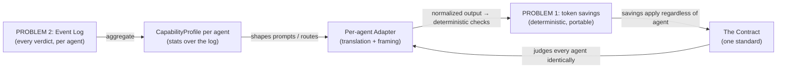

# 04 — PROBLEM 3: MULTI-AGENT NORMALIZATION (the "management system")

**Purpose:** Answer the sharpest technical question in your prompt — *"to bring every coding agent
(Claude, GPT/Codex, open-source) to the same, best performance level, do we train our engine to learn
each agent's patterns, or is there another strategy?"* — and design the subsystem that makes divergent
agents produce convergent, compliant work. Two themes: (1) logical reasoning behind the problem, (2)
full technical workflow and where it lives in the engine.

**Prerequisite reading:** `00_START_HERE.md` (Correction 3), `01`, `03` (this problem drinks from the
history system).

---

## PART 1 — THE REASONING: WHY DO AGENTS DIVERGE, AND WHAT WOULD "NORMALIZE" MEAN?

### 1.1 Why two developers on the same project produce different code

Different agents differ along many axes: training data, instruction-following fidelity, default coding
style, verbosity, tool-use conventions, context-window size, and per-domain strengths and weaknesses.
Claude, GPT/Codex, and an open-source model like Qwen or DeepSeek will, given the same task, produce
*different* outputs — different naming, different structure, different edge-case handling.

In an organization where Developer A uses Claude and Developer B uses GPT, the codebase drifts into two
dialects unless something enforces a common standard. That "something" is your product. The *goal* —
"bring every agent to the same, best level" — is exactly right. The question is the *mechanism*.

### 1.2 The tempting wrong answer: "train the engine to learn each agent"

Your instinct was: maybe Congine must *learn each agent's patterns over time and act accordingly* —
which sounds like training a model. Here is why that is the wrong *first* move (and mostly a
wrong-forever move for the core engine):

- **You don't have the data.** Training needs large, labeled datasets of each agent's behavior. You have
  none on day one.
- **It's slow and expensive.** Training/fine-tuning is a research project with GPUs, iteration, and
  evaluation — not a feature you ship in a sprint.
- **It re-introduces the exact thing your product sells against.** Congine's entire value is
  *determinism*. Bolting a learned, probabilistic model into the decision path makes verdicts fuzzy and
  slow — the opposite of the moat. A learned normalizer would make your firewall guess.
- **It solves the wrong layer.** You don't need to *predict* what each agent will do. You need to *hold
  whatever it does to one standard* and *translate its dialect*. That's deterministic.

> The reframe: you are not building an AI that *understands* each agent. You are building a **standard**
> every agent is measured against, a **translator** that speaks each agent's dialect, and, over time, a
> **statistical record** of which agent is good at what. None of that is model training.

Anthropomorphic frame: think of a multinational company hiring engineers educated in different countries.
You do not send each new hire back to re-education. You (1) make them all pass the *same certification
exam* (the contract), (2) give each a *translator/interpreter* who speaks their dialect but files all
reports in one company language (the adapter), and (3) build an *HR performance record* over time so you
assign the right person to the right task (capability profiles). No brain surgery. Just standards,
translation, and record-keeping.

---

## PART 2 — THE TECHNICAL WORKFLOW: THREE DETERMINISTIC MECHANISMS

Normalization comes from three mechanisms, in strict order of importance and build-order.

### Mechanism 1 — The contract as the great equalizer (ALREADY EXISTS)

Regardless of which agent produced an output, it is validated against the **same contract**. If Claude's
output and GPT's output must both satisfy contract X, then *both are forced into whatever X permits.*
Their outputs converge — not because you understood either model, but because you held both to one law.

This is the primary normalizer, it requires **zero new work** (it's your Phase 0 `RuleEngine`), and it's
the thing to say first when someone asks "how do you support any agent?" The answer is: *"We don't adapt
to the agent. Every agent adapts to the contract."*

The contract is model-agnostic by construction. This is why your hexagonal architecture matters here too:
the `RuleEngine` (L2) has no idea whether the payload came from Claude, GPT, or a human — and it must
never know. The moment normalization logic leaks into the domain core, you've broken the property that
makes it universal.

### Mechanism 2 — The per-agent adapter (translation, not learning) (Phase 2 of this problem)

Agents differ in surface *protocol*, not just output. They expect tool schemas in slightly different
shapes, respond with different envelopes, need different prompt framing (a weaker model needs more
explicit instructions; a verbose model needs "output JSON only"). You absorb these differences in a thin
**adapter per agent** — the exact **Ports & Adapters** pattern your entire codebase already lives by.

```python
# L1 port
class IAgentAdapter(Protocol):
    def to_agent_request(self, canonical_task: CanonicalTask) -> AgentRequest: ...
    def from_agent_output(self, raw: AgentOutput) -> CanonicalOutput: ...
    def frame_prompt(self, canonical_prompt: str, profile: CapabilityProfile) -> str: ...

# L4 concretes
class ClaudeAdapter(IAgentAdapter): ...
class OpenAIAdapter(IAgentAdapter): ...
class OpenSourceAdapter(IAgentAdapter): ...   # Ollama / vLLM-hosted models
```

What the adapter does, concretely:
- **On the way in:** translate Congine's *canonical* request into the agent's dialect (its MCP flavor,
  its tool-call format, its preferred prompt structure).
- **On the way out:** normalize the agent's raw output back into Congine's *canonical form* before it
  ever reaches the `RuleEngine`. After this step, the core doesn't know or care which agent spoke.
- **Framing:** apply agent-specific prompt shaping (informed by the capability profile — Mechanism 3):
  give a model with a smaller context window a tighter delta; give a model with weaker
  instruction-following more explicit constraints.

This is an **anti-corruption layer** (a Domain-Driven Design term): it stops each agent's quirks from
contaminating your clean core. **Zero training.** It's translation code. This is the mechanism that lets
you honestly say "we support Claude, GPT, and open-source models" — you write one adapter each.

### Mechanism 3 — Empirical capability profiles (statistics over your own telemetry) (Phase 2/3)

This is where the *appearance* of "learning each agent" is actually delivered — but it's **statistics
over the event log from Problem 2**, not model training. Over time, for each `(agent, contract_type)`
pair, you accumulate:
- success rate (passed on first attempt),
- average number of retries to converge,
- typical latency and token cost,
- which rule types it violates most.

This is a straightforward aggregation query over Store 1 (the event log). From it you build a
`CapabilityProfile` per agent, and you use it two ways:

1. **Prompt shaping (now):** the adapter uses the profile to frame prompts better ("GPT tends to violate
   RANGE_CHECK on this contract type — inject the range rule explicitly up front").
2. **Routing (Phase 3, optional):** when a task could go to any of several agents, route it to the one
   the data says is best for that contract type. This is a **capability-based routing** problem, and if
   you want it to adapt online, the right tool is a **contextual bandit** (Thompson sampling or UCB) —
   *not* a neural network. A bandit balances "use the agent we know is good" (exploit) against "try
   another to see if it's better now" (explore), and it's a few dozen lines of well-understood math.

And you *already own* the drift detector for this: `KSDriftEngine`. When an agent's success-rate
distribution shifts (a model update degraded it, say), KS detects the drift and you re-profile. That's
your "act accordingly over time" — delivered by a component that already exists, driven by data you
already collect.

> So the full answer to your question: **No, you do not train the engine on each agent.** You normalize
> via (1) one shared contract every agent must satisfy, (2) a thin translation adapter per agent, and
> (3) capability profiles computed as *statistics over your own event log*, optionally with a contextual
> bandit for routing and KS-drift for re-profiling. The "learning" is arithmetic over telemetry, not
> gradient descent over model weights. Full model fine-tuning is a Phase-3-or-never research bet that
> would *weaken* your determinism moat — keep it off the critical path.

---

## PART 3 — HOW THE THREE PROBLEMS FUSE HERE

This problem is where the product becomes more than the sum of its parts, so let's make the fusion
explicit:



Read it as a sentence: the **event log** (P2) yields **capability profiles**, which shape the
**adapters**, which feed normalized output into the **deterministic checks** whose **token savings** (P1)
therefore hold *no matter which agent is used* — because the **contract** judged them all the same. Cut
any one of these and the others weaken. This interdependence is *why* the build order in `05` is what it
is, and it's the story that makes the product feel inevitable rather than like three bolted-on features.

---

## PART 4 — SECURITY FOR MULTI-AGENT NORMALIZATION

Every agent is an **untrusted output source**, and open-source/self-hosted agents especially so. This
subsystem's security posture is the strictest in the product. Relevant frameworks: zero-trust boundaries,
OWASP LLM Top 10 (LLM02 Insecure Output Handling, LLM01 Prompt Injection), and supply-chain security.

1. **Treat all agent output as hostile until validated — this is the core posture.** A jailbroken,
   misconfigured, or compromised agent (a poisoned open-source model, a prompt-injected Claude session)
   can emit malicious code or crafted output designed to exploit downstream systems. The adapter's
   `from_agent_output` step must **validate and sanitize before the output enters the core**, and the
   `RuleEngine` verdict is what gates it. Never execute or trust agent-produced code on the strength of
   *which* agent produced it. Provenance is not safety.
2. **Per-agent isolation (no cross-contamination).** A prompt-injection or bad state in one agent's
   context must not leak into another's. Keep per-agent contexts, credentials, and caches isolated (this
   extends your existing multi-tenant scoping down to the per-agent granularity). Cache keys for LLM
   results must include agent identity.
3. **Credential isolation and secrets management.** Each agent has its own API keys / endpoints. Never
   hard-code them; never log them (your `StructuredLogger` already has an unconditional secret blocklist
   — extend it to cover every new credential field). Store them in a vault, scope per tenant/agent, and
   rotate. Denial-of-wallet applies here too — an attacker who can trigger expensive-agent calls runs up
   your bill; rate-limit per tenant and keep the load-shedding discipline.
4. **Supply-chain risk for open-source adapters.** Running self-hosted models (Ollama, vLLM) pulls in a
   larger dependency and model surface. Pin dependencies, maintain an SBOM, scan (`pip-audit`), and keep
   your existing dependency-light discipline — every new adapter's transitive dependencies are new attack
   surface. Validate model provenance where you can.
5. **Adapter input validation.** The adapter is a translation boundary, and translation boundaries are
   classic injection points (think of it like parsing untrusted input). Schema-validate what comes back
   from each agent before normalizing; malformed envelopes should be rejected, not coerced.

---

## PART 5 — WHAT TO LEARN FOR THIS PROBLEM (pointer to `06`)

- **Ports & Adapters / anti-corruption layer (DDD)** — you already live this; now apply it to agents.
- **Canonical data modeling / normalization** — one internal representation, many external dialects.
- **Statistics** — success-rate estimation, confidence intervals; enough to build honest capability
  profiles and not fool yourself with small samples.
- **Contextual bandits (Thompson sampling, UCB)** — *optional, Phase 3* — the correct, lightweight tool
  for adaptive routing (explore/exploit), instead of deep RL or model training.
- **Distribution drift / KS test** — you already have `KSDriftEngine`; understand what it's testing so
  you can point it at agent performance.
- **Protocol design (JSON-RPC / MCP dialects)** — the shape of what adapters translate.
- **Zero-trust security & OWASP LLM Top 10** — the posture above.

Deliberately *not* required: model fine-tuning, RLHF, GPU training pipelines. Building those into the
core engine would trade your determinism moat for a research project you don't need.

---

## PART 6 — THE ONE-PARAGRAPH TAKEAWAY

Agents diverge because they're different models; the goal of normalizing them is right, but the mechanism
is **not** training the engine to learn each one. Normalize deterministically: (1) the **contract** is
the one standard every agent is judged against — it already exists and makes support universal because the
core never knows which agent spoke; (2) a thin **per-agent adapter** (Ports & Adapters, an anti-corruption
layer) translates each agent's dialect on the way in and normalizes its output on the way out — pure
translation, zero training; (3) **capability profiles** computed as *statistics over the Problem-2 event
log* deliver the "learn over time" behavior, optionally sharpened by a **contextual bandit** for routing
and your existing **KSDriftEngine** for detecting when an agent's performance shifts. The three problems
fuse here: history yields profiles that shape adapters that feed deterministic checks whose token savings
hold regardless of agent because the contract judged them all the same. And because every agent is an
untrusted output source, the governing security rule is absolute: *validate and sanitize before trust —
provenance is never safety.*
