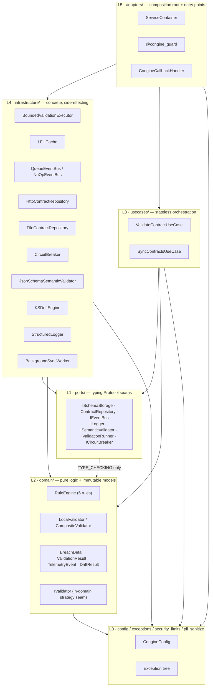
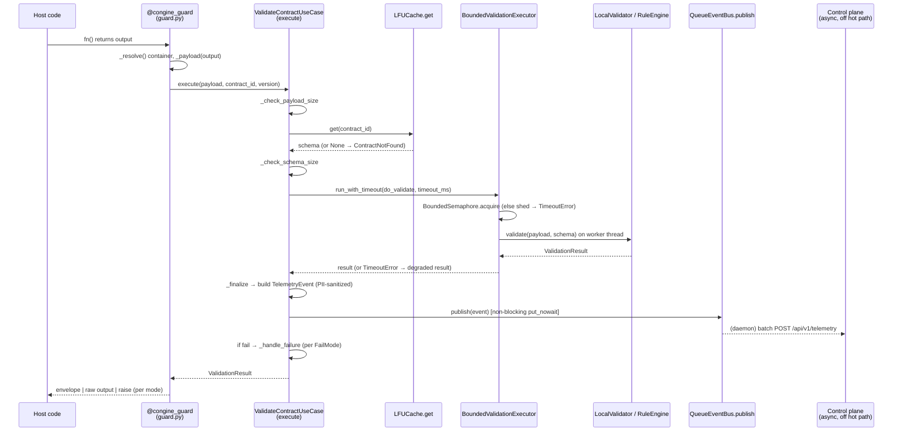
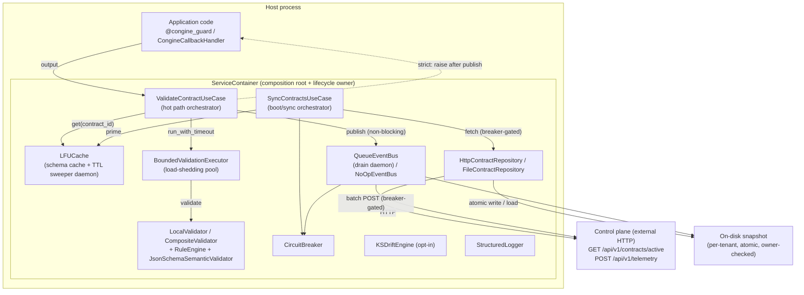
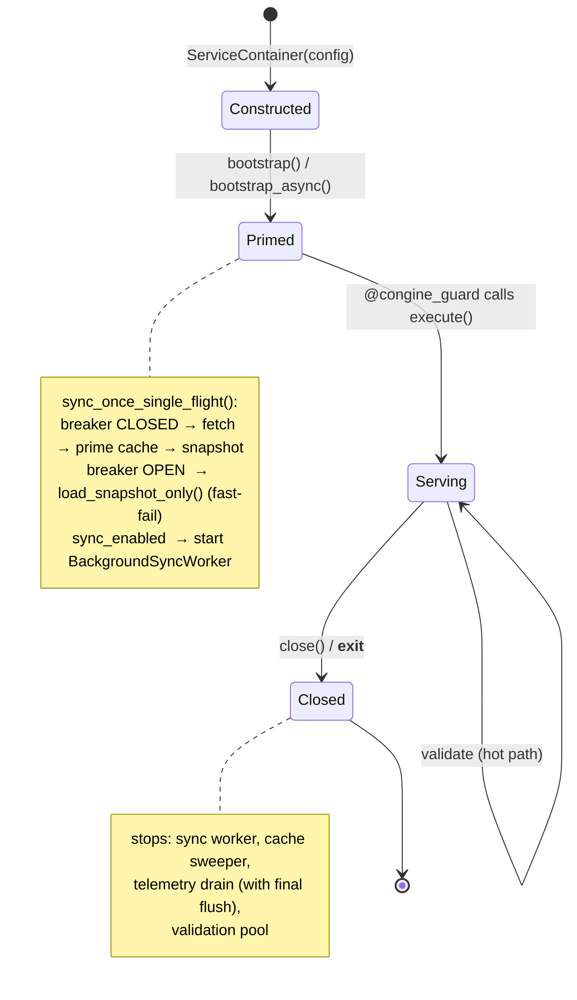

# 00 — Congine System Map

> **The document you read to understand the whole system.** Reverse-engineered from source on 2026-06-14.
> Every claim here traces to a file you can open. Diagrams are companions to the prose — the prose is primary.
> Companion files: `01_FILE_INVENTORY.md` (every file), `02_FAILURE_PATHS.md` (every branch), `03_SPEC_RECONCILIATION.md` (build-vs-spec).

---

## 0. One-paragraph orientation

Congine is a **synchronous output firewall**. A developer puts `@congine_guard("some-contract")` on a function;
when that function returns, Congine intercepts the return value, looks up a JSON contract schema in an in-memory
cache, runs the value through six deterministic rules (and optionally full JSON-Schema validation) under a hard
millisecond deadline, fires a telemetry event without blocking, and then either passes the value through, returns
it wrapped in an envelope, or raises — depending on the configured mode. Everything else in the codebase exists to
make that one hot path **safe under load** (a bounded, load-shedding thread pool), **safe under failure** (a
circuit breaker + on-disk snapshot fallback so a dead control plane can't stall boot), **safe under attack**
(linear-time regex, length caps, payload bounds, PII scrubbing), and **safe across tenants** (per-tenant cache,
snapshot, and breaker). It is a library, not a service: there is no server, no database, no CLI — the host
application owns the process and Congine rides inside it.

---

## STEP 2 — The Seams (the architecture as it actually is)

The SDK is a **strict 6-tier hexagonal monolith**. Dependencies point inward only. I verified this by reading
every `import` statement, not by trusting the layer names. The verdict: **the intended architecture is the real
architecture.** Below, each layer with its actual files and a boundary check.

**L0 — Shared kernel.** `config.py`, `exceptions.py`, `security_limits.py`, `pii_sanitize.py`. These are imported
everywhere and import (almost) nothing. `config.py` imports `exceptions` and `security_limits`; that's an intra-L0
edge and is fine. **Boundary check: clean.** No L0 file imports any port, domain, infra, or adapter.

**L1 — Ports.** The seven `typing.Protocol` interfaces in `ports/`. They contain no logic. Two of them
(`IEventBus`, `ISemanticValidator`) reference an L2 value object (`TelemetryEvent`, `BreachDetail`) **only under
`TYPE_CHECKING`**, so there is no runtime upward edge — exactly the inward-reference pattern `ARCHITECTURE.md`
prescribes. **Boundary check: clean.**

**L2 — Domain.** `domain/models.py` (value objects) and `domain/validator.py` (the rule engine + validators).
`validator.py` imports `domain.models` and `security_limits` (both inward) and `re2` (a 3rd-party leaf, not a
layer). It references `ISemanticValidator` only under `TYPE_CHECKING`. **Boundary check: clean — the domain
imports no infrastructure.** This is the single most important boundary in the system and it holds.

> **One sanctioned deviation:** the `IValidator` Protocol lives in `domain/validator.py`, not in `ports/`. This is
> deliberate and documented: it is an *in-domain strategy seam* that `LocalValidator` and `CompositeValidator`
> implement, never injected across a layer boundary. Every protocol that *is* injected across a boundary lives in
> `ports/`. So the rule "cross-boundary protocols live in L1" is upheld; `IValidator` is the explicit exception.

**L3 — Use cases.** `ValidateContractUseCase` and `SyncContractsUseCase`. Both depend **only on L1 ports, L2
models, and L0**. `ValidateContractUseCase` names `ISchemaStorage`, `IValidator`, `IEventBus`, `ILogger`,
`IValidationRunner` — all abstractions — and never imports a concrete from L4. `SyncContractsUseCase` imports
`portalocker` directly (a 3rd-party leaf) for the boot lock, which is a pragmatic infra dependency in an
orchestration layer; it's the one place a use case touches a concrete external library. **Boundary check: clean
w.r.t. Congine layers** (the `portalocker` import is a 3rd-party leaf, not an L4 Congine concrete — note it but
don't over-flag it).

**L4 — Infrastructure.** Every concrete that does I/O, threads, HTTP, or caching. Each implements an L1 port
structurally. They import L0 and L2 (e.g. the semantic validator imports `BreachDetail`) — both inward.
**Boundary check: clean.** No infra file imports an adapter.

**L5 — Adapters.** `ServiceContainer` (the *only* place concretes are constructed), `@congine_guard`, and the
LangChain handler. This is the top of the graph; it imports everything below. **Boundary check: clean.**

**Net architectural verdict:** The hexagon is real and disciplined. The ports are genuine duck-typed seams (the
test fakes in `conftest.py` satisfy them without importing them). The composition root is genuinely the sole
wiring point. The one thing worth saying plainly: *this discipline is the asset.* It is why every future feature
(MCP server, SQLite event bus, distributed cache) can be added as a new L4 concrete behind an existing port
without touching the domain.

---

## STEP 3 — The Primary Path, End to End (the most important section)

This is the validation of a decorated function's output — the thing the whole system exists to do. I trace **one
synchronous request** through every file it touches, in order. Read this once and you can trace any request by hand.

### Setup (what exists before the request)

The host has, at startup, constructed one `ServiceContainer` and called `bootstrap()`. Inside
`ServiceContainer.__init__` (`adapters/dependency_injection.py:132`), the object graph was assembled bottom-up:
a `StructuredLogger`, a `BoundedValidationExecutor`, an `LFUCache`, a `CircuitBreaker`, a contract repository
(`HttpContractRepository` by default), an event bus (`QueueEventBus` unless telemetry disabled), a
`JsonSchemaSemanticValidator`, a `KSDriftEngine`, a validator (`LocalValidator`, or `CompositeValidator` if
semantic validation is on), and finally the two use cases. `bootstrap()` ran a single-flight sync that primed the
`LFUCache` with contract schemas from the control plane (or, if the breaker was OPEN, from the on-disk snapshot).
So when the first request arrives, the schema is already in the cache.

### The journey

**1. The developer's function returns.** The host code is `@congine_guard("sentiment-v1", container=ctx)` on a
function `analyze()`. The function body runs and returns `{"score": 0.9, "label": "pos"}`. Control passes to
`sync_wrapper` in `adapters/guard.py:76`.

**2. The guard resolves the container and the payload.** `sync_wrapper` calls `_resolve()` — since an explicit
`container=` was given, it returns that container immediately (had it been `None`, it would lazily call
`ServiceContainer.get_default()`). It then computes the payload: `_payload(output)` returns the output unchanged
(no `extractor` was supplied). The guard now calls `ctx.validate_contract_usecase.execute(payload=..., contract_id="sentiment-v1", contract_version="latest")`.
**What just arrived:** the raw function output. **Who has control now:** `ValidateContractUseCase.execute`
(`usecases/validate_contract_usecase.py:49`).

**3. Size guard.** `execute` first calls `_check_payload_size(payload)` (line 125). It does
`len(json.dumps(payload, default=str))` and compares to `max_payload_bytes` (default 1 MiB). Our payload is tiny,
so this returns `None` (no breach) and we proceed. *(Note: this measures character count, not UTF-8 byte count —
a known minor divergence, see `02_FAILURE_PATHS.md`.)*

**4. Schema resolution from cache.** `execute` calls `_resolve_schema("sentiment-v1")` (line 161), which calls
`self.schema_storage.get("sentiment-v1")`. Control is now in `LFUCache.get` (`infrastructure/lfu_cache.py:79`).
Under an `RLock`, the cache finds the entry, checks it is not TTL-expired, bumps its access frequency (the O(1)
LFU move-to-next-bucket in `_increment_freq`), and returns the schema dict. Back in the use case, the schema is
non-`None`, so no `CongineContractNotFoundError` is raised. `_check_schema_size` then bounds the schema the same
way. **What was produced:** the contract schema. **Why this call:** validation is meaningless without the schema,
and the cache is the only thing on the hot path fast enough to make the sub-100ms budget realistic.

**5. Time-boxed execution.** `execute` defines a zero-arg closure `do_validate()` that will call
`self.validator.validate(payload, schema)`, then hands it to the executor:
`self.timer.run_with_timeout(do_validate, self.timeout_ms)` (line 70). Control passes to
`BoundedValidationExecutor.run_with_timeout` (`infrastructure/bounded_executor.py:84`).

**6. The bounded executor admits or sheds.** The executor first checks `_on_worker_thread()` — we are on the
caller's thread, not a pool worker, so it proceeds (the re-entrancy inline-run is for nested calls only). It calls
`_acquire_and_submit(do_validate)`: it tries `self._sem.acquire(blocking=False)` on a `BoundedSemaphore` sized to
`capacity = max_workers + max_pending` (default 20). If a permit is free, it submits `do_validate` to the
`ThreadPoolExecutor` and attaches a done-callback that releases the permit **only when the future genuinely
finishes** (so a timed-out zombie keeps occupying capacity — this is the whole point). If no permit is free, it
increments `rejected_total` and raises `TimeoutError` *immediately* (load shed, not unbounded queue). In the happy
path a permit is free; the work is submitted. `run_with_timeout` then blocks on `future.result(timeout=timeout_ms/1000)`.

**7. The pure validation runs on a worker thread.** On the pool worker, `do_validate()` calls
`LocalValidator.validate(payload, schema)` (`domain/validator.py:369`). It confirms the payload is a dict, then
iterates its six rules **in this fixed order**: `FIELD_PRESENCE`, `TYPE_MATCH`, `ENUM_VALUES`, `RANGE_CHECK`,
`NULL_GUARD`, `REGEX_PATTERN`. For each rule, `_extract_params` pulls the relevant slice of the schema (e.g.
`required` for FIELD_PRESENCE, the `properties` map for TYPE_MATCH, the `enum`-bearing properties for ENUM_VALUES,
the `pattern`-bearing properties for REGEX_PATTERN — using `re2.fullmatch` with length caps). Each rule is a pure
static method returning a list of `BreachDetail`. The breaches are concatenated. Since our payload satisfies every
rule, the list is empty, and `validate` returns `ValidationResult(status="pass", breaches=(), duration_ms=…)`.
*(If semantic validation were enabled, `CompositeValidator.validate` would run here instead, calling
`LocalValidator` first, then `JsonSchemaSemanticValidator.validate` for full JSON-Schema checks, and merging the
breach lists.)* **What was produced:** a frozen `ValidationResult`. The future completes; its done-callback
releases the semaphore permit; `future.result()` returns the result to the use case.

**8. Finalize: telemetry, then enforcement.** Back in `execute`, the result is passed to `_finalize` (line 205).
`_finalize` builds a `TelemetryEvent` — copying contract id/version, status, duration, and a list of breach dicts,
each message run through `sanitize_breach_message` to strip any embedded instance values — and calls
`self.event_bus.publish(event)`. Control passes briefly to `QueueEventBus.publish`
(`infrastructure/queue_event_bus.py:99`), which does `self._queue.put_nowait(event)` and returns instantly. **No
network call happens on the hot path.** (A daemon drain thread, started at container init, will later batch this
event and POST it to `/api/v1/telemetry`, retrying with backoff, gated by the circuit breaker, dropping and
counting on saturation.) Since `result.is_pass()` is true, `_handle_failure` is **not** called. `_finalize`
returns the result.

**9. The guard shapes the return value.** Back in `sync_wrapper`, the result returns to `_finish(output, result)`
(`guard.py:63`). The mode is the default `"envelope"`, so it returns `{"output": {"score":0.9,"label":"pos"}, "validation_result": <ValidationResult pass>}`.
That dict is what the caller of `analyze()` receives.

### The same path as a sequence diagram

### The async twin (one important nuance)

If `analyze` is `async`, `async_wrapper` (`guard.py:87`) awaits the function, then calls
`execute_async`, which awaits `run_with_timeout_async`. That async method offloads the **CPU-bound** validation
onto the **same bounded pool** via `asyncio.wrap_future` + `asyncio.wait_for` — so async callers get the identical
capacity bound and deadline as sync callers, and a slow validation never stalls the event loop. There is **no raw
`run_in_executor` bypass.** This is the closure of audit H1/H2 and is verified by
`tests/adversarial/test_bounded_executor.py::test_async_concurrent_saturation_sheds_load`.

---

## STEP 6 — The Whole Machine

### 6.1 Full-system narrative (read this even if you skip everything else)

Congine lives **inside the host's process**. There is no Congine server in this repository; the "control plane"
is an external HTTP service the SDK *talks to* but does not contain. The SDK's job is to sit between a model's
(stochastic) output and the application's (deterministic) downstream logic and answer one question fast and
safely: *does this output satisfy its contract, and what do we do if it doesn't?*

Think of the system as having **three planes that meet at the container.**

**The configuration plane** is `CongineConfig` — one frozen dataclass with ~45 fields, every one mappable from a
`CONGINE_*` environment variable via `from_env()`. It carries the control-plane URL and credentials, the timeout
and fail-mode, the cache and telemetry tuning, the security bounds, and the deployment topology. It also *enforces
policy*: `validate()` refuses an incomplete or cleartext non-local configuration; `is_local_base_url()` decides
(by parsed hostname, so `localhost.evil.com` is rejected) whether credential/HTTPS rules and log-redaction apply.
This object is assembled once and threaded read-only through every layer. Nothing mutates it.

**The hot plane** is the validation path traced in Step 3: guard → use case → cache → bounded executor → rule
engine → telemetry enqueue → enforcement. It is synchronous, in-process, and CPU-bound, and it is deliberately
designed to be *boring and fast* — no network, no disk, no surprises. Its safety comes from four guards that are
always on: the **bounded executor** (you can never queue work unboundedly; saturation sheds load as a
`TimeoutError` that degrades), the **ReDoS protections** (linear-time `re2` + length caps on patterns and values),
the **input bounds** (payload and schema size caps), and the **PII sanitizer** (no instance values in breach
messages).

**The control plane boundary** is everything that reaches out of the process: the `HttpContractRepository`
(fetching contracts at boot/sync), the on-disk snapshot (the offline fallback), and the `QueueEventBus`'s drain
thread (shipping telemetry). This boundary is wrapped by a **circuit breaker**. A cold or hung control plane is
the single biggest operational threat to a library like this — it can stall application boot or burn CPU in
backoff — so the breaker short-circuits boot straight to the on-disk snapshot when OPEN, and the snapshot itself
is written atomically, scoped per `(base_url, project_id, tenant_id)`, and refused on load if it's a symlink or
owned by another user. Boot is further coordinated across N worker processes by a `portalocker` single-flight lock
so a 100-pod cold start issues exactly one fetch per host.

The **`ServiceContainer` is where the three planes meet.** It is the only place concretes are constructed; it
owns every background daemon (the cache TTL sweeper, the telemetry drain worker, the optional periodic sync
worker) and the bounded validation pool; and it offers two topologies. In **single-tenant** mode there is a lazy
process-wide singleton (`get_default()`) that default-`@congine_guard` calls resolve. In **multi-tenant** mode the
singleton is *disabled* (calling it raises), and each tenant gets its own container from a bounded LRU registry
(`for_tenant`, cap 128) so caches, breakers, and telemetry never cross tenant lines in one process. Two
independent switches turn the SDK fully offline: `CONGINE_LOCAL_CONTRACTS_DIR` binds a `FileContractRepository`
and allocates no sync daemon, and `CONGINE_TELEMETRY_ENABLED=false` swaps in a `NoOpEventBus` with no thread and
no socket — together, a pure in-process validator with zero control-plane I/O.

Around the edges sit the **optional capabilities**, all gated so the core stays dependency-light: semantic
validation (`jsonschema`, off by default), drift detection (`KSDriftEngine` + numpy, an opt-in library call, not
an auto-wired pipeline), and the LangChain callback handler (`langchain-core`, lazily imported). None of these is
on the hot path unless explicitly enabled.

What the system is **not**, and you should hold this firmly: it is not a server, not a database, not an audit
store, not an RBAC system, not a distributed anything. Every piece of state — cache, breaker, telemetry queue,
tenant registry — is **process-local**. There is no persistence: if the process dies, queued telemetry dies with
it. There is no contract version resolution: the cache is keyed on `contract_id` alone, and `version` is recorded
in telemetry only. These are not bugs; they are the deliberate edges of Phase 0. The whole value of what's built
is that the core enforcement mechanism is **sound, fast, and safe**, and everything missing plugs into a port that
already exists.

### 6.2 Master architecture diagram (with prose legend)

**Legend (every box and arrow in human terms):**

- **Application code → `ValidateContractUseCase`**: the `@congine_guard` decorator (or LangChain handler) passes
  the intercepted output into the hot-path orchestrator. This is the only entry into validation.
- **`ValidateContractUseCase` → `LFUCache`**: synchronous schema lookup. A miss raises
  `CongineContractNotFoundError` regardless of fail-mode (a missing contract is a wiring error, not a validation
  failure).
- **`ValidateContractUseCase` → `BoundedValidationExecutor` → validators**: the time-boxed, load-shed execution of
  the pure validation. The executor is the safety valve; the validators are the pure logic.
- **`ValidateContractUseCase` → `QueueEventBus`**: non-blocking telemetry enqueue. The dashed arrow back to the app
  is the *strict-mode raise*, which happens **after** the telemetry publish (telemetry-before-raise ordering).
- **`SyncContractsUseCase` → repository → control plane / disk**: the boot and periodic priming path. The breaker
  gates it; the snapshot is the fallback. This never runs on the hot path.
- **`QueueEventBus` → control plane / breaker / disk**: the async telemetry drain, gated by the same breaker.
- **Control plane / snapshot (outside the process)**: the only things Congine talks to over the wire or to disk.

### 6.3 The definitive File-to-File Linkage Map

Read this to trace any path by hand. **"Depends on"** = this file imports/uses it at runtime. **"Depended on by"**
= these files use this one. (TC = TYPE_CHECKING-only, no runtime edge.)

| File | Depends on (runtime) | Depended on by |
|------|----------------------|----------------|
| `config.py` | `exceptions`, `security_limits` | `validate_contract_usecase`, `http_contract_repository`, `queue_event_bus`, `dependency_injection`, `langchain_handler`, `__init__` |
| `exceptions.py` | — | `config`, `validate_contract_usecase`, `sync_contracts_usecase`, `http_contract_repository`, `jsonschema_validator`, `dependency_injection`, `guard`, `langchain_handler`, `__init__` |
| `security_limits.py` | — | `config`, `domain/validator`, `jsonschema_validator`, `langchain_handler` |
| `pii_sanitize.py` | — | `validate_contract_usecase`, `jsonschema_validator` |
| `domain/models.py` | — | `domain/validator`, `validate_contract_usecase`, `jsonschema_validator`, `ks_drift`, `dependency_injection`, ports `event_bus`/`semantic_validator` (TC), `queue_event_bus`/`noop_event_bus` (TC) |
| `domain/validator.py` | `domain/models`, `security_limits`, `ports/semantic_validator` (TC), `re2` | `dependency_injection`, `__init__` |
| `ports/schema_storage.py` | — | `validate_contract_usecase`, `sync_contracts_usecase` |
| `ports/contract_repository.py` | — | `sync_contracts_usecase`, `dependency_injection` |
| `ports/event_bus.py` | `domain/models` (TC) | `validate_contract_usecase`, `dependency_injection` |
| `ports/logger.py` | — | every use case + most infra |
| `ports/semantic_validator.py` | `domain/models` (TC) | `domain/validator` (TC) |
| `ports/validation_runner.py` | — | `validate_contract_usecase` |
| `ports/circuit_breaker.py` | — | `sync_contracts_usecase` (TC), `queue_event_bus` (TC) |
| `validate_contract_usecase.py` | `config`, `domain/*`, `exceptions`, `pii_sanitize`, ports ×4 | `dependency_injection`, `guard` (via container), `langchain_handler` (via container) |
| `sync_contracts_usecase.py` | `exceptions`, ports ×3, `portalocker` | `dependency_injection`, `background_sync` (TC) |
| `lfu_cache.py` | — (stdlib) | `dependency_injection` |
| `bounded_executor.py` | — (stdlib) | `dependency_injection` |
| `circuit_breaker.py` | — (stdlib) | `dependency_injection` |
| `http_contract_repository.py` | `config`, `exceptions`, `ports/logger`, `httpx`, `portalocker` | `dependency_injection` |
| `file_contract_repository.py` | `ports/logger`, `yaml?` | `dependency_injection` |
| `queue_event_bus.py` | `config`, `ports/logger`, `httpx`, `domain/models` (TC), `ports/circuit_breaker` (TC) | `dependency_injection` |
| `noop_event_bus.py` | `domain/models` (TC) | `dependency_injection` |
| `jsonschema_validator.py` | `domain/models`, `exceptions`, `pii_sanitize`, `security_limits`, `jsonschema` | `dependency_injection` |
| `ks_drift.py` | `domain/models`, `numpy?` | `dependency_injection` |
| `background_sync.py` | `ports/logger`, `sync_contracts_usecase` (TC) | `dependency_injection` |
| `logger.py` | — (stdlib) | `dependency_injection` |
| `dependency_injection.py` | `config`, `domain/*`, `exceptions`, **all infra**, **both usecases**, ports ×2, `httpx` | `guard`, `langchain_handler`, `__init__` |
| `guard.py` | `dependency_injection`, `exceptions` | host code, `__init__` |
| `langchain_handler.py` | (lazy) `dependency_injection`, `config`, `exceptions`, `security_limits`, `langchain_core` | host code, `adapters/__init__` (lazy) |

**How to read a path by hand (worked example):** "What does a guard call touch?" Start at `guard.py` → it depends
on `dependency_injection` (to resolve the container) and calls `container.validate_contract_usecase` → that's
`validate_contract_usecase.py` → which depends on `ports/schema_storage` (resolved to `lfu_cache` by the
container), `ports/validation_runner` (resolved to `bounded_executor`), `domain/validator`, and `ports/event_bus`
(resolved to `queue_event_bus`). Follow the "resolved to" via the container's `__init__`, which is the single
place those bindings are made (`dependency_injection.py:132-259`).

---

## Appendix — The lifecycle (how the container is born and dies)

**Production pattern (from `README.md` + `ARCHITECTURE.md`, confirmed in code):** construct one container,
`bootstrap()` (or `await bootstrap_async()` inside a loop — `bootstrap()` actively refuses to run inside a running
event loop, `dependency_injection.py:270`), share it, pass `container=` to every guard, and `close()` on shutdown.
The container owns all daemons; `close()` releases them.
