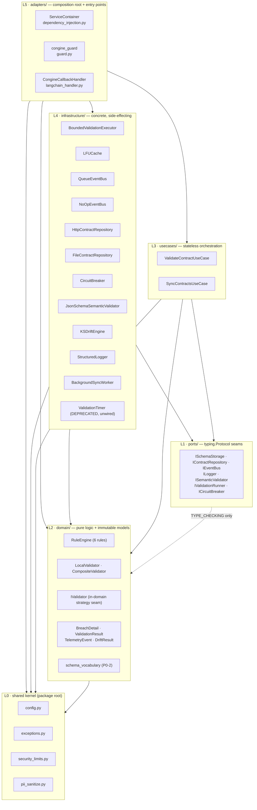

## 3. The layer model

Six tiers, L0–L5. The tier of a file is determined by its directory, except L0, which is the set of
loose modules at the package root. Every file in the package is assigned below; the assignment is
exhaustive.

### 3.1 L0 — Shared kernel

**Responsibility.** Constants, policy, and vocabulary that every layer may name. Contains the one
mutable-by-configuration object in the system (`CongineConfig`) and the one exception tree.

**Forbidden from:** importing any port, domain type, use case, concrete, or adapter. Doing any I/O
other than reading environment variables.

| File | Lines | What it is |
|---|---|---|
| `config.py` | 363 | `CongineConfig` (frozen, 46 fields), `Region`, `FailMode`, `DeploymentMode`, `from_env()`, `validate()`, `is_local_base_url()`, `effective_log_safe_fields()` |
| `exceptions.py` | 82 | 1 root + 6 canonical exception classes + 4 Tier-2 aliases |
| `security_limits.py` | 33 | 8 numeric bounds |
| `pii_sanitize.py` | 26 | `sanitize_breach_message()` |
| `__init__.py` | 135 | the public `__all__` surface + `__version__` |

**Boundary check: clean.** The only intra-L0 edge is `config.py` → `exceptions`, `security_limits`
(`config.py:20-28`). `exceptions.py`, `security_limits.py` and `pii_sanitize.py` import nothing from
the package at all.

**Arguable placement — the package-root `__init__.py`.** It is filed as L0 by directory, but it
imports *every* layer including L5 (`__init__.py:9-65`). It is the only file in the package whose
imports point outward. This is correct and unavoidable — a package's public surface must be able to
name its top layer — but it means "L0 imports nothing outward" is true of the four L0 *modules*, not
of the L0 *directory*. Any automated layering check must exempt this file.

### 3.2 L1 — Ports

**Responsibility.** Declare, as `typing.Protocol`, every seam across which an implementation is
injected. No logic, no state, no imports that create runtime coupling.

**Forbidden from:** containing implementation; importing L2/L3/L4/L5 at runtime; importing L0 (it
does not need to — port signatures are expressed in builtins and L2 value objects).

| File | Lines | Protocol | Runtime imports | TYPE_CHECKING imports |
|---|---|---|---|---|
| `ports/schema_storage.py` | 60 | `ISchemaStorage` | — | — |
| `ports/contract_repository.py` | 48 | `IContractRepository` | — | — |
| `ports/event_bus.py` | 31 | `IEventBus` | — | `domain.models.TelemetryEvent` |
| `ports/logger.py` | 34 | `ILogger` | — | — |
| `ports/semantic_validator.py` | 39 | `ISemanticValidator` | — | `domain.models.BreachDetail` |
| `ports/validation_runner.py` | 95 | `IValidationRunner` | — | — |
| `ports/circuit_breaker.py` | 32 | `ICircuitBreaker` | — | — |
| `ports/__init__.py` | 26 | aggregate re-export of all seven | the seven port modules | — |

**Boundary check: clean.** Two ports name an L2 value object, both exclusively under
`TYPE_CHECKING` (`event_bus.py:16-17`, `semantic_validator.py:18-19`). Importing any port at runtime
therefore drags in nothing. All seven are `@runtime_checkable`.

### 3.3 L2 — Domain

**Responsibility.** The deterministic validation core and the immutable value objects that flow
through the system. This is the layer whose correctness the product sells.

**Forbidden from:** any I/O, any thread, any clock other than `time.perf_counter` for measurement,
any import of L1 at runtime, any import of L3/L4/L5 at all.

| File | Lines | What it is |
|---|---|---|
| `domain/models.py` | 102 | `BreachDetail`, `ValidationResult`, `DriftResult`, `TelemetryEvent` — all `frozen=True` |
| `domain/validator.py` | 461 | `RuleEngine` (6 static rules), `IValidator` (in-domain Protocol), `LocalValidator`, `CompositeValidator`, helpers `_compiled_pattern`, `_path_present`, `_type_matches`, `_JSON_TYPE_MAP` |
| `domain/schema_vocabulary.py` | 144 | **new since baseline** — `find_unenforced_keywords()` plus the four keyword frozensets |
| `domain/__init__.py` | 28 | aggregate re-export |

**Boundary check: clean.** `domain/validator.py` imports `domain.models` and `security_limits`
(inward) plus the third-party `re2` leaf, and names `ISemanticValidator` only under `TYPE_CHECKING`
(`:30-31`). `domain/models.py` and `domain/schema_vocabulary.py` import nothing from the package.
The domain imports no infrastructure. This is the single most important boundary in the system and
it holds.

**The one sanctioned deviation.** `IValidator` (`domain/validator.py:293-301`) is a Protocol that
lives outside `ports/`. It is sanctioned because it is an *in-domain strategy seam*: its two
implementations (`LocalValidator`, `CompositeValidator`) both live in the same module, and it is
never used to inject an outer-layer concrete inward. Contrast `ISemanticValidator`, which *is*
implemented by an L4 concrete and therefore correctly lives in `ports/`. The rule the codebase
actually follows is precise: **a Protocol lives in `ports/` if and only if something outside L2
implements it.** `IValidator` is the only Protocol that fails that test, and it is the only one
outside `ports/`. It is re-exported from `domain/__init__.py:27` but deliberately excluded from the
package `__all__`.

**Arguable placement — `domain/schema_vocabulary.py`.** It is a *mirror* of knowledge that lives in
`LocalValidator._extract_params` and `_JSON_TYPE_MAP`, deliberately duplicated rather than derived
(`schema_vocabulary.py:11-12` states this explicitly and points at the drift test). The alternative
placements are worse — deriving it inside `validator.py` would put a diagnostic concern in the
enforcement path, and putting it in L3 would place domain knowledge outside the domain. L2 is right;
the duplication is the cost, and `tests/unit/test_schema_vocabulary.py:119,133` is what makes the
cost payable.

### 3.4 L3 — Use cases

**Responsibility.** Stateless orchestration of a workflow across ports. Owns sequencing, error
policy, and degradation policy; owns no state that outlives a call except the
`_warned_unenforced` de-dup set.

**Forbidden from:** constructing a concrete; importing any L4 module; importing L5.

| File | Lines | What it is |
|---|---|---|
| `usecases/validate_contract_usecase.py` | 260 | the hot-path orchestrator, sync + async twins |
| `usecases/sync_contracts_usecase.py` | 315 | the boot/sync orchestrator, sync + async twins, single-flight |
| `usecases/__init__.py` | 9 | aggregate re-export |

**Boundary check: clean w.r.t. Congine layers.** `ValidateContractUseCase` names five abstractions
(`ISchemaStorage`, `IValidator`, `IEventBus`, `ILogger`, `IValidationRunner`) and never a concrete.
`SyncContractsUseCase` names three ports plus `ICircuitBreaker` under `TYPE_CHECKING`, and imports
`domain.schema_vocabulary` (inward, L2).

**Arguable placement — `portalocker` in L3.** `sync_contracts_usecase.py:27-33` imports
`portalocker` directly and `:174-198` opens and locks a file. That is filesystem I/O in the
orchestration layer. It is not a *layer* violation (portalocker is a third-party leaf, not a Congine
concrete), but it is a *purity* violation: L3 is supposed to sequence I/O, not perform it. The clean
form would be an `IBootLock` port with an L4 `PortalockerBootLock`. The pragmatic defence is that
the boot lock is a coordination primitive rather than a data source, and the guard degrades safely
when portalocker is absent (`:138`). **This is the single most arguable file placement in the
system.**

**Second arguable point — statefulness.** `SyncContractsUseCase._warned_unenforced`
(`:86`) is per-instance mutable state in a layer documented as stateless. It is a bounded, purely
diagnostic set (capped at 4096, `:41`, `:292-293`) and affects nothing but log volume, but the
"stateless orchestration" description is now slightly inaccurate.

### 3.5 L4 — Infrastructure

**Responsibility.** Every concrete that touches a thread, a socket, a file, a clock, or a
third-party engine. Each implements an L1 port structurally — none subclasses one.

**Forbidden from:** importing L5; importing another L4 concrete; constructing its own collaborators
(everything is constructor-injected).

| File | Lines | Port implemented | Notes |
|---|---|---|---|
| `infrastructure/bounded_executor.py` | 208 | `IValidationRunner` | stdlib only |
| `infrastructure/lfu_cache.py` | 245 | `ISchemaStorage` | stdlib only |
| `infrastructure/circuit_breaker.py` | 126 | `ICircuitBreaker` | stdlib only |
| `infrastructure/logger.py` | 111 | `ILogger` | stdlib only |
| `infrastructure/http_contract_repository.py` | 273 | `IContractRepository` | `httpx`, `portalocker` |
| `infrastructure/file_contract_repository.py` | 164 | `IContractRepository` | optional `yaml` |
| `infrastructure/queue_event_bus.py` | 296 | `IEventBus` | `httpx` |
| `infrastructure/noop_event_bus.py` | 40 | `IEventBus` | stdlib only |
| `infrastructure/jsonschema_validator.py` | 175 | `ISemanticValidator` | `jsonschema` |
| `infrastructure/ks_drift.py` | 156 | **none** | optional `numpy` |
| `infrastructure/background_sync.py` | 97 | **none** | drives L3 |
| `infrastructure/timer.py` | 81 | (`IValidationRunner`-shaped) | **DEPRECATED, not wired, not exported** |
| `infrastructure/__init__.py` | 39 | — | deliberately omits `ValidationTimer` (`:22-25`) |

**Boundary check: clean.** No L4 file imports an adapter. No L4 file imports another L4 file. Four
of the twelve concretes (`bounded_executor`, `lfu_cache`, `circuit_breaker`, `logger`) have zero
internal imports at all — they are pure mechanisms.

**Arguable placement — two L4 files implement no port.** `KSDriftEngine` and `BackgroundSyncWorker`
sit in L4 but fulfil no L1 contract. `KSDriftEngine` is a *library capability* the host calls
directly through the container (`dependency_injection.py:370-403`), so nothing injects it and no
seam is needed — but that also means it cannot be substituted. `BackgroundSyncWorker` is a
*mechanism that drives a policy*: it holds an L3 use case and calls it on a timer. It is the only L4
file that depends on L3, which it does under `TYPE_CHECKING` only (`background_sync.py:21-24`), so
there is no runtime upward edge — but the conceptual direction is genuinely outward-driving-inward,
which is what a scheduler is. Both placements are defensible; both are the reason "every L4 file
implements an L1 port" cannot be stated as an invariant.

### 3.6 L5 — Adapters

**Responsibility.** The composition root and the entry points through which a host reaches the
system. This is the top of the graph; it may import everything.

**Forbidden from:** containing business logic; being imported by any lower layer.

| File | Lines | What it is |
|---|---|---|
| `adapters/dependency_injection.py` | 463 | `ServiceContainer` — the sole construction site; owns lifecycle, the default singleton, the tenant registry |
| `adapters/guard.py` | 105 | `@congine_guard` — sync + async wrappers, three return modes, optional extractor |
| `adapters/langchain_handler.py` | 147 | `CongineCallbackHandler` — optional, gated on `[langchain]` |
| `adapters/__init__.py` | 26 | re-exports `ServiceContainer` + `congine_guard`; `CongineCallbackHandler` lazily via `__getattr__` |

**Boundary check: clean.** Nothing below L5 imports an adapter. `langchain_handler.py` performs all
its Congine imports *inside* methods (`:38-40`, `:57`, `:108`) so importing the module never pulls
the container in, and `_BaseCallbackHandler` degrades to `object` when `langchain-core` is absent
(`:8-16`), with the constructor raising a directed `ImportError` (`:33-37`).
