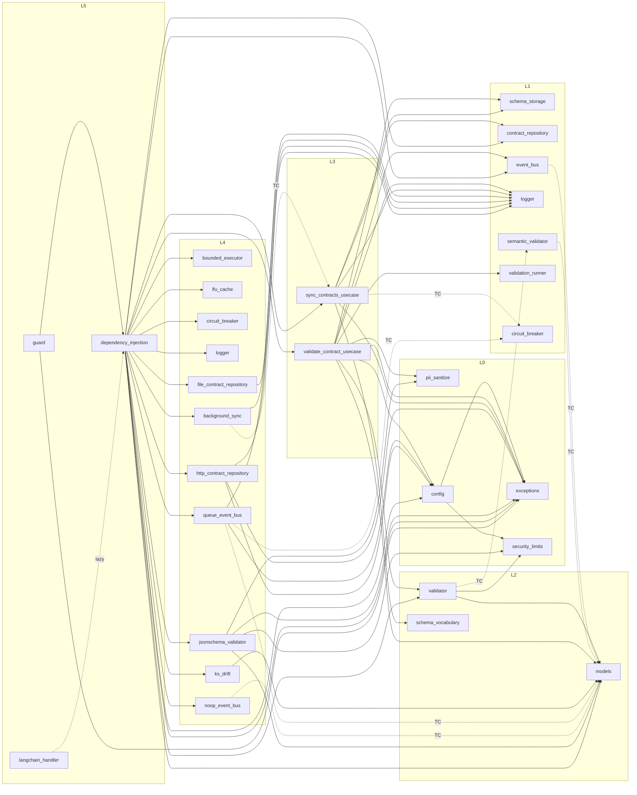

## 4. Dependency graph (verified)

### 4.1 Method

The graph below is not read off the layer names. It was produced by parsing every one of the 37
files with `ast`, collecting every `Import`/`ImportFrom` whose module starts with `congine_core`, and
classifying each edge by whether its line number falls inside an `if TYPE_CHECKING:` block. That
distinction matters (**CC-6**): a `TYPE_CHECKING` edge creates no runtime dependency, and conflating
the two would manufacture false layering violations in `ports/`, `noop_event_bus.py`,
`queue_event_bus.py` and `background_sync.py`.

Circularity was checked separately and empirically: each of the 37 modules was imported in a fresh
interpreter as the *first* Congine import. **All 37 succeeded.** A cycle would have surfaced as an
`ImportError`/`AttributeError` on partially-initialised modules for at least one entry order.

### 4.2 Complete runtime edge list

Every runtime edge in the system, grouped by source layer. `L` columns give the layer of source and
target; every row must satisfy `target ≤ source` (inward) except where noted.

| Source | L | Target(s) | L | Direction |
|---|---|---|---|---|
| `config` | 0 | `exceptions`, `security_limits` | 0 | intra-layer |
| `exceptions` | 0 | — | | — |
| `security_limits` | 0 | — | | — |
| `pii_sanitize` | 0 | — | | — |
| `ports/schema_storage` | 1 | — | | — |
| `ports/contract_repository` | 1 | — | | — |
| `ports/logger` | 1 | — | | — |
| `ports/validation_runner` | 1 | — | | — |
| `ports/circuit_breaker` | 1 | — | | — |
| `ports/event_bus` | 1 | — | | — |
| `ports/semantic_validator` | 1 | — | | — |
| `domain/models` | 2 | — | | — |
| `domain/schema_vocabulary` | 2 | — | | — |
| `domain/validator` | 2 | `domain.models`, `security_limits` | 2, 0 | inward |
| `usecases/validate_contract_usecase` | 3 | `config`, `domain.models`, `domain.validator`, `exceptions`, `pii_sanitize`, `ports.event_bus`, `ports.logger`, `ports.schema_storage`, `ports.validation_runner` | 0,2,2,0,0,1,1,1,1 | inward |
| `usecases/sync_contracts_usecase` | 3 | `domain.schema_vocabulary`, `exceptions`, `ports.contract_repository`, `ports.logger`, `ports.schema_storage` | 2,0,1,1,1 | inward |
| `infrastructure/bounded_executor` | 4 | — | | — |
| `infrastructure/lfu_cache` | 4 | — | | — |
| `infrastructure/circuit_breaker` | 4 | — | | — |
| `infrastructure/logger` | 4 | — | | — |
| `infrastructure/timer` | 4 | — | | — |
| `infrastructure/noop_event_bus` | 4 | — | | — |
| `infrastructure/file_contract_repository` | 4 | `ports.logger` | 1 | inward |
| `infrastructure/background_sync` | 4 | `ports.logger` | 1 | inward |
| `infrastructure/ks_drift` | 4 | `domain.models` | 2 | inward |
| `infrastructure/queue_event_bus` | 4 | `config`, `ports.logger` | 0, 1 | inward |
| `infrastructure/http_contract_repository` | 4 | `config`, `exceptions`, `ports.logger` | 0,0,1 | inward |
| `infrastructure/jsonschema_validator` | 4 | `domain.models`, `exceptions`, `pii_sanitize`, `security_limits` | 2,0,0,0 | inward |
| `adapters/dependency_injection` | 5 | `config`, `exceptions`, `domain.models`, `domain.validator`, all 10 wired L4 concretes, both L3 use cases, `ports.contract_repository`, `ports.event_bus` | 0–4 | inward |
| `adapters/guard` | 5 | `adapters.dependency_injection`, `exceptions` | 5, 0 | intra-layer + inward |
| `adapters/langchain_handler` | 5 | `adapters.dependency_injection`, `config`, `exceptions`, `security_limits` — **all function-local** | 5, 0 | intra-layer + inward |
| `ports/__init__` | 1 | the 7 port modules | 1 | intra-layer |
| `domain/__init__` | 2 | `domain.models`, `domain.validator` | 2 | intra-layer |
| `usecases/__init__` | 3 | both use cases | 3 | intra-layer |
| `infrastructure/__init__` | 4 | 11 concretes (**not** `timer`) | 4 | intra-layer |
| `adapters/__init__` | 5 | `dependency_injection`, `guard`; `langchain_handler` lazily | 5 | intra-layer |
| `congine_core/__init__` | (root) | `ports`, `domain`, `usecases`, `infrastructure`, `adapters`, `config`, `exceptions` | 0–5 | **outward — see §4.5** |

### 4.3 Complete TYPE_CHECKING-only edge list

Six edges exist for typing alone and create no runtime dependency. Five of the six point *outward*
(inner layer naming an outer type), which is exactly why they are guarded.

| Source | L | Target | L | Line | Why it must be guarded |
|---|---|---|---|---|---|
| `ports/event_bus` | 1 | `domain.models.TelemetryEvent` | 2 | `:16-17` | keeps L1 import-light; importing a port must not drag in the domain |
| `ports/semantic_validator` | 1 | `domain.models.BreachDetail` | 2 | `:18-19` | same |
| `domain/validator` | 2 | `ports.semantic_validator.ISemanticValidator` | 1 | `:30-31` | **outward** — the domain must not import a port at runtime |
| `infrastructure/noop_event_bus` | 4 | `domain.models.TelemetryEvent` | 2 | `:19-20` | keeps the offline bus dependency-free |
| `infrastructure/queue_event_bus` | 4 | `domain.models.TelemetryEvent`, `ports.circuit_breaker.ICircuitBreaker` | 2, 1 | `:29-31` | inward anyway; kept light |
| `infrastructure/background_sync` | 4 | `usecases.sync_contracts_usecase.SyncContractsUseCase` | 3 | `:21-24` | **outward** — L4 must not import L3 at runtime |
| `adapters/dependency_injection` | 5 | `domain.models.DriftResult` | 2 | `:36-37` | return-type annotation only |
| `adapters/langchain_handler` | 5 | `dependency_injection.ServiceContainer`, `domain.models.ValidationResult` | 5, 2 | `:18-20` | avoids eager import of the container |

The two rows marked **outward** are the load-bearing ones. `domain/validator.py:30-31` is what lets
`CompositeValidator` be typed against `ISemanticValidator` without the domain depending on `ports/`,
and `background_sync.py:21-24` is what lets a scheduler hold a use case without L4 depending on L3.
Reclassify either as a runtime import and the hexagon breaks.

### 4.4 Verification results

**Claim 1 — dependencies point inward only.** Verified against the table in §4.2. Every runtime edge
targets a layer at or below its source, with two categories of exception, both accounted for:

- **Intra-layer edges** (`config`→`exceptions`, the five aggregate `__init__.py` files,
  `guard`→`dependency_injection`, `langchain_handler`→`dependency_injection`). These are
  same-layer, not upward.
- **The package-root `__init__.py`** (§4.5).

**Claim 2 — no inner layer imports an outer concrete.** Verified. The strongest form of this claim
holds: no L0/L1/L2/L3 module names any `infrastructure.*` or `adapters.*` symbol at runtime *or*
under `TYPE_CHECKING`. The only inner→outer references at all are the two `TYPE_CHECKING` edges in
§4.3, and both target an **abstraction or an L3 policy**, never an L4/L5 concrete.

**Claim 3 — no circular imports.** Verified empirically: all 37 modules import successfully as the
first Congine import in a fresh interpreter.

**Claim 4 — the composition root is the sole construction site.** Verified by searching for
constructor calls of every L4 concrete outside `dependency_injection.py`:

| Concrete | Constructed in `dependency_injection.py` at | Constructed anywhere else in `src/`? |
|---|---|---|
| `StructuredLogger` | `:211` | no |
| `BoundedValidationExecutor` | `:224` | no |
| `LFUCache` | `:229` | no |
| `CircuitBreaker` | `:235` | no |
| `FileContractRepository` | `:246`, `:253` | no |
| `HttpContractRepository` | `:260` | no |
| `NoOpEventBus` | `:265` | no |
| `QueueEventBus` | `:267` | no |
| `JsonSchemaSemanticValidator` | `:281` | no |
| `KSDriftEngine` | `:286` | no |
| `LocalValidator` | `:291` | no |
| `CompositeValidator` | `:294` | no |
| `ValidateContractUseCase` | `:301` | no |
| `SyncContractsUseCase` | `:313` | no |
| `BackgroundSyncWorker` | `:329` | no |
| `ValidationTimer` | **never** | no — deprecated and unwired |

Sixteen constructions, one file, zero exceptions. `httpx.Client` is the only third-party object
constructed outside `dependency_injection.py` (`http_contract_repository.py:116` creates a
per-request `AsyncClient`; `queue_event_bus.py:75` holds a fallback factory) — but in the wired
configuration the container supplies the factory (`:275-277`), so even the HTTP client's
configuration is centralised.

**Violations found: none.** Two structural observations that are *not* violations but that any
future automated check must encode are recorded in §4.5 and §4.6.

### 4.5 The one outward edge, and why it is correct

`congine_core/__init__.py` imports from all six tiers, including `from congine_core.adapters import
ServiceContainer, congine_guard` (`:49`). By directory it sits at L0; by dependency it sits above
L5.

This is correct and structurally necessary — a package's public surface must be able to name its
top-level entry points — but it means the invariant "L0 imports nothing outward" is a statement
about the four L0 *modules*, not the L0 *directory*. Its practical consequence: **`import
congine_core` eagerly imports every layer**, including `httpx`, `jsonschema`, `re2` and
`portalocker`. Only `langchain-core` and `numpy` stay lazy. A consumer wanting a light import must
reach past the package surface (`from congine_core.domain.validator import LocalValidator`), which
imports only `re2`.

### 4.6 Near-miss: the function-local imports in `langchain_handler.py`

Static analysis classifies `adapters/langchain_handler.py` as having runtime edges to
`dependency_injection`, `config`, `exceptions` and `security_limits`. All four are **function-local**
(`:38-40` and `:57` inside `__init__`, `:108` inside `on_llm_end`), so at *module import* time the
file's only Congine dependency is the `TYPE_CHECKING` block. This is deliberate: it is what makes
`adapters/__init__.py`'s lazy `__getattr__` (`:18-26`) meaningful, and it is why importing
`congine_core.adapters` does not require `langchain-core`.

Recorded here because a naive import-graph linter will report these as eager L5→L5/L0 edges and a
naive reader will conclude the lazy-import pattern is broken. It is not. The distinction is
*statement position*, not `TYPE_CHECKING`, and it is a third category the graph must recognise
alongside "runtime" and "typing-only".

### 4.7 The graph, drawn

