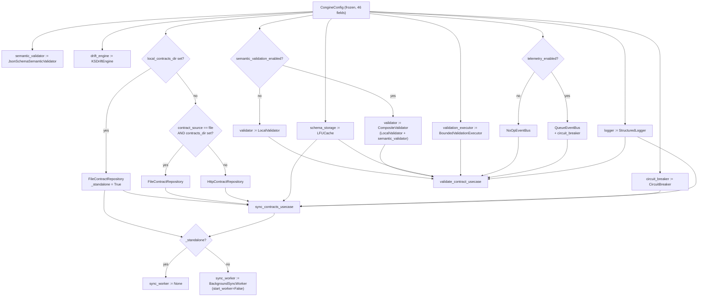

## 6. Composition and wiring

`ServiceContainer.__init__` (`adapters/dependency_injection.py:202-335`) is the whole map. It is 134
lines, it constructs sixteen objects, and it is the only place any of them is constructed. Read as:
**"when X is configured, port Y is implemented by Z."**

### 6.1 The unconditional spine

These six are built on every path, in this order, with no branch.

| # | Attribute | Concrete | Line | Config → constructor argument |
|---|---|---|---|---|
| 1 | `logger` | `StructuredLogger` | `:211-215` | `log_level` → `level`; `effective_log_safe_fields()` → `log_safe_fields` |
| 2 | `validation_executor` | `BoundedValidationExecutor` | `:224-228` | `validation_max_workers` → `max_workers`; `validation_max_pending` → `max_pending`; `start_background_services` → `register_atexit` |
| 3 | `schema_storage` | `LFUCache` | `:229-234` | `cache_capacity` → `capacity`; `cache_ttl_seconds` → `ttl_seconds`; `cache_sweep_interval_seconds` → `sweep_interval`; `start_background_services` → `start_sweeper` |
| 4 | `circuit_breaker` | `CircuitBreaker` | `:235-238` | `breaker_failure_threshold`, `breaker_cooldown_seconds` |
| 5 | `semantic_validator` | `JsonSchemaSemanticValidator` | `:281-285` | `semantic_max_breaches` → `max_breaches`; `semantic_format_checking` → `format_checking`; `jsonschema_draft` |
| 6 | `drift_engine` | `KSDriftEngine` | `:286-289` | `drift_threshold` → `threshold`; `drift_sample_limit` → `max_samples` |

Two notes on the unconditional spine.

`semantic_validator` is **always constructed**, even when `semantic_validation_enabled` is false and
nothing will ever call it. Because `_resolve_draft` is fail-closed
(`jsonschema_validator.py:54-68`), this means a typo in `CONGINE_JSONSCHEMA_DRAFT` raises
`CongineConfigurationError` at container construction *even for a deployment that never uses
semantic validation*. That is deliberate fail-fast behaviour, and it is asserted by
`tests/unit/test_config_wiring.py:178`.

`drift_engine` is likewise always constructed but never wired into any pipeline. Nothing feeds it;
the host must call `record_drift_sample()` by hand (`:370-371`). It is a library capability hanging
off the container, not a component of the architecture. Constructing it is free — `numpy` is
imported lazily inside `detect()` (`ks_drift.py:31-46`).

Immediately after the logger is built and before anything else, `:216-223` emits a cleartext warning
when the base URL is non-local and not HTTPS. This is the only side effect in the constructor other
than object creation and thread starts.

### 6.2 Branch A — the contract repository (three-way)

`:243-260`. The `_standalone` flag set at `:243` is load-bearing far beyond this branch: it also
decides whether a sync worker exists at all.

| Condition | Bound concrete | `_standalone` | Sync worker |
|---|---|---|---|
| `local_contracts_dir is not None` | `FileContractRepository(contracts_dir=local_contracts_dir, logger, max_contract_files, max_file_bytes=max_schema_bytes)` `:246-251` | `True` | **`None`** — never allocated |
| else if `contract_source == "file"` **and** `contracts_dir is not None` | `FileContractRepository(contracts_dir=contracts_dir, …)` `:253-258` | `False` | allocated |
| else (default) | `HttpContractRepository(config, logger)` `:260` | `False` | allocated |

The distinction between the first two rows is subtle and worth stating: **both bind the same
concrete, but only the first suppresses the background sync daemon.** `CONGINE_LOCAL_CONTRACTS_DIR`
is the "I am offline, do not start a network loop" switch; `CONGINE_CONTRACT_SOURCE=file` +
`CONGINE_CONTRACTS_DIR` is the "read contracts from disk but keep behaving like a normal
deployment" switch. A reader who conflates them will expect a sync thread that does not exist.

**Foot-gun, verified.** The first condition is `is not None`, so `CONGINE_LOCAL_CONTRACTS_DIR=""`
(empty string) selects standalone mode with an empty directory. Measured: `local_contracts_dir` is
`''`, `_standalone` is `True`, the repository is `FileContractRepository`, `sync_worker` is `None`.
`FileContractRepository.fetch_active_contracts` then fails `os.path.isdir("")`
(`file_contract_repository.py:60`), logs "Contracts directory missing", and returns `[]` — so the
cache is never primed and every validation raises `CongineContractNotFoundError`, with no network
fallback and no sync worker to recover. Setting an environment variable to empty is a common way to
"unset" it in shell scripts and container orchestration. Recorded as debt D9 in §16.

`HttpContractRepository` reads three further config fields directly from the injected config rather
than through constructor parameters: `snapshot_dir` (`:71`), `control_plane_http_timeout_seconds`
(`:117`), `max_http_response_bytes` (`:114`) and `snapshot_lock_timeout_seconds` (`:231`). It is the
only concrete given the whole config object.

### 6.3 Branch B — the event bus (two-way)

`:261-280`.

| Condition | Bound concrete | Thread? | Socket? |
|---|---|---|---|
| `telemetry_enabled is False` | `NoOpEventBus()` `:265` | no | no |
| else | `QueueEventBus(...)` `:267-280` | `congine_event_bus` daemon (iff `start_background_services`) | lazy `httpx.Client` |

`QueueEventBus` receives eight config-derived arguments: `config` (for `base_url` and the three
isolation headers), `logger`, `telemetry_queue_size` → `max_queue_size`, `telemetry_batch_size` →
`batch_size`, `telemetry_max_retries` → `max_retries`, `telemetry_backoff_base` → `backoff_base`,
`telemetry_backoff_max` → `backoff_max`, and a `client_factory` closure that builds an
`httpx.Client(timeout=control_plane_http_timeout_seconds)` (`:275-277`). It also receives the
**shared** `circuit_breaker` (`:278`) and `start_worker=start_bg` (`:279`).

The `client_factory` closure is the only place `control_plane_http_timeout_seconds` reaches the
telemetry path — the field is consumed twice in the system, here and in
`HttpContractRepository.fetch_active_contracts` (`:117`). `tests/unit/test_config_wiring.py:68,187`
guards both.

### 6.4 Branch C — the validator (two-way)

`:291-299`.

| Condition | `self.validator` | Line |
|---|---|---|
| `semantic_validation_enabled is False` (default) | `LocalValidator()` | `:299` |
| `semantic_validation_enabled is True` | `CompositeValidator(rule_validator=LocalValidator(), semantic_validator=self.semantic_validator)` | `:294-297` |

`LocalValidator()` is constructed unconditionally at `:291` and then either used directly or wrapped.
Note that the *same instance* is used in both arms — there is no duplicate rule engine.

### 6.5 The use cases

`:301-321`. Both are constructed after everything they depend on, and both receive only
abstractions.

`ValidateContractUseCase` (`:301-311`) — nine arguments:

| Parameter | Bound to | Config field |
|---|---|---|
| `schema_storage` | `self.schema_storage` (`LFUCache`) | — |
| `validator` | `self.validator` (branch C) | — |
| `event_bus` | `self.event_bus` (branch B) | — |
| `logger` | `self.logger` | — |
| `timer` | `self.validation_executor` | — |
| `timeout_ms` | | `validation_timeout_ms` |
| `fail_mode` | | `fail_mode` |
| `max_payload_bytes` | | `max_payload_bytes` |
| `max_schema_bytes` | | `max_schema_bytes` |

The parameter is named `timer` for historical reasons (it predates `IValidationRunner`) but is typed
`IValidationRunner` and bound to `BoundedValidationExecutor`. The deprecated `ValidationTimer` is
never what lands here.

`SyncContractsUseCase` (`:312-321`) — seven arguments:

| Parameter | Bound to | Notes |
|---|---|---|
| `schema_storage` | `self.schema_storage` | |
| `contract_repository` | branch A result | |
| `logger` | `self.logger` | |
| `cache_ttl_seconds` | `config.cache_ttl_seconds` | the TTL applied to every primed schema |
| `circuit_breaker` | `self.circuit_breaker` | the **same** instance as the bus's |
| `boot_lock_path` | `getattr(self.contract_repository, "snapshot_lock_path", None)` `:312` | `None` for `FileContractRepository` ⇒ single-flight degrades to plain `sync_once` |
| `semantic_validation_enabled` | `config.semantic_validation_enabled` `:320` | **new (P0-2)** — suppresses the unenforced-keyword scan when full JSON Schema is enforcing those keywords |

### 6.6 Branch D — the sync worker (two-way)

`:325-335`.

| Condition | `self.sync_worker` |
|---|---|
| `self._standalone` (i.e. `local_contracts_dir` set) | **`None`** `:327` |
| else | `BackgroundSyncWorker(sync_contracts_usecase, interval_seconds=sync_interval_seconds, logger, run_immediately=False, start_worker=False)` `:329-335` |

Two things are notable. `run_immediately=False` means the worker never duplicates the boot prime —
`bootstrap()` has already done it. `start_worker=False` means construction never starts a thread;
only `start_background_sync()` (`:366-368`), called by `bootstrap()`/`bootstrap_async()` **iff
`config.sync_enabled`**, does.

There are four call sites that must tolerate `sync_worker is None`: `start_background_sync` (`:367`),
`health` (`:416`), `close` (`:449`), and `_teardown_components` (`:54`). All four guard.

### 6.7 The complete configuration topologies

Four independent switches produce the deployment shapes that actually occur. This table is the
answer to "what exists in my process?"

| Topology | `local_contracts_dir` | `telemetry_enabled` | `sync_enabled` | `start_background_services` | Repository | Bus | Sync worker | Threads created |
|---|---|---|---|---|---|---|---|---|
| **Default (control-plane)** | unset | true | false | true | `HttpContractRepository` | `QueueEventBus` | allocated, **not started** | sweeper + bus (+ pool on first validation) |
| **Control-plane + periodic sync** | unset | true | **true** | true | `HttpContractRepository` | `QueueEventBus` | allocated **and started** | sweeper + bus + sync (+ pool) |
| **Standalone / air-gapped** | **set** | **false** | any | true | `FileContractRepository` | `NoOpEventBus` | **`None`** | sweeper only (+ pool) |
| **Standalone, telemetry on** | **set** | true | any | true | `FileContractRepository` | `QueueEventBus` | **`None`** | sweeper + bus (+ pool) |
| **File source, normal deployment** | unset | true | any | true | `FileContractRepository` | `QueueEventBus` | allocated | sweeper + bus (+ sync if enabled) (+ pool) |
| **Test / embedded** | any | any | any | **false** | per above | per above | per above, never started | **pool only** — no sweeper, no bus thread, no atexit hooks |

**What is *not* created, per topology** — the part that is easy to get wrong:

- **Standalone** creates no `BackgroundSyncWorker` *object* at all. `container.sync_worker is None`,
  not "a stopped worker". Code that does `container.sync_worker.is_running()` crashes.
- **Telemetry disabled** creates no drain thread, no `httpx.Client`, and registers no `atexit` flush.
  `NoOpEventBus` has no queue, so `queue_depth()` is a constant `0` — not "0 because it drained".
- **`start_background_services=False`** suppresses three things at once (`:227`, `:233`, `:279`): the
  executor's `atexit` shutdown hook, the `LFUCache` sweeper thread *and* its `atexit` hook, and the
  `QueueEventBus` drain thread *and* its `atexit` flush hook. TTL entries then expire only lazily on
  read (`lfu_cache.py:90-92`, `:150-152`), and telemetry accumulates in the queue until it is full
  and starts dropping. This flag is for tests and for hosts that manage their own lifecycle; it is
  not an "offline" switch.
- **The validation pool's worker threads are always lazy.** `ThreadPoolExecutor` spawns
  `congine_validation_N` on first `submit`, so a container that never validates has no pool threads
  regardless of configuration.

### 6.8 The wiring, drawn

### 6.9 The no-dead-configurable contract

`libs/congine-sdk/.claude/CLAUDE.md` states the rule: a constructor parameter that maps to a
`CongineConfig` field **must** be passed by the container, and `tests/unit/test_config_wiring.py`
(12 tests) guards the env → `from_env()` → container → concrete path for the ones most often missed:
`cache_sweep_interval_seconds`, the five telemetry knobs, `telemetry_enabled` → `NoOpEventBus`,
`local_contracts_dir` → file repo + no sync worker, `jsonschema_draft` (including the fail-closed
case), `control_plane_http_timeout_seconds` on both consumers, `snapshot_lock_timeout_seconds`
through to `portalocker`, and — newly added — `semantic_validation_enabled` reaching
`SyncContractsUseCase`.

The contract holds for 45 of 46 fields. The exception is `region`, analysed in §12.4.
