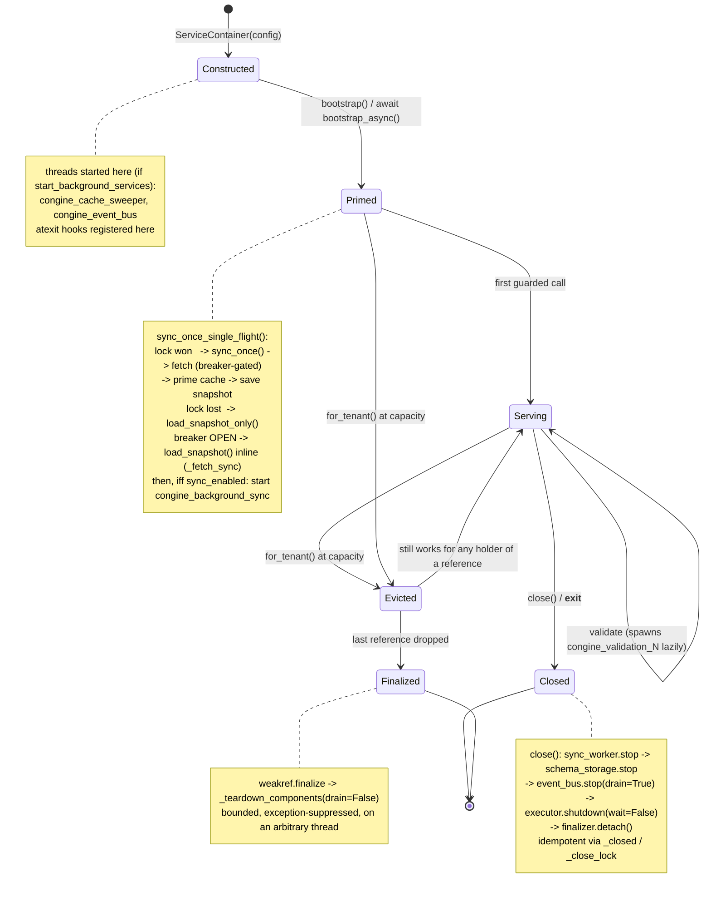

## 7. Lifecycle

### 7.1 Construction order, and why it is forced

`ServiceContainer.__init__` builds strictly bottom-up. The order is not stylistic; four of the steps
are genuinely constrained.

| Step | What | Why it must come where it does |
|---|---|---|
| 1 | `_closed = False`, `_close_lock`, `_finalizer = None` (`:206-208`) | Must precede everything, because `_arm_deferred_teardown` and `close()` both read them and either can be called the instant the object escapes |
| 2 | `logger` (`:211`) | Every subsequent construction takes it as a collaborator, and the cleartext warning at `:216-223` is the first thing that must be able to log |
| 3 | `validation_executor`, `schema_storage`, `circuit_breaker` (`:224-238`) | Pure mechanisms with no Congine collaborators; order among these three is free |
| 4 | `contract_repository` (`:243-260`) | Needs `logger`. Sets `_standalone`, which step 8 reads |
| 5 | `event_bus` (`:261-280`) | Needs `logger` **and** `circuit_breaker` (step 3) |
| 6 | `semantic_validator`, `drift_engine` (`:281-289`) | Independent |
| 7 | `validator` (`:291-299`) | Needs `semantic_validator` (step 6) when composite |
| 8 | `validate_contract_usecase` (`:301`), `sync_contracts_usecase` (`:313`) | Need every port above |
| 9 | `sync_worker` (`:325-335`) | Needs `sync_contracts_usecase` (step 8) **and** `_standalone` (step 4) |

The hard constraints are: logger first (steps 2→3-9), breaker before bus (3→5), semantic validator
before composite validator (6→7), use cases before the worker (8→9), and `_standalone` before the
worker branch (4→9).

**Construction starts threads.** Steps 3 and 5 can each start a daemon thread before the constructor
returns, if `start_background_services` is true: `LFUCache` starts `congine_cache_sweeper` in its own
`__init__` (`lfu_cache.py:67-74`) and `QueueEventBus` starts `congine_event_bus`
(`queue_event_bus.py:87-94`). Both also register `atexit` hooks at that moment. **A container that
raises later in `__init__` therefore leaks two threads and two `atexit` registrations** — there is no
`try/except` around the remaining steps. The realistic trigger is step 6: a bad
`CONGINE_JSONSCHEMA_DRAFT` makes `JsonSchemaSemanticValidator` raise `CongineConfigurationError` at
`:281`, *after* the sweeper and drain threads are running. Recorded as debt D10 in §16.

### 7.2 `bootstrap()` — `:346-358`

```
1. asyncio.get_running_loop()          :348
     - succeeds  -> raise RuntimeError("bootstrap() cannot run inside an event loop;
                                        await bootstrap_async()")      :352-354
     - RuntimeError -> we are sync, continue                            :349-350
2. loaded = sync_contracts_usecase.sync_once_single_flight()            :355
3. if config.sync_enabled: start_background_sync()                      :356-357
4. return loaded                                                        :358
```

The loop guard exists because step 2 ultimately calls `asyncio.run` (`sync_contracts_usecase.py:207`),
which raises inside a running loop with a far less actionable message. Tested by
`tests/adversarial/test_remediations.py:123`.

`bootstrap_async()` (`:360-364`) is the twin: no loop guard (it *must* be inside a loop), awaits
`sync_once_single_flight_async()`, then the identical `sync_enabled` branch.

Both return the number of schemas loaded. Neither raises on a dead control plane — that is the whole
point of guarantee G2 (§14.2).

### 7.3 Background thread creation, and what gates each

Four kinds of thread can exist per container. Each has a different gate, which is why "does my
process have Congine threads?" has no single answer.

| Thread | Name | Daemon | Created by | Gate | Started when |
|---|---|---|---|---|---|
| Cache TTL sweeper | `congine_cache_sweeper` | **True** | `LFUCache.__init__` `lfu_cache.py:67-74` | `start_background_services` | container construction |
| Telemetry drain | `congine_event_bus` | **True** | `QueueEventBus.__init__` `queue_event_bus.py:87-94` | `telemetry_enabled` **and** `start_background_services` | container construction |
| Periodic sync | `congine_background_sync` | **True** | `BackgroundSyncWorker.start()` `background_sync.py:60-66` | `not _standalone` (object exists) **and** `sync_enabled` (started) | `bootstrap()` / `bootstrap_async()` / explicit `start_background_sync()` |
| Validation workers | `congine_validation_N` | **False** | `ThreadPoolExecutor` `bounded_executor.py:54-58` | none | lazily, on first `submit` — i.e. first validation |

Verified at runtime: with `CONGINE_SYNC_ENABLED=true` and no standalone dir, `threading.enumerate()`
after `start_background_sync()` shows exactly `congine_background_sync(daemon=True)`,
`congine_cache_sweeper(daemon=True)`, `congine_event_bus(daemon=True)`; after one validation,
`congine_validation_0(daemon=False)` joins them.

**The validation pool is the only non-daemon set.** `ThreadPoolExecutor` on Python 3.9+ uses
non-daemon threads joined via an interpreter-exit hook. Combined with the fact that a timed-out
validation cannot be killed, this means a hung validation callable can delay interpreter exit even
though every Congine-owned thread is a daemon. `atexit.register(self.shutdown)`
(`bounded_executor.py:64-65`, gated on `start_background_services`) calls `shutdown(wait=False)`,
which prevents *new* work but does not abandon running futures.

**`atexit` registrations** are a second, parallel lifecycle. Five sites register hooks:
`BoundedValidationExecutor.__init__` (`:65`), `LFUCache.__init__` (`:74`),
`QueueEventBus.__init__` (`:94`, registering `_drain_on_exit`), `BackgroundSyncWorker.start()`
(`:66`) — note this one is inside `start()`, so it re-registers on every restart — and the
deprecated `ValidationTimer.__init__` (`timer.py:49`). These hooks are **never unregistered**, so a
long-lived process that creates and closes many containers accumulates `atexit` entries. Bounded in
practice by `_MAX_TENANTS`, unbounded in principle. Recorded as debt D11 in §16.

### 7.4 Teardown — `close()` at `:439-457`

```
1. with _close_lock: if _closed: return; _closed = True        :445-448
2. sync_worker.stop()          (if not None)                    :449-450
3. schema_storage.stop()                                        :451
4. event_bus.stop(drain=True)                                   :452
5. validation_executor.shutdown(wait=False)                     :453
6. detach the armed finalizer, if any                           :454-457
```

The order is forced by one rule: **stop producers before consumers.** The sync worker can call
`schema_storage.put`, so it goes first. The event bus must be drained *after* nothing can still
publish. The validation pool is last because a running validation may still be publishing telemetry.

Each step's blocking behaviour matters:

| Step | Can it block? | Bound |
|---|---|---|
| `sync_worker.stop()` | yes | `thread.join(timeout=interval_seconds + 1.0)` (`background_sync.py:77`) — **up to 301 s at defaults** |
| `schema_storage.stop()` | yes | `sweeper.join(timeout=sweep_interval + 1.0)` (`lfu_cache.py:245`) — up to 31 s |
| `event_bus.stop(drain=True)` | yes | flushes the whole queue with the full retry/backoff budget, then `daemon.join(timeout=2.0)` (`queue_event_bus.py:127-141`) |
| `validation_executor.shutdown(wait=False)` | no | returns immediately |

`close()` is therefore **not** a fast operation, and step 2's join bound scales with
`sync_interval_seconds`. In practice the `threading.Event.wait` in each loop wakes promptly on
`stop()`, so the real cost is small — but the *worst case* is bounded by the interval, not by a
short constant. `__exit__` (`:462-463`) calls `close()`, so `with ServiceContainer(cfg) as c:` has
the same profile.

**Idempotence.** `_closed`/`_close_lock` (`:206-207`, `:445-448`) make repeated `close()` a no-op —
tested by `test_close_is_idempotent`. This matters because `atexit` hooks, `__exit__`, explicit
`close()` and a deferred finalizer can all fire for the same container.

### 7.5 The deferred-teardown path — `_arm_deferred_teardown()` at `:422-437`

This is the P0-1 mechanism and the most subtle lifecycle in the system.

```
_arm_deferred_teardown():
  with _close_lock:
     if _closed or _finalizer is not None: return          # already dead or already armed
     _finalizer = weakref.finalize(
         self, _teardown_components,
         sync_worker, schema_storage, event_bus, validation_executor)
```

Three properties make it correct:

1. **It performs no teardown.** Registering a `weakref.finalize` is cheap and cannot block, which is
   what lets it run inside `_tenant_lock` (`:163`).
2. **It captures the components, never `self`** (`:432-436`). A finalizer holding a strong reference
   to its own referent never fires. Passing the four sub-objects by value is what makes the
   collection possible at all — and `_teardown_components` is a module-level function (`:40-62`),
   not a method, for the same reason.
3. **`_teardown_components` is bounded and total.** `drain=False` (`:60`) so a dead control plane
   cannot stall a finalizer running on an arbitrary thread during GC; every stop is wrapped in
   `contextlib.suppress(Exception)` (`:55-62`) so one failing component cannot block the others or
   raise out of a finalizer.

The teardown thread is *whichever thread drops the last reference* — typically the GC, possibly the
main thread, possibly a worker. That is why nothing in `_teardown_components` may block or raise.

`close()` detaches an armed finalizer (`:454-457`), so an evicted-then-explicitly-closed container
tears down exactly once — tested by `test_evicted_container_explicit_close_detaches_finalizer`.

### 7.6 The default singleton — `get_default()` at `:81-100`

```
config = CongineConfig.from_env()                           :89   (every call)
if config.deployment_mode is MULTI_TENANT: raise            :90-95
if _default_instance is None:                               :96
    with _default_lock:                                     :97
        if _default_instance is None:                       :98
            _default_instance = cls(config)                 :99
return _default_instance                                    :100
```

Classic double-checked locking. Three observations that a reader needs.

- **`from_env()` runs on *every* call**, including cache hits — it re-reads and re-validates ~46
  environment variables and can raise `CongineConfigurationError` even when a perfectly good
  singleton already exists. `@congine_guard` with no explicit `container=` resolves through
  `ServiceContainer.get_default()` on **every guarded call** (`guard.py:57-58`, called at `:77`
  and `:88`). That places a full environment re-read and re-validation on the hot path for the
  default-container usage pattern. Recorded as debt D8 in §16; it is the strongest mechanical reason
  the documentation's advice to pass an explicit `container=` is correct.
- **The multi-tenant guard is evaluated before the cache check**, so switching
  `CONGINE_DEPLOYMENT_MODE` to `multi_tenant` at runtime disables `get_default()` immediately, even
  if a singleton was already built (FIX-05).
- **The config captured is whatever the environment said at first construction.** Later env changes
  affect the guard check but not the live singleton.

### 7.7 The tenant registry — `for_tenant()` at `:102-176`

The registry is a `Dict[str, ServiceContainer]` keyed `f"{tenant_id}|{project_id}"`, bounded at
`_MAX_TENANTS = 128` (`:76`), relying on Python's insertion-ordered dicts as an LRU.

```
with _tenant_lock:                                          :129
    existing = registry.get(key)                            :130
    if existing: pop + reinsert (bump to MRU); return       :131-134
    if config is None: build from env + overrides           :136-145
    else: verify tenant_id/project_id match or raise        :146-150
    if len(registry) >= _MAX_TENANTS:                       :157
        evicted_key = next(iter(registry))   # LRU          :159
        oldest = registry.pop(evicted_key)                  :160
        _evicted_total += 1                                 :161
        oldest._arm_deferred_teardown()      # no teardown  :163
    container = cls(config)                                 :165
    registry[key] = container                               :166
# --- lock released ---
if evicted_key: logger.warning(...)                         :169-175
return container                                            :176
```

**Current eviction semantics, stated precisely.** Recency is keyed on **`for_tenant()` lookups, not
validation activity** — the docstring says so explicitly (`:114-117`). A container fetched once and
then used heavily for hours still ages toward the LRU end. Eviction removes the registry entry and
*nothing else*: the container keeps working for anyone holding a reference, and its daemons stop
only when it becomes unreferenced. `evicted_total()` (`:197-200`) exposes the monotonic count.

This is a genuine improvement over the pre-P0-1 behaviour but it is a *trade*, not a cure. The
failure mode it replaces the old one with: a caller that permanently holds a reference to an evicted
container permanently keeps its sweeper thread, drain thread and pool alive, off-registry and
invisible to `health()`. With 128 tenants churning, the process can hold more than 128 live
containers. The old bug broke live containers; the new behaviour leaks them. Recorded as debt D3.

**`reset_default()`** (`:178-195`) captures the default and the tenant values under their respective
locks, clears both, and then calls `close()` on all of them **outside** both locks (`:192-195`) — so
a slow telemetry drain cannot block concurrent `get_default()`/`for_tenant()` callers.

`for_tenant` in its `config is None` path forces `deployment_mode = MULTI_TENANT` (`:141`) regardless
of the environment, and filters the caller's `**config_overrides` against the real dataclass field
names (`:143-144`) so an unknown key is silently dropped rather than raising `TypeError`. In the
explicit-`config` path it validates that the config's identifiers match the arguments (`:147-150`).

### 7.8 Where the lifecycle can go wrong

| # | Situation | What happens | Evidence |
|---|---|---|---|
| 1 | `__init__` raises after step 3 or 5 | Sweeper and/or drain thread already running; `atexit` hooks registered; no container object returned, so nothing can `close()` them | `:229-234`, `:267-280`, `:281` |
| 2 | `bootstrap()` called inside a running loop | `RuntimeError` — deliberate, actionable | `:346-354` |
| 3 | `bootstrap()` never called | Cache is empty; every validation raises `CongineContractNotFoundError` regardless of `fail_mode` | `validate_contract_usecase.py:163-165` |
| 4 | `bootstrap()` called twice | Two single-flight passes; harmless (`put` is idempotent), but `start_background_sync()` is also called twice — idempotent by the `is_alive()` guard (`background_sync.py:57-58`) |
| 5 | `close()` then a validation | `submit` on a shut-down pool raises `RuntimeError`, converted to `TimeoutError` (`bounded_executor.py:170-172`), degraded as a timeout. Telemetry `publish` on a stopped `QueueEventBus` still enqueues but nothing drains it | `:170-172`, `queue_event_bus.py:105` |
| 6 | Container garbage-collected without `close()` and without eviction | **No finalizer is armed** — `_arm_deferred_teardown` is called *only* from the eviction path (`:163`). A dropped, never-evicted, never-closed container leaks its sweeper and drain threads for the life of the process | `:163` is the sole call site |
| 7 | Evicted container held forever | Threads live forever, off-registry, invisible to `health()` | §7.7 |
| 8 | `close()` racing a live validation | `shutdown(wait=False)` returns immediately; the in-flight future completes on a pool thread and publishes to a stopped bus | `:453` |
| 9 | Two threads call `for_tenant` for two different new tenants | Fully serialised: `_tenant_lock` is held across `cls(config)` (`:165`), which itself starts threads. Container construction is on the critical path of every tenant lookup | `:129-166` |
| 10 | `stop()` on `QueueEventBus` racing its own drain thread | `stop()` joins with a 2 s timeout, then closes `self._client` and sets it to `None` (`:139-141`). If the join times out while the daemon is mid-`_ship`, the daemon uses a closed client — `httpx` raises `RuntimeError`, which `_ship` does **not** catch (it catches only `httpx.HTTPError`, `:256`), so the exception escapes `_drain_loop` and kills the daemon thread with a traceback. Conversely a daemon calling `_get_client()` after `stop()` builds a fresh client that nothing will ever close | `queue_event_bus.py:127-147`, `:256` |
| 11 | `_MAX_TENANTS` monkeypatched (tests) | Class-level state; leaks between tests unless reset. `tests/unit/test_container_tenant_lru.py:30-48` uses an autouse fixture for exactly this | — |

### 7.9 The lifecycle, drawn


