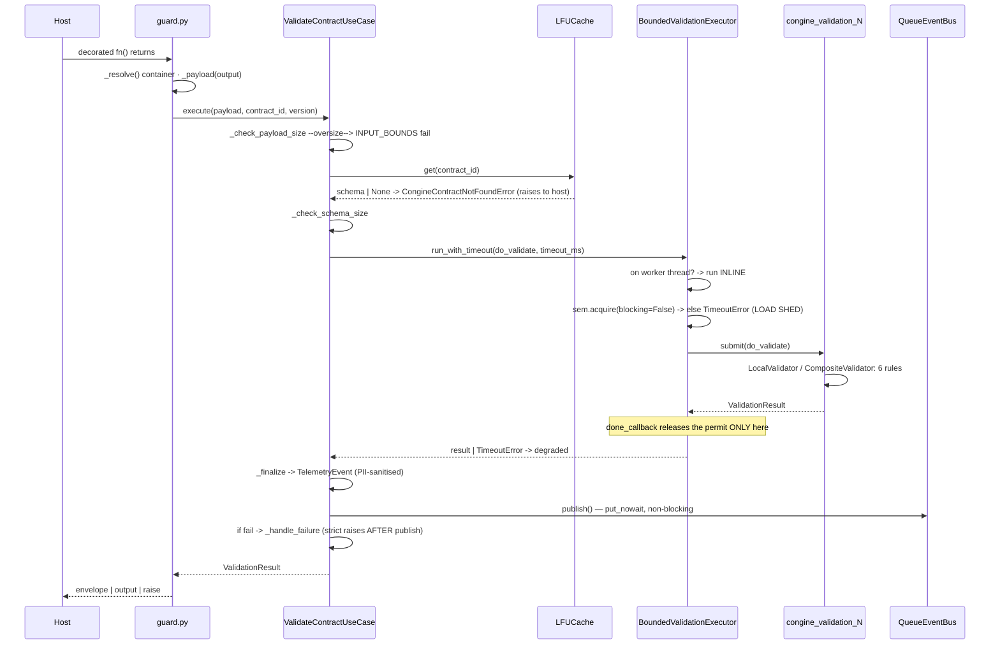
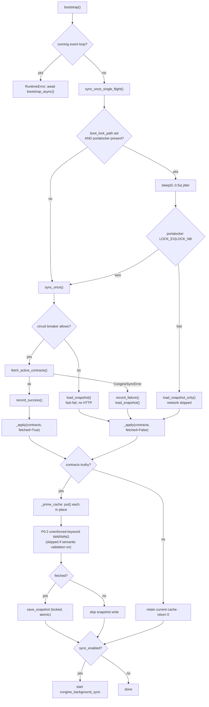
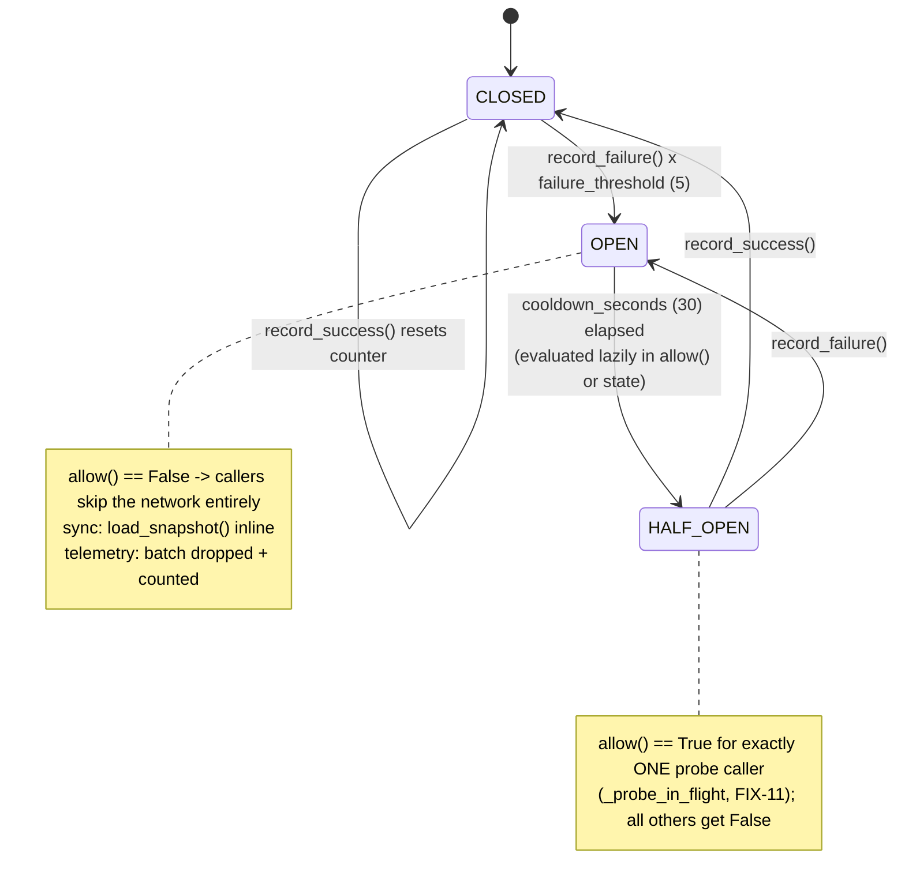

## 8. Control flows

Five traces. Every step carries a `file:line`. Branch points are called out explicitly with what
happens on each side.

### 8.1 The validation hot path (sync)

Preconditions: a container exists, `bootstrap()` has primed the cache, the host calls a function
decorated `@congine_guard("sentiment-v1", container=ctx)` returning `{"score": 0.9, "label": "pos"}`.

| # | Where | What happens |
|---|---|---|
| 1 | `adapters/guard.py:76-77` | `sync_wrapper` entered; `_resolve()` (`:57-58`) returns the explicit `container=`. **Branch:** if `container` was `None`, `ServiceContainer.get_default()` runs — which calls `CongineConfig.from_env()` and re-validates the whole environment *on this call* (§7.6, debt D8) |
| 2 | `guard.py:78` | `fn(*args, **kwargs)` runs. The decorated function executes **before** any validation — Congine is an output firewall, not an input gate |
| 3 | `guard.py:79-83` | `_payload(output)` (`:60-61`) returns `output` unchanged. **Branch:** with `extractor=`, the extractor's return value is validated instead. Then `ctx.validate_contract_usecase.execute(payload, contract_id, contract_version)` |
| 4 | `usecases/validate_contract_usecase.py:56` | `_check_payload_size` (`:125-141`): `len(json.dumps(payload, default=str))` vs `max_payload_bytes`. **Branch:** over budget ⇒ build an `INPUT_BOUNDS` fail result and jump straight to step 11 (`:58`) — the validator is never invoked. **Branch:** `TypeError`/`ValueError` from `json.dumps` ⇒ `size = 0` (`:128-129`), i.e. an unserialisable payload is treated as size-zero and passes the guard |
| 5 | `:60` → `:161-166` | `_resolve_schema` → `schema_storage.get(contract_id)`. **Branch:** `None` ⇒ log `"Schema not found"` and raise `CongineContractNotFoundError` (`:164-165`) — this **escapes to the host regardless of `fail_mode`**, because it is a wiring error, not a validation failure |
| 6 | `infrastructure/lfu_cache.py:85-94` | Under `self._lock` (RLock): look up, check `_is_expired` against `time.monotonic()`. **Branch:** expired ⇒ `_evict_key` and return `None` (→ step 5's raise). Otherwise `_increment_freq` (the O(1) bucket move, `:163-175`) and return the schema |
| 7 | `:61` → `:143-159` | `_check_schema_size` — same shape as step 4, `<schema>` field, `INPUT_BOUNDS` rule |
| 8 | `:65-66` | The zero-arg closure `do_validate()` capturing `payload` and `schema` is defined |
| 9 | `:68-70` | `started = time.perf_counter()`; `self.timer.run_with_timeout(do_validate, self.timeout_ms)` |
| 10 | `infrastructure/bounded_executor.py:100-109` | **Branch:** `_on_worker_thread()` true (re-entrant call from this pool) ⇒ `return func()` **inline**, no permit, no deadlock. Otherwise `_acquire_and_submit` (`:151-175`): **Branch:** `self._sem.acquire(blocking=False)` fails ⇒ `_rejected_total += 1` and raise `TimeoutError("validation capacity exhausted (load shed)")` — *load shed, before any work starts*. **Branch:** `thread_pool.submit` raises `RuntimeError` (pool shut down) ⇒ release the permit and raise `TimeoutError("validation executor unavailable")`. Otherwise attach `add_done_callback(lambda _f: self._release())` (`:174`) and block on `future.result(timeout=timeout_ms/1000)` |
| 11 | `domain/validator.py:369-408` (on a `congine_validation_N` worker) | `LocalValidator.validate`. **Branch:** `not isinstance(payload, dict)` ⇒ immediate `fail` with a single `TYPE_MATCH`/`<root>` breach (`:384-395`). Otherwise iterate the six rules in fixed order — `FIELD_PRESENCE`, `TYPE_MATCH`, `ENUM_VALUES`, `RANGE_CHECK`, `NULL_GUARD`, `REGEX_PATTERN` — calling `_extract_params` (`:333-367`) per rule and concatenating breaches. `status = "pass"` iff the list is empty |
| 11a | `domain/validator.py:436-461` | **Branch:** with `semantic_validation_enabled`, `CompositeValidator.validate` runs instead: `LocalValidator` first (`:451`), then `semantic_validator.validate` **unconditionally** (`:453`) — including when the rule validator already rejected a non-dict root — and merges. `degraded` propagates from the rule result only (`:460`) |
| 12 | `bounded_executor.py:174` | The future completes; the done-callback fires `_release()` (`:177-180`): `_in_flight -= 1` then `self._sem.release()`. **This is the only release path** — a timed-out caller never releases |
| 13 | `validate_contract_usecase.py:70` → `:84` | `future.result()` returns; control reaches `_finalize`. **Branch on exception:** `TimeoutError` ⇒ `_degraded_on_timeout` (`:168-182`, `degraded_reason="timeout"`); `MemoryError`/`RecursionError` ⇒ `_degraded_on_error(..., "resource_error")`; any `CongineBaseException` ⇒ **re-raised unchanged** (`:77-78`); any other `Exception` ⇒ `_degraded_on_error(..., "internal_error")`. All degraded results carry `status="fail"`, `breaches=()` |
| 14 | `:205-225` | `_finalize` builds a `TelemetryEvent` copying contract id/version/status/`duration_ms` and a list of breach dicts, each message passed through `sanitize_breach_message` (`:220`). Then `self.event_bus.publish(event)` (`:225`) |
| 15 | `infrastructure/queue_event_bus.py:105-116` | `self._queue.put_nowait(event)` — returns immediately. **Branch:** `queue.Full` ⇒ `_dropped_total += 1` and a WARNING; the event is lost. **No network call happens on the hot path.** **Branch:** with `NoOpEventBus`, `publish` is `return None` (`noop_event_bus.py:26-28`) |
| 16 | `:227-228` | **Branch:** `result.is_pass()` false ⇒ `_handle_failure` (`:232-260`): `SILENT` ⇒ return; `STRICT` ⇒ log ERROR then **raise `CongineValidationError`** — note this is *after* the publish at step 14, which is the "telemetry before raise" ordering; `DEGRADE` ⇒ log WARNING and return |
| 17 | `:230` → `guard.py:84` → `:63-72` | `_finish(output, result)`. **Branch:** `mode="raise"` and not passing ⇒ raise `CongineValidationError`; `mode="output"` ⇒ return the raw output; `mode="envelope"` (default) ⇒ return `{"output": ..., "validation_result": ...}` |

**The async twin.** `guard.py:87-99` awaits `fn`, then `execute_async` (`:86-123`), which is
step-for-step identical except step 9→10 uses `run_with_timeout_async`
(`bounded_executor.py:111-149`): the *same* `_acquire_and_submit`, then
`await asyncio.wait_for(asyncio.wrap_future(future), timeout)`. The bound and the deadline are
identical to the sync path and the event loop is never blocked. There is no `run_in_executor`
bypass — that is the closure of audit H1/H2, asserted by
`tests/adversarial/test_bounded_executor.py:117` (`test_async_concurrent_saturation_sheds_load`)
and `:146` (`test_async_reentrant_call_runs_inline`).

### 8.2 Cold boot with a reachable control plane

| # | Where | What happens |
|---|---|---|
| 1 | `dependency_injection.py:346-354` | `bootstrap()` confirms no running loop |
| 2 | `:355` → `usecases/sync_contracts_usecase.py:123-153` | `sync_once_single_flight`. **Branch:** `boot_lock_path is None` (file repo) or portalocker absent ⇒ plain `sync_once()` (`:138-139`) |
| 3 | `:142-146` | `time.sleep(random.uniform(0.0, 0.5))` — herd desynchronisation, bounded at 500 ms |
| 4 | `:148` → `:174-198` | `_try_boot_lock`: `os.makedirs(dirname(boot_lock_path), exist_ok=True)`, then `portalocker.Lock(..., timeout=0, flags=LOCK_EX|LOCK_NB)`. **Branch:** `LockException` ⇒ yield `False` → step 4b |
| 4b | `:151-153` | Lock lost: log `"Boot lock held by sibling worker; loading snapshot only"` and call `load_snapshot_only()` (`:113-121`) — **the network is skipped entirely** |
| 5 | `:149` → `:88-102` | Lock won: `sync_once()` → `_fetch_sync()` (`:200-213`) |
| 6 | `:201` | `_breaker_allows()`. **Branch:** breaker not CLOSED/HALF_OPEN-probe ⇒ §8.3 |
| 7 | `:207` | `asyncio.run(contract_repository.fetch_active_contracts())` |
| 8 | `infrastructure/http_contract_repository.py:107-130` | Build `X-API-Key`/`X-Project-ID`/`X-Tenant-ID` headers; `GET {base_url}/api/v1/contracts/active` through a per-request `httpx.AsyncClient(timeout=control_plane_http_timeout_seconds)`; `raise_for_status()`; **check `len(response.content) > max_http_response_bytes`** (`:121-125`) before parsing; `data["contracts"]`; assert it is a list |
| 9 | `:212-213` | `_breaker_record_success()`; return `(contracts, fetched=True)` |
| 10 | `:241-255` | `_apply`. **Branch:** falsy contracts ⇒ log `"No contracts available; retaining current cache"` and return `0` — **a failed sync never clears a healthy cache** |
| 11 | `:257-271` | `_prime_cache`: for each contract with both `id` and `schema`, `schema_storage.put(id, schema, cache_ttl_seconds)`. Entries are updated **in place**, never clear-then-refill, so a concurrent hot-path `get` always sees a coherent cache |
| 12 | `:270` → `:273-306` | **(P0-2, new)** `_warn_unenforced_keywords`. **Branch:** `semantic_validation_enabled` ⇒ return immediately. Otherwise `find_unenforced_keywords(schema)`; if non-empty and `(contract_id, sha256(canonical schema))` is unseen, emit one WARNING listing the `field.keyword` paths plus the `CONGINE_SEMANTIC_VALIDATION=true` hint. The de-dup set is cleared wholesale at 4096 entries (`:292-293`). Every exception is swallowed into a DEBUG line (`:301-306`) |
| 13 | `:248-252` | `fetched` is true ⇒ `contract_repository.save_snapshot(contracts)`; an `OSError` is logged and swallowed |
| 14 | `http_contract_repository.py:178-207` | Build the `{"version","contracts","fetched_at"}` envelope; `os.makedirs(snapshot_dir)`; on POSIX `chmod 0o700` (best-effort); acquire the advisory `.lock` (`:212-243`) — **branch:** not acquired within `snapshot_lock_timeout_seconds` ⇒ log and **skip the write** (a sibling is writing the same contracts); otherwise `tempfile.mkstemp` in the same directory, `json.dump`, `os.replace` (atomic), unlinking the temp file on any exception |
| 15 | `:254-255` | Log `"Schema cache synced"` with the count; return it |
| 16 | `dependency_injection.py:356-357` | **Branch:** `sync_enabled` ⇒ `start_background_sync()` → `BackgroundSyncWorker.start()` spawns `congine_background_sync` |

### 8.3 Cold boot with an unreachable control plane

Two distinct sub-cases, and the prior documentation conflated them.

**Case A — the breaker is already OPEN** (5 prior consecutive failures, within the 30 s cooldown).
`_fetch_sync` (`sync_contracts_usecase.py:201-205`) sees `_breaker_allows()` false, logs
`"Circuit breaker OPEN; skipping contract fetch (snapshot fallback)"`, and returns
`(load_snapshot(), False)` **inline**. The HTTP timeout is never entered — this is the boot-stall
protection. `_apply` then primes from the snapshot and, because `fetched` is `False`, skips
`save_snapshot`.

> **Correction to the prior docs.** `00_SYSTEM_MAP.md`'s lifecycle appendix says
> "breaker OPEN → `load_snapshot_only()` (fast-fail)". That is wrong. `bootstrap()` never calls
> `load_snapshot_only()`. That method (`:113-121`) is reached **only** from the single-flight *loser*
> branch (`:153` sync, `:172` async). The OPEN-breaker path is the inline `load_snapshot()` above.
> The observable behaviour is nearly the same; the call graph is not.

**Case B — the breaker is CLOSED and the plane is dead.** The fetch is attempted and costs up to
`control_plane_http_timeout_seconds` (default 10 s). `httpx` raises, `HttpContractRepository`
converts it to `CongineSyncError` (`:131-140`) after logging, `_fetch_sync` catches exactly that
type (`:208`), calls `_breaker_record_failure()`, logs `"Contract fetch failed; falling back to disk
snapshot"`, and returns `(load_snapshot(), False)`.

So the *first* cold boot against a dead plane costs one timeout; boots six onward cost nothing.
After `breaker_failure_threshold` (5) consecutive failures the breaker trips OPEN
(`circuit_breaker.py:115-118`) and every subsequent attempt takes Case A until the cooldown elapses.

**If the snapshot is also unavailable** (missing, symlinked, foreign-owned, corrupt, or a malformed
envelope — `http_contract_repository.py:142-161`, `:258-269`), `load_snapshot()` returns `None`,
`_apply` logs `"No contracts available; retaining current cache"` and returns `0`. On a genuinely
cold process the cache is then empty and **every subsequent validation raises
`CongineContractNotFoundError`** — the system fails closed on missing contracts, in all three
fail modes. `bootstrap()` itself still returns normally: boot does not crash.

### 8.4 The periodic background sync

| # | Where | What happens |
|---|---|---|
| 1 | `dependency_injection.py:366-368` | `start_background_sync()` — only if `sync_worker is not None` |
| 2 | `infrastructure/background_sync.py:55-66` | **Branch:** thread already alive ⇒ return (idempotent). Otherwise clear `_stop_event`, spawn `congine_background_sync` (daemon), `atexit.register(self.stop)` |
| 3 | `:79-84` | `_run_loop`: **branch:** `run_immediately` is `False` as wired by the container, so the first action is the wait. Then `while not self._stop_event.wait(self._interval): self._safe_sync()` — an interruptible sleep, so `stop()` wakes it promptly |
| 4 | `:86-97` | `_safe_sync` calls `sync_usecase.sync_once()`. `KeyboardInterrupt`/`SystemExit` re-raise; **every other exception is swallowed** into an ERROR log, so one bad pass never kills the loop |
| 5 | → §8.2 steps 5-15 | The full sync, including the breaker gate, the P0-2 keyword scan (de-duplicated, so a re-sync of unchanged contracts logs nothing) and the snapshot write |

The worker calls `sync_once`, **not** `sync_once_single_flight` — the boot lock is a boot-time
concern only. N processes therefore each issue their own periodic fetch; only the initial burst is
coordinated.

### 8.5 The telemetry drain

| # | Where | What happens |
|---|---|---|
| 1 | `queue_event_bus.py:87-94` | At container construction (if `start_background_services`): spawn `congine_event_bus` (daemon), `atexit.register(self._drain_on_exit)` |
| 2 | `:152-157` | `_drain_loop`: `while not self._stop_event.is_set(): batch = self._collect_batch(); if batch: self._ship(batch)` |
| 3 | `:159-171` | `_collect_batch`: block up to **1 s** on `queue.get(timeout=1.0)`. **Branch:** `Empty` ⇒ return `[]` (loop re-checks the stop flag — this 1 s poll is what makes `stop()` responsive). Otherwise greedily `get_nowait()` up to `batch_size` |
| 4 | `:213-217` | **Branch:** `self._config is None` ⇒ drain-and-observe only, DEBUG log, return `True`. (Never happens in the wired container, which always passes `config`) |
| 5 | `:221-231` | **Branch:** breaker present and `allow()` false ⇒ `_dropped_total += len(batch)`, WARNING, return `False`. The whole batch is discarded **without** a network attempt — a persistently dead plane costs no backoff on the bus thread |
| 6 | `:233-240` | Build `POST {base_url}/api/v1/telemetry` with the three isolation headers and `{"events": [ _serialize(e) … ]}`. `_serialize` (`:283-296`) emits exactly six keys and ISO-formats `created_at` |
| 7 | `:243-255` | Attempt loop, `attempts = max_attempts or self._max_retries` (default 4). On success: DEBUG log, `circuit_breaker.record_success()`, return `True` |
| 8 | `:256-280` | On `httpx.HTTPError`: WARNING. **Branch:** last attempt ⇒ `circuit_breaker.record_failure()`, `_dropped_total += len(batch)`, ERROR `"Telemetry chunk dropped after retries"`, return `False`. Otherwise `self._stop_event.wait(delay)` — an **interruptible** backoff; **branch:** if it returns `True` (stop requested) abandon immediately. Then `delay = min(delay*2, backoff_max)` — 0.5, 1.0, 2.0, 4.0 … capped at 8.0 |
| 9 | `:127-141` | `stop(drain=True)`: set `_stop_event`, `_flush_remaining()` **on the caller's thread**, `daemon.join(timeout=2.0)`, close and null the client |
| 10 | `:173-180` | `_drain_on_exit` (atexit): set the stop flag and `_flush_remaining(max_attempts=1)` — a single attempt per batch, so a dead plane cannot add retries×backoff seconds to interpreter shutdown (audit M2) |

Note the asymmetry in step 8: the breaker records a failure only after the *entire* retry budget is
exhausted, so one telemetry batch consumes one breaker failure, not four.
