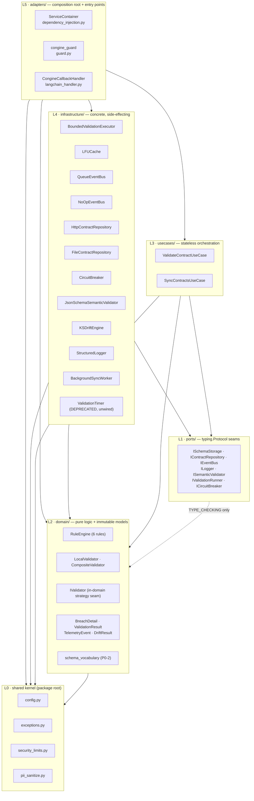
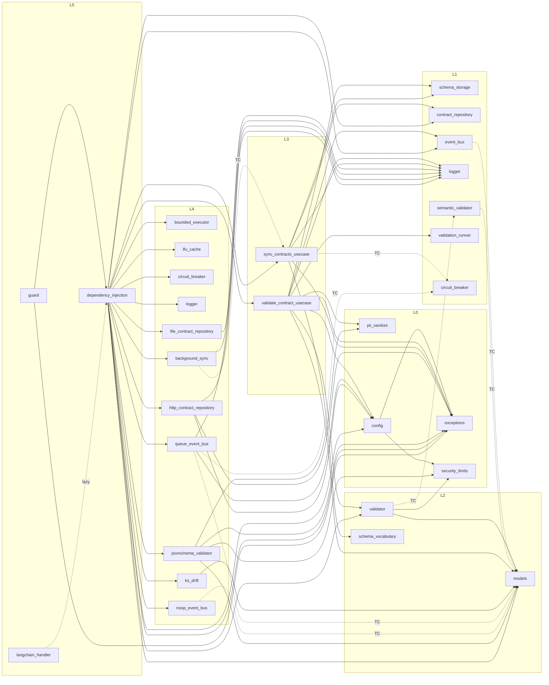
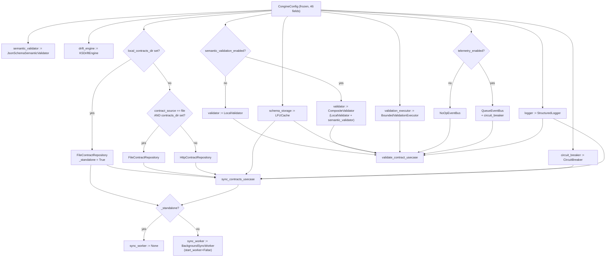
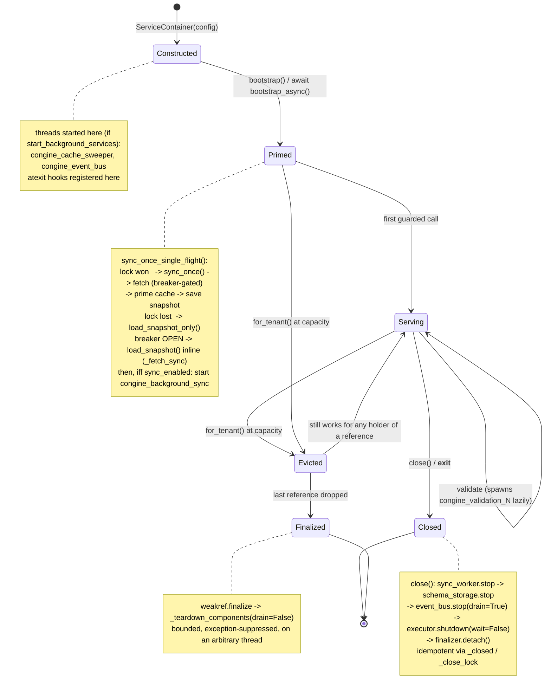
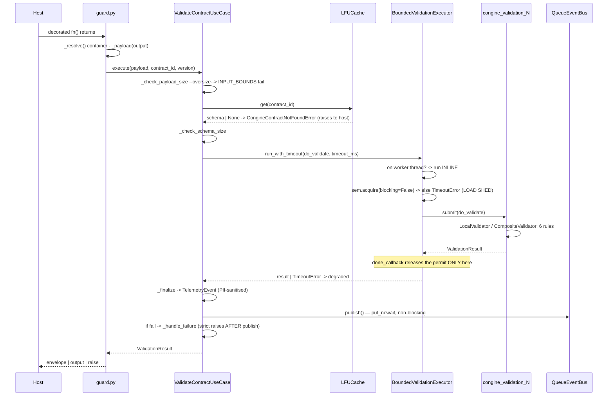
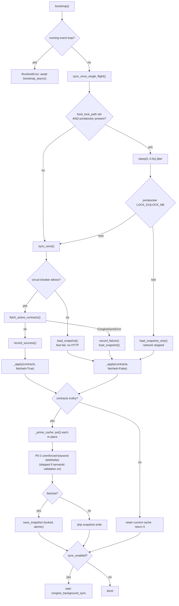
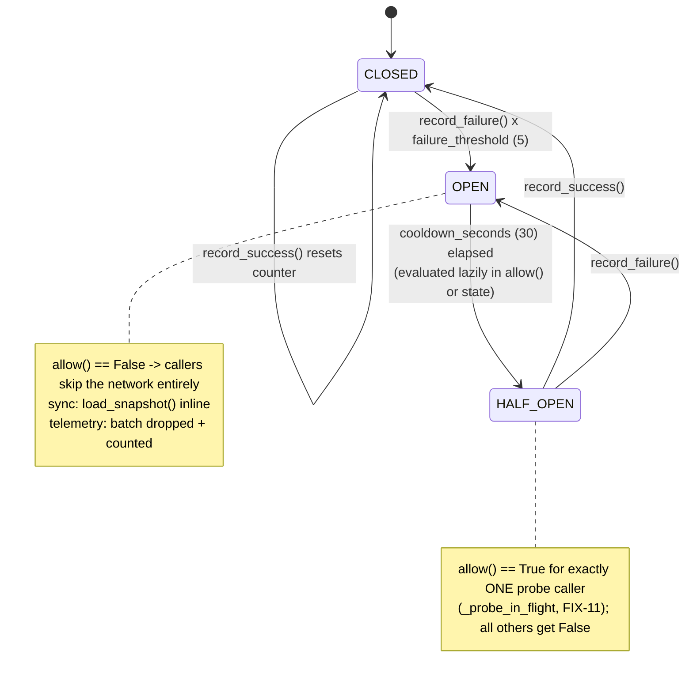

# CONGINE — CURRENT ARCHITECTURE (verified)

> **Superseded implementation snapshot (2026-08-21).** This forensic document
> describes commit `a561992` plus its noted working tree and is retained as
> historical evidence until the planned P3 reconciliation. For current closure
> status, use `docs/_suite/hardening/P0_COMPLETION_REPORT.md`,
> `docs/_suite/hardening/P1_PRE_CHANGE_VERIFICATION.md`, and
> `docs/_suite/hardening/P1_COMPLETION_REPORT.md`. In particular, its test
> counts and open P0/P1 debt tables are not statements about the post-P1
> codebase.

**Generated:** 2026-08-09 · **Commit:** `a561992c69bf5ca334492706314f6ffc9d5ece10` (branch
`ahmed-main-v2`), **plus an uncommitted working tree** carrying the P0-2 change ·
**Supersedes:** the 2026-06-14 audit set (`docs/system-analysis/00_SYSTEM_MAP.md`,
`docs/system-analysis/01_FILE_INVENTORY.md`, `docs/context/01_SYSTEM_STATE.md`,
`docs/context/02_COMPONENT_MAP.md`)

**Package root:** `libs/congine-sdk/src/congine_core/` — 37 Python files, 31 implementation modules,
5 075 lines. **Test suite at time of writing: 293 passed, 1 skipped** (34 test files).

---

## 0. How to read this document

**What this is.** A forensic reverse-engineering of the Congine SDK as it exists in this repository
today. It describes only what is built. Anything planned, partially designed, or described in the
`docs_v2/` roadmap but absent from the code appears **exclusively** in §15 and nowhere else.

**Evidence rules.** Every structural claim carries a `file:line` reference. Where a behaviour was
verified by executing it rather than by reading it, the section says so and gives the observed
result. Where something could not be determined, it is marked `UNVERIFIED:` with the reason.

**Terminology.** One name per concept, used consistently:

| Term | Means |
|---|---|
| **the container** | `ServiceContainer` (`adapters/dependency_injection.py`) |
| **the hot path** | guard → use case → cache → executor → rules → telemetry → enforcement (§8.1) |
| **the control plane** | the external HTTP service the SDK talks to; it is **not** in this repository |
| **a port** | a `typing.Protocol` in `ports/` (L1), plus the in-domain `IValidator` |
| **a concrete** | a class in `infrastructure/` (L4) implementing a port structurally |
| **the composition root** | `ServiceContainer.__init__`, the only place concretes are constructed |
| **degraded** | `ValidationResult.degraded is True` — a timeout/error fallback, **not** a real evaluation |
| **load shed** | a validation rejected before it ran, because capacity was exhausted |
| **standalone** | `local_contracts_dir` is set: file repository, **no sync worker allocated at all** |
| **L0–L5** | the six tiers (§3) |
| **TC edge** | an import guarded by `if TYPE_CHECKING:` — no runtime dependency |

**Citation.** Section numbers are stable. Cite as `ARCHITECTURE_CURRENT.md §9.3`.

**Reading orders.** To understand *what it does*: §1 → §8 → §13. To *change* it: §3 → §4 → §6 → §16.
To *extend* it: §5 → §15. To *operate* it: §7 → §9 → §12 → §14.

**Provenance.** Working notes are in `docs/_workbench/arch_pass_1.md` … `arch_pass_15.md`, with the
pass ledger in `docs/_workbench/arch_progress.md`. Each pass file is the body of one section here.

---

## 1. Orientation — the system in one page

Congine is a **synchronous output firewall shipped as a Python library**. A developer decorates a
function with `@congine_guard("some-contract")`; when that function returns, Congine intercepts the
return value, looks up a JSON contract schema in an in-memory cache, runs the value through six
deterministic rules under a hard millisecond deadline on a bounded thread pool, enqueues a telemetry
event without blocking, and then passes the value through, wraps it in an envelope, or raises —
depending on the configured mode.

It is a **library, not a service**. There is no server, no database, no CLI, no persistence. Every
piece of state — schema cache, circuit-breaker state, telemetry queue, tenant registry, drift window
— is process-local. If the process dies, queued telemetry dies with it.

Everything else in the codebase exists to make that one hot path safe:

- **safe under load** — a bounded, load-shedding executor that sheds rather than queues (§14.1)
- **safe under failure** — a circuit breaker plus an on-disk snapshot, so a dead control plane
  cannot stall application boot (§14.2)
- **safe under attack** — linear-time `re2`, length caps everywhere, payload and schema bounds, PII
  scrubbing (§14.5, §14.7, §13.5)
- **safe across tenants** — per-tenant caches, snapshots, breakers and containers (§14.6)

**The shape.** A strict six-tier hexagon (L0 kernel → L1 ports → L2 domain → L3 use cases →
L4 infrastructure → L5 adapters), with dependencies pointing inward only. This was re-verified by
AST analysis of every import in all 37 files, distinguishing runtime edges from `TYPE_CHECKING`
edges: **no violations were found** (§4.4). The hexagon is real, and it is the asset — six of the
nine planned future capabilities attach as pure additions behind seams that already exist (§15.10).

**What is genuinely good.** The composition root is the only construction site — sixteen
constructions, one file, zero exceptions. The ports are real duck-typed seams, proven by test fakes
that satisfy them without importing them. The bounded executor's permit accounting is subtle and
correct. All eleven invariants in §14 hold.

**What a reader must not miss.** Three things, each covered in full below:

1. **A union `type` declaration (`{"type": ["string","null"]}`) — legal, idiomatic JSON Schema —
   makes every validation against that contract degrade silently, forever** (§13.6, debt D18).
2. **The rule engine reads eight schema keywords. Everything else — `minLength`, `format`, `const`,
   `additionalProperties`, `items`, `allOf` — is silently ignored** unless semantic validation is
   on (§13.1, §13.2). Since P0-2 this is *warned about at load*, but only on the cache-prime path.
3. **`region` is a fully validated, documented configuration field that nothing reads** (§12.4,
   debt D1).

**Since the 2026-06-14 audit.** P0-1 (safe tenant eviction) landed and is committed. P0-2
(unenforced-keyword warning) landed and is **uncommitted** in the working tree. One prior debt claim
turned out to be wrong in direction. Full reconciliation in §2.

---

## 2. Drift report — what changed since 2026-06-14

### 2.1 The module-count discrepancy, resolved

The two prior documents disagree. Both were measuring the same tree; they were counting different things.

| Source | Claim | Verdict |
|---|---|---|
| `docs/context/01_SYSTEM_STATE.md:7` | "33 source modules across 6 tiers" | **WRONG** — no counting rule over the tree at that commit yields 33 |
| `docs/system-analysis/01_FILE_INVENTORY.md:5` | "36 Python source modules" | **CONFIRMED exactly** |

Verification (`git ls-tree -r --name-only 051ceae -- libs/congine-sdk/src/congine_core`, the last
commit before the 2026-06-14 doc date):

| Counting rule | Count at 2026-06-14 baseline | Count today |
|---|---|---|
| All `.py` files under the package root | **36** | **37** |
| Excluding all six `__init__.py` | 30 | 31 |
| Excluding only the package-root `__init__.py` | 35 | 36 |

`01_FILE_INVENTORY.md`'s 36 is the "all `.py` files" figure and is exact. `01_SYSTEM_STATE.md`'s 33
matches none of these rules. The only reconstruction that produces 33 is *36 minus the three
`__init__.py` files that are pure re-export shims* (`domain/__init__.py`, `ports/__init__.py`,
`usecases/__init__.py`), keeping the three that carry logic (the package root's `__version__`
resolution, `adapters/__init__.py`'s lazy `__getattr__`, `infrastructure/__init__.py`'s deliberate
`ValidationTimer` exclusion). **UNVERIFIED: whether that was the author's actual intent** — it is a
reconstruction, not a documented rule.

Corroborating evidence that `01_SYSTEM_STATE.md` was otherwise carefully measured: its companion
claim in the same line — "259 test functions across 32 test files" — reproduces **exactly** at commit
`051ceae` (32 files matching `test_*.py`, 259 `def test_` definitions). The counting method was
sound; the module figure specifically is the outlier.

**Authoritative current count: 37 Python files under `libs/congine-sdk/src/congine_core/`, of which
31 are implementation modules and 6 are package `__init__.py` files.** This document uses
"37 files / 31 modules" throughout.

### 2.2 What moved since 2026-06-14

Version control (`git log --since=2026-06-01`) shows exactly two commits touching the SDK after the
audit date, plus an uncommitted working tree:

| Change | Where | Status |
|---|---|---|
| Tenant-eviction rewrite (P0-1): `weakref.finalize` deferred teardown, `_evicted_total`, idempotent `close()`, `reset_default()` outside locks | `adapters/dependency_injection.py` (+135 lines) | committed `a561992` |
| New direct test for tenant LRU eviction | `tests/unit/test_container_tenant_lru.py` (7 tests) | committed `a561992` |
| Unenforced-keyword vocabulary module (P0-2) | `domain/schema_vocabulary.py` (144 lines, **new file**) | **uncommitted** |
| Load-time unenforced-keyword WARNING + de-dup | `usecases/sync_contracts_usecase.py` (+63 lines) | **uncommitted** |
| `semantic_validation_enabled` threaded into `SyncContractsUseCase` | `adapters/dependency_injection.py:320` (+1 line) | **uncommitted** |
| Tests for the above | `tests/unit/test_schema_vocabulary.py` (12), `tests/unit/test_sync_usecase.py` (+6), `tests/unit/test_config_wiring.py` (+2) | **uncommitted** |
| `requires-python` raised to `>=3.11`; classifiers extended to 3.14 | `pyproject.toml` | committed |
| LangChain example added (`examples/LangChain/`) | example tree | committed |

Nothing else in `src/` changed. Test suite today: **293 passed, 1 skipped** (34 `test_*.py` files,
286 `def test_` definitions; the collected count is higher because of parametrisation).

### 2.3 Claim-by-claim verdict on the prior documents

Legend: **CONFIRMED** (still exactly true) · **CHANGED** (was true, has since moved) ·
**WRONG** (was not true when written) · **GONE** (no longer exists).

#### From `docs/context/01_SYSTEM_STATE.md`

| # | Claim | Verdict | Evidence |
|---|---|---|---|
| 1 | "33 source modules across 6 tiers" | **WRONG** | §2.1 |
| 2 | "259 test functions across 32 test files" | **CHANGED** | Exact at baseline; now 34 files / 286 definitions / 294 collected |
| 3 | `ServiceContainer` has no dedicated test file | **CHANGED** | `tests/unit/test_container_tenant_lru.py` now exists (7 tests) |
| 4 | `for_tenant()` LRU eviction "not directly asserted" | **CHANGED** | `test_container_tenant_lru.py:51,76,94,130,138,157,191` |
| 5 | `bootstrap()` in-event-loop guard untested | **WRONG** | `tests/adversarial/test_remediations.py:123` `test_bootstrap_inside_running_loop_raises` existed at baseline |
| 6 | `health()` aggregation untested | **WRONG** | `tests/adversarial/test_remediations.py:107` `test_health_snapshot_shape` |
| 7 | `evaluate_drift()` `__drift__` event untested | **WRONG** | `tests/adversarial/test_remediations.py:82,95` |
| 8 | `reset_default()` teardown untested | **WRONG** | `tests/adversarial/test_remediations.py:71` |
| 9 | `ValidationTimer` deprecated and not wired | **CONFIRMED** | `infrastructure/timer.py:39`; absent from `infrastructure/__init__.py:27-39` |
| 10 | Debt #1 — LangChain example enum mismatch | **VERIFIED PRESENT** | `examples/LangChain/agent.py:75,90` say `manual_review`; `contracts/return_processing.json:7` enum is `["approve_return","reject_return","escalate"]` |
| 11 | Debt #2 — eviction `close()`s a live container | **VERIFIED FIXED** | `dependency_injection.py:157-163` removes the entry and arms `weakref.finalize`; no `close()` under the lock |
| 12 | Debt #3 — `requires-python` contradicts 3.10 floor | **VERIFIED PRESENT** | `pyproject.toml:6` `>=3.11` vs `:18` classifier 3.10 vs `:69` `target-version = "py310"` |
| 13 | Debt #4 — size guards count characters, undercounting multibyte UTF-8 | **WRONG (direction inverted)** | `json.dumps(..., default=str)` uses `ensure_ascii=True`, so its output is pure ASCII and `len(str) == len(str.encode("utf-8"))` exactly. Measured: `{"k": "é"×10}` → guard sees 69, compact UTF-8 is 29. The guard **over**-counts by up to ~6× and is therefore conservative, not permissive. The debt is real (the number is not the payload's wire size) but it is fail-safe, not fail-open |
| 14 | Debt #5 — stale `TelemetryEvent` "mutable" docstring | **VERIFIED PRESENT** | `domain/models.py:5` says mutable; `:74` is `@dataclass(frozen=True)` |
| 15 | Debt #6 — `pii_sanitize` uses stdlib `re` | **VERIFIED PRESENT** | `pii_sanitize.py:9,14` |
| 16 | Debt #7 — `CompositeValidator` runs semantic validator on non-dict payloads | **VERIFIED PRESENT** | `domain/validator.py:451-453` — no short-circuit between the two calls |
| 17 | Debt #8 — silent schema-keyword vocabulary | **PARTIALLY ADDRESSED** | Enforcement unchanged (`domain/validator.py:333-367`), but a load-time WARNING now fires (`sync_contracts_usecase.py:273-306`, `domain/schema_vocabulary.py`). Detection landed; enforcement did not |
| 18 | Debt #9 — `ValidationTimer` dead code retained | **VERIFIED PRESENT** | `infrastructure/timer.py` still present, still tested by `tests/unit/test_timer.py` (4 tests) |
| 19 | "no literal TODO/FIXME remain in src/" | **CONFIRMED** | `grep -rn "TODO\|FIXME" src/` → no matches |
| 20 | All seven hot-path guarantees hold | **CONFIRMED with amendments** | See §14 — all seven hold; two acquire new caveats |

#### From `docs/system-analysis/00_SYSTEM_MAP.md`

| # | Claim | Verdict | Evidence |
|---|---|---|---|
| 21 | Strict 6-tier hexagon, dependencies inward only | **CONFIRMED** | §4 — re-verified by AST analysis |
| 22 | `IValidator` is the one sanctioned in-domain protocol | **CONFIRMED** | `domain/validator.py:293-301` |
| 23 | `ServiceContainer` is the sole construction site | **CONFIRMED** | §4.4 |
| 24 | Hot path: guard → use case → cache → executor → rules → telemetry → enforce | **CONFIRMED** | §8.1 |
| 25 | `ServiceContainer.__init__` at `dependency_injection.py:132` | **CHANGED** | now `:202` (P0-1 rewrite shifted line numbers) |
| 26 | `_resolve_schema` at `:161`, `_finalize` at `:205`, `_check_payload_size` at `:125` | **CONFIRMED** | unchanged |
| 27 | `bootstrap()` loop-guard at `dependency_injection.py:270` | **CHANGED** | now `:346-354` |
| 28 | `for_tenant` registry at `:72-118`, cap 128 | **CHANGED (lines)** / **CONFIRMED (cap)** | now `:102-176`; `_MAX_TENANTS = 128` at `:76` |
| 29 | `close()` at `:346-351` tears down in order sync → cache → bus → pool | **CHANGED (lines)** / **CONFIRMED (order)** | now `:439-457` |
| 30 | Appendix lifecycle: "breaker OPEN → `load_snapshot_only()` (fast-fail)" | **WRONG** | `bootstrap()` never calls `load_snapshot_only()`. The OPEN-breaker fallback is inline in `sync_contracts_usecase.py:201-205` (`_fetch_sync` → `load_snapshot()`). `load_snapshot_only()` (`:113-121`) is reached **only** by the single-flight *loser* branch (`:153`, `:172`) |
| 31 | "`config.py` … one frozen dataclass with ~45 fields" | **CHANGED** | exactly **46** fields today |
| 32 | Linkage map (`00_SYSTEM_MAP.md:370-400`) | **CHANGED** | `usecases/sync_contracts_usecase` now also imports `domain/schema_vocabulary` at runtime — the row is stale. See Appendix A for the current map |
| 33 | "no server, no database, no CLI" | **CONFIRMED** | §15 |

#### From `docs/system-analysis/01_FILE_INVENTORY.md`

| # | Claim | Verdict | Evidence |
|---|---|---|---|
| 34 | 36 modules; package root `libs/congine-sdk/src/congine_core/` | **CONFIRMED (baseline)** / **CHANGED (now 37)** | §2.1 |
| 35 | Per-module responsibilities and internal-import lists | **CONFIRMED except two rows** | `domain/` gains `schema_vocabulary.py`; `usecases/sync_contracts_usecase.py` gains a runtime `domain.schema_vocabulary` import and a `semantic_validation_enabled` constructor parameter |
| 36 | `main.py` is a stub, "not part of the SDK" | **CONFIRMED** | `libs/congine-sdk/main.py`, 95 bytes, outside `src/` |
| 37 | conftest fakes satisfy ports structurally | **CONFIRMED** | `tests/conftest.py:17-119` — no protocol import, no subclassing |

#### From `docs_v2/01_CORE_ENGINE_ARCHITECTURE.md`

| # | Claim | Verdict | Evidence |
|---|---|---|---|
| 38 | MCP server exists | **DOES NOT EXIST** | no `mcp/` package; `IMCPTransport` absent — §15.1 |
| 39 | `SqliteEventBus` exists | **DOES NOT EXIST** | §15.2 |
| 40 | `TelemetryEvent` carries `project_id`/`agent_id`/`file_paths`/`git_commit_sha`/`session_id` | **DOES NOT EXIST** | `domain/models.py:91-96` — six fields only |
| 41 | `correction_hint` on `BreachDetail` | **DOES NOT EXIST** | `domain/models.py:25-27` — three fields |
| 42 | `HistoryQueryUseCase` | **DOES NOT EXIST** | `usecases/` holds exactly two modules |
| 43 | `IAgentAdapter` + per-agent adapters | **DOES NOT EXIST** | §15.7 |
| 44 | `domain/arch_graph.py`, `validate_arch_usecase.py` | **DOES NOT EXIST** | §15.6 |
| 45 | "Rule engine only understands `required`, `type`, `enum`, `min`/`max`/`minimum`/`maximum`, `pattern`, `null_forbidden`" | **CONFIRMED, and it is now the authoritative list** | `domain/schema_vocabulary.py:23-32` mirrors it; guarded against drift by `tests/unit/test_schema_vocabulary.py:119` |

Everything in rows 38–44 belongs to §15 (extension seams) and nowhere else in this document.

### 2.4 Did P0-1 and P0-2 land?

**P0-1 (safe tenant container eviction): YES — landed and committed.**

The old code called `close()` on the evicted container while holding `_tenant_lock`. Both halves of
that defect are gone:

- `dependency_injection.py:157-163` — at capacity, eviction pops the registry entry, bumps
  `_evicted_total`, and calls `_arm_deferred_teardown()`, which only registers a
  `weakref.finalize` (`:422-437`). No component is stopped at eviction time.
- `_teardown_components` (`:40-62`) is a module-level function taking the four sub-components by
  value, never `self`, so the finalizer cannot keep the container alive. It uses `drain=False` so a
  dead control plane cannot stall the finalizer, and wraps each stop in
  `contextlib.suppress(Exception)`.
- The warning log and the return happen **outside** the lock (`:168-176`).
- `close()` is now idempotent behind `_close_lock` (`:445-448`) and detaches an armed finalizer
  (`:454-457`) so teardown runs exactly once.
- `reset_default()` (`:178-195`) collects containers under the locks but calls `close()` after
  releasing both.

Backed by seven tests, of which the decisive ones are
`test_eviction_does_not_disable_live_container` (asserts `result.degraded is False` on a still-held
evicted container — i.e. the pool is genuinely alive, not merely constructed) and
`test_for_tenant_eviction_returns_promptly` (a victim whose `stop()` sleeps 3 s must not delay the
triggering `for_tenant()` call beyond 1 s).

**P0-2 (unenforced schema keyword warning): YES — landed, but uncommitted, and detection-only.**

- `domain/schema_vocabulary.py` (new, pure, no I/O) exposes `find_unenforced_keywords(schema)` with
  **allowlist** semantics: anything not in the enforced set and not in a metadata allowlist is
  reported, so keywords nobody thought to blocklist are still caught as JSON Schema evolves.
- `sync_contracts_usecase.py:273-306` calls it once per contract at cache-prime time, emits one
  WARNING naming the unenforced `field.keyword` paths plus a remediation hint, de-duplicates on
  `(contract_id, SHA-256 schema fingerprint)` so background re-syncs do not repeat it, bounds the
  de-dup set at 4096 entries, and swallows every exception so a diagnostic can never break priming.
- It is skipped entirely when `semantic_validation_enabled` is true (`:283-284`), which the
  container now threads in (`dependency_injection.py:320`).

**What P0-2 does *not* do:** it does not change enforcement. A contract using `minLength` still
validates as passing under default configuration. The trap is now *observable*, not *closed*. Two
gaps remain, both in §13: the warning fires only on the **cache-prime path**, so a schema injected
directly via `schema_storage.put()` is never scanned; and the scan is deliberately non-recursive, so
a nested subtree is reported once at its parent field rather than enumerated.

---

## 3. The layer model

Six tiers, L0–L5. The tier of a file is determined by its directory, except L0, which is the set of
loose modules at the package root. Every file in the package is assigned below; the assignment is
exhaustive.



### 3.1 L0 — Shared kernel

**Responsibility.** Constants, policy, and vocabulary that every layer may name. Contains the one
mutable-by-configuration object in the system (`CongineConfig`) and the one exception tree.

**Forbidden from:** importing any port, domain type, use case, concrete, or adapter. Doing any I/O
other than reading environment variables.

| File | Lines | What it is |
|---|---|---|
| `config.py` | 363 | `CongineConfig` (frozen, 46 fields), `Region`, `FailMode`, `DeploymentMode`, `from_env()`, `validate()`, `is_local_base_url()`, `effective_log_safe_fields()` |
| `exceptions.py` | 82 | 1 root + 6 canonical exception classes + 4 Tier-2 aliases |
| `security_limits.py` | 33 | 8 numeric bounds |
| `pii_sanitize.py` | 26 | `sanitize_breach_message()` |
| `__init__.py` | 135 | the public `__all__` surface + `__version__` |

**Boundary check: clean.** The only intra-L0 edge is `config.py` → `exceptions`, `security_limits`
(`config.py:20-28`). `exceptions.py`, `security_limits.py` and `pii_sanitize.py` import nothing from
the package at all.

**Arguable placement — the package-root `__init__.py`.** It is filed as L0 by directory, but it
imports *every* layer including L5 (`__init__.py:9-65`). It is the only file in the package whose
imports point outward. This is correct and unavoidable — a package's public surface must be able to
name its top layer — but it means "L0 imports nothing outward" is true of the four L0 *modules*, not
of the L0 *directory*. Any automated layering check must exempt this file.

### 3.2 L1 — Ports

**Responsibility.** Declare, as `typing.Protocol`, every seam across which an implementation is
injected. No logic, no state, no imports that create runtime coupling.

**Forbidden from:** containing implementation; importing L2/L3/L4/L5 at runtime; importing L0 (it
does not need to — port signatures are expressed in builtins and L2 value objects).

| File | Lines | Protocol | Runtime imports | TYPE_CHECKING imports |
|---|---|---|---|---|
| `ports/schema_storage.py` | 60 | `ISchemaStorage` | — | — |
| `ports/contract_repository.py` | 48 | `IContractRepository` | — | — |
| `ports/event_bus.py` | 31 | `IEventBus` | — | `domain.models.TelemetryEvent` |
| `ports/logger.py` | 34 | `ILogger` | — | — |
| `ports/semantic_validator.py` | 39 | `ISemanticValidator` | — | `domain.models.BreachDetail` |
| `ports/validation_runner.py` | 95 | `IValidationRunner` | — | — |
| `ports/circuit_breaker.py` | 32 | `ICircuitBreaker` | — | — |
| `ports/__init__.py` | 26 | aggregate re-export of all seven | the seven port modules | — |

**Boundary check: clean.** Two ports name an L2 value object, both exclusively under
`TYPE_CHECKING` (`event_bus.py:16-17`, `semantic_validator.py:18-19`). Importing any port at runtime
therefore drags in nothing. All seven are `@runtime_checkable`.

### 3.3 L2 — Domain

**Responsibility.** The deterministic validation core and the immutable value objects that flow
through the system. This is the layer whose correctness the product sells.

**Forbidden from:** any I/O, any thread, any clock other than `time.perf_counter` for measurement,
any import of L1 at runtime, any import of L3/L4/L5 at all.

| File | Lines | What it is |
|---|---|---|
| `domain/models.py` | 102 | `BreachDetail`, `ValidationResult`, `DriftResult`, `TelemetryEvent` — all `frozen=True` |
| `domain/validator.py` | 461 | `RuleEngine` (6 static rules), `IValidator` (in-domain Protocol), `LocalValidator`, `CompositeValidator`, helpers `_compiled_pattern`, `_path_present`, `_type_matches`, `_JSON_TYPE_MAP` |
| `domain/schema_vocabulary.py` | 144 | **new since baseline** — `find_unenforced_keywords()` plus the four keyword frozensets |
| `domain/__init__.py` | 28 | aggregate re-export |

**Boundary check: clean.** `domain/validator.py` imports `domain.models` and `security_limits`
(inward) plus the third-party `re2` leaf, and names `ISemanticValidator` only under `TYPE_CHECKING`
(`:30-31`). `domain/models.py` and `domain/schema_vocabulary.py` import nothing from the package.
The domain imports no infrastructure. This is the single most important boundary in the system and
it holds.

**The one sanctioned deviation.** `IValidator` (`domain/validator.py:293-301`) is a Protocol that
lives outside `ports/`. It is sanctioned because it is an *in-domain strategy seam*: its two
implementations (`LocalValidator`, `CompositeValidator`) both live in the same module, and it is
never used to inject an outer-layer concrete inward. Contrast `ISemanticValidator`, which *is*
implemented by an L4 concrete and therefore correctly lives in `ports/`. The rule the codebase
actually follows is precise: **a Protocol lives in `ports/` if and only if something outside L2
implements it.** `IValidator` is the only Protocol that fails that test, and it is the only one
outside `ports/`. It is re-exported from `domain/__init__.py:27` but deliberately excluded from the
package `__all__`.

**Arguable placement — `domain/schema_vocabulary.py`.** It is a *mirror* of knowledge that lives in
`LocalValidator._extract_params` and `_JSON_TYPE_MAP`, deliberately duplicated rather than derived
(`schema_vocabulary.py:11-12` states this explicitly and points at the drift test). The alternative
placements are worse — deriving it inside `validator.py` would put a diagnostic concern in the
enforcement path, and putting it in L3 would place domain knowledge outside the domain. L2 is right;
the duplication is the cost, and `tests/unit/test_schema_vocabulary.py:119,133` is what makes the
cost payable.

### 3.4 L3 — Use cases

**Responsibility.** Stateless orchestration of a workflow across ports. Owns sequencing, error
policy, and degradation policy; owns no state that outlives a call except the
`_warned_unenforced` de-dup set.

**Forbidden from:** constructing a concrete; importing any L4 module; importing L5.

| File | Lines | What it is |
|---|---|---|
| `usecases/validate_contract_usecase.py` | 260 | the hot-path orchestrator, sync + async twins |
| `usecases/sync_contracts_usecase.py` | 315 | the boot/sync orchestrator, sync + async twins, single-flight |
| `usecases/__init__.py` | 9 | aggregate re-export |

**Boundary check: clean w.r.t. Congine layers.** `ValidateContractUseCase` names five abstractions
(`ISchemaStorage`, `IValidator`, `IEventBus`, `ILogger`, `IValidationRunner`) and never a concrete.
`SyncContractsUseCase` names three ports plus `ICircuitBreaker` under `TYPE_CHECKING`, and imports
`domain.schema_vocabulary` (inward, L2).

**Arguable placement — `portalocker` in L3.** `sync_contracts_usecase.py:27-33` imports
`portalocker` directly and `:174-198` opens and locks a file. That is filesystem I/O in the
orchestration layer. It is not a *layer* violation (portalocker is a third-party leaf, not a Congine
concrete), but it is a *purity* violation: L3 is supposed to sequence I/O, not perform it. The clean
form would be an `IBootLock` port with an L4 `PortalockerBootLock`. The pragmatic defence is that
the boot lock is a coordination primitive rather than a data source, and the guard degrades safely
when portalocker is absent (`:138`). **This is the single most arguable file placement in the
system.**

**Second arguable point — statefulness.** `SyncContractsUseCase._warned_unenforced`
(`:86`) is per-instance mutable state in a layer documented as stateless. It is a bounded, purely
diagnostic set (capped at 4096, `:41`, `:292-293`) and affects nothing but log volume, but the
"stateless orchestration" description is now slightly inaccurate.

### 3.5 L4 — Infrastructure

**Responsibility.** Every concrete that touches a thread, a socket, a file, a clock, or a
third-party engine. Each implements an L1 port structurally — none subclasses one.

**Forbidden from:** importing L5; importing another L4 concrete; constructing its own collaborators
(everything is constructor-injected).

| File | Lines | Port implemented | Notes |
|---|---|---|---|
| `infrastructure/bounded_executor.py` | 208 | `IValidationRunner` | stdlib only |
| `infrastructure/lfu_cache.py` | 245 | `ISchemaStorage` | stdlib only |
| `infrastructure/circuit_breaker.py` | 126 | `ICircuitBreaker` | stdlib only |
| `infrastructure/logger.py` | 111 | `ILogger` | stdlib only |
| `infrastructure/http_contract_repository.py` | 273 | `IContractRepository` | `httpx`, `portalocker` |
| `infrastructure/file_contract_repository.py` | 164 | `IContractRepository` | optional `yaml` |
| `infrastructure/queue_event_bus.py` | 296 | `IEventBus` | `httpx` |
| `infrastructure/noop_event_bus.py` | 40 | `IEventBus` | stdlib only |
| `infrastructure/jsonschema_validator.py` | 175 | `ISemanticValidator` | `jsonschema` |
| `infrastructure/ks_drift.py` | 156 | **none** | optional `numpy` |
| `infrastructure/background_sync.py` | 97 | **none** | drives L3 |
| `infrastructure/timer.py` | 81 | (`IValidationRunner`-shaped) | **DEPRECATED, not wired, not exported** |
| `infrastructure/__init__.py` | 39 | — | deliberately omits `ValidationTimer` (`:22-25`) |

**Boundary check: clean.** No L4 file imports an adapter. No L4 file imports another L4 file. Four
of the twelve concretes (`bounded_executor`, `lfu_cache`, `circuit_breaker`, `logger`) have zero
internal imports at all — they are pure mechanisms.

**Arguable placement — two L4 files implement no port.** `KSDriftEngine` and `BackgroundSyncWorker`
sit in L4 but fulfil no L1 contract. `KSDriftEngine` is a *library capability* the host calls
directly through the container (`dependency_injection.py:370-403`), so nothing injects it and no
seam is needed — but that also means it cannot be substituted. `BackgroundSyncWorker` is a
*mechanism that drives a policy*: it holds an L3 use case and calls it on a timer. It is the only L4
file that depends on L3, which it does under `TYPE_CHECKING` only (`background_sync.py:21-24`), so
there is no runtime upward edge — but the conceptual direction is genuinely outward-driving-inward,
which is what a scheduler is. Both placements are defensible; both are the reason "every L4 file
implements an L1 port" cannot be stated as an invariant.

### 3.6 L5 — Adapters

**Responsibility.** The composition root and the entry points through which a host reaches the
system. This is the top of the graph; it may import everything.

**Forbidden from:** containing business logic; being imported by any lower layer.

| File | Lines | What it is |
|---|---|---|
| `adapters/dependency_injection.py` | 463 | `ServiceContainer` — the sole construction site; owns lifecycle, the default singleton, the tenant registry |
| `adapters/guard.py` | 105 | `@congine_guard` — sync + async wrappers, three return modes, optional extractor |
| `adapters/langchain_handler.py` | 147 | `CongineCallbackHandler` — optional, gated on `[langchain]` |
| `adapters/__init__.py` | 26 | re-exports `ServiceContainer` + `congine_guard`; `CongineCallbackHandler` lazily via `__getattr__` |

**Boundary check: clean.** Nothing below L5 imports an adapter. `langchain_handler.py` performs all
its Congine imports *inside* methods (`:38-40`, `:57`, `:108`) so importing the module never pulls
the container in, and `_BaseCallbackHandler` degrades to `object` when `langchain-core` is absent
(`:8-16`), with the constructor raising a directed `ImportError` (`:33-37`).

---

## 4. Dependency graph (verified)

### 4.1 Method

The graph below is not read off the layer names. It was produced by parsing every one of the 37
files with `ast`, collecting every `Import`/`ImportFrom` whose module starts with `congine_core`, and
classifying each edge by whether its line number falls inside an `if TYPE_CHECKING:` block. That
distinction matters (**CC-6**): a `TYPE_CHECKING` edge creates no runtime dependency, and conflating
the two would manufacture false layering violations in `ports/`, `noop_event_bus.py`,
`queue_event_bus.py` and `background_sync.py`.

Circularity was checked separately and empirically: each of the 37 modules was imported in a fresh
interpreter as the *first* Congine import. **All 37 succeeded.** A cycle would have surfaced as an
`ImportError`/`AttributeError` on partially-initialised modules for at least one entry order.

### 4.2 Complete runtime edge list

Every runtime edge in the system, grouped by source layer. `L` columns give the layer of source and
target; every row must satisfy `target ≤ source` (inward) except where noted.

| Source | L | Target(s) | L | Direction |
|---|---|---|---|---|
| `config` | 0 | `exceptions`, `security_limits` | 0 | intra-layer |
| `exceptions` | 0 | — | | — |
| `security_limits` | 0 | — | | — |
| `pii_sanitize` | 0 | — | | — |
| `ports/schema_storage` | 1 | — | | — |
| `ports/contract_repository` | 1 | — | | — |
| `ports/logger` | 1 | — | | — |
| `ports/validation_runner` | 1 | — | | — |
| `ports/circuit_breaker` | 1 | — | | — |
| `ports/event_bus` | 1 | — | | — |
| `ports/semantic_validator` | 1 | — | | — |
| `domain/models` | 2 | — | | — |
| `domain/schema_vocabulary` | 2 | — | | — |
| `domain/validator` | 2 | `domain.models`, `security_limits` | 2, 0 | inward |
| `usecases/validate_contract_usecase` | 3 | `config`, `domain.models`, `domain.validator`, `exceptions`, `pii_sanitize`, `ports.event_bus`, `ports.logger`, `ports.schema_storage`, `ports.validation_runner` | 0,2,2,0,0,1,1,1,1 | inward |
| `usecases/sync_contracts_usecase` | 3 | `domain.schema_vocabulary`, `exceptions`, `ports.contract_repository`, `ports.logger`, `ports.schema_storage` | 2,0,1,1,1 | inward |
| `infrastructure/bounded_executor` | 4 | — | | — |
| `infrastructure/lfu_cache` | 4 | — | | — |
| `infrastructure/circuit_breaker` | 4 | — | | — |
| `infrastructure/logger` | 4 | — | | — |
| `infrastructure/timer` | 4 | — | | — |
| `infrastructure/noop_event_bus` | 4 | — | | — |
| `infrastructure/file_contract_repository` | 4 | `ports.logger` | 1 | inward |
| `infrastructure/background_sync` | 4 | `ports.logger` | 1 | inward |
| `infrastructure/ks_drift` | 4 | `domain.models` | 2 | inward |
| `infrastructure/queue_event_bus` | 4 | `config`, `ports.logger` | 0, 1 | inward |
| `infrastructure/http_contract_repository` | 4 | `config`, `exceptions`, `ports.logger` | 0,0,1 | inward |
| `infrastructure/jsonschema_validator` | 4 | `domain.models`, `exceptions`, `pii_sanitize`, `security_limits` | 2,0,0,0 | inward |
| `adapters/dependency_injection` | 5 | `config`, `exceptions`, `domain.models`, `domain.validator`, all 10 wired L4 concretes, both L3 use cases, `ports.contract_repository`, `ports.event_bus` | 0–4 | inward |
| `adapters/guard` | 5 | `adapters.dependency_injection`, `exceptions` | 5, 0 | intra-layer + inward |
| `adapters/langchain_handler` | 5 | `adapters.dependency_injection`, `config`, `exceptions`, `security_limits` — **all function-local** | 5, 0 | intra-layer + inward |
| `ports/__init__` | 1 | the 7 port modules | 1 | intra-layer |
| `domain/__init__` | 2 | `domain.models`, `domain.validator` | 2 | intra-layer |
| `usecases/__init__` | 3 | both use cases | 3 | intra-layer |
| `infrastructure/__init__` | 4 | 11 concretes (**not** `timer`) | 4 | intra-layer |
| `adapters/__init__` | 5 | `dependency_injection`, `guard`; `langchain_handler` lazily | 5 | intra-layer |
| `congine_core/__init__` | (root) | `ports`, `domain`, `usecases`, `infrastructure`, `adapters`, `config`, `exceptions` | 0–5 | **outward — see §4.5** |

### 4.3 Complete TYPE_CHECKING-only edge list

Six edges exist for typing alone and create no runtime dependency. Five of the six point *outward*
(inner layer naming an outer type), which is exactly why they are guarded.

| Source | L | Target | L | Line | Why it must be guarded |
|---|---|---|---|---|---|
| `ports/event_bus` | 1 | `domain.models.TelemetryEvent` | 2 | `:16-17` | keeps L1 import-light; importing a port must not drag in the domain |
| `ports/semantic_validator` | 1 | `domain.models.BreachDetail` | 2 | `:18-19` | same |
| `domain/validator` | 2 | `ports.semantic_validator.ISemanticValidator` | 1 | `:30-31` | **outward** — the domain must not import a port at runtime |
| `infrastructure/noop_event_bus` | 4 | `domain.models.TelemetryEvent` | 2 | `:19-20` | keeps the offline bus dependency-free |
| `infrastructure/queue_event_bus` | 4 | `domain.models.TelemetryEvent`, `ports.circuit_breaker.ICircuitBreaker` | 2, 1 | `:29-31` | inward anyway; kept light |
| `infrastructure/background_sync` | 4 | `usecases.sync_contracts_usecase.SyncContractsUseCase` | 3 | `:21-24` | **outward** — L4 must not import L3 at runtime |
| `adapters/dependency_injection` | 5 | `domain.models.DriftResult` | 2 | `:36-37` | return-type annotation only |
| `adapters/langchain_handler` | 5 | `dependency_injection.ServiceContainer`, `domain.models.ValidationResult` | 5, 2 | `:18-20` | avoids eager import of the container |

The two rows marked **outward** are the load-bearing ones. `domain/validator.py:30-31` is what lets
`CompositeValidator` be typed against `ISemanticValidator` without the domain depending on `ports/`,
and `background_sync.py:21-24` is what lets a scheduler hold a use case without L4 depending on L3.
Reclassify either as a runtime import and the hexagon breaks.

### 4.4 Verification results

**Claim 1 — dependencies point inward only.** Verified against the table in §4.2. Every runtime edge
targets a layer at or below its source, with two categories of exception, both accounted for:

- **Intra-layer edges** (`config`→`exceptions`, the five aggregate `__init__.py` files,
  `guard`→`dependency_injection`, `langchain_handler`→`dependency_injection`). These are
  same-layer, not upward.
- **The package-root `__init__.py`** (§4.5).

**Claim 2 — no inner layer imports an outer concrete.** Verified. The strongest form of this claim
holds: no L0/L1/L2/L3 module names any `infrastructure.*` or `adapters.*` symbol at runtime *or*
under `TYPE_CHECKING`. The only inner→outer references at all are the two `TYPE_CHECKING` edges in
§4.3, and both target an **abstraction or an L3 policy**, never an L4/L5 concrete.

**Claim 3 — no circular imports.** Verified empirically: all 37 modules import successfully as the
first Congine import in a fresh interpreter.

**Claim 4 — the composition root is the sole construction site.** Verified by searching for
constructor calls of every L4 concrete outside `dependency_injection.py`:

| Concrete | Constructed in `dependency_injection.py` at | Constructed anywhere else in `src/`? |
|---|---|---|
| `StructuredLogger` | `:211` | no |
| `BoundedValidationExecutor` | `:224` | no |
| `LFUCache` | `:229` | no |
| `CircuitBreaker` | `:235` | no |
| `FileContractRepository` | `:246`, `:253` | no |
| `HttpContractRepository` | `:260` | no |
| `NoOpEventBus` | `:265` | no |
| `QueueEventBus` | `:267` | no |
| `JsonSchemaSemanticValidator` | `:281` | no |
| `KSDriftEngine` | `:286` | no |
| `LocalValidator` | `:291` | no |
| `CompositeValidator` | `:294` | no |
| `ValidateContractUseCase` | `:301` | no |
| `SyncContractsUseCase` | `:313` | no |
| `BackgroundSyncWorker` | `:329` | no |
| `ValidationTimer` | **never** | no — deprecated and unwired |

Sixteen constructions, one file, zero exceptions. `httpx.Client` is the only third-party object
constructed outside `dependency_injection.py` (`http_contract_repository.py:116` creates a
per-request `AsyncClient`; `queue_event_bus.py:75` holds a fallback factory) — but in the wired
configuration the container supplies the factory (`:275-277`), so even the HTTP client's
configuration is centralised.

**Violations found: none.** Two structural observations that are *not* violations but that any
future automated check must encode are recorded in §4.5 and §4.6.

### 4.5 The one outward edge, and why it is correct

`congine_core/__init__.py` imports from all six tiers, including `from congine_core.adapters import
ServiceContainer, congine_guard` (`:49`). By directory it sits at L0; by dependency it sits above
L5.

This is correct and structurally necessary — a package's public surface must be able to name its
top-level entry points — but it means the invariant "L0 imports nothing outward" is a statement
about the four L0 *modules*, not the L0 *directory*. Its practical consequence: **`import
congine_core` eagerly imports every layer**, including `httpx`, `jsonschema`, `re2` and
`portalocker`. Only `langchain-core` and `numpy` stay lazy. A consumer wanting a light import must
reach past the package surface (`from congine_core.domain.validator import LocalValidator`), which
imports only `re2`.

### 4.6 Near-miss: the function-local imports in `langchain_handler.py`

Static analysis classifies `adapters/langchain_handler.py` as having runtime edges to
`dependency_injection`, `config`, `exceptions` and `security_limits`. All four are **function-local**
(`:38-40` and `:57` inside `__init__`, `:108` inside `on_llm_end`), so at *module import* time the
file's only Congine dependency is the `TYPE_CHECKING` block. This is deliberate: it is what makes
`adapters/__init__.py`'s lazy `__getattr__` (`:18-26`) meaningful, and it is why importing
`congine_core.adapters` does not require `langchain-core`.

Recorded here because a naive import-graph linter will report these as eager L5→L5/L0 edges and a
naive reader will conclude the lazy-import pattern is broken. It is not. The distinction is
*statement position*, not `TYPE_CHECKING`, and it is a third category the graph must recognise
alongside "runtime" and "typing-only".

### 4.7 The graph, drawn



---

## 5. Ports and adapters catalogue

Eight seams exist: the seven `ports/` Protocols plus the in-domain `IValidator`. All eight are
`@runtime_checkable` `typing.Protocol`s, so conformance is structural — the test fakes in
`tests/conftest.py` satisfy them without importing or subclassing anything (**CC-7**), which is the
proof that these are genuine duck-typed seams rather than ABCs in disguise.

For each port: the exact method surface (signatures, not paraphrases), every implementation in the
tree, and the obligations a new implementation must satisfy. The obligations column is derived from
what the *callers* actually do, not from the docstrings.

### 5.1 `ISchemaStorage` — `ports/schema_storage.py:14`

```python
def get(self, contract_id: str) -> Optional[Dict[str, Any]]: ...
def put(self, contract_id: str, schema: Dict[str, Any], ttl_seconds: int) -> None: ...
def clear(self) -> None: ...
def exists(self, contract_id: str) -> bool: ...
```

| Implementation | Location | Notes |
|---|---|---|
| `LFUCache` | `infrastructure/lfu_cache.py:24` | production; O(1) LFU + per-entry TTL + daemon sweeper |
| `FakeSchemaStorage` | `tests/conftest.py:59` | dict, no TTL, no LFU |

**Obligations for a new implementation.**

- **Thread safety: required.** `get` is called on the caller's thread on the hot path
  (`validate_contract_usecase.py:162`) while `put` is called from the boot thread and from the
  `congine_background_sync` daemon (`sync_contracts_usecase.py:268`). Concurrent `get`/`put` is the
  normal case, not an edge case.
- **TTL semantics: expired ⇒ absent.** `get` must return `None` for an expired entry; the use case
  translates `None` into `CongineContractNotFoundError` and there is no second chance.
- **Blocking: must not.** `get` sits inside the latency budget before the executor is even entered,
  so it is *outside* the timeout guard. A `get` that blocks blocks the host thread unboundedly.
- **`put` must be individually atomic and must not clear.** `_prime_cache`
  (`sync_contracts_usecase.py:257-271`) updates keys in place precisely so a concurrent hot-path
  `get` always observes a coherent cache. An implementation that internally does clear-then-refill
  would open a window where every validation raises `CongineContractNotFoundError`.
- **Failure: must not raise.** No caller catches from `get`/`put`. `LFUCache` never raises after
  construction.
- **Extra surface the container requires beyond the Protocol:** `size()` (`dependency_injection.py:408`)
  and `stop()` (`:451`). Neither is declared on `ISchemaStorage`. A new implementation that
  satisfies only the declared Protocol will `AttributeError` in `health()` and `close()`. **This is
  a real gap between the declared port and the required port.**

### 5.2 `IContractRepository` — `ports/contract_repository.py:14`

```python
async def fetch_active_contracts(self) -> list[dict[str, Any]]: ...
def load_snapshot(self) -> Optional[list[dict[str, Any]]]: ...
def save_snapshot(self, contracts: list[dict[str, Any]]) -> None: ...
```

| Implementation | Location | Notes |
|---|---|---|
| `HttpContractRepository` | `infrastructure/http_contract_repository.py:61` | HTTP fetch + scoped atomic disk snapshot |
| `FileContractRepository` | `infrastructure/file_contract_repository.py:30` | local directory; snapshot methods are no-ops |
| `FakeContractRepository` | `tests/conftest.py:87` | scripted contracts / errors |

**Obligations for a new implementation.**

- **`fetch_active_contracts` must raise only `CongineSyncError` for expected failure.**
  `_fetch_sync`/`_fetch_async` (`sync_contracts_usecase.py:206-228`) catch exactly that type. Any
  other exception escapes the use case, escapes `bootstrap()`, and reaches the host — turning a
  transport hiccup into a boot crash. `HttpContractRepository` funnels `httpx.HTTPError`, `KeyError`
  and `ValueError` into `CongineSyncError` at `:131-140` for precisely this reason.
- **`fetch_active_contracts` is awaited from two contexts.** `sync_once` drives it with
  `asyncio.run` (`:207`) — so it must not assume a pre-existing loop — while `sync_once_async`
  awaits it directly (`:222`). `FileContractRepository` is declared `async` purely to satisfy this
  (`file_contract_repository.py:53-58`).
- **`load_snapshot` must never raise and must return `None` rather than `[]` when unusable.**
  `_apply` (`:242`) treats any falsy value as "no contracts available; retain current cache".
  `HttpContractRepository.load_snapshot` swallows `FileNotFoundError`, `JSONDecodeError` and `OSError`
  (`:159-160`) and returns `None`.
- **`save_snapshot` may raise only `OSError`.** `_apply` catches exactly `OSError` (`:251`). It is
  best-effort: a failure must not fail the sync.
- **Returned contracts must be `{"id": ..., "schema": ...}` mappings.** `_prime_cache` skips any
  entry missing either key (`:267`) silently.
- **Optional property `snapshot_lock_path: str`.** If present, the container passes it as the
  single-flight boot lock (`dependency_injection.py:312` via `getattr(..., None)`). Absent ⇒
  single-flight silently degrades to a plain `sync_once` (`sync_contracts_usecase.py:138-139`).
  `FileContractRepository` deliberately omits it.

### 5.3 `IEventBus` — `ports/event_bus.py:21`

```python
def publish(self, event: "TelemetryEvent") -> None: ...
```

| Implementation | Location | Notes |
|---|---|---|
| `QueueEventBus` | `infrastructure/queue_event_bus.py:37` | bounded queue + daemon drain + batched POST + breaker gate |
| `NoOpEventBus` | `infrastructure/noop_event_bus.py:23` | discards; no thread, no socket |
| `FakeEventBus` | `tests/conftest.py:42` | captures into a list |

**Obligations for a new implementation.**

- **`publish` must be non-blocking and must never raise.** It is called on the hot path from
  `_finalize` (`validate_contract_usecase.py:225`) with no `try` around it. A raise there propagates
  to the host *after* validation succeeded — the worst possible failure shape. `QueueEventBus` uses
  `put_nowait` and catches `queue.Full` (`:105-116`).
- **Dropping under back-pressure is sanctioned.** Telemetry loss is explicitly preferred to hot-path
  latency.
- **Extra surface the container requires beyond the Protocol:** `queue_depth() -> int`
  (`dependency_injection.py:411`), `stop(drain: bool)` (`:452`, `:60`), and optionally
  `dropped_total() -> int` (`:406`, probed with `getattr` and `callable`, so it is genuinely
  optional). `queue_depth` and `stop` are **not** optional and **not** declared on `IEventBus`.
  `NoOpEventBus` implements all three (`:30-40`) purely for container symmetry, and the conftest
  `FakeEventBus` implements `stop` and `queue_depth` but not `dropped_total` — which is exactly why
  the `callable()` probe exists.

### 5.4 `ILogger` — `ports/logger.py:13`

```python
def info(self, message: str, **kwargs: Any) -> None: ...
def error(self, message: str, **kwargs: Any) -> None: ...
def warning(self, message: str, **kwargs: Any) -> None: ...
def debug(self, message: str, **kwargs: Any) -> None: ...
```

| Implementation | Location | Notes |
|---|---|---|
| `StructuredLogger` | `infrastructure/logger.py:43` | one JSON object per line to stdout; level threshold; blocklist + allowlist redaction |
| `FakeLogger` | `tests/conftest.py:17` | captures `(level, message, kwargs)` |

**Obligations for a new implementation.**

- **Must never raise, on any input.** It is called from the hot path, from daemon threads, and from
  inside `except` blocks. `StructuredLogger` coerces with `json.dumps(..., default=str)` (`:95`) so
  a non-serialisable extra cannot raise.
- **Must accept arbitrary keyword extras**, including keys it has never seen.
- **Must be thread-safe.** Four threads log concurrently. `StructuredLogger` relies on `print(...,
  flush=True)` being atomic enough per line; it holds no lock. Interleaving of *whole lines* is
  possible under extreme concurrency but each JSON object is written by a single `print` call.
- **Should honour the redaction contract.** Callers pass values that may contain tenant data;
  `StructuredLogger` enforces an unconditional blocklist (`:32-40`) plus an optional allowlist
  (`:81-84`). A replacement that logs everything verbatim silently voids guarantee G7 (§14.7).

### 5.5 `ISemanticValidator` — `ports/semantic_validator.py:23`

```python
def validate(self, payload: dict[str, Any], schema: dict[str, Any]) -> "List[BreachDetail]": ...
```

| Implementation | Location | Notes |
|---|---|---|
| `JsonSchemaSemanticValidator` | `infrastructure/jsonschema_validator.py:71` | `jsonschema`-backed; draft resolution fail-closed; breach cap; PII-sanitised messages |

**Obligations for a new implementation.**

- **Must return a flat list, never nested, never `None`.** `CompositeValidator` does
  `breaches.extend(...)` with no guard (`domain/validator.py:453`).
- **Must not raise on a malformed payload or schema.** It runs inside the executor; a raise becomes a
  `degraded_reason="internal_error"` result and the breach detail is lost.
  `JsonSchemaSemanticValidator` converts `SchemaError` into a `BreachDetail` (`:109-116`) rather
  than propagating.
- **Must bound its output.** `_max_breaches` (default 100) caps `iter_errors` drain and appends a
  `SEMANTIC_TRUNCATED` marker (`:135-145`). An unbounded implementation lets a hostile schema
  generate unbounded work inside the timeout budget.
- **Must sanitise messages.** Every message goes through `sanitize_breach_message` before leaving
  (`:114`, `:132`) because these strings reach telemetry.
- **Must be callable concurrently** — it runs on pool worker threads. The `jsonschema` validator
  class is constructed fresh per call (`:121`), so no state is shared.
- **Must tolerate a non-dict payload.** `CompositeValidator` calls it even after `LocalValidator` has
  already rejected a non-dict root (see §16, debt D7).

### 5.6 `IValidationRunner` — `ports/validation_runner.py:20`

```python
@property
def capacity(self) -> int: ...
def run_with_timeout(self, func: Callable[[], Any], timeout_ms: int) -> Any: ...
async def run_with_timeout_async(self, func: Callable[[], Any], timeout_ms: int) -> Any: ...
def health(self) -> Dict[str, Any]: ...
```

| Implementation | Location | Notes |
|---|---|---|
| `BoundedValidationExecutor` | `infrastructure/bounded_executor.py:32` | bounded semaphore, load shed, permit-until-completion, re-entrancy inline |
| `ValidationTimer` | `infrastructure/timer.py:26` | **DEPRECATED** — shape-compatible on `run_with_timeout` only; no `capacity`, no async twin, no `health`, no bounding |
| `ImmediateTimer` | `tests/conftest.py:80` | runs inline; implements `run_with_timeout` only |

**Obligations for a new implementation.** This is the most demanding port in the system, and the
port docstring (`:23-36`) states three of the four explicitly.

- **Capacity bounding.** Saturation must raise `TimeoutError` immediately rather than queueing.
  Unbounded queueing is the exact failure this port exists to prevent (audit H1).
- **Hard deadline.** Overrun must raise `TimeoutError`. Because Python cannot kill a thread, the
  implementation may not actually stop the work — it must only stop *waiting*.
- **The permit must be held until the future genuinely completes, not until the wait is abandoned.**
  `_acquire_and_submit` releases via `future.add_done_callback` (`:174`), never in the timeout
  handler. This is the subtle obligation: an implementation that releases capacity on timeout would
  admit new work while zombies still hold threads, and the bound becomes fiction under exactly the
  load it exists for.
- **Re-entrancy safety.** A call arriving on one of the implementation's own worker threads must run
  inline (`:100-101`, `:137-138`) or the pool deadlocks on nested use.
- **Sync and async must share one capacity pool.** Both entry points call the same
  `_acquire_and_submit` (`:103`, `:140`). An async twin implemented over a raw `run_in_executor`
  would silently bypass the bound — the defect audit H1/H2 closed.
- **The async twin must not block the event loop.** `asyncio.wrap_future` + `asyncio.wait_for`
  (`:142-144`).
- **Exception transparency.** `func`'s own exceptions must propagate unchanged;
  `ValidateContractUseCase` classifies them (`:73-82`).
- **Shutdown must be idempotent and non-blocking by default** (`:206-208`, called with `wait=False`).
- **Extra surface the container requires beyond the Protocol:** `in_flight` and `rejected_total`
  properties (`dependency_injection.py:409-410`) and `shutdown(wait)` (`:453`). None is declared.

### 5.7 `ICircuitBreaker` — `ports/circuit_breaker.py:14`

```python
@property
def state(self) -> str: ...
def allow(self) -> bool: ...
def record_success(self) -> None: ...
def record_failure(self) -> None: ...
```

| Implementation | Location | Notes |
|---|---|---|
| `CircuitBreaker` | `infrastructure/circuit_breaker.py:37` | in-process CLOSED/OPEN/HALF_OPEN with single-flight probe |

**Obligations for a new implementation.**

- **`allow()` must be cheap and non-blocking.** It is consulted before every fetch
  (`sync_contracts_usecase.py:201`) and before every telemetry batch
  (`queue_event_bus.py:221`).
- **`allow()` in HALF_OPEN must admit exactly one probe.** `CircuitBreaker` sets
  `_probe_in_flight` under the lock (`:93-96`) — audit FIX-11. Without it, the moment the cooldown
  elapses every caller floods the recovering plane.
- **Reading `state` may transition OPEN→HALF_OPEN.** `state` calls `_maybe_half_open_locked()`
  (`:73-75`). This is documented as making `state`-then-`allow()` coherent, but it also means
  **observation mutates state**: `ServiceContainer.health()` reads `state` (`:419`), so an operator
  polling health can move the breaker out of OPEN. Harmless (it only makes recovery slightly
  eager) but a genuine surprise, and a new implementation must decide the same question.
- **Thread safety: required.** Consulted from the boot thread, the `congine_background_sync` daemon
  and the `congine_event_bus` daemon simultaneously. All four methods hold `self._lock`.
- **`record_failure` in HALF_OPEN must go straight back to OPEN**, not increment toward the
  threshold (`:111-114`).
- **The breaker is shared, and its two users interact.** One `CircuitBreaker` instance is injected
  into both `SyncContractsUseCase` and `QueueEventBus` (`dependency_injection.py:278`, `:318`).
  Telemetry-ship failures therefore trip the breaker that gates contract fetches, and vice versa.
  This is deliberate — both are the same control plane — but it means a new implementation cannot
  assume a single caller.

### 5.8 `IValidator` — `domain/validator.py:294` (in-domain seam)

```python
def validate(self, payload: dict[str, Any], schema: dict[str, Any]) -> ValidationResult: ...
```

| Implementation | Location | Notes |
|---|---|---|
| `LocalValidator` | `domain/validator.py:304` | the six rules |
| `CompositeValidator` | `domain/validator.py:411` | `LocalValidator` + `ISemanticValidator`, merged |

**Why it is sanctioned to live outside `ports/`.** The rule the codebase follows is: *a Protocol
lives in `ports/` if and only if something outside L2 implements it.* Both `IValidator`
implementations live in the same L2 module; nothing in L3, L4 or L5 implements it. It is a strategy
seam **within** the domain — the choice between "rules only" and "rules plus full JSON Schema" — not
a boundary seam. Putting it in `ports/` would imply an outer layer is expected to supply a
validator, which would invert the one boundary the architecture most needs to protect. By contrast
`ISemanticValidator` *is* implemented outside L2, so it correctly lives in `ports/`. Consistent with
its private status, `IValidator` is re-exported from `domain/__init__.py:27` but deliberately
excluded from the package `__all__` (`congine_core/__init__.py:83-135`).

**Obligations for a new implementation.**

- **Must be pure and side-effect free.** It runs on a pool worker; no I/O, no shared mutable state.
- **Must never raise on well-formed input**, and should tolerate malformed input. Any raise becomes
  `degraded_reason="internal_error"` and the specific breach information is lost. Today
  `LocalValidator` violates this for two malformed-schema shapes — see §13.6.
- **Must return a `ValidationResult` whose `status` is `"pass"` only when `breaches` is empty.**
  `is_pass()` compares the status string; a result claiming `"pass"` with breaches would be enforced
  as a pass.
- **Should populate `duration_ms`.** It is copied into the telemetry event verbatim
  (`validate_contract_usecase.py:215`).

### 5.9 Summary: the declared port surface vs. the required port surface

The gap between what the Protocols declare and what `ServiceContainer` actually calls is worth
stating once, plainly, because it is the trap a would-be extender falls into.

| Port | Declared methods | Additionally required by the container | Consequence of implementing only the Protocol |
|---|---|---|---|
| `ISchemaStorage` | `get`, `put`, `clear`, `exists` | `size()`, `stop()` | `health()` and `close()` raise `AttributeError` |
| `IEventBus` | `publish` | `queue_depth()`, `stop(drain)`; `dropped_total()` optional | `health()` and `close()` raise `AttributeError` |
| `IValidationRunner` | `capacity`, `run_with_timeout`, `run_with_timeout_async`, `health` | `in_flight`, `rejected_total`, `shutdown(wait)` | `health()` and `close()` raise `AttributeError` |
| `IContractRepository` | `fetch_active_contracts`, `load_snapshot`, `save_snapshot` | `snapshot_lock_path` (genuinely optional — `getattr` guarded) | single-flight degrades silently, nothing raises |
| `ILogger`, `ISemanticValidator`, `ICircuitBreaker`, `IValidator` | as declared | none | — |

Three of the eight seams have an undeclared lifecycle/observability surface. `NoOpEventBus`
documents this in its own docstring (`noop_event_bus.py:10-12`) — it implements `queue_depth`,
`dropped_total` and `stop` for no reason other than container symmetry. Recorded as debt D14 in §16.

---

## 6. Composition and wiring

`ServiceContainer.__init__` (`adapters/dependency_injection.py:202-335`) is the whole map. It is 134
lines, it constructs sixteen objects, and it is the only place any of them is constructed. Read as:
**"when X is configured, port Y is implemented by Z."**

### 6.1 The unconditional spine

These six are built on every path, in this order, with no branch.

| # | Attribute | Concrete | Line | Config → constructor argument |
|---|---|---|---|---|
| 1 | `logger` | `StructuredLogger` | `:211-215` | `log_level` → `level`; `effective_log_safe_fields()` → `log_safe_fields` |
| 2 | `validation_executor` | `BoundedValidationExecutor` | `:224-228` | `validation_max_workers` → `max_workers`; `validation_max_pending` → `max_pending`; `start_background_services` → `register_atexit` |
| 3 | `schema_storage` | `LFUCache` | `:229-234` | `cache_capacity` → `capacity`; `cache_ttl_seconds` → `ttl_seconds`; `cache_sweep_interval_seconds` → `sweep_interval`; `start_background_services` → `start_sweeper` |
| 4 | `circuit_breaker` | `CircuitBreaker` | `:235-238` | `breaker_failure_threshold`, `breaker_cooldown_seconds` |
| 5 | `semantic_validator` | `JsonSchemaSemanticValidator` | `:281-285` | `semantic_max_breaches` → `max_breaches`; `semantic_format_checking` → `format_checking`; `jsonschema_draft` |
| 6 | `drift_engine` | `KSDriftEngine` | `:286-289` | `drift_threshold` → `threshold`; `drift_sample_limit` → `max_samples` |

Two notes on the unconditional spine.

`semantic_validator` is **always constructed**, even when `semantic_validation_enabled` is false and
nothing will ever call it. Because `_resolve_draft` is fail-closed
(`jsonschema_validator.py:54-68`), this means a typo in `CONGINE_JSONSCHEMA_DRAFT` raises
`CongineConfigurationError` at container construction *even for a deployment that never uses
semantic validation*. That is deliberate fail-fast behaviour, and it is asserted by
`tests/unit/test_config_wiring.py:178`.

`drift_engine` is likewise always constructed but never wired into any pipeline. Nothing feeds it;
the host must call `record_drift_sample()` by hand (`:370-371`). It is a library capability hanging
off the container, not a component of the architecture. Constructing it is free — `numpy` is
imported lazily inside `detect()` (`ks_drift.py:31-46`).

Immediately after the logger is built and before anything else, `:216-223` emits a cleartext warning
when the base URL is non-local and not HTTPS. This is the only side effect in the constructor other
than object creation and thread starts.

### 6.2 Branch A — the contract repository (three-way)

`:243-260`. The `_standalone` flag set at `:243` is load-bearing far beyond this branch: it also
decides whether a sync worker exists at all.

| Condition | Bound concrete | `_standalone` | Sync worker |
|---|---|---|---|
| `local_contracts_dir is not None` | `FileContractRepository(contracts_dir=local_contracts_dir, logger, max_contract_files, max_file_bytes=max_schema_bytes)` `:246-251` | `True` | **`None`** — never allocated |
| else if `contract_source == "file"` **and** `contracts_dir is not None` | `FileContractRepository(contracts_dir=contracts_dir, …)` `:253-258` | `False` | allocated |
| else (default) | `HttpContractRepository(config, logger)` `:260` | `False` | allocated |

The distinction between the first two rows is subtle and worth stating: **both bind the same
concrete, but only the first suppresses the background sync daemon.** `CONGINE_LOCAL_CONTRACTS_DIR`
is the "I am offline, do not start a network loop" switch; `CONGINE_CONTRACT_SOURCE=file` +
`CONGINE_CONTRACTS_DIR` is the "read contracts from disk but keep behaving like a normal
deployment" switch. A reader who conflates them will expect a sync thread that does not exist.

**Foot-gun, verified.** The first condition is `is not None`, so `CONGINE_LOCAL_CONTRACTS_DIR=""`
(empty string) selects standalone mode with an empty directory. Measured: `local_contracts_dir` is
`''`, `_standalone` is `True`, the repository is `FileContractRepository`, `sync_worker` is `None`.
`FileContractRepository.fetch_active_contracts` then fails `os.path.isdir("")`
(`file_contract_repository.py:60`), logs "Contracts directory missing", and returns `[]` — so the
cache is never primed and every validation raises `CongineContractNotFoundError`, with no network
fallback and no sync worker to recover. Setting an environment variable to empty is a common way to
"unset" it in shell scripts and container orchestration. Recorded as debt D9 in §16.

`HttpContractRepository` reads three further config fields directly from the injected config rather
than through constructor parameters: `snapshot_dir` (`:71`), `control_plane_http_timeout_seconds`
(`:117`), `max_http_response_bytes` (`:114`) and `snapshot_lock_timeout_seconds` (`:231`). It is the
only concrete given the whole config object.

### 6.3 Branch B — the event bus (two-way)

`:261-280`.

| Condition | Bound concrete | Thread? | Socket? |
|---|---|---|---|
| `telemetry_enabled is False` | `NoOpEventBus()` `:265` | no | no |
| else | `QueueEventBus(...)` `:267-280` | `congine_event_bus` daemon (iff `start_background_services`) | lazy `httpx.Client` |

`QueueEventBus` receives eight config-derived arguments: `config` (for `base_url` and the three
isolation headers), `logger`, `telemetry_queue_size` → `max_queue_size`, `telemetry_batch_size` →
`batch_size`, `telemetry_max_retries` → `max_retries`, `telemetry_backoff_base` → `backoff_base`,
`telemetry_backoff_max` → `backoff_max`, and a `client_factory` closure that builds an
`httpx.Client(timeout=control_plane_http_timeout_seconds)` (`:275-277`). It also receives the
**shared** `circuit_breaker` (`:278`) and `start_worker=start_bg` (`:279`).

The `client_factory` closure is the only place `control_plane_http_timeout_seconds` reaches the
telemetry path — the field is consumed twice in the system, here and in
`HttpContractRepository.fetch_active_contracts` (`:117`). `tests/unit/test_config_wiring.py:68,187`
guards both.

### 6.4 Branch C — the validator (two-way)

`:291-299`.

| Condition | `self.validator` | Line |
|---|---|---|
| `semantic_validation_enabled is False` (default) | `LocalValidator()` | `:299` |
| `semantic_validation_enabled is True` | `CompositeValidator(rule_validator=LocalValidator(), semantic_validator=self.semantic_validator)` | `:294-297` |

`LocalValidator()` is constructed unconditionally at `:291` and then either used directly or wrapped.
Note that the *same instance* is used in both arms — there is no duplicate rule engine.

### 6.5 The use cases

`:301-321`. Both are constructed after everything they depend on, and both receive only
abstractions.

`ValidateContractUseCase` (`:301-311`) — nine arguments:

| Parameter | Bound to | Config field |
|---|---|---|
| `schema_storage` | `self.schema_storage` (`LFUCache`) | — |
| `validator` | `self.validator` (branch C) | — |
| `event_bus` | `self.event_bus` (branch B) | — |
| `logger` | `self.logger` | — |
| `timer` | `self.validation_executor` | — |
| `timeout_ms` | | `validation_timeout_ms` |
| `fail_mode` | | `fail_mode` |
| `max_payload_bytes` | | `max_payload_bytes` |
| `max_schema_bytes` | | `max_schema_bytes` |

The parameter is named `timer` for historical reasons (it predates `IValidationRunner`) but is typed
`IValidationRunner` and bound to `BoundedValidationExecutor`. The deprecated `ValidationTimer` is
never what lands here.

`SyncContractsUseCase` (`:312-321`) — seven arguments:

| Parameter | Bound to | Notes |
|---|---|---|
| `schema_storage` | `self.schema_storage` | |
| `contract_repository` | branch A result | |
| `logger` | `self.logger` | |
| `cache_ttl_seconds` | `config.cache_ttl_seconds` | the TTL applied to every primed schema |
| `circuit_breaker` | `self.circuit_breaker` | the **same** instance as the bus's |
| `boot_lock_path` | `getattr(self.contract_repository, "snapshot_lock_path", None)` `:312` | `None` for `FileContractRepository` ⇒ single-flight degrades to plain `sync_once` |
| `semantic_validation_enabled` | `config.semantic_validation_enabled` `:320` | **new (P0-2)** — suppresses the unenforced-keyword scan when full JSON Schema is enforcing those keywords |

### 6.6 Branch D — the sync worker (two-way)

`:325-335`.

| Condition | `self.sync_worker` |
|---|---|
| `self._standalone` (i.e. `local_contracts_dir` set) | **`None`** `:327` |
| else | `BackgroundSyncWorker(sync_contracts_usecase, interval_seconds=sync_interval_seconds, logger, run_immediately=False, start_worker=False)` `:329-335` |

Two things are notable. `run_immediately=False` means the worker never duplicates the boot prime —
`bootstrap()` has already done it. `start_worker=False` means construction never starts a thread;
only `start_background_sync()` (`:366-368`), called by `bootstrap()`/`bootstrap_async()` **iff
`config.sync_enabled`**, does.

There are four call sites that must tolerate `sync_worker is None`: `start_background_sync` (`:367`),
`health` (`:416`), `close` (`:449`), and `_teardown_components` (`:54`). All four guard.

### 6.7 The complete configuration topologies

Four independent switches produce the deployment shapes that actually occur. This table is the
answer to "what exists in my process?"

| Topology | `local_contracts_dir` | `telemetry_enabled` | `sync_enabled` | `start_background_services` | Repository | Bus | Sync worker | Threads created |
|---|---|---|---|---|---|---|---|---|
| **Default (control-plane)** | unset | true | false | true | `HttpContractRepository` | `QueueEventBus` | allocated, **not started** | sweeper + bus (+ pool on first validation) |
| **Control-plane + periodic sync** | unset | true | **true** | true | `HttpContractRepository` | `QueueEventBus` | allocated **and started** | sweeper + bus + sync (+ pool) |
| **Standalone / air-gapped** | **set** | **false** | any | true | `FileContractRepository` | `NoOpEventBus` | **`None`** | sweeper only (+ pool) |
| **Standalone, telemetry on** | **set** | true | any | true | `FileContractRepository` | `QueueEventBus` | **`None`** | sweeper + bus (+ pool) |
| **File source, normal deployment** | unset | true | any | true | `FileContractRepository` | `QueueEventBus` | allocated | sweeper + bus (+ sync if enabled) (+ pool) |
| **Test / embedded** | any | any | any | **false** | per above | per above | per above, never started | **pool only** — no sweeper, no bus thread, no atexit hooks |

**What is *not* created, per topology** — the part that is easy to get wrong:

- **Standalone** creates no `BackgroundSyncWorker` *object* at all. `container.sync_worker is None`,
  not "a stopped worker". Code that does `container.sync_worker.is_running()` crashes.
- **Telemetry disabled** creates no drain thread, no `httpx.Client`, and registers no `atexit` flush.
  `NoOpEventBus` has no queue, so `queue_depth()` is a constant `0` — not "0 because it drained".
- **`start_background_services=False`** suppresses three things at once (`:227`, `:233`, `:279`): the
  executor's `atexit` shutdown hook, the `LFUCache` sweeper thread *and* its `atexit` hook, and the
  `QueueEventBus` drain thread *and* its `atexit` flush hook. TTL entries then expire only lazily on
  read (`lfu_cache.py:90-92`, `:150-152`), and telemetry accumulates in the queue until it is full
  and starts dropping. This flag is for tests and for hosts that manage their own lifecycle; it is
  not an "offline" switch.
- **The validation pool's worker threads are always lazy.** `ThreadPoolExecutor` spawns
  `congine_validation_N` on first `submit`, so a container that never validates has no pool threads
  regardless of configuration.

### 6.8 The wiring, drawn



### 6.9 The no-dead-configurable contract

`libs/congine-sdk/.claude/CLAUDE.md` states the rule: a constructor parameter that maps to a
`CongineConfig` field **must** be passed by the container, and `tests/unit/test_config_wiring.py`
(12 tests) guards the env → `from_env()` → container → concrete path for the ones most often missed:
`cache_sweep_interval_seconds`, the five telemetry knobs, `telemetry_enabled` → `NoOpEventBus`,
`local_contracts_dir` → file repo + no sync worker, `jsonschema_draft` (including the fail-closed
case), `control_plane_http_timeout_seconds` on both consumers, `snapshot_lock_timeout_seconds`
through to `portalocker`, and — newly added — `semantic_validation_enabled` reaching
`SyncContractsUseCase`.

The contract holds for 45 of 46 fields. The exception is `region`, analysed in §12.4.

---

## 7. Lifecycle

### 7.1 Construction order, and why it is forced

`ServiceContainer.__init__` builds strictly bottom-up. The order is not stylistic; four of the steps
are genuinely constrained.

| Step | What | Why it must come where it does |
|---|---|---|
| 1 | `_closed = False`, `_close_lock`, `_finalizer = None` (`:206-208`) | Must precede everything, because `_arm_deferred_teardown` and `close()` both read them and either can be called the instant the object escapes |
| 2 | `logger` (`:211`) | Every subsequent construction takes it as a collaborator, and the cleartext warning at `:216-223` is the first thing that must be able to log |
| 3 | `validation_executor`, `schema_storage`, `circuit_breaker` (`:224-238`) | Pure mechanisms with no Congine collaborators; order among these three is free |
| 4 | `contract_repository` (`:243-260`) | Needs `logger`. Sets `_standalone`, which step 8 reads |
| 5 | `event_bus` (`:261-280`) | Needs `logger` **and** `circuit_breaker` (step 3) |
| 6 | `semantic_validator`, `drift_engine` (`:281-289`) | Independent |
| 7 | `validator` (`:291-299`) | Needs `semantic_validator` (step 6) when composite |
| 8 | `validate_contract_usecase` (`:301`), `sync_contracts_usecase` (`:313`) | Need every port above |
| 9 | `sync_worker` (`:325-335`) | Needs `sync_contracts_usecase` (step 8) **and** `_standalone` (step 4) |

The hard constraints are: logger first (steps 2→3-9), breaker before bus (3→5), semantic validator
before composite validator (6→7), use cases before the worker (8→9), and `_standalone` before the
worker branch (4→9).

**Construction starts threads.** Steps 3 and 5 can each start a daemon thread before the constructor
returns, if `start_background_services` is true: `LFUCache` starts `congine_cache_sweeper` in its own
`__init__` (`lfu_cache.py:67-74`) and `QueueEventBus` starts `congine_event_bus`
(`queue_event_bus.py:87-94`). Both also register `atexit` hooks at that moment. **A container that
raises later in `__init__` therefore leaks two threads and two `atexit` registrations** — there is no
`try/except` around the remaining steps. The realistic trigger is step 6: a bad
`CONGINE_JSONSCHEMA_DRAFT` makes `JsonSchemaSemanticValidator` raise `CongineConfigurationError` at
`:281`, *after* the sweeper and drain threads are running. Recorded as debt D10 in §16.

### 7.2 `bootstrap()` — `:346-358`

```
1. asyncio.get_running_loop()          :348
     - succeeds  -> raise RuntimeError("bootstrap() cannot run inside an event loop;
                                        await bootstrap_async()")      :352-354
     - RuntimeError -> we are sync, continue                            :349-350
2. loaded = sync_contracts_usecase.sync_once_single_flight()            :355
3. if config.sync_enabled: start_background_sync()                      :356-357
4. return loaded                                                        :358
```

The loop guard exists because step 2 ultimately calls `asyncio.run` (`sync_contracts_usecase.py:207`),
which raises inside a running loop with a far less actionable message. Tested by
`tests/adversarial/test_remediations.py:123`.

`bootstrap_async()` (`:360-364`) is the twin: no loop guard (it *must* be inside a loop), awaits
`sync_once_single_flight_async()`, then the identical `sync_enabled` branch.

Both return the number of schemas loaded. Neither raises on a dead control plane — that is the whole
point of guarantee G2 (§14.2).

### 7.3 Background thread creation, and what gates each

Four kinds of thread can exist per container. Each has a different gate, which is why "does my
process have Congine threads?" has no single answer.

| Thread | Name | Daemon | Created by | Gate | Started when |
|---|---|---|---|---|---|
| Cache TTL sweeper | `congine_cache_sweeper` | **True** | `LFUCache.__init__` `lfu_cache.py:67-74` | `start_background_services` | container construction |
| Telemetry drain | `congine_event_bus` | **True** | `QueueEventBus.__init__` `queue_event_bus.py:87-94` | `telemetry_enabled` **and** `start_background_services` | container construction |
| Periodic sync | `congine_background_sync` | **True** | `BackgroundSyncWorker.start()` `background_sync.py:60-66` | `not _standalone` (object exists) **and** `sync_enabled` (started) | `bootstrap()` / `bootstrap_async()` / explicit `start_background_sync()` |
| Validation workers | `congine_validation_N` | **False** | `ThreadPoolExecutor` `bounded_executor.py:54-58` | none | lazily, on first `submit` — i.e. first validation |

Verified at runtime: with `CONGINE_SYNC_ENABLED=true` and no standalone dir, `threading.enumerate()`
after `start_background_sync()` shows exactly `congine_background_sync(daemon=True)`,
`congine_cache_sweeper(daemon=True)`, `congine_event_bus(daemon=True)`; after one validation,
`congine_validation_0(daemon=False)` joins them.

**The validation pool is the only non-daemon set.** `ThreadPoolExecutor` on Python 3.9+ uses
non-daemon threads joined via an interpreter-exit hook. Combined with the fact that a timed-out
validation cannot be killed, this means a hung validation callable can delay interpreter exit even
though every Congine-owned thread is a daemon. `atexit.register(self.shutdown)`
(`bounded_executor.py:64-65`, gated on `start_background_services`) calls `shutdown(wait=False)`,
which prevents *new* work but does not abandon running futures.

**`atexit` registrations** are a second, parallel lifecycle. Five sites register hooks:
`BoundedValidationExecutor.__init__` (`:65`), `LFUCache.__init__` (`:74`),
`QueueEventBus.__init__` (`:94`, registering `_drain_on_exit`), `BackgroundSyncWorker.start()`
(`:66`) — note this one is inside `start()`, so it re-registers on every restart — and the
deprecated `ValidationTimer.__init__` (`timer.py:49`). These hooks are **never unregistered**, so a
long-lived process that creates and closes many containers accumulates `atexit` entries. Bounded in
practice by `_MAX_TENANTS`, unbounded in principle. Recorded as debt D11 in §16.

### 7.4 Teardown — `close()` at `:439-457`

```
1. with _close_lock: if _closed: return; _closed = True        :445-448
2. sync_worker.stop()          (if not None)                    :449-450
3. schema_storage.stop()                                        :451
4. event_bus.stop(drain=True)                                   :452
5. validation_executor.shutdown(wait=False)                     :453
6. detach the armed finalizer, if any                           :454-457
```

The order is forced by one rule: **stop producers before consumers.** The sync worker can call
`schema_storage.put`, so it goes first. The event bus must be drained *after* nothing can still
publish. The validation pool is last because a running validation may still be publishing telemetry.

Each step's blocking behaviour matters:

| Step | Can it block? | Bound |
|---|---|---|
| `sync_worker.stop()` | yes | `thread.join(timeout=interval_seconds + 1.0)` (`background_sync.py:77`) — **up to 301 s at defaults** |
| `schema_storage.stop()` | yes | `sweeper.join(timeout=sweep_interval + 1.0)` (`lfu_cache.py:245`) — up to 31 s |
| `event_bus.stop(drain=True)` | yes | flushes the whole queue with the full retry/backoff budget, then `daemon.join(timeout=2.0)` (`queue_event_bus.py:127-141`) |
| `validation_executor.shutdown(wait=False)` | no | returns immediately |

`close()` is therefore **not** a fast operation, and step 2's join bound scales with
`sync_interval_seconds`. In practice the `threading.Event.wait` in each loop wakes promptly on
`stop()`, so the real cost is small — but the *worst case* is bounded by the interval, not by a
short constant. `__exit__` (`:462-463`) calls `close()`, so `with ServiceContainer(cfg) as c:` has
the same profile.

**Idempotence.** `_closed`/`_close_lock` (`:206-207`, `:445-448`) make repeated `close()` a no-op —
tested by `test_close_is_idempotent`. This matters because `atexit` hooks, `__exit__`, explicit
`close()` and a deferred finalizer can all fire for the same container.

### 7.5 The deferred-teardown path — `_arm_deferred_teardown()` at `:422-437`

This is the P0-1 mechanism and the most subtle lifecycle in the system.

```
_arm_deferred_teardown():
  with _close_lock:
     if _closed or _finalizer is not None: return          # already dead or already armed
     _finalizer = weakref.finalize(
         self, _teardown_components,
         sync_worker, schema_storage, event_bus, validation_executor)
```

Three properties make it correct:

1. **It performs no teardown.** Registering a `weakref.finalize` is cheap and cannot block, which is
   what lets it run inside `_tenant_lock` (`:163`).
2. **It captures the components, never `self`** (`:432-436`). A finalizer holding a strong reference
   to its own referent never fires. Passing the four sub-objects by value is what makes the
   collection possible at all — and `_teardown_components` is a module-level function (`:40-62`),
   not a method, for the same reason.
3. **`_teardown_components` is bounded and total.** `drain=False` (`:60`) so a dead control plane
   cannot stall a finalizer running on an arbitrary thread during GC; every stop is wrapped in
   `contextlib.suppress(Exception)` (`:55-62`) so one failing component cannot block the others or
   raise out of a finalizer.

The teardown thread is *whichever thread drops the last reference* — typically the GC, possibly the
main thread, possibly a worker. That is why nothing in `_teardown_components` may block or raise.

`close()` detaches an armed finalizer (`:454-457`), so an evicted-then-explicitly-closed container
tears down exactly once — tested by `test_evicted_container_explicit_close_detaches_finalizer`.

### 7.6 The default singleton — `get_default()` at `:81-100`

```
config = CongineConfig.from_env()                           :89   (every call)
if config.deployment_mode is MULTI_TENANT: raise            :90-95
if _default_instance is None:                               :96
    with _default_lock:                                     :97
        if _default_instance is None:                       :98
            _default_instance = cls(config)                 :99
return _default_instance                                    :100
```

Classic double-checked locking. Three observations that a reader needs.

- **`from_env()` runs on *every* call**, including cache hits — it re-reads and re-validates ~46
  environment variables and can raise `CongineConfigurationError` even when a perfectly good
  singleton already exists. `@congine_guard` with no explicit `container=` resolves through
  `ServiceContainer.get_default()` on **every guarded call** (`guard.py:57-58`, called at `:77`
  and `:88`). That places a full environment re-read and re-validation on the hot path for the
  default-container usage pattern. Recorded as debt D8 in §16; it is the strongest mechanical reason
  the documentation's advice to pass an explicit `container=` is correct.
- **The multi-tenant guard is evaluated before the cache check**, so switching
  `CONGINE_DEPLOYMENT_MODE` to `multi_tenant` at runtime disables `get_default()` immediately, even
  if a singleton was already built (FIX-05).
- **The config captured is whatever the environment said at first construction.** Later env changes
  affect the guard check but not the live singleton.

### 7.7 The tenant registry — `for_tenant()` at `:102-176`

The registry is a `Dict[str, ServiceContainer]` keyed `f"{tenant_id}|{project_id}"`, bounded at
`_MAX_TENANTS = 128` (`:76`), relying on Python's insertion-ordered dicts as an LRU.

```
with _tenant_lock:                                          :129
    existing = registry.get(key)                            :130
    if existing: pop + reinsert (bump to MRU); return       :131-134
    if config is None: build from env + overrides           :136-145
    else: verify tenant_id/project_id match or raise        :146-150
    if len(registry) >= _MAX_TENANTS:                       :157
        evicted_key = next(iter(registry))   # LRU          :159
        oldest = registry.pop(evicted_key)                  :160
        _evicted_total += 1                                 :161
        oldest._arm_deferred_teardown()      # no teardown  :163
    container = cls(config)                                 :165
    registry[key] = container                               :166
# --- lock released ---
if evicted_key: logger.warning(...)                         :169-175
return container                                            :176
```

**Current eviction semantics, stated precisely.** Recency is keyed on **`for_tenant()` lookups, not
validation activity** — the docstring says so explicitly (`:114-117`). A container fetched once and
then used heavily for hours still ages toward the LRU end. Eviction removes the registry entry and
*nothing else*: the container keeps working for anyone holding a reference, and its daemons stop
only when it becomes unreferenced. `evicted_total()` (`:197-200`) exposes the monotonic count.

This is a genuine improvement over the pre-P0-1 behaviour but it is a *trade*, not a cure. The
failure mode it replaces the old one with: a caller that permanently holds a reference to an evicted
container permanently keeps its sweeper thread, drain thread and pool alive, off-registry and
invisible to `health()`. With 128 tenants churning, the process can hold more than 128 live
containers. The old bug broke live containers; the new behaviour leaks them. Recorded as debt D3.

**`reset_default()`** (`:178-195`) captures the default and the tenant values under their respective
locks, clears both, and then calls `close()` on all of them **outside** both locks (`:192-195`) — so
a slow telemetry drain cannot block concurrent `get_default()`/`for_tenant()` callers.

`for_tenant` in its `config is None` path forces `deployment_mode = MULTI_TENANT` (`:141`) regardless
of the environment, and filters the caller's `**config_overrides` against the real dataclass field
names (`:143-144`) so an unknown key is silently dropped rather than raising `TypeError`. In the
explicit-`config` path it validates that the config's identifiers match the arguments (`:147-150`).

### 7.8 Where the lifecycle can go wrong

| # | Situation | What happens | Evidence |
|---|---|---|---|
| 1 | `__init__` raises after step 3 or 5 | Sweeper and/or drain thread already running; `atexit` hooks registered; no container object returned, so nothing can `close()` them | `:229-234`, `:267-280`, `:281` |
| 2 | `bootstrap()` called inside a running loop | `RuntimeError` — deliberate, actionable | `:346-354` |
| 3 | `bootstrap()` never called | Cache is empty; every validation raises `CongineContractNotFoundError` regardless of `fail_mode` | `validate_contract_usecase.py:163-165` |
| 4 | `bootstrap()` called twice | Two single-flight passes; harmless (`put` is idempotent), but `start_background_sync()` is also called twice — idempotent by the `is_alive()` guard (`background_sync.py:57-58`) |
| 5 | `close()` then a validation | `submit` on a shut-down pool raises `RuntimeError`, converted to `TimeoutError` (`bounded_executor.py:170-172`), degraded as a timeout. Telemetry `publish` on a stopped `QueueEventBus` still enqueues but nothing drains it | `:170-172`, `queue_event_bus.py:105` |
| 6 | Container garbage-collected without `close()` and without eviction | **No finalizer is armed** — `_arm_deferred_teardown` is called *only* from the eviction path (`:163`). A dropped, never-evicted, never-closed container leaks its sweeper and drain threads for the life of the process | `:163` is the sole call site |
| 7 | Evicted container held forever | Threads live forever, off-registry, invisible to `health()` | §7.7 |
| 8 | `close()` racing a live validation | `shutdown(wait=False)` returns immediately; the in-flight future completes on a pool thread and publishes to a stopped bus | `:453` |
| 9 | Two threads call `for_tenant` for two different new tenants | Fully serialised: `_tenant_lock` is held across `cls(config)` (`:165`), which itself starts threads. Container construction is on the critical path of every tenant lookup | `:129-166` |
| 10 | `stop()` on `QueueEventBus` racing its own drain thread | `stop()` joins with a 2 s timeout, then closes `self._client` and sets it to `None` (`:139-141`). If the join times out while the daemon is mid-`_ship`, the daemon uses a closed client — `httpx` raises `RuntimeError`, which `_ship` does **not** catch (it catches only `httpx.HTTPError`, `:256`), so the exception escapes `_drain_loop` and kills the daemon thread with a traceback. Conversely a daemon calling `_get_client()` after `stop()` builds a fresh client that nothing will ever close | `queue_event_bus.py:127-147`, `:256` |
| 11 | `_MAX_TENANTS` monkeypatched (tests) | Class-level state; leaks between tests unless reset. `tests/unit/test_container_tenant_lru.py:30-48` uses an autouse fixture for exactly this | — |

### 7.9 The lifecycle, drawn



---

## 8. Control flows

Five traces. Every step carries a `file:line`. Branch points are called out explicitly with what
happens on each side.

### 8.1 The validation hot path (sync)

Preconditions: a container exists, `bootstrap()` has primed the cache, the host calls a function
decorated `@congine_guard("sentiment-v1", container=ctx)` returning `{"score": 0.9, "label": "pos"}`.

| # | Where | What happens |
|---|---|---|
| 1 | `adapters/guard.py:76-77` | `sync_wrapper` entered; `_resolve()` (`:57-58`) returns the explicit `container=`. **Branch:** if `container` was `None`, `ServiceContainer.get_default()` runs — which calls `CongineConfig.from_env()` and re-validates the whole environment *on this call* (§7.6, debt D8) |
| 2 | `guard.py:78` | `fn(*args, **kwargs)` runs. The decorated function executes **before** any validation — Congine is an output firewall, not an input gate |
| 3 | `guard.py:79-83` | `_payload(output)` (`:60-61`) returns `output` unchanged. **Branch:** with `extractor=`, the extractor's return value is validated instead. Then `ctx.validate_contract_usecase.execute(payload, contract_id, contract_version)` |
| 4 | `usecases/validate_contract_usecase.py:56` | `_check_payload_size` (`:125-141`): `len(json.dumps(payload, default=str))` vs `max_payload_bytes`. **Branch:** over budget ⇒ build an `INPUT_BOUNDS` fail result and jump straight to step 11 (`:58`) — the validator is never invoked. **Branch:** `TypeError`/`ValueError` from `json.dumps` ⇒ `size = 0` (`:128-129`), i.e. an unserialisable payload is treated as size-zero and passes the guard |
| 5 | `:60` → `:161-166` | `_resolve_schema` → `schema_storage.get(contract_id)`. **Branch:** `None` ⇒ log `"Schema not found"` and raise `CongineContractNotFoundError` (`:164-165`) — this **escapes to the host regardless of `fail_mode`**, because it is a wiring error, not a validation failure |
| 6 | `infrastructure/lfu_cache.py:85-94` | Under `self._lock` (RLock): look up, check `_is_expired` against `time.monotonic()`. **Branch:** expired ⇒ `_evict_key` and return `None` (→ step 5's raise). Otherwise `_increment_freq` (the O(1) bucket move, `:163-175`) and return the schema |
| 7 | `:61` → `:143-159` | `_check_schema_size` — same shape as step 4, `<schema>` field, `INPUT_BOUNDS` rule |
| 8 | `:65-66` | The zero-arg closure `do_validate()` capturing `payload` and `schema` is defined |
| 9 | `:68-70` | `started = time.perf_counter()`; `self.timer.run_with_timeout(do_validate, self.timeout_ms)` |
| 10 | `infrastructure/bounded_executor.py:100-109` | **Branch:** `_on_worker_thread()` true (re-entrant call from this pool) ⇒ `return func()` **inline**, no permit, no deadlock. Otherwise `_acquire_and_submit` (`:151-175`): **Branch:** `self._sem.acquire(blocking=False)` fails ⇒ `_rejected_total += 1` and raise `TimeoutError("validation capacity exhausted (load shed)")` — *load shed, before any work starts*. **Branch:** `thread_pool.submit` raises `RuntimeError` (pool shut down) ⇒ release the permit and raise `TimeoutError("validation executor unavailable")`. Otherwise attach `add_done_callback(lambda _f: self._release())` (`:174`) and block on `future.result(timeout=timeout_ms/1000)` |
| 11 | `domain/validator.py:369-408` (on a `congine_validation_N` worker) | `LocalValidator.validate`. **Branch:** `not isinstance(payload, dict)` ⇒ immediate `fail` with a single `TYPE_MATCH`/`<root>` breach (`:384-395`). Otherwise iterate the six rules in fixed order — `FIELD_PRESENCE`, `TYPE_MATCH`, `ENUM_VALUES`, `RANGE_CHECK`, `NULL_GUARD`, `REGEX_PATTERN` — calling `_extract_params` (`:333-367`) per rule and concatenating breaches. `status = "pass"` iff the list is empty |
| 11a | `domain/validator.py:436-461` | **Branch:** with `semantic_validation_enabled`, `CompositeValidator.validate` runs instead: `LocalValidator` first (`:451`), then `semantic_validator.validate` **unconditionally** (`:453`) — including when the rule validator already rejected a non-dict root — and merges. `degraded` propagates from the rule result only (`:460`) |
| 12 | `bounded_executor.py:174` | The future completes; the done-callback fires `_release()` (`:177-180`): `_in_flight -= 1` then `self._sem.release()`. **This is the only release path** — a timed-out caller never releases |
| 13 | `validate_contract_usecase.py:70` → `:84` | `future.result()` returns; control reaches `_finalize`. **Branch on exception:** `TimeoutError` ⇒ `_degraded_on_timeout` (`:168-182`, `degraded_reason="timeout"`); `MemoryError`/`RecursionError` ⇒ `_degraded_on_error(..., "resource_error")`; any `CongineBaseException` ⇒ **re-raised unchanged** (`:77-78`); any other `Exception` ⇒ `_degraded_on_error(..., "internal_error")`. All degraded results carry `status="fail"`, `breaches=()` |
| 14 | `:205-225` | `_finalize` builds a `TelemetryEvent` copying contract id/version/status/`duration_ms` and a list of breach dicts, each message passed through `sanitize_breach_message` (`:220`). Then `self.event_bus.publish(event)` (`:225`) |
| 15 | `infrastructure/queue_event_bus.py:105-116` | `self._queue.put_nowait(event)` — returns immediately. **Branch:** `queue.Full` ⇒ `_dropped_total += 1` and a WARNING; the event is lost. **No network call happens on the hot path.** **Branch:** with `NoOpEventBus`, `publish` is `return None` (`noop_event_bus.py:26-28`) |
| 16 | `:227-228` | **Branch:** `result.is_pass()` false ⇒ `_handle_failure` (`:232-260`): `SILENT` ⇒ return; `STRICT` ⇒ log ERROR then **raise `CongineValidationError`** — note this is *after* the publish at step 14, which is the "telemetry before raise" ordering; `DEGRADE` ⇒ log WARNING and return |
| 17 | `:230` → `guard.py:84` → `:63-72` | `_finish(output, result)`. **Branch:** `mode="raise"` and not passing ⇒ raise `CongineValidationError`; `mode="output"` ⇒ return the raw output; `mode="envelope"` (default) ⇒ return `{"output": ..., "validation_result": ...}` |

**The async twin.** `guard.py:87-99` awaits `fn`, then `execute_async` (`:86-123`), which is
step-for-step identical except step 9→10 uses `run_with_timeout_async`
(`bounded_executor.py:111-149`): the *same* `_acquire_and_submit`, then
`await asyncio.wait_for(asyncio.wrap_future(future), timeout)`. The bound and the deadline are
identical to the sync path and the event loop is never blocked. There is no `run_in_executor`
bypass — that is the closure of audit H1/H2, asserted by
`tests/adversarial/test_bounded_executor.py:117` (`test_async_concurrent_saturation_sheds_load`)
and `:146` (`test_async_reentrant_call_runs_inline`).



### 8.2 Cold boot with a reachable control plane

| # | Where | What happens |
|---|---|---|
| 1 | `dependency_injection.py:346-354` | `bootstrap()` confirms no running loop |
| 2 | `:355` → `usecases/sync_contracts_usecase.py:123-153` | `sync_once_single_flight`. **Branch:** `boot_lock_path is None` (file repo) or portalocker absent ⇒ plain `sync_once()` (`:138-139`) |
| 3 | `:142-146` | `time.sleep(random.uniform(0.0, 0.5))` — herd desynchronisation, bounded at 500 ms |
| 4 | `:148` → `:174-198` | `_try_boot_lock`: `os.makedirs(dirname(boot_lock_path), exist_ok=True)`, then `portalocker.Lock(..., timeout=0, flags=LOCK_EX|LOCK_NB)`. **Branch:** `LockException` ⇒ yield `False` → step 4b |
| 4b | `:151-153` | Lock lost: log `"Boot lock held by sibling worker; loading snapshot only"` and call `load_snapshot_only()` (`:113-121`) — **the network is skipped entirely** |
| 5 | `:149` → `:88-102` | Lock won: `sync_once()` → `_fetch_sync()` (`:200-213`) |
| 6 | `:201` | `_breaker_allows()`. **Branch:** breaker not CLOSED/HALF_OPEN-probe ⇒ §8.3 |
| 7 | `:207` | `asyncio.run(contract_repository.fetch_active_contracts())` |
| 8 | `infrastructure/http_contract_repository.py:107-130` | Build `X-API-Key`/`X-Project-ID`/`X-Tenant-ID` headers; `GET {base_url}/api/v1/contracts/active` through a per-request `httpx.AsyncClient(timeout=control_plane_http_timeout_seconds)`; `raise_for_status()`; **check `len(response.content) > max_http_response_bytes`** (`:121-125`) before parsing; `data["contracts"]`; assert it is a list |
| 9 | `:212-213` | `_breaker_record_success()`; return `(contracts, fetched=True)` |
| 10 | `:241-255` | `_apply`. **Branch:** falsy contracts ⇒ log `"No contracts available; retaining current cache"` and return `0` — **a failed sync never clears a healthy cache** |
| 11 | `:257-271` | `_prime_cache`: for each contract with both `id` and `schema`, `schema_storage.put(id, schema, cache_ttl_seconds)`. Entries are updated **in place**, never clear-then-refill, so a concurrent hot-path `get` always sees a coherent cache |
| 12 | `:270` → `:273-306` | **(P0-2, new)** `_warn_unenforced_keywords`. **Branch:** `semantic_validation_enabled` ⇒ return immediately. Otherwise `find_unenforced_keywords(schema)`; if non-empty and `(contract_id, sha256(canonical schema))` is unseen, emit one WARNING listing the `field.keyword` paths plus the `CONGINE_SEMANTIC_VALIDATION=true` hint. The de-dup set is cleared wholesale at 4096 entries (`:292-293`). Every exception is swallowed into a DEBUG line (`:301-306`) |
| 13 | `:248-252` | `fetched` is true ⇒ `contract_repository.save_snapshot(contracts)`; an `OSError` is logged and swallowed |
| 14 | `http_contract_repository.py:178-207` | Build the `{"version","contracts","fetched_at"}` envelope; `os.makedirs(snapshot_dir)`; on POSIX `chmod 0o700` (best-effort); acquire the advisory `.lock` (`:212-243`) — **branch:** not acquired within `snapshot_lock_timeout_seconds` ⇒ log and **skip the write** (a sibling is writing the same contracts); otherwise `tempfile.mkstemp` in the same directory, `json.dump`, `os.replace` (atomic), unlinking the temp file on any exception |
| 15 | `:254-255` | Log `"Schema cache synced"` with the count; return it |
| 16 | `dependency_injection.py:356-357` | **Branch:** `sync_enabled` ⇒ `start_background_sync()` → `BackgroundSyncWorker.start()` spawns `congine_background_sync` |



### 8.3 Cold boot with an unreachable control plane

Two distinct sub-cases, and the prior documentation conflated them.

**Case A — the breaker is already OPEN** (5 prior consecutive failures, within the 30 s cooldown).
`_fetch_sync` (`sync_contracts_usecase.py:201-205`) sees `_breaker_allows()` false, logs
`"Circuit breaker OPEN; skipping contract fetch (snapshot fallback)"`, and returns
`(load_snapshot(), False)` **inline**. The HTTP timeout is never entered — this is the boot-stall
protection. `_apply` then primes from the snapshot and, because `fetched` is `False`, skips
`save_snapshot`.

> **Correction to the prior docs.** `00_SYSTEM_MAP.md`'s lifecycle appendix says
> "breaker OPEN → `load_snapshot_only()` (fast-fail)". That is wrong. `bootstrap()` never calls
> `load_snapshot_only()`. That method (`:113-121`) is reached **only** from the single-flight *loser*
> branch (`:153` sync, `:172` async). The OPEN-breaker path is the inline `load_snapshot()` above.
> The observable behaviour is nearly the same; the call graph is not.

**Case B — the breaker is CLOSED and the plane is dead.** The fetch is attempted and costs up to
`control_plane_http_timeout_seconds` (default 10 s). `httpx` raises, `HttpContractRepository`
converts it to `CongineSyncError` (`:131-140`) after logging, `_fetch_sync` catches exactly that
type (`:208`), calls `_breaker_record_failure()`, logs `"Contract fetch failed; falling back to disk
snapshot"`, and returns `(load_snapshot(), False)`.

So the *first* cold boot against a dead plane costs one timeout; boots six onward cost nothing.
After `breaker_failure_threshold` (5) consecutive failures the breaker trips OPEN
(`circuit_breaker.py:115-118`) and every subsequent attempt takes Case A until the cooldown elapses.

**If the snapshot is also unavailable** (missing, symlinked, foreign-owned, corrupt, or a malformed
envelope — `http_contract_repository.py:142-161`, `:258-269`), `load_snapshot()` returns `None`,
`_apply` logs `"No contracts available; retaining current cache"` and returns `0`. On a genuinely
cold process the cache is then empty and **every subsequent validation raises
`CongineContractNotFoundError`** — the system fails closed on missing contracts, in all three
fail modes. `bootstrap()` itself still returns normally: boot does not crash.



### 8.4 The periodic background sync

| # | Where | What happens |
|---|---|---|
| 1 | `dependency_injection.py:366-368` | `start_background_sync()` — only if `sync_worker is not None` |
| 2 | `infrastructure/background_sync.py:55-66` | **Branch:** thread already alive ⇒ return (idempotent). Otherwise clear `_stop_event`, spawn `congine_background_sync` (daemon), `atexit.register(self.stop)` |
| 3 | `:79-84` | `_run_loop`: **branch:** `run_immediately` is `False` as wired by the container, so the first action is the wait. Then `while not self._stop_event.wait(self._interval): self._safe_sync()` — an interruptible sleep, so `stop()` wakes it promptly |
| 4 | `:86-97` | `_safe_sync` calls `sync_usecase.sync_once()`. `KeyboardInterrupt`/`SystemExit` re-raise; **every other exception is swallowed** into an ERROR log, so one bad pass never kills the loop |
| 5 | → §8.2 steps 5-15 | The full sync, including the breaker gate, the P0-2 keyword scan (de-duplicated, so a re-sync of unchanged contracts logs nothing) and the snapshot write |

The worker calls `sync_once`, **not** `sync_once_single_flight` — the boot lock is a boot-time
concern only. N processes therefore each issue their own periodic fetch; only the initial burst is
coordinated.

### 8.5 The telemetry drain

| # | Where | What happens |
|---|---|---|
| 1 | `queue_event_bus.py:87-94` | At container construction (if `start_background_services`): spawn `congine_event_bus` (daemon), `atexit.register(self._drain_on_exit)` |
| 2 | `:152-157` | `_drain_loop`: `while not self._stop_event.is_set(): batch = self._collect_batch(); if batch: self._ship(batch)` |
| 3 | `:159-171` | `_collect_batch`: block up to **1 s** on `queue.get(timeout=1.0)`. **Branch:** `Empty` ⇒ return `[]` (loop re-checks the stop flag — this 1 s poll is what makes `stop()` responsive). Otherwise greedily `get_nowait()` up to `batch_size` |
| 4 | `:213-217` | **Branch:** `self._config is None` ⇒ drain-and-observe only, DEBUG log, return `True`. (Never happens in the wired container, which always passes `config`) |
| 5 | `:221-231` | **Branch:** breaker present and `allow()` false ⇒ `_dropped_total += len(batch)`, WARNING, return `False`. The whole batch is discarded **without** a network attempt — a persistently dead plane costs no backoff on the bus thread |
| 6 | `:233-240` | Build `POST {base_url}/api/v1/telemetry` with the three isolation headers and `{"events": [ _serialize(e) … ]}`. `_serialize` (`:283-296`) emits exactly six keys and ISO-formats `created_at` |
| 7 | `:243-255` | Attempt loop, `attempts = max_attempts or self._max_retries` (default 4). On success: DEBUG log, `circuit_breaker.record_success()`, return `True` |
| 8 | `:256-280` | On `httpx.HTTPError`: WARNING. **Branch:** last attempt ⇒ `circuit_breaker.record_failure()`, `_dropped_total += len(batch)`, ERROR `"Telemetry chunk dropped after retries"`, return `False`. Otherwise `self._stop_event.wait(delay)` — an **interruptible** backoff; **branch:** if it returns `True` (stop requested) abandon immediately. Then `delay = min(delay*2, backoff_max)` — 0.5, 1.0, 2.0, 4.0 … capped at 8.0 |
| 9 | `:127-141` | `stop(drain=True)`: set `_stop_event`, `_flush_remaining()` **on the caller's thread**, `daemon.join(timeout=2.0)`, close and null the client |
| 10 | `:173-180` | `_drain_on_exit` (atexit): set the stop flag and `_flush_remaining(max_attempts=1)` — a single attempt per batch, so a dead plane cannot add retries×backoff seconds to interpreter shutdown (audit M2) |

Note the asymmetry in step 8: the breaker records a failure only after the *entire* retry budget is
exhausted, so one telemetry batch consumes one breaker failure, not four.

---

## 9. Failure paths

Every failure mode, one row per mode. "Caller-visible" describes what the host application actually
observes at the guard boundary under the default `fail_mode=degrade`; divergences under `strict` and
`silent` are stated where they differ.

### 9.1 Hot-path failures

| # | Trigger | System response | Caller-visible result | Logged | Telemetry |
|---|---|---|---|---|---|
| 1 | **Oversized payload** — `len(json.dumps(payload, default=str)) > max_payload_bytes` | `_check_payload_size` returns a fail result and `execute` jumps straight to `_finalize`; the validator is never invoked (`validate_contract_usecase.py:56-58, 125-141`) | `ValidationResult(status="fail", breaches=(BreachDetail("INPUT_BOUNDS","<root>","Payload exceeds max_payload_bytes budget"),), degraded=False)`. `strict` ⇒ `CongineValidationError` | WARNING `"Validation failed (degrade)"` (`:254`); nothing at the guard | published, `status="fail"`, one `INPUT_BOUNDS` breach |
| 2 | **Unserialisable payload** — `json.dumps` raises `TypeError`/`ValueError` | `size = 0` (`:128-129`), so the guard **passes** and validation proceeds normally | normal validation of the un-measured payload | none | normal |
| 3 | **Oversized schema** — cached schema exceeds `max_schema_bytes` | `_check_schema_size` (`:143-159`) | as row 1 but `field="<schema>"`, message `"Schema exceeds max_schema_bytes budget"` | WARNING | published, one `INPUT_BOUNDS` breach |
| 4 | **Contract not found** — `schema_storage.get()` returns `None` (miss, TTL expiry, or cache never primed) | `_resolve_schema` logs and raises (`:161-165`) | **`CongineContractNotFoundError` propagates to the host in all three fail modes.** No telemetry, no degradation — a missing contract is a wiring error, not a validation outcome | ERROR `"Schema not found"` with `contract_id` | **none** — `_finalize` is never reached |
| 5 | **Validation breach** (any of the six rules) | Rules return `BreachDetail`s; `status="fail"` | `degrade` ⇒ the failing result is returned; `strict` ⇒ ERROR then `CongineValidationError` raised **after** the publish (`:241-252`); `silent` ⇒ returned with no log (`:238-239`). Guard `mode="raise"` raises independently (`guard.py:65-69`) | `degrade` ⇒ WARNING; `strict` ⇒ ERROR; `silent` ⇒ nothing | published with sanitised breach messages |
| 6 | **Validation timeout** — the future overruns `timeout_ms` | `future.result(timeout=…)` raises `concurrent.futures.TimeoutError`, converted to `TimeoutError` (`bounded_executor.py:106-109`); `execute` catches it (`:71-72`) | `ValidationResult(status="fail", breaches=(), degraded=True, degraded_reason="timeout", duration_ms=elapsed)` — **fails closed with zero breach detail** | WARNING `"Validation timeout"` with `contract_id`, `timeout_ms` (`:172-176`) | published, `status="fail"`, empty `breach_details` |
| 7 | **Capacity exhausted (load shed)** — `BoundedSemaphore.acquire(blocking=False)` fails | `_rejected_total += 1`; `TimeoutError("validation capacity exhausted (load shed)")` raised **before any work is submitted** (`bounded_executor.py:161-164`) | indistinguishable from row 6: `degraded_reason="timeout"`. The `rejected_total` counter (`health()["validation_rejected_total"]`) is the **only** way to tell load shed from genuine overrun | WARNING `"Validation timeout"` — the same message as row 6 | published, `status="fail"`, empty breaches |
| 8 | **Pool already shut down** — `submit` raises `RuntimeError` | permit released, `TimeoutError("validation executor unavailable")` (`bounded_executor.py:170-172`) | as row 6 | WARNING `"Validation timeout"` | published |
| 9 | **`MemoryError` / `RecursionError` inside the validator** | caught explicitly (`:73-76`) | `degraded=True, degraded_reason="resource_error"` | ERROR `"Validation error"` with `error_type`, `degraded_reason` (`:192-197`) | published, empty breaches |
| 10 | **Any other exception inside the validator** | caught by the bare `except Exception` (`:79-82`) | `degraded=True, degraded_reason="internal_error"` | ERROR `"Validation error"` with `error_type` | published, empty breaches |
| 11 | **A `CongineBaseException` from inside the validator** | **re-raised unchanged** (`:77-78`) — deliberately not degraded | propagates to the host | whatever the raiser logged | **none** |
| 12 | **Non-dict payload** | `LocalValidator.validate` short-circuits (`domain/validator.py:384-395`) | `status="fail"`, one `TYPE_MATCH`/`<root>` breach `"Payload must be an object/dict"`, `degraded=False` | per fail mode | published, one breach |
| 13 | **Non-dict *schema*** (e.g. a string cached under a contract id) | `_extract_params` calls `schema.get(...)` → `AttributeError` → row 10 | `degraded=True, degraded_reason="internal_error"`. **Verified end-to-end** | ERROR, `error_type="AttributeError"` | published, empty breaches |
| 14 | **Union / list `type` declaration** — e.g. `{"type": ["string","null"]}` | `_type_matches` does `_JSON_TYPE_MAP.get(json_type)` with an unhashable list ⇒ `TypeError: cannot use 'list' as a dict key` → row 10 | `degraded=True, degraded_reason="internal_error"` — **every validation against that contract degrades, silently, forever**. Verified end-to-end. Since P0-2 the *load* is warned about (`schema_vocabulary.py:99-101`, `find_unenforced_keywords` reports `field.type`), but only on the cache-prime path | ERROR `"Validation error"`, `error_type="TypeError"` | published, empty breaches |
| 15 | **Invalid regex pattern** in the schema | `re2.error` caught (`domain/validator.py:272-280`) | a normal `REGEX_PATTERN` breach `"Invalid regex pattern for '<field>'"` — **fails closed, does not degrade** | per fail mode; `re2` itself writes a line to stderr outside Congine's logger | published |
| 16 | **Over-long regex pattern** (> `MAX_PATTERN_LENGTH` = 1000) | length-capped before compilation (`:252-260`) | `REGEX_PATTERN` breach `"Pattern for '<field>' exceeds the safe length budget"` — fail-closed | per fail mode | published |
| 17 | **Over-long value for a regex field** (> `MAX_REGEX_VALUE_LENGTH` = 50 000) | length-capped (`:261-269`) | `REGEX_PATTERN` breach `"Value for '<field>' is too long to match safely"` | per fail mode | published |
| 18 | **Unknown schema dialect** — bad `CONGINE_JSONSCHEMA_DRAFT` | `_resolve_draft` raises `CongineConfigurationError` (`jsonschema_validator.py:64-68`) at **container construction**, not at validation — fail-closed and early, even when semantic validation is off | `ServiceContainer(...)` raises; the process does not start. Note the sweeper and drain threads may already be running (§7.1) | none from Congine | none |
| 19 | **Invalid schema under semantic validation** — `check_schema` raises `SchemaError` | converted to a single `SEMANTIC_SCHEMA`/`<schema>` breach with a sanitised message (`:107-116`) | `status="fail"`, one breach, `degraded=False` | per fail mode | published |
| 20 | **Too many semantic breaches** (> `semantic_max_breaches`, default 100) | drain stops; a `SEMANTIC_TRUNCATED`/`<root>` marker breach is appended (`:135-145`) | `status="fail"` with 101 breaches, the last being the truncation marker | per fail mode | published |

### 9.2 Control-plane and boot failures

| # | Trigger | System response | Caller-visible result | Logged | Telemetry |
|---|---|---|---|---|---|
| 21 | **Contract fetch failure** — transport error, non-2xx, missing `contracts` key, non-list `contracts`, or a body over `max_http_response_bytes` | all funnelled into `CongineSyncError` (`http_contract_repository.py:131-140`); `_fetch_sync` catches it, records a breaker failure, falls back to `load_snapshot()` (`sync_contracts_usecase.py:208-211`) | `bootstrap()` returns normally with the snapshot count (possibly `0`) — **it never raises** | ERROR `"Contract fetch failed"` with `url`, `error_type`; WARNING `"Contract fetch failed; falling back to disk snapshot"` | none |
| 22 | **Breaker OPEN at fetch time** | `_fetch_sync` skips the network entirely and returns `load_snapshot()` (`:201-205`) | `bootstrap()` returns fast — no HTTP timeout is paid | WARNING `"Circuit breaker OPEN; skipping contract fetch (snapshot fallback)"` | none |
| 23 | **Missing snapshot** | `open()` raises `FileNotFoundError`, swallowed; `load_snapshot` returns `None` (`http_contract_repository.py:159-160`) | `_apply` retains the current cache and returns `0` | WARNING `"No contracts available; retaining current cache"` | none |
| 24 | **Corrupt snapshot** — invalid JSON, or a valid-JSON envelope that is not a dict / has no list `contracts` / has no dict entries | `json.JSONDecodeError` swallowed, or `_validate_envelope` returns `None` (`:258-269`) | as row 23 — **a poisoned snapshot never wipes a healthy in-memory cache** | WARNING `"No contracts available; retaining current cache"` | none |
| 25 | **Symlinked snapshot** | refused before opening (`:151-153`) | as row 23 | WARNING `"Refusing symlinked snapshot"` with `path` | none |
| 26 | **Snapshot owned by another user** (POSIX only; always `True` on Windows and where `os.getuid` is absent — `:245-256`) | refused (`:154-156`) | as row 23 | WARNING `"Refusing snapshot not owned by current user"` | none |
| 27 | **Snapshot write lock busy** — another process holds it past `snapshot_lock_timeout_seconds` | the write is **skipped**, not retried or raised (`:191-198`) | none — sync still succeeds; the sibling is writing identical contracts | WARNING `"Snapshot lock busy; skipping write"` | none |
| 28 | **Snapshot write fails** — `OSError` from `mkstemp`/`json.dump`/`os.replace` | the temp file is unlinked and the exception re-raised (`:204-207`), then caught by `_apply` (`:251-252`) | none — the cache is already primed; only persistence failed | ERROR `"Snapshot persist failed"` with `error` | none |
| 29 | **Cold start with an empty cache** (no snapshot, dead plane) | `bootstrap()` returns `0` | every subsequent validation raises `CongineContractNotFoundError` (row 4) in **all** fail modes — the system **fails closed** | WARNING at boot; ERROR per validation | none |
| 30 | **Contracts directory missing / unreadable** (file repo) | `os.path.isdir` false ⇒ return `[]` (`file_contract_repository.py:60-66`) | `bootstrap()` returns `0` ⇒ row 29 | WARNING `"Contracts directory missing"` with `contracts_dir` | none |
| 31 | **Malformed contract file** (bad JSON/YAML, or larger than `max_file_bytes`) | that file is skipped; the scan continues (`:75-82`, `:104-111`, `:134-146`) | the remaining contracts load normally | WARNING `"Skipping malformed contract file"` with `path`, `error_type` | none |
| 32 | **Background sync pass fails** for any reason | `_safe_sync` swallows every exception except `KeyboardInterrupt`/`SystemExit` (`background_sync.py:88-97`) | none — the loop survives and retries next interval | ERROR `"Background sync pass failed"` with `error_type` | none |
| 33 | **`bootstrap()` called inside a running event loop** | pre-empted by an explicit guard (`dependency_injection.py:346-354`) | `RuntimeError("bootstrap() cannot run inside an event loop; await bootstrap_async()")` | none | none |
| 34 | **`get_default()` in multi-tenant mode** | `CongineConfigurationError` (`:90-95`) | raised at guard-call time for any default-container guard | none | none |
| 35 | **Incomplete or cleartext non-local config** | `CongineConfig.validate()` raises `CongineConfigurationError` (`config.py:257-283`) | `from_env()` raises — the process does not start | none | none |
| 36 | **Cleartext explicitly allowed** (`allow_cleartext=true`, non-local, non-HTTPS) | construction proceeds | none | **WARNING at container construction** `"Cleartext control plane in use…"` with `base_url` (`dependency_injection.py:216-223`) | none |

### 9.3 Telemetry failures

| # | Trigger | System response | Caller-visible result | Logged | Telemetry |
|---|---|---|---|---|---|
| 37 | **Telemetry queue full** (`telemetry_queue_size`, default 10 000) | `queue.Full` caught; `_dropped_total += 1` (`queue_event_bus.py:107-116`) | **none — the hot path is unaffected.** The event is lost | WARNING `"Event queue full, dropping event"` with `contract_id`, `dropped_total` | the event is dropped |
| 38 | **Telemetry ship failure, retries remaining** | WARNING; interruptible backoff (`_stop_event.wait(delay)`), delay doubles to `backoff_max` (`:256-280`) | none | WARNING `"Telemetry ship failed"` with `attempt`, `max_retries`, `error` | retried |
| 39 | **Telemetry ship failure, budget exhausted** | `circuit_breaker.record_failure()`; `_dropped_total += len(batch)`; the batch is dropped (`:264-276`) | none | ERROR `"Telemetry chunk dropped after retries"` with `count`, `dropped_total` | whole batch lost |
| 40 | **Breaker OPEN at ship time** | the batch is dropped **without** a network attempt; `_dropped_total += len(batch)` (`:221-231`) | none | WARNING `"Circuit breaker OPEN; dropping telemetry batch"` | whole batch lost |
| 41 | **Stop requested during backoff** | `_stop_event.wait(delay)` returns `True` ⇒ `_ship` returns `False` immediately (`:278-279`) | none | none extra | that batch lost |
| 42 | **Process exit with a non-empty queue** | `atexit` `_drain_on_exit` sets the stop flag and flushes with `max_attempts=1` (`:173-180`) | none | per attempt | best-effort; whatever fails is lost — **telemetry is not durable** |
| 43 | **`stop()` join times out while the daemon is mid-`_ship`** | `stop()` closes `self._client` and sets it to `None` (`:139-141`). The daemon's next client use raises `RuntimeError`, which `_ship` does **not** catch (it catches only `httpx.HTTPError`, `:256`), so it escapes `_drain_loop` and the daemon thread dies with a traceback on stderr | none — the container is closing anyway | an unhandled-thread-exception traceback, outside the structured logger | remaining events lost |

### 9.4 Drift

| # | Trigger | System response | Caller-visible result | Logged | Telemetry |
|---|---|---|---|---|---|
| 44 | **`evaluate_drift()` without `[stats]`** | `ImportError` from `_require_numpy` converted to `CongineConfigurationError` with an install hint (`dependency_injection.py:376-380`, `ks_drift.py:38-46`) | raises to the caller | none | none |
| 45 | **`evaluate_drift()` with an empty reference window or empty sample** | `ValueError` from `detect` (`ks_drift.py:114-118`) — **not** converted | raw `ValueError` propagates | none | none |
| 46 | **Drift detected** (`statistic > threshold`) | WARNING plus a synthetic `TelemetryEvent(contract_id="__drift__", contract_version="n/a", status="drift", duration_ms=0.0)` carrying the statistic (`:381-402`) | the `DriftResult` is returned normally | WARNING `"Distribution drift detected"` with `statistic`, `p_value` | a `__drift__` event enters the normal telemetry pipeline |

### 9.5 LangChain adapter

| # | Trigger | System response | Caller-visible result | Logged | Telemetry |
|---|---|---|---|---|---|
| 47 | **`CongineCallbackHandler` without `[langchain]`** | explicit `ImportError` with an install hint (`langchain_handler.py:33-37`) | raises at construction | none | none |
| 48 | **No `container=` in multi-tenant mode** | `CongineConfigurationError` (`:42-51`) | raises at construction | none | none |
| 49 | **Any exception during `on_llm_end` validation** | caught (`:105-119`); `KeyboardInterrupt`/`SystemExit` re-raised; everything else — including `CongineValidationError` from `strict` mode and `CongineContractNotFoundError` — swallowed, `last_result = None`, returns `None` | **the LLM callback never propagates a validation failure.** `strict` mode is effectively neutralised on this surface | ERROR `"LangChain validation failed"` with `contract_id`, `error_type` | the publish already happened inside `_finalize` |
| 50 | **Stream exceeds `max_stream_buffer_chars`** (default 500 000) | further tokens are clipped/discarded under the lock (`:75-82`) | the completion is validated **truncated**, silently | none | normal |

### 9.6 The two shapes of "fails closed"

Worth stating plainly, because they are different and both matter:

- **Missing contract ⇒ raise, always** (row 4). Not degraded, not silenced, not affected by
  `fail_mode`. A contract you thought was enforced but is absent will stop your code.
- **Broken validation ⇒ `degraded=True`, `status="fail"`, no breaches** (rows 6-10, 13, 14). Under
  the default `degrade` mode this is a WARNING and the output flows through. Under `strict` it
  raises. The information that *nothing was actually checked* is carried only in the `degraded` and
  `degraded_reason` fields — a caller inspecting only `is_pass()` cannot distinguish "the payload
  violated the contract" from "the validator crashed". Row 14 makes this concrete and permanent for
  a whole class of otherwise-legal schema.

---

## 10. Concurrency and state

### 10.1 Every thread

| Thread | Name prefix | Count | Daemon | Created at | Started by | Stopped by | Loop body |
|---|---|---|---|---|---|---|---|
| Validation workers | `congine_validation_` | `validation_max_workers` (10) | **False** | `bounded_executor.py:54-58` | `ThreadPoolExecutor`, lazily on first `submit` | `shutdown(wait=False)` (`:206-208`) — prevents new work, does not abandon running futures | runs one submitted callable |
| Cache TTL sweeper | `congine_cache_sweeper` | 1 per container | True | `lfu_cache.py:68-73` | `LFUCache.__init__` iff `start_sweeper` | `stop()` sets `_stop_event`, joins with `sweep_interval + 1.0` (`:240-245`) | `while not _stop_event.wait(sweep_interval): sweep_expired()` |
| Telemetry drain | `congine_event_bus` | 1 per container | True | `queue_event_bus.py:88-93` | `QueueEventBus.__init__` iff `start_worker` | `stop(drain)` sets `_stop_event`, flushes, joins with 2.0 s (`:127-141`) | `while not _stop_event.is_set(): ship(collect_batch())` |
| Periodic sync | `congine_background_sync` | 1 per container | True | `background_sync.py:60-65` | `BackgroundSyncWorker.start()` | `stop()` sets `_stop_event`, joins with `interval + 1.0` (`:72-77`) | `while not _stop_event.wait(interval): _safe_sync()` |
| *(deprecated)* | `congine_timer` | — | False | `timer.py:45-48` | `ValidationTimer.__init__` | never wired | — |

Verified at runtime by `threading.enumerate()`.

Three consequences of this table:

**The only non-daemon threads are the validation workers.** Every Congine-*owned* thread is a daemon
and cannot block interpreter exit. But a validation callable that hangs holds a non-daemon
`ThreadPoolExecutor` thread, which Python joins at exit. Because a timed-out callable cannot be
killed, a pathological validation can delay process exit even though the SDK's own design is
exit-safe. The `re2` linear-time guarantee and the length caps (§13.5) are what make this
theoretical rather than practical.

**Each container owns its own threads.** In multi-tenant mode with 128 registered tenants and
telemetry on, the process holds up to 128 sweepers + 128 drain threads + up to 128 sync workers +
up to 128×10 pool threads. There is no global pool and no cross-container sharing of anything.

**Every daemon loop uses `threading.Event.wait` rather than `time.sleep`,** so `stop()` wakes it
promptly instead of waiting out a full interval. The one exception is the drain loop, which blocks
on `queue.get(timeout=1.0)` — that 1 s poll is its responsiveness bound.

### 10.2 Every lock

| # | Lock | Type | Owner | Protects | Held across a blocking call? |
|---|---|---|---|---|---|
| 1 | `LFUCache._lock` | `RLock` | per cache | `_key_to_value`, `_key_to_freq`, `_freq_to_keys`, `_min_freq` | no — pure in-memory dict work |
| 2 | `BoundedValidationExecutor._lock` | `Lock` | per executor | `_in_flight`, `_rejected_total` | **no** — `submit` (`:169`) is deliberately outside the lock |
| 3 | `CircuitBreaker._lock` | `Lock` | per breaker | `_state`, `_consecutive_failures`, `_opened_at`, `_probe_in_flight` | no |
| 4 | `QueueEventBus._dropped_lock` | `Lock` | per bus | `_dropped_total` | no |
| 5 | `ServiceContainer._default_lock` | `Lock` (ClassVar) | class | `_default_instance` | **yes — `cls(config)` at `:99`** |
| 6 | `ServiceContainer._tenant_lock` | `Lock` (ClassVar) | class | `_tenant_registry`, `_evicted_total` | **yes — `cls(config)` at `:165`** |
| 7 | `ServiceContainer._close_lock` | `Lock` | per container | `_closed`, `_finalizer` | no |
| 8 | `CongineCallbackHandler._lock` | `Lock` | per handler | `_buffers`, `_buffer_lengths` | no — released before validating (`:87-89`, then `:97`) |

Plus two non-lock synchronisation primitives with lock-like roles: the `threading.BoundedSemaphore`
in the executor (§10.3) and the `queue.Queue` in the bus (thread-safe by construction).

**Locks held across a potentially blocking call — the honest answer.**

Rows 5 and 6 are the only ones, and both are the same shape: the class-level lock is held across
full `ServiceContainer` construction. Construction does no network and no disk I/O, but it **does
start up to two daemon threads** (`LFUCache.__init__`, `QueueEventBus.__init__`) and register
`atexit` hooks. `threading.Thread.start()` blocks until the new thread has begun, which is fast but
not free.

The practical consequence: **`for_tenant()` calls for distinct new tenants fully serialise behind
one another.** Under a cold burst of N new tenants, tenant N waits for N−1 container constructions.
This is not a bug and it is far better than the pre-P0-1 behaviour (which held the same lock across
a `close()` that could block on a telemetry drain), but it is the remaining contention point and it
is worth knowing before the registry is put under load.

Rows 5 and 6 are also where the P0-1 fix is most visible: `_arm_deferred_teardown` (`:422-437`) is
called under the lock precisely *because* it only registers a `weakref.finalize` and does no
teardown, and both the eviction warning (`:169-175`) and every `close()` in `reset_default`
(`:192-195`) are deliberately moved outside the locks.

### 10.3 Semaphore and permit accounting

`BoundedValidationExecutor` uses a `threading.BoundedSemaphore(max_workers + max_pending)` — default
20 (`:59-60`). `BoundedSemaphore` rather than `Semaphore` is deliberate: an over-release is a
programming error and raises `ValueError` immediately rather than silently inflating capacity.

Permit lifecycle:

```
acquire   : _acquire_and_submit  :161   sem.acquire(blocking=False)
              failure -> _rejected_total += 1, raise TimeoutError   (LOAD SHED)
              success -> _in_flight += 1                            :166-167
submit    :                       :169   thread_pool.submit(func)
              RuntimeError -> _release() and raise TimeoutError     :170-172
release   :                       :174   future.add_done_callback(lambda _f: self._release())
_release  :                       :177-180  _in_flight -= 1 ; sem.release()
```

**How timed-out work is handled — the load-bearing detail.** When
`future.result(timeout=…)` raises, the caller abandons the *wait*. It does **not** release the
permit. The permit is released only by the done-callback, i.e. when the underlying callable
genuinely finishes. A "zombie" therefore continues to occupy capacity for as long as it runs.

This is the correct behaviour and it is counter-intuitive enough to be worth stating twice: under
sustained timeouts, capacity **drains** and new work is shed rather than piled on top of threads
that are already stuck. An implementation that released on timeout would report free capacity that
does not exist and would degrade into exactly the unbounded-queue failure this class was written to
prevent (audit H1). Both comments at `:107-108` and `:146-148` call this out, and
`tests/adversarial/test_bounded_executor.py:36` (`test_saturation_sheds_load`) and `:75`
(`test_in_flight_returns_to_zero`) pin it.

**Sync/async capacity sharing.** Both `run_with_timeout` (`:103`) and `run_with_timeout_async`
(`:140`) call the *same* `_acquire_and_submit`. There is one semaphore, one pool, one bound. An
async caller cannot obtain capacity a sync caller could not, and vice versa. This is the substance
of the H1/H2 closure and is asserted by `test_async_concurrent_saturation_sheds_load`.

**The re-entrancy guard.** `self._local = threading.local()` (`:53`); the pool's `initializer`
(`_init_worker`, `:75-76`) sets `is_worker = True` on each worker thread. `_on_worker_thread()`
(`:78-79`) reads it with a `getattr` default of `False`, so a non-worker thread is never mistaken
for one. Both entry points check it first (`:100`, `:137`) and run inline when true — no permit is
taken and no submission occurs, so a nested same-pool call cannot deadlock.

Two properties of this design that are easy to miss. Because `_local` is an *instance* attribute,
the flag is per-executor: a worker of executor A calling into executor B is correctly treated as a
non-worker by B and does take a B permit. And an inline re-entrant run is **not time-boxed** — it
runs to completion regardless of `timeout_ms`; the comment at `:98-99` acknowledges this
("best-effort timeout; CPU work is bounded upstream"). Tested by
`test_reentrant_call_runs_inline_no_deadlock` (`:62`) and `test_async_reentrant_call_runs_inline`
(`:146`).

### 10.4 Every piece of shared mutable state

| # | State | Where | Scope | Guarded by | Mutated from |
|---|---|---|---|---|---|
| 1 | `_key_to_value`, `_key_to_freq`, `_freq_to_keys`, `_min_freq` | `lfu_cache.py:55-60` | per container | `_lock` (RLock) | hot path (`get`), boot + sync daemon (`put`), sweeper daemon (`sweep_expired`) |
| 2 | `_in_flight`, `_rejected_total` | `bounded_executor.py:62-63` | per container | `_lock` | caller threads (acquire), pool threads (done-callback release) |
| 3 | `_local.is_worker` | `bounded_executor.py:53` | per thread | thread-local — no lock needed | pool `initializer` only |
| 4 | Semaphore permits | `bounded_executor.py:60` | per container | the semaphore itself | caller threads, pool threads |
| 5 | `_state`, `_consecutive_failures`, `_opened_at`, `_probe_in_flight` | `circuit_breaker.py:60-63` | per container | `_lock` | boot thread, sync daemon, bus daemon — **three writers** |
| 6 | `_queue` | `queue_event_bus.py:68` | per container | `queue.Queue` internals | hot path (`put_nowait`), bus daemon (`get`), `stop()` caller (`_flush_remaining`) |
| 7 | `_dropped_total` | `queue_event_bus.py:84` | per container | `_dropped_lock` | hot path, bus daemon |
| 8 | `_client` | `queue_event_bus.py:76` | per container | **nothing** | bus daemon (`_get_client`), `stop()` caller (`:139-141`) — **unguarded, see §10.6** |
| 9 | `_stop_event` (×3) | cache, bus, sync worker | per container | `threading.Event` | any thread |
| 10 | `_thread`, `_daemon`, `_sweeper` handles | the three workers | per container | **nothing** | `start()`/`stop()` callers |
| 11 | `_default_instance` | `dependency_injection.py:68` | **process-wide class state** | `_default_lock` | any thread |
| 12 | `_tenant_registry` | `dependency_injection.py:72` | **process-wide class state** | `_tenant_lock` | any thread |
| 13 | `_evicted_total` | `dependency_injection.py:79` | **process-wide class state** | `_tenant_lock` (incremented at `:161`) | any thread |
| 14 | `_MAX_TENANTS` | `dependency_injection.py:76` | **process-wide class state** | none — read-only in production; monkeypatched by tests | tests only |
| 15 | `_closed`, `_finalizer` | `dependency_injection.py:206-208` | per container | `_close_lock` | any thread, incl. a GC finalizer |
| 16 | `_warned_unenforced` | `sync_contracts_usecase.py:86` | per use case | **nothing** | boot thread and sync daemon — **unguarded, see §10.6** |
| 17 | `_compiled_pattern` LRU cache | `domain/validator.py:41-44` | **process-wide module state** | `functools.lru_cache` internals (thread-safe) | every pool thread |
| 18 | `_buffers`, `_buffer_lengths` | `langchain_handler.py:67-68` | per handler | `_lock` | LangChain callback threads |
| 19 | `_results`, `last_result` | `langchain_handler.py:69-70` | per handler | **nothing** — written at `:102-103` *outside* the lock | LangChain callback threads |
| 20 | `KSDriftEngine._reference` deque | `ks_drift.py:66` | per container | **nothing** | whichever host thread calls `record_drift_sample` |

Everything in this table is **process-local**. There is no distributed state, no shared cache, no
external coordination beyond the two advisory `portalocker` files. If the process dies, queued
telemetry, cache contents, breaker state and drift samples die with it.

### 10.5 Immutable / effectively-immutable state

Deliberately not in the table above, because immutability is what makes them safe to share freely
across every thread:

- `CongineConfig` — `frozen=True` (`config.py:60`), constructed once, threaded read-only everywhere.
- All four domain value objects — `frozen=True` (§11).
- `LocalValidator.rules` — assigned once in `__init__` and never mutated.
- `security_limits` constants and the `schema_vocabulary` frozensets.
- `_JSON_TYPE_MAP` (`domain/validator.py:49-56`) — module-level, read-only.

### 10.6 Concurrency findings

Three places where the analysis above turns up something a reader should not have to re-derive.

**F1 — `QueueEventBus._client` is unguarded across a stop race** (state row 8). `stop()` closes the
client and sets it to `None` (`:139-141`) after a 2 s join timeout that may expire while the daemon
is mid-`_ship`. Two outcomes: the daemon uses a closed client and `httpx` raises `RuntimeError`,
which `_ship` does not catch (it catches only `httpx.HTTPError`, `:256`), so the exception escapes
`_drain_loop` and kills the daemon thread with a stderr traceback; or the daemon calls
`_get_client()` after the null-out and constructs a fresh client that nothing will ever close. Both
occur only during teardown of a bus with a slow in-flight POST. Recorded as debt D4 in §16.

**F2 — `SyncContractsUseCase._warned_unenforced` is unguarded** (state row 16). It is a plain `set`
mutated at `:293-294` from both the boot thread and the `congine_background_sync` daemon. CPython's
GIL makes `set.add` and `set.clear` atomic, so this cannot corrupt, but a benign race can emit a
duplicate warning or clear the set concurrently with an add. It is a diagnostic-only structure and
the consequence is at worst a repeated log line. Recorded as debt D12.

**F3 — `CongineCallbackHandler._results` / `last_result` are written outside the lock** (state row
19). `on_llm_end` takes `_lock` only to pop the buffers (`:87-89`), then writes `_results[run_id]`
and `last_result` unguarded at `:102-103`. Concurrent runs can interleave such that `last_result`
reflects a different run than the caller expects. `result_for(run_id)` (`:129-131`) is the correct,
race-free accessor; `last_result` is inherently ambiguous under concurrency. Recorded as debt D13.

### 10.7 What is *not* a concurrency problem

Stated explicitly because each looks like one on a first read:

- **`LFUCache` uses an `RLock`, not a `Lock`.** Not because of re-entrant public calls but because
  `get`/`exists` call `_evict_key` while already holding it (`:91`, `:151`). Correct as written.
- **`_evict_key` deliberately does not recompute `_min_freq`** (`:196-210`). That would be an O(n)
  scan on every TTL expiry. Staleness is reconciled off the hot path in `_evict_lfu` (`:184-189`),
  and `put` resets `_min_freq` to 1 anyway (`:129`). This is audit M4 and it is a considered
  trade, not an oversight.
- **`ValidateContractUseCase` has no mutable state at all** — nine constructor-assigned attributes,
  never written after `__init__`. One instance safely serves every thread.
- **The `_compiled_pattern` `lru_cache`** (state row 17) is process-wide and shared across
  containers and tenants. It is keyed on the pattern string and holds only compiled regexes — no
  tenant data — so cross-tenant sharing is safe, and `functools.lru_cache` is thread-safe.
- **`StructuredLogger` holds no lock.** It relies on a single `print(..., flush=True)` per record.
  Whole lines can interleave under extreme concurrency but individual JSON objects are not torn.

---

## 11. Data model

Four value objects, all in `domain/models.py`, all `@dataclass(frozen=True)`. Nothing else in the
system is a data-carrying type — everything else is either a mechanism, a configuration object
(`CongineConfig`, also frozen), or a plain `dict` schema.

### 11.1 `BreachDetail` — `domain/models.py:15-27`

| Field | Type | Default | Notes |
|---|---|---|---|
| `rule` | `str` | required | One of the seven rule identifiers below |
| `field` | `str` | required | Field name, or the sentinel `"<root>"` / `"<schema>"` |
| `message` | `Optional[str]` | `None` | Human-readable; **may be `None`**, which every consumer must handle |

Frozen. Hashable, since all three fields are hashable — which makes it usable in sets and as a dict
key, though nothing currently does.

**The complete set of `rule` values produced anywhere in the system.** There is no enum; these are
string literals, and this is the authoritative list:

| `rule` | Produced by | Line |
|---|---|---|
| `FIELD_PRESENCE` | `RuleEngine.FIELD_PRESENCE` | `validator.py:111` |
| `TYPE_MATCH` | `RuleEngine.TYPE_MATCH`; also the non-dict-root breach | `validator.py:142`, `:389` |
| `ENUM_VALUES` | `RuleEngine.ENUM_VALUES` | `validator.py:164` |
| `RANGE_CHECK` | `RuleEngine.RANGE_CHECK` | `validator.py:197`, `:205` |
| `NULL_GUARD` | `RuleEngine.NULL_GUARD` | `validator.py:221` |
| `REGEX_PATTERN` | `RuleEngine.REGEX_PATTERN` (four distinct messages) | `validator.py:255`, `:264`, `:275`, `:285` |
| `INPUT_BOUNDS` | `ValidateContractUseCase` size guards | `validate_contract_usecase.py:135`, `:153` |
| `SEMANTIC_SCHEMA` | `JsonSchemaSemanticValidator` (invalid schema, over-long pattern, each violation) | `jsonschema_validator.py:112`, `:130`, `:161` |
| `SEMANTIC_TRUNCATED` | breach-cap marker | `jsonschema_validator.py:138` |

Nine values, six of which correspond to the six rules. `INPUT_BOUNDS` is notable because it is
emitted by **L3**, not by the domain — the only breach the use case manufactures itself.

**Where created:** `domain/validator.py` (6 rules + the non-dict root),
`usecases/validate_contract_usecase.py` (2 size guards),
`infrastructure/jsonschema_validator.py` (3 sites).
**Where consumed:** `ValidationResult.breaches`; `_finalize` serialises `rule`/`field`/sanitised
`message` into `TelemetryEvent.breach_details` (`validate_contract_usecase.py:216-223`); the host
reads them off the returned `ValidationResult`.

**Field ordering and `<root>` semantics.** Breaches accumulate in rule order, then in schema-property
iteration order within a rule (`validator.py:397-400`). The order is therefore deterministic for a
given schema but is *not* a severity ranking.

### 11.2 `ValidationResult` — `domain/models.py:30-52`

| Field | Type | Default | Notes |
|---|---|---|---|
| `status` | `str` | required | `"pass"` or `"fail"` — a bare string, not an enum |
| `breaches` | `Tuple[BreachDetail, ...]` | `()` | **a tuple, not a list** — the immutability is structural, not merely by convention |
| `duration_ms` | `float` | `0.0` | Wall-clock, `time.perf_counter`-derived |
| `degraded` | `bool` | `False` | `True` ⇒ this is a timeout/error fallback, not a real evaluation |
| `degraded_reason` | `Optional[str]` | `None` | `"timeout"`, `"resource_error"`, or `"internal_error"` |

One method: `is_pass()` (`:50-52`) — `return self.status == "pass"`.

**`breaches` being a tuple is the load-bearing design choice here.** `frozen=True` alone would not
prevent `result.breaches.append(...)`; the tuple does. Combined with `BreachDetail` being frozen and
hashable, a `ValidationResult` is deeply immutable and safe to hand to any thread, log, or cache
without defensive copying.

**The three degraded reasons, exhaustively:**

| `degraded_reason` | Set at | Trigger |
|---|---|---|
| `"timeout"` | `validate_contract_usecase.py:180` | `TimeoutError` — either genuine overrun **or** load shed (§9.1 rows 6-8) |
| `"resource_error"` | `:77` via `_degraded_on_error` | `MemoryError`, `RecursionError` |
| `"internal_error"` | `:81` via `_degraded_on_error` | any other exception — including the union-type `TypeError` and the non-dict-schema `AttributeError` (§9.1 rows 13-14) |

Every degraded result carries `status="fail"` and `breaches=()`. **A caller that reads only
`is_pass()` cannot distinguish "the contract was violated" from "the validator crashed and nothing
was checked."** That distinction lives exclusively in `degraded`/`degraded_reason`, and it is the
single most important thing for a consumer of this type to know.

**Where created:** `LocalValidator.validate` (`:385`, `:404`), `CompositeValidator.validate`
(`:456`), `ValidateContractUseCase` size guards (`:131`, `:149`) and degradation helpers (`:177`,
`:198`).
**Where consumed:** `_finalize` (telemetry + enforcement), `guard._finish` (`guard.py:63-72`),
`CongineCallbackHandler` (`:102-104`), and the host.

### 11.3 `DriftResult` — `domain/models.py:55-71`

| Field | Type | Default | Notes |
|---|---|---|---|
| `statistic` | `float` | required | KS *D* statistic (max ECDF distance) |
| `p_value` | `float` | required | Asymptotic two-sample KS p-value, clamped to `[0,1]` |
| `drift_detected` | `bool` | required | `statistic > threshold` — **the D statistic, not the p-value** |
| `n_reference` | `int` | required | Reference-window size used |
| `n_sample` | `int` | required | Current-sample size used |

All five required, no defaults. Frozen.

**Note the documentation divergence.** `README.md` describes `drift_threshold` as "KS-test p-value
below which drift is flagged". The code compares the **D statistic** against the threshold
(`ks_drift.py:131`); `p_value` is computed and reported but never used in the decision. The README
is wrong about the semantics of a user-facing knob. Recorded as debt D15 in §16.

**Where created:** `KSDriftEngine.detect` (`ks_drift.py:128-134`) — the only site.
**Where consumed:** `ServiceContainer.evaluate_drift` (`dependency_injection.py:373-403`), which
returns it to the caller and, on detection, flattens four of the five fields into a `__drift__`
`TelemetryEvent`.

### 11.4 `TelemetryEvent` — `domain/models.py:74-102`

| Field | Type | Default | Notes |
|---|---|---|---|
| `contract_id` | `str` | required | `"__drift__"` for synthetic drift events |
| `contract_version` | `str` | required | `"n/a"` for drift events; `"latest"` by guard default |
| `status` | `str` | required | `"pass"`, `"fail"`, or `"drift"` |
| `duration_ms` | `float` | required | Copied verbatim from `ValidationResult.duration_ms` |
| `breach_details` | `list[dict[str, Any]]` | `field(default=None)` → `[]` in `__post_init__` | **a mutable list inside a frozen dataclass** |
| `created_at` | `datetime` | `field(default=None)` → `datetime.now(timezone.utc)` in `__post_init__` | UTC-aware |

Frozen (audit L7) so that, once enqueued for the drain worker, a caller cannot mutate it and race
the worker. Post-init defaulting uses `object.__setattr__` (`:98-102`), the standard escape hatch
for frozen dataclasses.

**Two caveats on the immutability.**

First, `breach_details` is a `list` — the dataclass is frozen (you cannot rebind the attribute) but
the list itself is mutable. The audit-L7 guarantee is therefore *shallow*. In practice
`_finalize` builds a fresh list per event (`validate_contract_usecase.py:216-223`) and no one
retains a reference to it, so nothing exploits the gap; but "frozen" here does not mean "deeply
immutable", unlike `ValidationResult.breaches`, which is a tuple.

Second, `TelemetryEvent` is **not hashable**: `eq=True` (the dataclass default) plus a `list` field
means `__hash__` computation would fail. Frozen dataclasses are normally hashable; this one is not,
in practice, for any instance.

**Stale docstring.** The module docstring at `:5-6` still says "the outbound `TelemetryEvent` is
mutable to allow post-init defaulting". It has been `frozen=True` since audit L7. Prior debt #5,
still present, recorded as debt D5 in §16.

**Where created:** `ValidateContractUseCase._finalize` (`:211-224`) — one per validation, on every
path including degraded ones — and `ServiceContainer.evaluate_drift` (`:388-401`).
**Where consumed:** `IEventBus.publish` → `QueueEventBus._queue` → `_serialize` (`:283-296`),
which emits exactly these six keys and ISO-formats `created_at`. `NoOpEventBus.publish` drops it.

**What it does not carry.** No `project_id`, `agent_id`, `file_paths`, `git_commit_sha`,
`session_id`, `payload_hash`, or tenant identifier. The isolation identifiers travel as HTTP headers
(`queue_event_bus.py:235-239`), not in the event body. Everything `docs_v2` describes as an extended
telemetry event is §15 material.

### 11.5 Cross-cutting properties

| Property | `BreachDetail` | `ValidationResult` | `DriftResult` | `TelemetryEvent` |
|---|---|---|---|---|
| `frozen=True` | yes | yes | yes | yes |
| Deeply immutable | yes | **yes** (tuple of frozen) | yes | **no** (mutable `list`) |
| Hashable | yes | yes | yes | **no** |
| Has defaults | 1 of 3 | 4 of 5 | 0 of 5 | 2 of 6 |
| Has `__post_init__` | no | no | no | **yes** |
| Crosses a thread boundary | yes (pool → caller) | yes (pool → caller) | no | **yes** (caller → drain daemon) |
| Serialised to the wire | as a dict inside `TelemetryEvent` | no | no | yes (`_serialize`) |

**What immutability buys, concretely.** Every one of these objects is created on one thread and read
on another — `ValidationResult` is built on a `congine_validation_N` worker and returned to the
caller's thread; `TelemetryEvent` is built on the caller's thread and read by the
`congine_event_bus` daemon. Freezing them removes an entire class of race without a single lock:
there is no defensive copying anywhere in the codebase, and none is needed. It is also why
`_prime_cache` can update the schema cache in place while a validation is running — the schema dict
handed to `do_validate` is captured by the closure, and although the *dict itself* is not frozen
(schemas are plain dicts from JSON), the cache never mutates a dict in place, only rebinds keys.

---

## 12. Configuration surface

`CongineConfig` (`config.py:60-363`) is a `frozen=True` dataclass with **exactly 46 fields**, every
one of which maps 1:1 to a `CONGINE_*` environment variable read by `from_env()` (`:151-255`). Field
count and env-var count were both enumerated programmatically and agree at 46.

The prior documents say "~45 fields" (`00_SYSTEM_MAP.md:260`, `01_FILE_INVENTORY.md:21`). The exact
current number is 46.

### 12.1 The complete field table

`Where it lands` gives the concrete and line the value actually reaches. `Validation` describes what
`from_env()` does with a bad value.

#### Control plane (5)

| # | Field | Type | Default | Env var | Validation | Where it lands | What it changes |
|---|---|---|---|---|---|---|---|
| 1 | `base_url` | `str` | `"http://localhost:8080"` | `CONGINE_BASE_URL` | HTTPS policy in `validate()` `:274-283`; parsed by `is_local_base_url()` `:285-295` | `http_contract_repository.py:112` (fetch URL), `queue_event_bus.py:234` (telemetry URL), `_scope_key` `:56` (snapshot path), cleartext warning `dependency_injection.py:216` | the control-plane host, the snapshot scope, and whether credential/HTTPS/redaction policy applies |
| 2 | `api_key` | `Optional[str]` | `None` | `CONGINE_API_KEY` | required when non-local `:261-273` | `X-API-Key` header in both repository `:108` and bus `:236`; `_scope_key` excludes it deliberately | authentication |
| 3 | `project_id` | `Optional[str]` | `None` | `CONGINE_PROJECT_ID` | required when non-local | `X-Project-ID` header `:109`, `:237`; `_scope_key` `:56` | tenancy scoping on the wire and on disk |
| 4 | `tenant_id` | `Optional[str]` | `None` | `CONGINE_TENANT_ID` | required when non-local | `X-Tenant-ID` header `:110`, `:238`; `_scope_key` `:56` | tenancy scoping on the wire and on disk |
| 5 | `region` | `Region` | `Region.US` | `CONGINE_REGION` | `ValueError` → `CongineConfigurationError` `:154-159` | **nowhere** | **nothing — see §12.4** |

#### Validation (2)

| # | Field | Type | Default | Env var | Validation | Where it lands | What it changes |
|---|---|---|---|---|---|---|---|
| 6 | `validation_timeout_ms` | `int` | `100` | `CONGINE_TIMEOUT_MS` | `_env_int` raises on non-int `:330-340` | `ValidateContractUseCase(timeout_ms=…)` `dependency_injection.py:307` | the hard per-validation deadline |
| 7 | `fail_mode` | `FailMode` | `DEGRADE` | `CONGINE_FAIL_MODE` | `ValueError` → `CongineConfigurationError` `:160-165` | `ValidateContractUseCase(fail_mode=…)` `:308` | raise / warn / silence on breach |

#### Cache (3)

| # | Field | Type | Default | Env var | Validation | Where it lands | What it changes |
|---|---|---|---|---|---|---|---|
| 8 | `cache_capacity` | `int` | `500` | `CONGINE_CACHE_CAPACITY` | `_env_int`; `LFUCache` rejects negative `:48-49` | `LFUCache(capacity=…)` `:230` | max cached schemas before LFU eviction. **`0` disables caching entirely** (`lfu_cache.py:110-111` makes `put` a no-op) |
| 9 | `cache_ttl_seconds` | `int` | `300` | `CONGINE_CACHE_TTL` | `_env_int` | `LFUCache(ttl_seconds=…)` `:231` **and** `SyncContractsUseCase(cache_ttl_seconds=…)` `:317` | per-entry TTL; the sync use case passes it explicitly on every `put` |
| 10 | `cache_sweep_interval_seconds` | `float` | `30.0` | `CONGINE_CACHE_SWEEP_INTERVAL_SECONDS` | `_env_float` `:350-360` | `LFUCache(sweep_interval=…)` `:232` | sweeper cadence; also bounds `stop()`'s join |

#### Background sync (2)

| # | Field | Type | Default | Env var | Validation | Where it lands | What it changes |
|---|---|---|---|---|---|---|---|
| 11 | `sync_enabled` | `bool` | `False` | `CONGINE_SYNC_ENABLED` | `_env_bool` `:320-328` | read in `bootstrap()` `:356` and `bootstrap_async()` `:362` | whether `bootstrap()` starts the periodic sync daemon |
| 12 | `sync_interval_seconds` | `int` | `300` | `CONGINE_SYNC_INTERVAL` | `_env_int` | `BackgroundSyncWorker(interval_seconds=…)` `:331` | sync cadence; also bounds `stop()`'s join |

#### Semantic validation & drift (6)

| # | Field | Type | Default | Env var | Validation | Where it lands | What it changes |
|---|---|---|---|---|---|---|---|
| 13 | `semantic_validation_enabled` | `bool` | `False` | `CONGINE_SEMANTIC_VALIDATION` | `_env_bool` | validator branch `:293`; `SyncContractsUseCase(semantic_validation_enabled=…)` `:320` | `LocalValidator` vs `CompositeValidator`, **and** whether the P0-2 unenforced-keyword warning fires |
| 14 | `semantic_max_breaches` | `int` | `100` | `CONGINE_SEMANTIC_MAX_BREACHES` | `_env_int` | `JsonSchemaSemanticValidator(max_breaches=…)` `:282` | cap on drained `iter_errors`; a `SEMANTIC_TRUNCATED` marker is appended when hit |
| 15 | `semantic_format_checking` | `bool` | `False` | `CONGINE_SEMANTIC_FORMAT_CHECKING` | `_env_bool` | `JsonSchemaSemanticValidator(format_checking=…)` `:283` | whether `format` assertions are enforced |
| 16 | `drift_threshold` | `float` | `0.1` | `CONGINE_DRIFT_THRESHOLD` | `_env_float` | `KSDriftEngine(threshold=…)` `:287` | the **D-statistic** above which drift is flagged (not the p-value — see §11.3) |
| 17 | `drift_sample_limit` | `int` | `500` | `CONGINE_DRIFT_SAMPLE_LIMIT` | `_env_int`; `KSDriftEngine` rejects ≤ 0 `:62-63` | `KSDriftEngine(max_samples=…)` `:288` | reference-window `deque` maxlen |
| 18 | `jsonschema_draft` | `str` | `"draft202012"` | `CONGINE_JSONSCHEMA_DRAFT` | **fail-closed at container construction** via `_resolve_draft` `jsonschema_validator.py:54-68` | `JsonSchemaSemanticValidator(jsonschema_draft=…)` `:284` | which JSON Schema dialect validates. 16 accepted spellings; anything else raises even when semantic validation is off |

#### Validation pool (2)

| # | Field | Type | Default | Env var | Validation | Where it lands | What it changes |
|---|---|---|---|---|---|---|---|
| 19 | `validation_max_workers` | `int` | `10` | `CONGINE_VALIDATION_WORKERS` | `_env_int`; executor rejects ≤ 0 `:49-50` | `BoundedValidationExecutor(max_workers=…)` `:225` | pool size; half of `capacity` |
| 20 | `validation_max_pending` | `int` | `10` | `CONGINE_VALIDATION_PENDING` | `_env_int`; executor rejects < 0 `:51-52` | `BoundedValidationExecutor(max_pending=…)` `:226` | queue slack; `capacity = workers + pending` |

#### Contract source (3)

| # | Field | Type | Default | Env var | Validation | Where it lands | What it changes |
|---|---|---|---|---|---|---|---|
| 21 | `contract_source` | `str` | `"http"` | `CONGINE_CONTRACT_SOURCE` | lower-cased `:201`; **any unrecognised value silently means HTTP** | repository branch `:252` | selects the file repository only in combination with `contracts_dir` |
| 22 | `contracts_dir` | `Optional[str]` | `None` | `CONGINE_CONTRACTS_DIR` | none | `FileContractRepository(contracts_dir=…)` `:254` | contract directory in the non-standalone file mode |
| 23 | `local_contracts_dir` | `Optional[str]` | `None` | `CONGINE_LOCAL_CONTRACTS_DIR` | none — **`""` is truthy for `is not None`** | `_standalone` `:243`, `FileContractRepository` `:247` | the standalone switch: file repo **and no sync worker at all** |

#### Telemetry (7)

| # | Field | Type | Default | Env var | Validation | Where it lands | What it changes |
|---|---|---|---|---|---|---|---|
| 24 | `telemetry_enabled` | `bool` | `True` | `CONGINE_TELEMETRY_ENABLED` | `_env_bool` | bus branch `:262` | `QueueEventBus` vs `NoOpEventBus` — thread and socket, or neither |
| 25 | `telemetry_queue_size` | `int` | `10_000` | `CONGINE_TELEMETRY_QUEUE_SIZE` | `_env_int` | `QueueEventBus(max_queue_size=…)` `:270` | buffered events before `publish` starts dropping |
| 26 | `telemetry_batch_size` | `int` | `100` | `CONGINE_TELEMETRY_BATCH_SIZE` | `_env_int` | `QueueEventBus(batch_size=…)` `:271` | events per POST |
| 27 | `telemetry_max_retries` | `int` | `4` | `CONGINE_TELEMETRY_MAX_RETRIES` | `_env_int` | `QueueEventBus(max_retries=…)` `:272` | attempts before a batch is dropped and the breaker records a failure |
| 28 | `telemetry_backoff_base` | `float` | `0.5` | `CONGINE_TELEMETRY_BACKOFF_BASE` | `_env_float` | `QueueEventBus(backoff_base=…)` `:273` | first retry delay; doubles each attempt |
| 29 | `telemetry_backoff_max` | `float` | `8.0` | `CONGINE_TELEMETRY_BACKOFF_MAX` | `_env_float` | `QueueEventBus(backoff_max=…)` `:274` | backoff ceiling |
| 30 | `control_plane_http_timeout_seconds` | `float` | `10.0` | `CONGINE_CONTROL_PLANE_HTTP_TIMEOUT` | `_env_float` | `httpx.Client` factory `:276` **and** `AsyncClient` `http_contract_repository.py:117` | HTTP timeout on both control-plane paths; the worst-case boot stall when the breaker is CLOSED |

#### Snapshot / security / observability (7)

| # | Field | Type | Default | Env var | Validation | Where it lands | What it changes |
|---|---|---|---|---|---|---|---|
| 31 | `snapshot_dir` | `Optional[str]` | `None` → `_default_snapshot_dir()` | `CONGINE_SNAPSHOT_DIR` | none | `http_contract_repository.py:71` | snapshot location; default is a per-user app dir, never `/tmp` |
| 32 | `snapshot_lock_timeout_seconds` | `float` | `10.0` | `CONGINE_SNAPSHOT_LOCK_TIMEOUT` | `_env_float` | `portalocker.Lock(timeout=…)` `http_contract_repository.py:231` | how long a writer waits before skipping its best-effort snapshot write |
| 33 | `require_https` | `bool` | `True` | `CONGINE_REQUIRE_HTTPS` | `_env_bool` | `self.require_https` in `validate()` `:275` | whether the HTTPS policy is enforced at all |
| 34 | `allow_cleartext` | `bool` | `False` | `CONGINE_ALLOW_CLEARTEXT` | `_env_bool` | `self.allow_cleartext` in `validate()` `:276`; drives the boot warning `dependency_injection.py:216-223` | the explicit escape hatch for a non-HTTPS control plane |
| 35 | `log_level` | `str` | `"INFO"` | `CONGINE_LOG_LEVEL` | upper-cased `:225`; **unknown values silently fall back to INFO** `logger.py:63` | `StructuredLogger(level=…)` `:213` | severity threshold |
| 36 | `log_safe_fields` | `Optional[FrozenSet[str]]` | `None` | `CONGINE_LOG_SAFE_FIELDS` | comma-split, blanks dropped `:342-348` | via `effective_log_safe_fields()` → `StructuredLogger(log_safe_fields=…)` `:214` | explicit allowlist; overrides auto-redaction |
| 37 | `log_redaction_enabled` | `bool` | `True` | `CONGINE_LOG_REDACTION` | `_env_bool` | `self.log_redaction_enabled` in `effective_log_safe_fields()` `:301` | whether non-local deployments get the 12-key auto-allowlist |

#### Circuit breaker (2)

| # | Field | Type | Default | Env var | Validation | Where it lands | What it changes |
|---|---|---|---|---|---|---|---|
| 38 | `breaker_failure_threshold` | `int` | `5` | `CONGINE_BREAKER_FAILURE_THRESHOLD` | `_env_int`; breaker rejects ≤ 0 `:52-53` | `CircuitBreaker(failure_threshold=…)` `:236` | consecutive failures before OPEN |
| 39 | `breaker_cooldown_seconds` | `float` | `30.0` | `CONGINE_BREAKER_COOLDOWN_SECONDS` | `_env_float`; breaker rejects < 0 `:54-55` | `CircuitBreaker(cooldown_seconds=…)` `:237` | OPEN duration before a HALF_OPEN probe |

#### Deployment (1)

| # | Field | Type | Default | Env var | Validation | Where it lands | What it changes |
|---|---|---|---|---|---|---|---|
| 40 | `deployment_mode` | `DeploymentMode` | `SINGLE_TENANT` | `CONGINE_DEPLOYMENT_MODE` | `ValueError` → `CongineConfigurationError` `:166-174` | `get_default()` guard `:90`; forced to `MULTI_TENANT` by `for_tenant()` `:141`; `CongineCallbackHandler` guard `:46` | whether the process-wide singleton is usable |

#### Input bounds (5)

| # | Field | Type | Default | Env var | Validation | Where it lands | What it changes |
|---|---|---|---|---|---|---|---|
| 41 | `max_payload_bytes` | `int` | `1_048_576` | `CONGINE_MAX_PAYLOAD_BYTES` | `_env_int` | `ValidateContractUseCase(max_payload_bytes=…)` `:309` | payload size ceiling (measured as JSON-encoded characters — §12.3) |
| 42 | `max_schema_bytes` | `int` | `1_048_576` | `CONGINE_MAX_SCHEMA_BYTES` | `_env_int` | `ValidateContractUseCase(max_schema_bytes=…)` `:310` **and** `FileContractRepository(max_file_bytes=…)` `:250`, `:257` | schema size ceiling **and** per-contract-file read cap — one knob, two meanings |
| 43 | `max_contract_files` | `int` | `1000` | `CONGINE_MAX_CONTRACT_FILES` | `_env_int` | `FileContractRepository(max_contract_files=…)` `:249`, `:256` | directory-scan cap |
| 44 | `max_stream_buffer_chars` | `int` | `500_000` | `CONGINE_MAX_STREAM_BUFFER_CHARS` | `_env_int` | `CongineCallbackHandler._max_buffer_chars` `langchain_handler.py:60-64` | LangChain token-buffer cap; excess is silently clipped |
| 45 | `max_http_response_bytes` | `int` | `10_485_760` | `CONGINE_MAX_HTTP_RESPONSE_BYTES` | `_env_int` | `http_contract_repository.py:114,121` | control-plane response ceiling, checked before parsing |

#### Container lifecycle (1)

| # | Field | Type | Default | Env var | Validation | Where it lands | What it changes |
|---|---|---|---|---|---|---|---|
| 46 | `start_background_services` | `bool` | `True` | `CONGINE_START_BACKGROUND_SERVICES` | `_env_bool` | `BoundedValidationExecutor(register_atexit=…)` `:227`, `LFUCache(start_sweeper=…)` `:233`, `QueueEventBus(start_worker=…)` `:279` | suppresses **three** things at once: the executor's atexit hook, the sweeper thread + its atexit hook, and the drain thread + its atexit flush |

### 12.2 Policy methods on the config object

`CongineConfig` is not a passive bag; it enforces three policies.

- **`validate()`** (`:257-283`) — called at the end of `from_env()` (`:254`), so environment-derived
  configs are always validated but directly-constructed ones are not. Returns immediately for a
  local base URL (`:259-260`). Otherwise requires all of `api_key`, `project_id`, `tenant_id`
  (`:261-273`), then enforces HTTPS unless `allow_cleartext` (`:274-283`).
- **`is_local_base_url()`** (`:285-295`) — parses the URL and compares the **hostname** against
  `{"localhost","127.0.0.1","::1","0.0.0.0"}` (`:31`). This is FIX-01: substring matching would
  accept `localhost.evil.com` and `notlocalhost`; hostname parsing rejects both. An unparseable or
  empty hostname returns `False` (fail-secure — policy applies).
- **`effective_log_safe_fields()`** (`:297-318`) — precedence: an explicit `log_safe_fields` wins;
  otherwise redaction disabled *or* a local URL ⇒ `None` (no redaction); otherwise a 12-key
  allowlist (`contract_id`, `contract_version`, `status`, `duration_ms`, `rule`, `field`,
  `error_type`, `breaches`, `count`, `attempt`, `timeout_ms`, `degraded`). This is FIX-08: a
  production (non-local) deployment gets PII-safe logging **by default**, without configuration.

### 12.3 Env-parsing helpers, and their edge behaviour

| Helper | Line | Behaviour on a bad value |
|---|---|---|
| `_env_bool` | `:320-328` | `{"0","false","no","off"}` ⇒ `False`; `{"1","true","yes","on"}` ⇒ `True`; **anything else ⇒ `False`**, silently. So `CONGINE_TELEMETRY_ENABLED=TRUE!` disables telemetry with no error |
| `_env_int` | `:330-340` | raises `CongineConfigurationError` naming the variable |
| `_env_float` | `:350-360` | raises `CongineConfigurationError` naming the variable |
| `_env_frozenset` | `:342-348` | comma-split, whitespace-stripped, blanks dropped; `""` ⇒ an **empty frozenset**, which means "redact everything" — different from unset (`None` = no redaction) |

Note the asymmetry: numeric fields fail loudly, boolean fields fail silently toward `False`. For
`require_https` that direction is safe (a typo cannot disable HTTPS enforcement, because
`allow_cleartext` must be explicitly *true*); for `telemetry_enabled` and
`start_background_services` a typo silently disables a subsystem.

**On the size guards.** `_check_payload_size`/`_check_schema_size` measure
`len(json.dumps(value, default=str))`. Because `json.dumps` defaults to `ensure_ascii=True`, its
output is pure ASCII, so `len(str)` is exactly the byte length of that encoding. Relative to a
compact UTF-8 encoding of the same data the measure **over**-counts (measured: a payload whose
compact UTF-8 form is 29 bytes is measured as 69). The guard is therefore *conservative* — it
rejects earlier than a true byte count would, never later. The field name `max_payload_bytes` is
still inaccurate (it is a JSON-encoded-character count, not a wire-size count), but the prior
audit's claim that it "undercounts vs the byte-named budget" is **inverted**. See §16 debt D6.

### 12.4 Dead configurables

**One field is defined, validated, documented, and never read: `region` (field 5).**

- Declared `config.py:73`.
- Parsed and validated in `from_env()` `:154-159` — an invalid value raises
  `CongineConfigurationError`, so it is not inert at load.
- Assigned `:181`.
- Documented in `README.md` as "`us` | `eu` | `apac`".
- **Zero reads.** `grep -rn "region" src/congine_core/` returns exactly four hits, all inside
  `config.py` itself (the enum definition, the field, the `from_env` parse, the constructor
  argument). No concrete, no use case, no adapter consults it. It does not affect `base_url`, does
  not select an endpoint, and does not appear in any header.

A user setting `CONGINE_REGION=eu` in the belief that it routes to a Frankfurt/GDPR endpoint gets no
such behaviour and no warning. The enum's own comments (`config.py:40-42`, naming Virginia,
Frankfurt (GDPR) and Singapore) actively encourage that belief. Given the compliance connotation,
this is the most consequential dead knob the system could have. Recorded as debt D1 in §16.

No other field is dead. The four that look suspicious are all genuinely consumed via `self.` inside
`config.py`'s own policy methods rather than via `config.<field>` at a call site: `require_https`
and `allow_cleartext` in `validate()`, `log_safe_fields` and `log_redaction_enabled` in
`effective_log_safe_fields()`.

### 12.5 Wired but undocumented

`README.md`'s configuration reference table — described in `.claude/CLAUDE.md` as "the canonical,
user-facing config doc" and the fourth touch of the mandatory 4-touch change — documents **27 of 46
fields**. The table's own preamble claims "Every field of `CongineConfig` is settable via `CONGINE_*`
environment variables", which is true, but the table does not list them.

The 19 fields that are fully wired and functional but absent from the README:

| | | |
|---|---|---|
| `cache_sweep_interval_seconds` | `semantic_max_breaches` | `jsonschema_draft` |
| `contract_source` | `contracts_dir` | `local_contracts_dir` |
| `telemetry_enabled` | `telemetry_queue_size` | `telemetry_batch_size` |
| `telemetry_max_retries` | `telemetry_backoff_base` | `telemetry_backoff_max` |
| `control_plane_http_timeout_seconds` | `snapshot_lock_timeout_seconds` | `log_redaction_enabled` |
| `max_schema_bytes` | `max_contract_files` | `max_stream_buffer_chars` |
| `max_http_response_bytes` | | |

Three of these are the most operationally significant switches in the whole surface:
`local_contracts_dir` (the standalone/air-gapped topology), `telemetry_enabled` (removes a thread
and a socket), and `jsonschema_draft` (fail-closed — a typo prevents the process from starting).
Recorded as debt D2 in §16.

One field is documented **incorrectly** rather than merely omitted: `drift_threshold` is described
as a p-value threshold; the code compares the D statistic (§11.3). Recorded as debt D15.

---

## 13. Contract semantics — safety-critical

**Why this section exists.** Under the default configuration (`semantic_validation_enabled=False`)
the only thing evaluating a contract is `LocalValidator` running six rules. Any schema keyword those
rules do not read is **silently ignored**: the contract reports conformance while enforcing nothing.
A user who writes `{"summary": {"type": "string", "minLength": 10}}` and sees `status="pass"` has no
enforcement of `minLength` and no indication of that fact at validation time.

Every behaviour below was verified by executing it, not by reading it. Where a claim came out
differently than the source reads, the executed result is what is recorded.

### 13.1 The keywords the rule engine reads

`LocalValidator._extract_params` (`domain/validator.py:333-367`) is the complete answer. It consults
exactly three top-level keys and five per-property keys.

**Top-level (3):**

| Keyword | Read by | Line |
|---|---|---|
| `properties` | TYPE_MATCH (whole map), ENUM_VALUES / RANGE_CHECK / REGEX_PATTERN (filtered views) | `:341` |
| `required` | FIELD_PRESENCE | `:343` |
| `null_forbidden` | NULL_GUARD — **a Congine extension, not JSON Schema** | `:360` |

**Per-property (5 distinct keys, 7 spellings):**

| Keyword | Read by | Line |
|---|---|---|
| `type` | TYPE_MATCH | `:131` |
| `enum` | ENUM_VALUES (selection at `:347-351`) | `:160` |
| `min` / `minimum` | RANGE_CHECK (selection at `:352-358`) | `:188-190` |
| `max` / `maximum` | RANGE_CHECK | `:191-193` |
| `pattern` | REGEX_PATTERN (selection at `:361-366`) | `:245` |

`domain/schema_vocabulary.py:23-32` mirrors exactly this set, and
`tests/unit/test_schema_vocabulary.py:119` (`test_vocabulary_matches_rule_engine`) is the drift
guard that keeps the mirror honest.

### 13.2 The keywords the rule engine silently ignores

Everything else. Because `find_unenforced_keywords` uses **allowlist** semantics (anything not
enforced and not metadata is reported), the ignored set is open-ended by construction — which is the
correct design, since JSON Schema keeps growing. The commonly-used members:

| Category | Keywords | Enforced only when |
|---|---|---|
| String constraints | `minLength`, `maxLength`, `format`, `contentEncoding`, `contentMediaType` | `CONGINE_SEMANTIC_VALIDATION=true` |
| Numeric constraints | `exclusiveMinimum`, `exclusiveMaximum`, `multipleOf` | same |
| Array constraints | `items`, `minItems`, `maxItems`, `uniqueItems`, `contains`, `prefixItems` | same |
| Object constraints | `additionalProperties`, `minProperties`, `maxProperties`, `patternProperties`, `propertyNames`, `dependentRequired` | same |
| Composition | `allOf`, `anyOf`, `oneOf`, `not`, `if`/`then`/`else` | same |
| Value constraints | `const` | same |
| References | `$ref`, `$defs`, `definitions` | same |
| Nested schemas | a property's own `properties` | same |

**`const` and `additionalProperties` deserve a specific callout.** `const` is the natural way to pin
a value and it does nothing. `additionalProperties: false` is the natural way to reject unexpected
fields and it does nothing — the rule engine has no concept of an unexpected field at all, so a
payload may carry arbitrary extra keys under any contract.

Keywords treated as **metadata and deliberately never warned about**
(`schema_vocabulary.py:37-50`): `description`, `title`, `default`, `examples`, `$comment`,
`deprecated`, `readOnly`, `writeOnly`, `$schema`, `$id`.

**The P0-2 mitigation, and its precise limits.** Since the working-tree change, priming a contract
whose schema contains an unenforced keyword emits one WARNING naming the `field.keyword` paths
(`sync_contracts_usecase.py:295-300`). Three limits matter:

1. It fires **only on the cache-prime path** (`_prime_cache` → `_warn_unenforced_keywords`,
   `:270`). A schema written directly with `schema_storage.put(...)` — which tests, embedders and
   any future non-repository loader do — is never scanned.
2. It is **non-recursive by design** (`schema_vocabulary.py:93-96`): a property carrying nested
   `properties` or `items` is reported once at that field rather than enumerated. The whole subtree
   is unenforced either way, so this is a noise decision, not a coverage gap.
3. It is **detection, not enforcement**. Validation behaviour is unchanged.

### 13.3 Per-rule behaviour, with edge cases

All results below are executed, not inferred.

#### Rule 1 — `FIELD_PRESENCE` (`:97-116`)

Reads `schema["required"]` (default `[]`). For each name, `_path_present(payload, name)` (`:59-72`).

| Edge case | Behaviour | Verified |
|---|---|---|
| **Dot-notation** `"a.b.c"` | **Supported.** Each segment must exist and every intermediate must be a mapping | `{"a":{"b":1}}` + `required:["a.b"]` ⇒ **pass** |
| Non-dict intermediate | absent ⇒ breach | `:69-70` |
| Key present with value `None` | **counts as present** — nullability is NULL_GUARD's concern | `:65` and `test_field_presence_none_value_counts_as_present` |
| `required` is a **string** rather than a list | iterates its **characters** — `required: "ab"` requires fields `"a"` and `"b"` | `{"a":1}` + `required:"ab"` ⇒ one breach on field `"b"` |
| `required` absent | no breaches | `:343` |

#### Rule 2 — `TYPE_MATCH` (`:118-146`)

Reads the whole `properties` map. Skips absent fields (`:129-130`) and `None` values (`:135-137`).

`_JSON_TYPE_MAP` (`:49-56`) recognises exactly six type names: `string`→`(str,)`,
`number`→`(int,float)`, `integer`→`(int,)`, `boolean`→`(bool,)`, `object`→`(dict,)`,
`array`→`(list,)`. Missing relative to JSON Schema: **`null`**.

| Edge case | Behaviour | Verified |
|---|---|---|
| **bool vs number** | `True` is **not** a `number` and **not** an `integer` (`:82-83`), despite `bool` subclassing `int` in Python | `test_type_match_bool_is_not_integer/_number` |
| **int vs boolean** | only a genuine `bool` satisfies `"boolean"` (`:85-86`); `1` does not | `test_type_match_all_json_types` |
| int for `number` | accepted | `test_type_match_int_satisfies_number` |
| float for `integer` | rejected | `test_type_match_float_not_integer` |
| **Unrecognised type string** (e.g. `"null"`, `"str"`) | `_JSON_TYPE_MAP.get` ⇒ `None` ⇒ **returns `True`, no breach** (`:77-80`) — "do not flag a breach we cannot evaluate" | `test_type_match_unknown_type_is_ignored` |
| **Union / list type** `["string","null"]` | **raises `TypeError`** — `dict.get` with an unhashable list. See §13.6 | executed: `TypeError: cannot use 'list' as a dict key` |
| Bare-string spec `{"a": "string"}` | supported — `spec` is used directly as the type name (`:131`) | `{"a":1}` + `{"a":"string"}` ⇒ **fail** |
| Falsy `type` (`""`, `None`, absent) | skipped (`:132-133`) | `:132` |
| **Dot-notation** | **not supported** — `field_name not in payload` is a flat lookup (`:129`) | `{"a":{"b":1}}` + `properties:{"a.b":{"type":"string"}}` ⇒ **pass** |

#### Rule 3 — `ENUM_VALUES` (`:148-169`)

Selected for properties whose spec is a dict containing `"enum"` (`:347-351`).

| Edge case | Behaviour | Verified |
|---|---|---|
| Field absent | skipped (`:158-159`) | `test_enum_values_absent_field_ok` |
| **Value is `None` and present** | **breach** — ENUM_VALUES does *not* skip `None` the way TYPE_MATCH does | `{"a":None}` + `enum:["x"]` ⇒ **fail**. Genuine inconsistency across rules |
| Membership test | `payload[field] not in allowed` — Python `in`, so `1 == True` and `1.0 == 1` match | `:161` |
| `enum` present but not a list | `in` against whatever it is; a string enum does substring matching | `:160` |
| Bare non-dict spec | `spec` used directly as the allowed collection (`:160`) | `:160` |
| **Dot-notation** | not supported | flat lookup at `:158` |

#### Rule 4 — `RANGE_CHECK` (`:171-210`)

Selected for dict specs containing any of `min`, `max`, `minimum`, `maximum` (`:352-358`).

| Edge case | Behaviour | Verified |
|---|---|---|
| Non-numeric value | skipped — TYPE_MATCH's concern (`:185-187`) | `test_range_check_ignores_non_numeric_and_bool` |
| **bool value** | explicitly skipped (`isinstance(value, bool)` at `:185`) | `{"a":True}` + `min:0,max:0` ⇒ **pass** |
| `min` / `minimum` aliases | `spec.get("min", spec.get("minimum"))` (`:188-190`) — `min` wins | `test_range_check_minimum_maximum_aliases` |
| **Explicit `min: None` alongside `minimum: 10`** | `spec.get("min", …)` finds the key and returns `None`, so the `minimum` fallback is **never consulted** and no bound is applied | `{"a":5}` + `{"min":None,"minimum":10}` ⇒ **pass** (should fail) |
| `min: 0` | works — the check is `is not None`, not truthiness (`:194`) | `{"a":-5}` + `min:0` ⇒ **fail** |
| **Both bounds violated** | `elif` at `:202` ⇒ **only the min breach is reported** | `{"a":100}` + `{"min":200,"max":50}` ⇒ one breach, `"below minimum 200"` |
| Comparison | plain `<` / `>` — inclusive bounds; no `exclusiveMinimum` support | `:194`, `:202` |
| **Dot-notation** | not supported | flat lookup at `:182` |

#### Rule 5 — `NULL_GUARD` (`:212-227`)

Reads `schema["null_forbidden"]` — a **Congine-specific extension with no JSON Schema equivalent**.

| Edge case | Behaviour | Verified |
|---|---|---|
| Field absent | no breach — only `present and is None` breaches (`:219`) | `test_null_guard_passes_non_none_and_absent` |
| Field present, non-`None` | no breach | same |
| **Dot-notation** | **not supported** | `{"a":{"b":None}}` + `null_forbidden:["a.b"]` ⇒ **pass** |
| `null_forbidden` absent | no breaches | `:360` |

Because this keyword is not JSON Schema, `JsonSchemaSemanticValidator` ignores it entirely — it is
one of the few constraints enforced by the rule engine and **not** by the semantic validator.
Symmetrically, `find_unenforced_keywords` explicitly allowlists it (`schema_vocabulary.py:24`) so it
is never warned about.

#### Rule 6 — `REGEX_PATTERN` (`:229-290`)

Selected for dict specs containing `"pattern"` (`:361-366`).

| Edge case | Behaviour | Verified |
|---|---|---|
| Non-string value | skipped — TYPE_MATCH's concern (`:242-244`) | `test_regex_pattern_skips_non_string` |
| **Anchoring** | `fullmatch` (`:271`) — **the entire value must match**. A pattern of `abc` does **not** match `"xabcx"` | executed: `{"a":"xabcx"}` + `pattern:"abc"` ⇒ **fail**. This diverges from JSON Schema, where `pattern` is an unanchored *search* |
| **Pattern longer than 1000 chars** | breach `"Pattern for '<f>' exceeds the safe length budget"`, no compilation (`:252-260`) — fail-closed | `MAX_PATTERN_LENGTH` |
| **Value longer than 50 000 chars** | breach `"Value for '<f>' is too long to match safely"`, no matching (`:261-269`) — fail-closed | `MAX_REGEX_VALUE_LENGTH` |
| **Invalid pattern** | `re2.error` ⇒ breach `"Invalid regex pattern for '<f>'"` (`:272-280`) — fail-closed, does **not** degrade | executed. `re2` also writes its own parse error to stderr, outside the structured logger |
| Empty/falsy pattern | skipped (`:246-247`) | `:246` |
| Engine | `google-re2` — linear-time, no catastrophic backtracking. A **required core dependency** (FIX-02), never optional | `:14`, `:38` |
| Compilation caching | `functools.lru_cache(maxsize=512)` keyed on the pattern string, process-wide (`:41-44`) | `:41` |
| **Syntax differences** | RE2 does not support backreferences or lookaround. Such a pattern raises `re2.error` ⇒ an "Invalid regex pattern" breach, i.e. a *contract* failure rather than a schema-authoring error | `:272` |
| **Dot-notation** | not supported | flat lookup at `:239` |

### 13.4 Dot-notation: exactly one rule supports it

This is the single easiest way to write a contract that does nothing.

| Rule | Dot-notation | Mechanism |
|---|---|---|
| `FIELD_PRESENCE` | **YES** | `_path_present` walks segments (`:59-72`) |
| `TYPE_MATCH` | no | `field_name not in payload` (`:129`) |
| `ENUM_VALUES` | no | `field_name not in payload` (`:158`) |
| `RANGE_CHECK` | no | `field_name not in payload` (`:182`) |
| `NULL_GUARD` | no | `field_name in payload` (`:219`) |
| `REGEX_PATTERN` | no | `field_name not in payload` (`:239`) |

A contract reading `{"required": ["user.email"], "properties": {"user.email": {"type": "string",
"pattern": "^.+@.+$"}}}` enforces **presence only**. The type and pattern constraints are evaluated
against a top-level key literally named `"user.email"`, which does not exist, so both rules skip
silently. Nothing warns: `find_unenforced_keywords` inspects keyword *names*, not field-name shapes,
so `user.email.type` and `user.email.pattern` are both in the enforced set and are not reported.
Recorded as debt D16 in §16.

### 13.5 The security caps, restated

| Cap | Value | Constant | Applied at | Behaviour on breach |
|---|---|---|---|---|
| Pattern length | 1 000 chars | `MAX_PATTERN_LENGTH` | `validator.py:252`; also pre-checked by the semantic validator `jsonschema_validator.py:158` | fail-closed breach |
| Regex value length | 50 000 chars | `MAX_REGEX_VALUE_LENGTH` | `validator.py:261` | fail-closed breach |
| Payload size | 1 MiB | `DEFAULT_MAX_PAYLOAD_BYTES` | `validate_contract_usecase.py:130` | `INPUT_BOUNDS` breach |
| Schema size | 1 MiB | `DEFAULT_MAX_SCHEMA_BYTES` | `:148` | `INPUT_BOUNDS` breach |
| Semantic breaches | 100 | `DEFAULT_SEMANTIC_MAX_BREACHES` | `jsonschema_validator.py:125` | truncation marker |
| Contract files | 1 000 | `DEFAULT_MAX_CONTRACT_FILES` | `file_contract_repository.py:71`, `:100` | scan stops |
| Stream buffer | 500 000 chars | `DEFAULT_MAX_STREAM_BUFFER_CHARS` | `langchain_handler.py:77-82` | tokens silently clipped |
| HTTP response | 10 MiB | `DEFAULT_MAX_HTTP_RESPONSE_BYTES` | `http_contract_repository.py:121` | `CongineSyncError` |
| Reported unenforced paths | 20 | `_MAX_REPORTED` | `schema_vocabulary.py:141-143` | `"... (+N more)"` |
| Warned-contract de-dup set | 4 096 | `_MAX_WARNED_CONTRACTS` | `sync_contracts_usecase.py:292` | set cleared wholesale |

Every one of these is fail-closed except the stream-buffer clip (silently truncates) and the
`_MAX_WARNED_CONTRACTS` reset (re-warns after a clear).

### 13.6 The two malformed-schema shapes that degrade instead of failing

Both were verified end-to-end through `ValidateContractUseCase`, and both are more dangerous than a
breach because the caller sees `is_pass() == False` with **zero breaches** and, in `degrade` mode,
only a WARNING.

**Shape 1 — a union / list `type` declaration.**

```json
{"properties": {"a": {"type": ["string", "null"]}}}
```

This is legal JSON Schema and the idiomatic way to express a nullable field. `_type_matches` does
`_JSON_TYPE_MAP.get(json_type)` with an unhashable `list`, raising
`TypeError: cannot use 'list' as a dict key`. That propagates out of the rule, out of the validator,
out of the pool future, and is caught by `execute`'s generic handler (`:79-82`).

Observed: `status="fail"`, `degraded=True`, `degraded_reason="internal_error"`, `breaches=()`, ERROR
log `"Validation error" error_type=TypeError`. **Every validation against that contract degrades,
permanently, for as long as the schema is cached.** Under `fail_mode=silent` there is not even a
log line at the use-case level.

P0-2 mitigates the *discovery* problem: `find_unenforced_keywords` reports `a.type` for a non-string
type value (`schema_vocabulary.py:99-101`, `_type_is_enforceable` at `:77-79`), and
`test_unrecognised_and_union_types_flagged` pins it. So a contract loaded through the repository now
warns at load. A schema injected via `schema_storage.put()` still does not.

**Shape 2 — a non-dict schema.** A cached value that is not a mapping (e.g. a string) makes
`_extract_params` call `schema.get(...)` ⇒ `AttributeError` ⇒ the same `internal_error` degrade.
Verified. Neither `_prime_cache` nor `LFUCache.put` type-checks the schema, so any repository that
yields `{"id": "x", "schema": "oops"}` produces this.

### 13.7 What a contract author needs to know, in one place

1. Only **`required`, `properties`, `null_forbidden`** at the top level and
   **`type`, `enum`, `min`/`minimum`, `max`/`maximum`, `pattern`** per property are enforced by
   default. Everything else — including `minLength`, `format`, `const`, `additionalProperties`,
   `items`, `allOf` — is ignored unless `CONGINE_SEMANTIC_VALIDATION=true`.
2. **`pattern` is a full match**, not a search. Patterns written for JSON Schema will over-reject.
3. **Dot-notation works only in `required`.** Nested constraints are silently unenforced.
4. **A union `type` (`["string","null"]`) breaks the contract entirely** — every validation degrades.
   Use a single type name and `null_forbidden`.
5. **Booleans are never numbers and never integers**, and `1` is never a boolean.
6. **`enum` treats a present `None` as a violation**; `type` does not. If a field is nullable and
   enumerated, `None` will breach.
7. **An unrecognised `type` name is not an error** — it disables type checking for that field.
8. When only `min` and `max` are both violated, **only the `min` breach is reported**.
9. The contract cannot reject unexpected fields. There is no `additionalProperties` enforcement.
10. Since P0-2, loading a contract with unenforced keywords logs one WARNING naming them. **Watch
    for it at boot.** It is your only signal that part of your contract is decorative.

---

## 14. Invariants and guarantees

The seven guarantees are the ones stated in `libs/congine-sdk/.claude/CLAUDE.md` and re-asserted in
`docs/context/01_SYSTEM_STATE.md`. Each is re-verified against current code below, with the test
that backs it and a status. Four further invariants the system genuinely upholds — but that nobody
has written down — are added in §14.8.

Status: **HOLDS** · **AT RISK** (holds today, with a specific condition that could break it) ·
**BROKEN** · **UNVERIFIED**.

### 14.1 G1 — Bounded latency / load shedding

**Mechanism.** `BoundedValidationExecutor` caps outstanding work at
`capacity = max_workers + max_pending` (default 20) with a `threading.BoundedSemaphore`
(`bounded_executor.py:59-60`). A non-blocking `acquire` failure increments `_rejected_total` and
raises `TimeoutError` immediately (`:161-164`) rather than queueing. The permit is released **only**
by the future's done-callback (`:174`, `:177-180`), so a timed-out zombie continues to occupy
capacity. Sync and async share the same `_acquire_and_submit` (`:103`, `:140`).

**Tests.** `tests/adversarial/test_bounded_executor.py`: `test_saturation_sheds_load` (`:36`),
`test_timeout_raises` (`:27`), `test_in_flight_returns_to_zero` (`:75`),
`test_async_concurrent_saturation_sheds_load` (`:117`), `test_async_timeout_raises` (`:106`),
`test_reentrant_call_runs_inline_no_deadlock` (`:62`), `test_async_reentrant_call_runs_inline`
(`:146`). Also `tests/test_validation_runner_port.py` (5).

**Status: HOLDS.** With two documented caveats, neither of which breaks the bound:
(a) a re-entrant inline run is **not** time-boxed (`:100-101`, `:137-138`) — it takes no permit and
observes no deadline; (b) load shed and genuine overrun are indistinguishable to the caller (both
surface as `degraded_reason="timeout"`), so only `health()["validation_rejected_total"]` separates
them operationally.

### 14.2 G2 — No control-plane stall on boot

**Mechanism.** `_fetch_sync`/`_fetch_async` consult the breaker before every fetch
(`sync_contracts_usecase.py:201`, `:216`). When it does not allow, the network is skipped entirely
and `load_snapshot()` is returned inline (`:202-205`) — the HTTP timeout is never entered. When the
breaker is CLOSED and the plane is dead, one timeout is paid
(`control_plane_http_timeout_seconds`, default 10 s), `CongineSyncError` is caught (`:208`), a
breaker failure is recorded, and the snapshot is used. After 5 consecutive failures the breaker
trips OPEN for 30 s.

**Tests.** `tests/adversarial/test_remediations.py:201` `test_bootstrap_does_not_stall_when_breaker_is_open`;
`:238` `test_breaker_trips_open_after_consecutive_fetch_failures`; `:261`
`test_breaker_success_resets_on_successful_fetch`; `tests/test_circuit_breaker.py` (11).

**Status: HOLDS.** Correction to the prior documentation: the OPEN-breaker path is the inline
`load_snapshot()` in `_fetch_sync`, **not** `load_snapshot_only()` — see §8.3.

### 14.3 G3 — No thundering herd

**Mechanism.** `sync_once_single_flight` (`:123-153`) sleeps a random 0–0.5 s
(`random.uniform`, `:142`), then takes a per-scope `portalocker` lock with
`timeout=0, LOCK_EX|LOCK_NB` (`:183-188`). The winner fetches; losers call `load_snapshot_only()`
and never touch the network (`:151-153`). The lock file is scoped per
`(base_url, project_id, tenant_id)` via `_scope_key` (`http_contract_repository.py:78-80`) and is
**deliberately distinct** from the snapshot-write `.lock` (`:75-77`) so boot coordination and write
serialisation do not contend.

**Tests.** `tests/test_single_flight_boot.py` (3), audit D-7.

**Status: HOLDS, scope-limited.** Two limits worth stating: the lock is a *host-local* advisory file
lock, so it de-duplicates workers on one host, not pods across a cluster — a 100-pod cold start
still issues 100 fetches, one per host. And only `bootstrap()` uses single-flight; the periodic
`BackgroundSyncWorker` calls plain `sync_once` (`background_sync.py:89`), so steady-state fetches
are uncoordinated by design.

### 14.4 G4 — Snapshot integrity

**Mechanism.** Five layers.

| Layer | Where |
|---|---|
| Per-scope path: `snapshot_{sha256(base_url\|project_id\|tenant_id)[:16]}.json` | `http_contract_repository.py:53-58`, `:72-74` |
| Per-user app directory (`%LOCALAPPDATA%` / `$XDG_CACHE_HOME` / `~/.cache`), never a world-shared temp root; `chmod 0o700` best-effort on POSIX | `:43-50`, `:185-189` |
| Atomic write: `tempfile.mkstemp` in the same directory + `os.replace`, temp unlinked on failure | `:199-207` |
| Cross-process serialisation via an advisory `portalocker` lock on a sibling `.lock`; a writer that times out **skips** rather than blocks or raises | `:191-198`, `:212-243` |
| Load-time refusal: symlink rejected, non-owner rejected (POSIX), envelope shape validated, non-dict entries filtered | `:151-156`, `:258-269` |

**Tests.** `tests/adversarial/test_host_bypass.py` (5, snapshot poisoning);
`tests/adversarial/test_remediations.py:183` `test_symlinked_snapshot_is_refused`;
`tests/unit/test_repository.py` (14).

**Status: HOLDS on POSIX; AT RISK on Windows.** `_owned_by_current_user` returns `True`
unconditionally when `os.name != "posix"` (`:248-249`). On Windows the ownership check is a no-op,
so integrity there rests on the per-user `%LOCALAPPDATA%` path plus the symlink refusal. That is a
reasonable posture (the default directory is already per-user and ACL-protected) but the guarantee
is weaker than on POSIX, and the codebase does not say so. Also note `os.path.islink` does not
detect NTFS junctions.

### 14.5 G5 — No ReDoS

**Mechanism.** `google-re2` is a **required core dependency** (`pyproject.toml:28`, FIX-02) — never
an optional extra — giving linear-time matching with no catastrophic backtracking. On top of that:
patterns over 1 000 chars are refused before compilation (`validator.py:252-260`), values over
50 000 chars are refused before matching (`:261-269`), compiled patterns are cached in a 512-entry
`lru_cache` (`:41-44`), and the semantic validator pre-rejects over-long schema patterns
independently (`jsonschema_validator.py:148-168`). All refusals are fail-closed breaches.

**Tests.** `tests/adversarial/test_redos.py` (5), audit H3.

**Status: HOLDS, with one documented exception.** `pii_sanitize.py:9,14` uses **stdlib `re`**, not
`re2` — the one regex in the codebase outside the project-wide linear-time rule. The risk is low:
the pattern `(['\"])(.*?)\1|(\b\d{4,}\b)` has no nested quantifier and the inputs are bounded breach
messages (themselves capped by `semantic_max_breaches`). But it is a real exception and it sits on
the path that processes the least-trusted strings in the system — validator-generated messages
containing instance data. Recorded as debt D7.

### 14.6 G6 — Multi-tenant isolation

**Mechanism.** Four independent parts.

| Part | Where |
|---|---|
| `get_default()` raises in `multi_tenant` mode | `dependency_injection.py:90-95` (FIX-05) |
| `CongineCallbackHandler` requires an explicit `container=` in `multi_tenant` mode | `langchain_handler.py:42-51` |
| Snapshot paths and boot-lock paths scoped per `(base_url, project_id, tenant_id)` | `http_contract_repository.py:53-58` |
| Per-tenant containers, each with its own cache, breaker, bus, pool | `for_tenant()` `:102-176` |

**Tests.** `tests/adversarial/test_tenant_isolation.py` (2, FIX-05);
`tests/test_agent_workflow.py` (5); `tests/unit/test_container_tenant_lru.py` (7, P0-1).

**Status: HOLDS.** The prior asterisk — eviction `close()`ing a live container — is **resolved**
(§2.4). One process-wide structure is shared across tenants: the `_compiled_pattern` `lru_cache`
(`validator.py:41`). It is keyed on the pattern string and stores only compiled regexes, so no
tenant data crosses; a tenant can observe a marginal timing difference on a pattern another tenant
already compiled, which is not a meaningful isolation break for this threat model. Recorded for
completeness, not as debt.

The residual issue is *resource* isolation, not data isolation: an evicted-but-referenced container
keeps its threads alive off-registry (§7.7, debt D3).

### 14.7 G7 — PII-safe telemetry

**Mechanism.** Three layers.

| Layer | Where |
|---|---|
| Every breach message passes `sanitize_breach_message` before entering a `TelemetryEvent` | `validate_contract_usecase.py:220` |
| The semantic validator sanitises at the source too | `jsonschema_validator.py:114`, `:132` |
| The logger enforces an unconditional blocklist (`api_key`, `authorization`, `x-api-key`, `payload`, `breach_details`) plus, for non-local URLs, an automatic 12-key allowlist | `logger.py:31-40`, `:76-87`; `config.py:297-318` (FIX-08) |

`sanitize_breach_message` (`pii_sanitize.py:14-26`) replaces quoted substrings and 4+-digit runs
with `'<redacted>'`, preserving the constraint description.

**Tests.** `tests/adversarial/test_pii_sanitization.py` (3, FIX-04); `tests/unit/test_logger.py` (5).

**Status: HOLDS.** Structural note: the isolation identifiers travel as HTTP headers
(`queue_event_bus.py:235-239`), not in the event body, so `_serialize` emits exactly six keys and
cannot leak tenant identity into the payload. Sanitisation is conservative but not exhaustive — an
unquoted, non-numeric instance value embedded in a custom rule message would survive. Every
*built-in* rule message names only the field and the constraint, never the value
(`validator.py:113`, `:143`, `:166`, `:199`, `:224`, `:287`), so the built-in surface is clean by
construction; a caller supplying custom rules via `LocalValidator(rules=…)` could break it.

### 14.8 Invariants discovered, not previously documented

These are genuine, code-backed properties the system upholds that no prior document states.

**G8 — A failed sync never destroys a healthy cache.**
`_apply` returns early on falsy contracts, logging `"No contracts available; retaining current
cache"` (`sync_contracts_usecase.py:242-244`), and `_prime_cache` updates keys **in place** rather
than clear-then-refill (`:257-271`, with an explicit comment). So a dead control plane, a corrupt
snapshot and a poisoned snapshot are all incapable of blanking the in-memory cache, and there is no
window during a successful sync in which a concurrent hot-path `get` sees a partially-empty cache.
**Tests:** `tests/unit/test_sync_usecase.py:57` `test_failure_does_not_clear_existing_cache`, `:46`
`test_sync_once_corrupt_snapshot_returns_zero`, `:84` `test_repeatable_sync_updates_in_place`.
**Status: HOLDS.**

**G9 — Telemetry is published before a strict-mode raise.**
`_finalize` publishes (`validate_contract_usecase.py:225`) and only then calls `_handle_failure`
(`:227-228`), which is what raises under `STRICT` (`:249`). A compliance-critical deployment
therefore never loses the record of the violation that stopped it. Stated in `README.md`'s
failure-mode table; **not** stated in either audit document. **Test:** exercised via
`tests/integration/test_end_to_end.py`. **Status: HOLDS.**

**G10 — A missing contract fails closed regardless of `fail_mode`.**
`_resolve_schema` raises `CongineContractNotFoundError` (`:161-165`) *before* any fail-mode logic is
consulted. `silent` mode cannot suppress it; `degrade` cannot downgrade it. This is deliberate — a
missing contract is a wiring error, not a validation outcome — and it means an empty cache is loud
rather than quiet. **Status: HOLDS.** It is also the sharpest edge in the system: a cold boot with a
dead plane and no snapshot turns every guarded call into an exception (§9.2 row 29).

**G11 — Telemetry can never block or break the hot path.**
`publish` is `put_nowait` + `except queue.Full` (`queue_event_bus.py:105-116`) with no re-raise; the
`NoOpEventBus` alternative is a bare `return None`. No network call occurs on the hot path under any
configuration — shipping happens exclusively on the `congine_event_bus` daemon. **Tests:**
`tests/unit/test_event_bus.py` (11). **Status: HOLDS.** The corollary is that telemetry is
**not durable**: queue-full drops, retry-exhausted drops, breaker-OPEN drops and process death all
lose events silently apart from the `dropped_total` counter.

### 14.9 Summary

| # | Guarantee | Mechanism | Test | Status |
|---|---|---|---|---|
| G1 | Bounded latency / load shedding | `BoundedValidationExecutor` + `BoundedSemaphore`, permit-until-completion | `test_bounded_executor.py` (10) | **HOLDS** |
| G2 | No boot stall | breaker gate + inline snapshot fallback | `test_remediations.py:201,238,261`; `test_circuit_breaker.py` (11) | **HOLDS** |
| G3 | No thundering herd | jitter + non-blocking `portalocker` boot lock | `test_single_flight_boot.py` (3) | **HOLDS** (per host; boot only) |
| G4 | Snapshot integrity | scoped path, per-user dir, atomic write, cross-process lock, load-time refusal | `test_host_bypass.py` (5); `test_repository.py` (14) | **HOLDS** (POSIX) / **AT RISK** (Windows ownership check is a no-op) |
| G5 | No ReDoS | `re2` core dep + length caps + pattern cache | `test_redos.py` (5) | **HOLDS** (except `pii_sanitize` stdlib `re`) |
| G6 | Multi-tenant isolation | `get_default()` disabled, scoped snapshots, per-tenant containers, safe eviction | `test_tenant_isolation.py` (2); `test_container_tenant_lru.py` (7) | **HOLDS** — prior asterisk resolved |
| G7 | PII-safe telemetry | breach sanitisation ×2 + logger blocklist + auto-allowlist | `test_pii_sanitization.py` (3); `test_logger.py` (5) | **HOLDS** |
| G8 | Failed sync never clears the cache | early return + in-place `put` | `test_sync_usecase.py:57,46,84` | **HOLDS** *(newly documented)* |
| G9 | Telemetry precedes a strict raise | publish at `:225`, raise at `:249` | `test_end_to_end.py` | **HOLDS** *(newly documented)* |
| G10 | Missing contract fails closed in every mode | raise before fail-mode logic | `test_usecase.py` | **HOLDS** *(newly documented)* |
| G11 | Telemetry never blocks the hot path | `put_nowait` + `except Full`; no hot-path I/O | `test_event_bus.py` (11) | **HOLDS** *(newly documented)* |

**Net: eleven invariants, all holding. One is weaker on Windows than on POSIX, and one carries a
narrow, documented exception.** None is broken.

---

## 15. Extension seams — where the next phases attach

Everything in this section **does not exist today**. Each entry states the absence with evidence,
then identifies the exact attachment point in the current architecture and what would have to
change. Where a seam is already adequate the entry says so; where the current code would have to
move, it says that too, plainly.

The governing observation: of the eight planned capabilities, **six attach cleanly at L1/L4/L5 with
no change to L2 or L3**. Two (history queries and correction hints) require additive changes to L2
value objects or a new L3 use case. **Nothing requires modifying `RuleEngine` or
`ValidateContractUseCase`'s orchestration.**

### 15.1 MCP server

**Confirmed absent.** No `mcp/` directory under `src/congine_core/`. No `IMCPTransport` — `ports/`
contains exactly seven modules (§3.2). No `mcp` extra in `pyproject.toml:41-57` (which declares
`langchain`, `stats`, `redos`, `dev`).

**Where it attaches.** L5, as a **third entry point** beside `guard.py` and `langchain_handler.py`.
An `MCPServer` wraps a `ServiceContainer` exactly as `CongineCallbackHandler` does
(`langchain_handler.py:52`) and calls `container.validate_contract_usecase.execute(...)` — the same
call `guard.py:79` makes. It is a peer of the existing adapters, not a layer.

**What must change:** nothing in L0–L4. A new `ports/mcp_transport.py` if transport is to be
swappable (`IMCPTransport` would be the eighth port, following the same `@runtime_checkable
Protocol` shape). A new `[mcp]` extra following the `[langchain]` gating pattern, and lazy exposure
via `adapters/__init__.py.__getattr__` (`:18-26`) so the core stays dependency-light.

**Existing precedent to copy.** `langchain_handler.py` is the reference implementation of "optional
L5 adapter": module-level try/except for the dependency (`:8-16`), function-local Congine imports
(`:38-40`), a directed `ImportError` in the constructor (`:33-37`), a multi-tenant guard (`:42-51`),
and never letting a validation exception escape the framework callback (`:105-119`).

**Two things the MCP surface must supply that no current caller does.** First, an MCP tool call is
untrusted external input — `contract_id` and any payload arrive from outside the process, whereas
today every caller is in-process host code. Second, `list_contracts` would be the first API that
*enumerates* contracts; `ISchemaStorage` has no enumeration method (`get`/`put`/`clear`/`exists`
only, §5.1), so either the port grows a method or the server reads from the repository. Growing the
port is the cleaner move and is backward-compatible for `LFUCache`.

### 15.2 Persistent event store (`SqliteEventBus`)

**Confirmed absent.** `infrastructure/` contains exactly two `IEventBus` implementations,
`QueueEventBus` and `NoOpEventBus` (`infrastructure/__init__.py:19-20`). No SQLite anywhere in
`src/`.

**Where it attaches.** L4, as a **third implementation of the existing `IEventBus` port**. This is
the cleanest seam in the entire system: `publish(event)` is a one-method Protocol
(`ports/event_bus.py:24`), and `ValidateContractUseCase` never learns which bus it holds.

**What must change:** one new L4 file, plus **one new branch in `dependency_injection.py:261-280`**
and the corresponding config fields (`event_store`, `event_store_path`). Nothing in L2 or L3.

**The non-obvious obligation.** Beyond `publish`, the container calls `queue_depth()`
(`:411`), `stop(drain)` (`:452`) and optionally `dropped_total()` (`:406`) — none of which is
declared on `IEventBus` (§5.9). A `SqliteEventBus` must implement all three or `health()` and
`close()` will `AttributeError`. `NoOpEventBus` implements them for exactly this reason
(`noop_event_bus.py:30-40`) and is the template to copy.

**The second obligation, which is a design constraint rather than a signature.** `publish` runs on
the hot path and must not block (G11, §14.11). A synchronous SQLite write in `publish` would put
disk I/O inside the validation path. The correct shape reuses `QueueEventBus`'s architecture —
enqueue on the hot path, write from the daemon — which means `SqliteEventBus` is closer to "swap
`_ship`'s HTTP POST for a SQLite `INSERT`" than to a from-scratch implementation. WAL mode is what
keeps history reads from blocking those writes.

### 15.3 Extended `TelemetryEvent`

**Confirmed absent.** `domain/models.py:91-96` declares exactly six fields:
`contract_id`, `contract_version`, `status`, `duration_ms`, `breach_details`, `created_at`. No
`project_id`, `agent_id`, `file_paths`, `git_commit_sha`, `session_id`, `payload_hash`.

**Where it attaches.** L2, as **additive fields with defaults** on a frozen dataclass. Because
`frozen=True` and every existing construction site uses keyword arguments
(`validate_contract_usecase.py:211-224`, `dependency_injection.py:388-401`), adding defaulted fields
is backward-compatible for construction.

**What must change.** Three things, and only the first is trivial:

1. The dataclass fields themselves.
2. **`QueueEventBus._serialize`** (`:283-296`) hard-codes the six keys. New fields are silently
   dropped from the wire until it is updated. It uses `getattr(event, k, None)` throughout, so it
   will not crash — it will just omit them, which is the quiet failure mode.
3. **Something must populate them.** `_finalize` (`:211-224`) is the only construction site on the
   hot path and it has access to `contract_id`, `contract_version` and the result — nothing else.
   `project_id`/`tenant_id` live on `CongineConfig`, which `ValidateContractUseCase` does **not**
   hold (it receives `fail_mode` and the two size bounds, not the config object —
   `dependency_injection.py:301-311`). `agent_id`/`file_paths`/`session_id` are call-scoped and
   would have to travel through `execute()`'s signature.

**This is the one place where "no L3 change" is not achievable.** Populating an extended event
requires either widening `ValidateContractUseCase.__init__` to take identity fields, or widening
`execute()` to take a per-call context. The latter also touches `guard.py` and every caller. Worth
deciding deliberately rather than discovering mid-implementation.

### 15.4 History query use case

**Confirmed absent.** `usecases/` contains exactly two modules (`usecases/__init__.py:6-7`).
`ValidateContractUseCase` has no query methods (`:24-260`).

**Where it attaches.** L3, as a **new use case**, and L1, as a new read port over the event store
(the existing `IEventBus` is write-only by design — one method, `publish`). A `HistoryQueryUseCase`
would depend on an `IEventStore`-shaped port that `SqliteEventBus` also implements.

**What must change:** one new L1 port, one new L3 use case, one new attribute on `ServiceContainer`,
plus §15.2. Nothing in L2, nothing in the existing L3 orchestration. Depends on §15.2 and §15.3.

**Cross-tenant scoping is a port-design decision, not an implementation detail.** In multi-tenant
mode each tenant has its own container and therefore its own bus — but a *shared* SQLite file would
be visible to all of them. Whether tenant scoping is enforced by the file path (mirroring
`_scope_key`, `http_contract_repository.py:53-58`) or by a mandatory query parameter should be
settled in the port signature before any implementation exists.

### 15.5 Correction hints on `BreachDetail`

**Confirmed absent.** `domain/models.py:25-27` declares three fields: `rule`, `field`, `message`.

**Where it attaches.** L2, as **one additive defaulted field** (`correction_hint: Optional[str] =
None`), plus a new pure L2 module mapping `(rule, field, constraint)` → hint text.

**What must change.** Two things:

1. Each rule would populate the new field where it constructs a `BreachDetail`. There are **eleven**
   construction sites (§11.1): six in `RuleEngine` (with `REGEX_PATTERN` alone having four distinct
   messages), one non-dict-root breach, two `INPUT_BOUNDS` sites in L3, and three in the semantic
   validator. This is additive but it is not one edit.
2. **`_finalize`'s serialisation** (`validate_contract_usecase.py:216-223`) hard-codes
   `{"rule","field","message"}`. Hints would not reach telemetry until it is updated.

**The design constraint the existing code already imposes.** Hints must be **deterministic and
table-driven** — no LLM, no I/O — because they are constructed inside L2, on a pool worker, under
the validation deadline. They must also be **PII-safe by construction**: `sanitize_breach_message`
is applied to `message` only (`:220`), so a hint containing an instance value would bypass
sanitisation entirely and reach telemetry unredacted. Either extend the sanitisation to the new
field or make it structurally value-free (as every built-in message already is, §14.7).

### 15.6 Architectural graph and arch-validation use case

**Confirmed absent.** No `domain/arch_graph.py` — `domain/` contains `models.py`, `validator.py`,
`schema_vocabulary.py`, `__init__.py`. No `usecases/validate_arch_usecase.py`.

**Where it attaches.** L2 for the pure graph structure (it is exactly the kind of thing L2 is for:
no I/O, deterministic), L3 for the validation workflow, L5 for whatever feeds it diffs.

**What must change:** new files only. The existing `ValidateContractUseCase` is untouched — arch
validation is a *sibling* workflow, not an extension of contract validation. `ServiceContainer`
gains one construction and one attribute.

**The one genuine architectural question.** Where does the graph *live* between calls? Everything in
the current system is either per-call (validation) or process-local-cached (schemas). A graph of a
codebase is neither: it is durable, incrementally updated state. That is a new *kind* of state for
this architecture, and it most likely belongs behind a port with an L4 implementation (file, SQLite)
rather than as an in-memory L2 object — otherwise the "pure L2" property breaks the first time it
needs to persist.

### 15.7 Agent adapters (`IAgentAdapter`)

**Confirmed absent.** No `ports/agent_adapter.py`; no `infrastructure/adapters/` subdirectory.

**Where it attaches.** L1 for the port, L4 for the per-agent implementations.

**What must change:** new files, plus a container branch selecting the adapter. Nothing in L2/L3 —
an agent adapter is an anti-corruption layer that normalises before the core is reached, so by
construction the core never learns which agent spoke.

**Placement caution.** `infrastructure/adapters/` as a nested package would put the word "adapters"
at two different layers, which in a codebase this disciplined about layer vocabulary is a real
readability cost. `infrastructure/agent_adapters/` avoids the collision.

**The obligation the existing security posture implies.** Everything crossing this seam is untrusted
model output. The current system's equivalent boundary — `HttpContractRepository` — validates size
(`:121`), shape (`:127-130`) and type before anything downstream sees it, and funnels every failure
into one exception type (`:131-140`). An `IAgentAdapter.from_agent_output` needs the same
discipline: bound it, validate it, and never let a novel exception type escape into L3.

### 15.8 Adaptive routing and capability profiles

**Confirmed absent.** No router, no bandit, no profile store. `KSDriftEngine` exists
(`infrastructure/ks_drift.py`) but is wired to nothing — the host must call `record_drift_sample()`
by hand (`dependency_injection.py:370-371`), and there is no automatic path from a validation
outcome into the drift window.

**Where it attaches.** L3/L4, reading from the event store (§15.2/§15.4).

**What must change:** new files. Also note the *existing* seam that already anticipates this: the
`__drift__` telemetry event (`dependency_injection.py:388-401`) already flows through the normal
bus, so drift signals will land in a persistent store for free once §15.2 exists.

**The reusable piece.** `KSDriftEngine` is already a bounded, dependency-light two-sample test with
a strictly capped reference window (`deque(maxlen=max_samples)`, `ks_drift.py:66`). Re-pointing it
at per-agent success rates requires no change to the engine — only a caller that feeds it.

### 15.9 CLI

**Confirmed absent.** No `cli/` package. `libs/congine-sdk/main.py` is a 95-byte stub outside
`src/`. `pyproject.toml` declares no `[project.scripts]`.

**Where it attaches.** L5, as a fourth entry point. A CLI constructs a `ServiceContainer` from env
(`ServiceContainer.from_env()`, `:337-344`), calls `bootstrap()`, and drives the same use cases.

**What must change:** new files plus a `[project.scripts]` entry. Nothing else.

**Two existing behaviours a CLI must work around.** `bootstrap()` refuses to run inside an event
loop (`:346-354`) — trivially satisfied by a synchronous CLI. And the container starts daemon
threads at construction (`:229-234`, `:267-280`); a short-lived CLI process should set
`CONGINE_START_BACKGROUND_SERVICES=false` to avoid spawning a sweeper and a drain thread for a
one-shot command, and must still call `close()` to flush telemetry if it is enabled.

### 15.10 Summary — attachment points

| Planned capability | Exists? | Layer | Attaches to | Changes needed in L2/L3? |
|---|---|---|---|---|
| MCP server | **no** | L5 (+ L1 for transport) | wraps `ServiceContainer`; calls `validate_contract_usecase.execute` | **none** (unless `ISchemaStorage` gains enumeration) |
| `SqliteEventBus` | **no** | L4 | existing `IEventBus` port + one container branch | **none** |
| Extended `TelemetryEvent` | **no** | L2 | additive frozen-dataclass fields | **yes** — `_serialize` and a population path through L3 |
| `HistoryQueryUseCase` | **no** | L3 + L1 | new read port over the event store | new L3 file; existing L3 untouched |
| `correction_hint` | **no** | L2 | additive `BreachDetail` field + 11 construction sites | **yes** — L2 rules and L3 serialisation |
| Architectural graph | **no** | L2 (+ L1/L4 for persistence) | new sibling workflow | **none** to existing files |
| `IAgentAdapter` | **no** | L1 + L4 | new port, new concretes, container branch | **none** |
| Routing / profiles | **no** | L3/L4 | reads the event store; reuses `KSDriftEngine` | **none** |
| CLI | **no** | L5 | `ServiceContainer.from_env()` + `bootstrap()` | **none** |

**The architecture's claim is largely borne out.** Six of nine capabilities are pure additions
behind existing seams. The two that are not — extended telemetry and correction hints — are not
blocked by the architecture but by two concrete, nameable facts: `QueueEventBus._serialize` and
`_finalize`'s breach serialisation both hard-code their key sets, and `ValidateContractUseCase` has
no access to the identity fields an extended event needs. Both are small, both are known now, and
both are cheaper to design for than to discover.

---

## 16. Debt register

Two parts: the nine debts from `docs/context/01_SYSTEM_STATE.md` re-verified against current code,
then sixteen items this pass found that no prior document records. Severity is this document's
judgement — the one place in this document where judgement is the point.

### 16.1 Prior debts, re-verified

| Prior # | Debt | Status | Evidence |
|---|---|---|---|
| 1 | LangChain example: offline fallback `action="manual_review"` ∉ contract enum | **VERIFIED PRESENT** | `examples/LangChain/agent.py:90` sets `"action": "manual_review"`; `:75` documents the same wrong value in the Pydantic field description; `examples/LangChain/contracts/return_processing.json:7` enum is `["approve_return","reject_return","escalate"]` |
| 2 | Multi-tenant LRU eviction `close()`s a possibly-live container, under the lock | **VERIFIED FIXED** | `dependency_injection.py:157-163` — registry entry removed, `weakref.finalize` armed, no teardown under `_tenant_lock`; 7 tests in `tests/unit/test_container_tenant_lru.py`. Replaced by a smaller debt, D3 below |
| 3 | `requires-python = ">=3.11"` contradicts the stated 3.10 floor | **VERIFIED PRESENT** | `pyproject.toml:6` `>=3.11`; `:18` still classifies 3.10; `:69` `target-version = "py310"`; `.claude/CLAUDE.md` still says "ruff `target-version = py310` is pinned to the supported floor". The comment at `:66-68` now claims 3.10–3.13 is "the declared `requires-python` floor", which contradicts `:6` in the same file |
| 4 | Size guards count characters, undercounting multibyte UTF-8 | **WRONG — direction inverted** | `json.dumps` defaults to `ensure_ascii=True`, so its output is pure ASCII and `len(str)` equals its own byte length exactly. Measured: a payload whose compact UTF-8 form is 29 bytes measures 69. The guard **over**-counts and is conservative. Restated as D6 |
| 5 | Stale `TelemetryEvent` "mutable" docstring | **VERIFIED PRESENT** | `domain/models.py:5` vs `:74` `@dataclass(frozen=True)` |
| 6 | `pii_sanitize` uses stdlib `re`, not `re2` | **VERIFIED PRESENT** | `pii_sanitize.py:9,14`. Restated as D7 |
| 7 | `CompositeValidator` runs the semantic validator on non-dict payloads | **VERIFIED PRESENT** | `domain/validator.py:451-453` — no short-circuit between the rule call and the semantic call |
| 8 | Dual schema vocabulary is implicit; unenforced keywords pass silently | **PARTIALLY ADDRESSED** | Enforcement unchanged (`validator.py:333-367`). Detection added: `domain/schema_vocabulary.py` + `sync_contracts_usecase.py:273-306` emit a load-time WARNING. Gaps remain — the scan runs only on the cache-prime path, so a direct `schema_storage.put()` is never scanned. Restated as D17 |
| 9 | `ValidationTimer` retained as deprecated dead code | **VERIFIED PRESENT** | `infrastructure/timer.py` (81 lines) still present, still tested by `tests/unit/test_timer.py` (4 tests), excluded from `infrastructure/__init__.py:22-25` and never constructed anywhere |

### 16.2 New findings

Ordered by severity, then by blast radius.

---

**D1 — `region` is a dead configurable with compliance connotations. Severity: HIGH.**

`CongineConfig.region` is declared (`config.py:73`), parsed and validated by `from_env()`
(`:154-159`, raising `CongineConfigurationError` on a bad value), assigned (`:181`), and documented
in `README.md` as "`us` | `eu` | `apac`". It is read by **nothing**: `grep -rn "region"
src/congine_core/` returns four hits, all inside `config.py` itself.

The `Region` enum's own comments name "Virginia", "Frankfurt (GDPR)" and "Singapore"
(`config.py:40-42`). A user setting `CONGINE_REGION=eu` to satisfy a data-residency requirement gets
no routing change, no endpoint change, no header, and no warning — the control plane is whatever
`base_url` says. Because the field *validates*, it feels alive.

*Fix:* either wire it (derive a default `base_url` per region, or send it as a header) or remove it
and the README row. A third option — raising if `region` is set inconsistently with `base_url` — is
worse than either.

---

**D2 — The README config table documents 27 of 46 fields. Severity: HIGH.**

`.claude/CLAUDE.md` designates the README table "the canonical, user-facing config doc" and the
mandatory fourth touch of any config change. Nineteen fully-wired fields are missing (§12.5),
including the three most operationally consequential: `local_contracts_dir` (the entire
standalone/air-gapped topology), `telemetry_enabled` (removes a thread and a socket), and
`jsonschema_draft` (fail-closed — a typo prevents process start). The table's preamble asserts that
every field is env-settable, which is true and makes the omissions read as intentional.

*Fix:* complete the table, or generate it from `dataclasses.fields(CongineConfig)` in a test so it
cannot drift again.

---

**D3 — An evicted-but-referenced tenant container leaks its threads indefinitely. Severity: MEDIUM.**

P0-1 correctly stopped eviction from breaking live containers, but the replacement leaks them. After
eviction the container is off-registry and invisible to any `health()` aggregation, yet a caller
holding a reference keeps its `congine_cache_sweeper`, `congine_event_bus` and validation pool alive
for as long as the reference lives (`dependency_injection.py:157-163`, `:422-437`). With tenant
churn a process can hold well over `_MAX_TENANTS` live containers and thread sets. `evicted_total()`
(`:197-200`) counts evictions but nothing counts *live-but-evicted* containers.

Related and narrower: `_arm_deferred_teardown` is called **only** from the eviction path (`:163`).
A container that is simply dropped — never registered, never evicted, never closed — arms no
finalizer at all and leaks the same threads permanently (§7.8 row 6).

*Fix:* arm the finalizer in `__init__` rather than at eviction, so every container tears down when
unreferenced regardless of how it was created.

---

**D4 — `QueueEventBus._client` is unguarded across the stop race. Severity: MEDIUM.**

`stop()` closes the client and sets it to `None` (`:139-141`) after a 2 s join that can expire while
the daemon is mid-`_ship`. Two outcomes: the daemon uses a closed client, `httpx` raises
`RuntimeError`, `_ship` does not catch it (it catches only `httpx.HTTPError`, `:256`), the exception
escapes `_drain_loop` and the daemon dies with a stderr traceback outside the structured logger; or
the daemon calls `_get_client()` after the null-out and builds a fresh client nothing will close.

*Fix:* guard `_client` with a lock, or have `stop()` only close it after a successful join, or widen
`_ship`'s except clause to `Exception`.

---

**D5 — Stale `TelemetryEvent` docstring, and a shallow-immutability caveat. Severity: LOW.**

Prior debt #5, still present (`domain/models.py:5` vs `:74`). Worth extending: the class is frozen
but `breach_details` is a `list`, so the audit-L7 guarantee ("a caller cannot mutate it and race the
worker") is **shallow** — the attribute cannot be rebound but the list can be mutated in place. And
because a `list` field is unhashable, this frozen dataclass is not hashable, unlike the other three.

*Fix:* make it a tuple (matching `ValidationResult.breaches`) and correct the docstring.

---

**D6 — Size guards measure JSON-encoded characters, not payload bytes. Severity: LOW.**

`len(json.dumps(value, default=str))` at `validate_contract_usecase.py:127` and `:145`. Because
`ensure_ascii=True`, the count equals the byte length of the *escaped* representation, which can be
several times the compact UTF-8 size of the same data. The guard is conservative — it never
under-rejects — but the field name `max_payload_bytes` promises something it does not measure, and a
user sizing the budget against real payload sizes will be surprised by early rejections on
non-ASCII data.

Separately, `json.dumps` failing (`TypeError`/`ValueError`) sets `size = 0` (`:128-129`), so an
unserialisable payload **bypasses the bound entirely**.

*Fix:* measure `len(json.dumps(v, ensure_ascii=False).encode("utf-8"))`, and treat a serialisation
failure as oversize rather than zero.

---

**D7 — `pii_sanitize` is the one regex outside the linear-time rule. Severity: LOW.**

`pii_sanitize.py:9,14` uses stdlib `re` with `(['\"])(.*?)\1|(\b\d{4,}\b)`. No nested quantifier and
bounded inputs, so the practical ReDoS risk is negligible — but it sits on the path handling the
least-trusted strings in the system (validator messages containing instance data), and `google-re2`
is already a required core dependency, so the exception buys nothing.

*Fix:* switch to `re2`.

---

**D8 — Default-container guards re-read and re-validate the environment on every call. Severity: MEDIUM.**

`ServiceContainer.get_default()` calls `CongineConfig.from_env()` **before** the singleton cache
check (`dependency_injection.py:89`), so every call parses ~46 environment variables, constructs a
frozen dataclass, and runs `validate()`. `@congine_guard` with no explicit `container=` resolves
through `get_default()` on **every guarded invocation** (`guard.py:57-58`, called at `:77` and
`:88`). That is a full environment re-read and re-validation on the hot path — and it can raise
`CongineConfigurationError` mid-request even though a perfectly good singleton exists.

*Fix:* check `_default_instance` first and only call `from_env()` when constructing. The multi-tenant
guard can be re-derived from the cached container's `config.deployment_mode`.

---

**D9 — `CONGINE_LOCAL_CONTRACTS_DIR=""` silently selects a broken standalone mode. Severity: MEDIUM.**

The branch is `config.local_contracts_dir is not None` (`dependency_injection.py:243`), so an empty
string — the common shell/orchestrator idiom for "unset this" — selects standalone mode. Verified:
`_standalone=True`, `FileContractRepository`, `sync_worker=None`. `fetch_active_contracts` then
fails `os.path.isdir("")`, logs "Contracts directory missing", and returns `[]`. The cache is never
primed, every validation raises `CongineContractNotFoundError`, and there is neither a network
fallback nor a sync worker to recover.

*Fix:* treat empty as unset (`if config.local_contracts_dir:`), or reject an empty value in
`from_env()`.

---

**D10 — A mid-constructor failure leaks two threads and two atexit hooks. Severity: MEDIUM.**

`LFUCache.__init__` (`lfu_cache.py:67-74`) and `QueueEventBus.__init__` (`queue_event_bus.py:87-94`)
each start a daemon thread and register an `atexit` hook *inside the constructor*, at
`dependency_injection.py:229` and `:267`. There is no `try/except` covering the remaining steps. The
realistic trigger is `:281`: an invalid `CONGINE_JSONSCHEMA_DRAFT` makes
`JsonSchemaSemanticValidator` raise `CongineConfigurationError` **after** both threads are running.
No container object is returned, so nothing can ever `close()` them.

*Fix:* wrap the constructor body so a partial graph is torn down on failure, or validate the draft
string in `CongineConfig.validate()` before construction begins.

---

**D11 — `atexit` hooks are registered and never unregistered. Severity: LOW.**

Five registration sites: `bounded_executor.py:65`, `lfu_cache.py:74`, `queue_event_bus.py:94`,
`background_sync.py:66` (inside `start()`, so it re-registers on every restart), and
`timer.py:49`. None calls `atexit.unregister`, and `close()` does not either. A long-lived process
that creates and closes many containers accumulates hooks bound to dead objects, each running at
interpreter exit. Bounded in practice by `_MAX_TENANTS`; unbounded in principle for a host that
constructs containers directly.

*Fix:* `atexit.unregister` in each component's `stop()`/`shutdown()`.

---

**D12 — `SyncContractsUseCase._warned_unenforced` is mutated from two threads without a lock. Severity: LOW.**

`sync_contracts_usecase.py:86`, mutated at `:293-294` from the boot thread and the
`congine_background_sync` daemon. The GIL makes `set.add`/`set.clear` atomic so nothing corrupts;
the worst outcome is a duplicated warning or a clear racing an add. Documented because §10.4 lists
every piece of shared mutable state and this is the one with no guard and no note.

*Fix:* a `threading.Lock`, or accept it and say so in a comment.

---

**D13 — `CongineCallbackHandler._results` / `last_result` are written outside the lock. Severity: LOW.**

`langchain_handler.py:102-103` writes both after releasing `_lock` at `:89`. Concurrent runs can
interleave so that `last_result` reflects a different run than the caller expects. `result_for(run_id)`
(`:129-131`) is the race-free accessor; `last_result` is inherently ambiguous under concurrency and
is not documented as such.

*Fix:* write under the lock, and document `last_result` as single-run-only.

---

**D14 — Three ports declare less than the container requires. Severity: MEDIUM.**

`ISchemaStorage` additionally needs `size()` and `stop()`; `IEventBus` additionally needs
`queue_depth()` and `stop(drain)`; `IValidationRunner` additionally needs `in_flight`,
`rejected_total` and `shutdown(wait)` (§5.9). None is declared. A conforming implementation of the
*declared* Protocol will `AttributeError` in `health()` or `close()`. `NoOpEventBus` implements the
undeclared surface purely for container symmetry and says so (`noop_event_bus.py:10-12`), which is
the clearest evidence that the port declarations are incomplete rather than the container being
over-eager. This matters directly for §15.2 (`SqliteEventBus`).

*Fix:* declare the lifecycle/observability methods on the ports, or split them into an
`ILifecycle`/`IObservable` protocol the container composes.

---

**D15 — `drift_threshold` is documented as a p-value; the code uses the D statistic. Severity: LOW.**

`README.md` says "KS-test p-value below which drift is flagged". `ks_drift.py:131` computes
`drift_detected=statistic > self.threshold` — the D statistic. `p_value` is calculated and reported
but never used in the decision. The two have opposite directionality, so a user tuning by the
documentation tunes backwards.

*Fix:* correct the README, or add a `drift_p_value_threshold` if p-value semantics were intended.

---

**D16 — Dot-notation is supported by exactly one rule, and nothing warns. Severity: MEDIUM.**

`FIELD_PRESENCE` walks dotted paths via `_path_present` (`validator.py:59-72`); the other five rules
use flat `field_name in payload` lookups (`:129`, `:158`, `:182`, `:219`, `:239`). A contract with
`{"required": ["user.email"], "properties": {"user.email": {"type": "string", "pattern": "..."}}}`
enforces presence only — type and pattern are evaluated against a top-level key literally named
`"user.email"`, which does not exist, so both skip silently.

The P0-2 warning does **not** catch this: `find_unenforced_keywords` inspects keyword *names*, and
`user.email.type` / `user.email.pattern` are both in the enforced set.

*Fix:* either support dotted paths in all six rules, or have `find_unenforced_keywords` flag any
property key containing a `.` as unenforced-beyond-presence.

---

**D17 — The P0-2 warning covers only the cache-prime path. Severity: MEDIUM.**

`_warn_unenforced_keywords` is called from `_prime_cache` (`sync_contracts_usecase.py:270`) and
nowhere else. A schema written directly via `schema_storage.put(...)` — which tests, embedders, and
any future non-repository loader (an MCP server, a CLI, a direct-injection API) will do — is never
scanned. The silent-keyword trap remains fully open on those paths, and every one of them is a path
the roadmap in `docs_v2/05_IMPLEMENTATION_ROADMAP.md` intends to add.

*Fix:* move the scan behind the `ISchemaStorage.put` boundary, or expose it as a public helper every
loader is required to call.

---

**D18 — A union `type` declaration degrades every validation, permanently. Severity: HIGH.**

`{"type": ["string","null"]}` is legal JSON Schema and the idiomatic nullable-field spelling.
`_type_matches` does `_JSON_TYPE_MAP.get(json_type)` with an unhashable `list`, raising `TypeError`
(`validator.py:77`). Verified end-to-end: `status="fail"`, `degraded=True`,
`degraded_reason="internal_error"`, `breaches=()`. **Every** validation against that contract
degrades, for as long as the schema is cached. Under `fail_mode=silent` there is not even a
use-case-level log.

The same shape occurs for a non-dict schema (`AttributeError` from `schema.get`), also verified.

P0-2 mitigates discovery — `find_unenforced_keywords` reports `field.type` for a non-string type
(`schema_vocabulary.py:99-101`) — but only on the prime path (D17), and only as a warning.

*Fix:* make `_type_matches` handle a list of type names (`any(...)`), which is both the correct JSON
Schema semantics and removes the crash. Guard `_extract_params` against a non-mapping schema.

---

**D19 — Load shed and genuine timeout are indistinguishable to the caller. Severity: LOW.**

Both produce `degraded_reason="timeout"` and both log the same WARNING `"Validation timeout"`
(`validate_contract_usecase.py:172-176`), yet they mean different things: "your validation was too
slow" versus "the system is saturated and did not run your validation at all". The only signal is
the process-wide `health()["validation_rejected_total"]` counter, which cannot be attributed to a
specific call.

*Fix:* a distinct `degraded_reason="load_shed"`, propagated from
`bounded_executor.py:164`'s already-distinct exception message.

---

**D20 — Silent-`False` boolean env parsing. Severity: LOW.**

`_env_bool` (`config.py:320-328`) returns `False` for any value outside the two recognised sets. So
`CONGINE_TELEMETRY_ENABLED=TRUE!`, `=yes please`, or `=1 ` (with a stray character) silently disable
telemetry. Numeric fields fail loudly (`_env_int`/`_env_float` raise naming the variable); booleans
fail silently in one direction. For `require_https` the direction is safe; for `telemetry_enabled`
and `start_background_services` it silently disables a subsystem.

*Fix:* raise `CongineConfigurationError` on an unrecognised boolean, matching the numeric helpers.

---

**D21 — `max_schema_bytes` is one knob with two meanings. Severity: LOW.**

It bounds the cached-schema size check in L3 (`validate_contract_usecase.py:148`) **and** is passed
as `max_file_bytes` to `FileContractRepository` (`dependency_injection.py:250`, `:257`), where it
caps per-file reads. Tuning one raises or lowers the other. The README documents neither.

*Fix:* a distinct `max_contract_file_bytes`, or document the coupling.

---

**D22 — `contract_source` accepts any value and silently means HTTP. Severity: LOW.**

`from_env()` lower-cases it (`config.py:201`) and the container tests `== "file"`
(`dependency_injection.py:252`). `CONGINE_CONTRACT_SOURCE=files` or `=local` silently selects the
HTTP repository. Unlike `region`, `fail_mode` and `deployment_mode` — all of which validate against
an enum — this string field has no validation at all.

*Fix:* validate against `{"http","file"}` in `from_env()`.

### 16.3 Dead and deprecated code

| Item | Location | Status | Notes |
|---|---|---|---|
| `ValidationTimer` | `infrastructure/timer.py` (81 lines) | **deprecated, unwired, tested** | `DeprecationWarning` on construction (`:39-44`); excluded from `infrastructure/__init__.py:22-25`; never constructed anywhere in `src/`. `tests/unit/test_timer.py` (4 tests) exercises it, so the suite protects code the container will never run |
| `region` / the `Region` enum | `config.py:34-42`, `:73` | **dead configurable** | D1 |
| `ValidationTimeoutException` | `exceptions.py:64` | **alias, never raised as a distinct type** | bound to `CongineValidationError`; a timeout degrades rather than raising. Documented at `:57-61` (audit L4) |
| `TenantIsolationViolationException` | `exceptions.py:65` | **alias, never raised at all** | forward-compat placeholder, documented as such |
| `CongineCacheError` | `exceptions.py:45` | **defined, never raised** | `grep` finds no `raise CongineCacheError` in `src/` |
| `CongineTelemetryError` | `exceptions.py:49` | **defined, never raised** | telemetry failures are swallowed and counted, never raised |
| `_DEFAULT_SAFE_FIELDS` | `logger.py:27-29` | **defined, never referenced** | a six-key frozenset the logger never reads; the effective allowlist comes from `config.effective_log_safe_fields()` |
| `_RE2_AVAILABLE` | `domain/validator.py:38` | **vestigial constant** | hard-coded `True` since `google-re2` became a required core dependency (FIX-02); never branched on |
| `_MAX_PATTERN_LENGTH` / `_MAX_REGEX_VALUE_LENGTH` | `domain/validator.py:34-35` | **back-compat aliases** | re-export `security_limits` constants "for tests and external references" |
| `main.py` | `libs/congine-sdk/main.py` (95 bytes) | **stub outside the package** | prints a greeting; not importable as part of the SDK |
| `redos` extra | `pyproject.toml:49` | **no-op extra** | documented as a backward-compatible alias since `google-re2` is a core dependency |
| `QueueEventBus(config=None)` path | `queue_event_bus.py:213-217` | **unreachable in production** | drain-and-observe mode; the container always passes a config (`:268`) |
| `validator_cls` parameter | `jsonschema_validator.py:76` | **test seam only** | the container never passes it (`:281-285`); it exists so tests can inject a class directly |

### 16.4 Severity roll-up

| Severity | Count | Items |
|---|---|---|
| HIGH | 3 | D1 (dead `region`), D2 (README covers 27/46), D18 (union type degrades everything) |
| MEDIUM | 8 | D3, D4, D8, D9, D10, D14, D16, D17 |
| LOW | 11 | D5, D6, D7, D11, D12, D13, D15, D19, D20, D21, D22 |
| Prior debts still present | 6 | #1, #3, #5, #6, #7, #9 |
| Prior debts fixed | 1 | #2 (P0-1) |
| Prior debts partially addressed | 1 | #8 (P0-2 — detection only) |
| Prior debts found to be wrong | 1 | #4 (direction inverted) |
| Dead / deprecated items | 13 | §16.3 |

**The pattern worth naming.** Nine of the twenty-two new findings (D1, D2, D5, D9, D15, D16, D20,
D21, D22) are **documentation or configuration drifting away from behaviour**, not defects in the
mechanisms. The mechanisms — the executor, the cache, the breaker, the repository, the rule engine —
are in good shape and their guarantees hold (§14). The risk in this codebase is concentrated in the
gap between what a user is told and what the code does, and D18 is the sharpest instance: a contract
written in perfectly ordinary JSON Schema silently stops enforcing anything at all.

---

## 17. Open questions for the founder

Each of these is a decision the code cannot answer and that materially affects the next phase.
Numbered for citation.

**Q1 — Is `region` meant to do something?** It validates, it is documented with GDPR connotations
(`config.py:40-42`), and nothing reads it (§12.4, D1). Should it derive a default `base_url`, travel
as a header, or be deleted? A user setting `CONGINE_REGION=eu` for data-residency reasons today gets
nothing and is told nothing.

**Q2 — Should a union `type` be supported, or rejected loudly?** `{"type": ["string","null"]}` is
idiomatic JSON Schema and currently degrades every validation silently (§13.6, D18). Two coherent
answers: make `_type_matches` accept a list (correct JSON Schema semantics, ~3 lines), or reject
such a schema at load with an error rather than a warning. The current third state — accept, then
crash at validation time — is the only indefensible one.

**Q3 — Is `null_forbidden` a permanent part of the contract language?** It is a Congine extension
with no JSON Schema equivalent, enforced by the rule engine and invisible to the semantic validator
(§13.3). If contracts are meant to be portable JSON Schema, this is a divergence to decide about
before contracts ship to users. If it stays, `{"type": ["string","null"]}` (Q2) needs an answer,
because that is what users will otherwise write.

**Q4 — Should the P0-2 scan move behind `ISchemaStorage.put`?** Today it fires only on the
cache-prime path (D17), so every future loader the roadmap adds — MCP server, CLI, direct injection
— reopens the silent-keyword trap. Moving it costs a little purity; leaving it means each new entry
point must remember.

**Q5 — Should an evicted-but-referenced tenant container keep running forever?** P0-1 correctly
stopped eviction from *breaking* live containers; the trade is that they now *leak* (D3). Arming the
finalizer in `__init__` rather than at eviction would make every container self-cleaning. Is that
the intended semantics, or should eviction be refused when a container is still referenced?

**Q6 — Is the Python floor 3.10 or 3.11?** `pyproject.toml:6` says `>=3.11`; `:18` classifies 3.10;
`:69` pins ruff to `py310`; `.claude/CLAUDE.md` says 3.10. The comment at `:66-68` asserts 3.10–3.13
is "the declared `requires-python` floor", contradicting `:6` in the same file. This blocks nothing
today but it will produce a confusing install failure for someone.

**Q7 — Should the README config table be generated?** It documents 27 of 46 fields (D2), and the
project's own conventions designate it the canonical user-facing config doc. A test that asserts the
table covers `dataclasses.fields(CongineConfig)` would make this class of drift impossible.

**Q8 — Should the ports declare their lifecycle surface?** Three ports require methods they do not
declare (§5.9, D14). This becomes concrete the moment `SqliteEventBus` is written: a faithful
implementation of `IEventBus` as declared will `AttributeError` in `health()` and `close()`.

**Q9 — Is telemetry meant to be durable?** Today it is explicitly not (G11, §14.11): queue-full,
retry-exhaustion, breaker-OPEN and process death all drop events silently apart from a counter.
Phase C in the roadmap treats the event log as "the data spine" that capability profiles and history
queries are computed from. Those two positions are incompatible, and the reconciliation (a durable
store behind the same port, §15.2) should be a deliberate decision rather than an emergent one.

**Q10 — Should `@congine_guard` without an explicit `container=` remain supported?** It re-reads and
re-validates ~46 environment variables on **every guarded call** (D8). It is the documented
convenience path and the one every example uses. Fixing the cost is ~5 lines; the alternative is to
document it as unsuitable for production, which the README already hints at but does not state.

**Q11 — Is `max_schema_bytes` deliberately doing two jobs?** It bounds the cached-schema check *and*
caps per-contract-file reads (D21). Tuning one silently changes the other.

**Q12 — What is the intended relationship between the audit-ID trail and the roadmap?** Nine of
fourteen `FIX-*` IDs, five of nine `D-*`, three of four `M*` and three of four `L*` appear in the
source (Appendix B). The prior audit asserted the full `FIX-01..FIX-14` range was present and
consistent. Either the missing IDs were closed elsewhere and the annotation was not added, or they
were never annotated. That trail is unusually valuable raw material and it is worth deciding whether
it is maintained or archived.

---

## Appendix A — Complete file-to-file linkage map

All 37 files. **Depends on (runtime)** = imports at runtime, Congine modules only.
**TC** = `TYPE_CHECKING`-only, no runtime edge. **Depended on by** = Congine modules importing it
(aggregate `__init__.py` re-exports omitted for readability, except where they are the only
consumer).

| # | File | L | Depends on (runtime) | TC | Depended on by |
|---|---|---|---|---|---|
| 1 | `__init__.py` | root | `ports`, `domain`, `usecases`, `infrastructure`, `adapters`, `config`, `exceptions` | — | *(package surface; nothing imports it internally)* |
| 2 | `config.py` | 0 | `exceptions`, `security_limits` | — | `validate_contract_usecase`, `http_contract_repository`, `queue_event_bus`, `dependency_injection`, `langchain_handler`, `__init__` |
| 3 | `exceptions.py` | 0 | — | — | `config`, `validate_contract_usecase`, `sync_contracts_usecase`, `http_contract_repository`, `jsonschema_validator`, `dependency_injection`, `guard`, `langchain_handler`, `__init__` |
| 4 | `security_limits.py` | 0 | — | — | `config`, `domain/validator`, `jsonschema_validator`, `langchain_handler` |
| 5 | `pii_sanitize.py` | 0 | — | — | `validate_contract_usecase`, `jsonschema_validator` |
| 6 | `ports/__init__.py` | 1 | the 7 port modules | — | `congine_core/__init__` |
| 7 | `ports/schema_storage.py` | 1 | — | — | `validate_contract_usecase`, `sync_contracts_usecase`, `ports/__init__` |
| 8 | `ports/contract_repository.py` | 1 | — | — | `sync_contracts_usecase`, `dependency_injection`, `ports/__init__` |
| 9 | `ports/event_bus.py` | 1 | — | `domain.models` | `validate_contract_usecase`, `dependency_injection`, `ports/__init__` |
| 10 | `ports/logger.py` | 1 | — | — | both use cases, `http_contract_repository`, `file_contract_repository`, `queue_event_bus`, `background_sync`, `ports/__init__` |
| 11 | `ports/semantic_validator.py` | 1 | — | `domain.models` | `domain/validator` (TC), `ports/__init__` |
| 12 | `ports/validation_runner.py` | 1 | — | — | `validate_contract_usecase`, `ports/__init__` |
| 13 | `ports/circuit_breaker.py` | 1 | — | — | `sync_contracts_usecase` (TC), `queue_event_bus` (TC), `ports/__init__` |
| 14 | `domain/__init__.py` | 2 | `domain.models`, `domain.validator` | — | `congine_core/__init__` |
| 15 | `domain/models.py` | 2 | — | — | `domain/validator`, `validate_contract_usecase`, `jsonschema_validator`, `ks_drift`, `dependency_injection`; TC from `ports/event_bus`, `ports/semantic_validator`, `noop_event_bus`, `queue_event_bus`, `langchain_handler` |
| 16 | `domain/validator.py` | 2 | `domain.models`, `security_limits` | `ports.semantic_validator` | `validate_contract_usecase`, `dependency_injection`, `domain/__init__` |
| 17 | `domain/schema_vocabulary.py` | 2 | — | — | `sync_contracts_usecase` **(new since baseline)** |
| 18 | `usecases/__init__.py` | 3 | both use cases | — | `congine_core/__init__` |
| 19 | `usecases/validate_contract_usecase.py` | 3 | `config`, `domain.models`, `domain.validator`, `exceptions`, `pii_sanitize`, `ports.event_bus`, `ports.logger`, `ports.schema_storage`, `ports.validation_runner` | — | `dependency_injection`, `usecases/__init__` |
| 20 | `usecases/sync_contracts_usecase.py` | 3 | `domain.schema_vocabulary`, `exceptions`, `ports.contract_repository`, `ports.logger`, `ports.schema_storage` | `ports.circuit_breaker` | `dependency_injection`, `background_sync` (TC), `usecases/__init__` |
| 21 | `infrastructure/__init__.py` | 4 | 11 concretes (**not** `timer`) | — | `congine_core/__init__` |
| 22 | `infrastructure/bounded_executor.py` | 4 | — | — | `dependency_injection`, `infrastructure/__init__` |
| 23 | `infrastructure/lfu_cache.py` | 4 | — | — | `dependency_injection`, `infrastructure/__init__` |
| 24 | `infrastructure/circuit_breaker.py` | 4 | — | — | `dependency_injection`, `infrastructure/__init__` |
| 25 | `infrastructure/logger.py` | 4 | — | — | `dependency_injection`, `infrastructure/__init__` |
| 26 | `infrastructure/http_contract_repository.py` | 4 | `config`, `exceptions`, `ports.logger` | — | `dependency_injection`, `infrastructure/__init__` |
| 27 | `infrastructure/file_contract_repository.py` | 4 | `ports.logger` | — | `dependency_injection`, `infrastructure/__init__` |
| 28 | `infrastructure/queue_event_bus.py` | 4 | `config`, `ports.logger` | `domain.models`, `ports.circuit_breaker` | `dependency_injection`, `infrastructure/__init__` |
| 29 | `infrastructure/noop_event_bus.py` | 4 | — | `domain.models` | `dependency_injection`, `infrastructure/__init__` |
| 30 | `infrastructure/jsonschema_validator.py` | 4 | `domain.models`, `exceptions`, `pii_sanitize`, `security_limits` | — | `dependency_injection`, `infrastructure/__init__` |
| 31 | `infrastructure/ks_drift.py` | 4 | `domain.models` | — | `dependency_injection`, `infrastructure/__init__` |
| 32 | `infrastructure/background_sync.py` | 4 | `ports.logger` | `usecases.sync_contracts_usecase` | `dependency_injection`, `infrastructure/__init__` |
| 33 | `infrastructure/timer.py` | 4 | — | — | **nothing** — deprecated, unwired; only `tests/unit/test_timer.py` |
| 34 | `adapters/__init__.py` | 5 | `dependency_injection`, `guard`; `langchain_handler` lazily via `__getattr__` | — | `congine_core/__init__` |
| 35 | `adapters/dependency_injection.py` | 5 | `config`, `exceptions`, `domain.models`, `domain.validator`, **all 10 wired concretes**, **both use cases**, `ports.contract_repository`, `ports.event_bus` | `domain.models` | `guard`, `langchain_handler` (lazy), `adapters/__init__` |
| 36 | `adapters/guard.py` | 5 | `dependency_injection`, `exceptions` | — | `adapters/__init__`, host code |
| 37 | `adapters/langchain_handler.py` | 5 | `dependency_injection`, `config`, `exceptions`, `security_limits` — **all function-local** | `dependency_injection`, `domain.models` | `adapters/__init__` (lazy), host code |

**How to trace a path by hand.** "What does a guarded call touch?" Start at `guard.py` (36) → it
imports `dependency_injection` (35) to resolve the container, then calls
`container.validate_contract_usecase` → that is `validate_contract_usecase.py` (19) → which names
`ports/schema_storage` (7), `ports/validation_runner` (12), `domain/validator` (16) and
`ports/event_bus` (9). To learn which concrete each port resolves to, read §6 — the bindings are made
in exactly one place, `dependency_injection.py:202-335`.

**Files no runtime edge reaches:** `infrastructure/timer.py` (deprecated) and
`congine_core/__init__.py` (the package surface, imported only by consumers).

---

## Appendix B — Audit-ID index

The codebase uses no `TODO`/`FIXME` (verified: zero matches in `src/`). It annotates deliberate
remediations with audit IDs instead. Every occurrence in `src/` is listed below, with the meaning
derived from the annotated code.

### B.1 P0 — the post-audit priority items

| ID | Locations | Meaning |
|---|---|---|
| **P0-1** | `dependency_injection.py:78`, `:124`, `:156`, `:183`, `:199`, `:204` | **Safe tenant-container eviction.** Eviction removes the registry entry and arms a `weakref.finalize` instead of calling `close()` on a possibly-live container; no teardown runs under `_tenant_lock`; `close()` is idempotent; `reset_default()` closes outside both locks; `_evicted_total` is exposed. Also cited as **H-1** at `:124`. **Landed, committed** |
| **P0-2** | `schema_vocabulary.py:6`, `sync_contracts_usecase.py:40`, `:73`, `:275` | **Unenforced-keyword diagnostic.** A load-time WARNING naming schema keywords the rule engine silently ignores, de-duplicated per `(contract_id, schema fingerprint)`, bounded at 4 096 entries, skipped when semantic validation is on. **Landed, uncommitted** |
| **F-2** | `schema_vocabulary.py:6` | Alternate identifier for the same finding as P0-2 |

### B.2 FIX-* — the numbered remediation series

| ID | Locations | Meaning |
|---|---|---|
| **FIX-01** | `config.py:30`, `:288` | Loopback detection by **parsed hostname**, not substring — rejects `localhost.evil.com` and `notlocalhost` |
| **FIX-02** | `domain/validator.py:37` | `google-re2` promoted to a **required core dependency**; the `[redos]` extra is a no-op alias |
| **FIX-03** | `jsonschema_validator.py:85`, `security_limits.py:21` | Hard cap on semantic breaches drained from `iter_errors` (100), with a `SEMANTIC_TRUNCATED` marker |
| **FIX-04** | `pii_sanitize.py:4` | Redact instance values out of breach messages before they reach logs or telemetry |
| **FIX-05** | `dependency_injection.py:87`, `config.py:138` | `get_default()` disabled in `multi_tenant` mode; explicit `container=` or `for_tenant()` required |
| **FIX-06** | `config.py:141`, `file_contract_repository.py:45`, `security_limits.py:14` | Input bounding: payload, schema, contract-file count, file size, stream buffer, HTTP response |
| **FIX-08** | `config.py:298`, `logger.py:31` | Log redaction: an unconditional sensitive-key blocklist plus a non-local auto-allowlist |
| **FIX-11** | `circuit_breaker.py:83` | HALF_OPEN admits exactly **one** probe caller (`_probe_in_flight`); concurrent callers get `False` |
| **FIX-14** | `config.py:148`, `dependency_injection.py:342` | `start_background_services` gates the executor atexit hook, the cache sweeper, and the telemetry drain thread |
| **(FIX)** *(unnumbered)* | `dependency_injection.py:264`, `:324` | Two unnumbered markers: `NoOpEventBus` leaves no trailing daemon at shutdown; standalone mode allocates no sync worker |

**Not present in `src/`: FIX-07, FIX-09, FIX-10, FIX-12, FIX-13.** `docs/context/01_SYSTEM_STATE.md:88`
asserts the full `FIX-01..FIX-14` range is "present and consistent with the implemented behavior";
**9 of 14 are annotated.** The other five were either closed without annotation or never annotated.
See Q12.

### B.3 H* — high-severity audit findings

| ID | Locations | Meaning |
|---|---|---|
| **H1** | `bounded_executor.py:5`, `:114`, `guard.py:92`, `ports/validation_runner.py:35` | **Bounded, load-shedding validation execution.** A vanilla `ThreadPoolExecutor` has an unbounded queue; timed-out callables cannot be killed, so a burst fills every worker with zombies while submissions pile up. Replaced by a `BoundedSemaphore` with permit-until-completion |
| **H2** | `bounded_executor.py:114`, `guard.py:91`, `ports/validation_runner.py:35` | **Async parity.** `run_with_timeout_async` offloads onto the *same* bounded pool via `wrap_future` + `wait_for` — no raw `run_in_executor` bypass, no event-loop blocking |
| **H3** | `domain/validator.py:248`, `security_limits.py:10` | **ReDoS defence.** Schema-supplied patterns are untrusted: cap pattern (1 000) and value (50 000) length fail-closed, cache compiled patterns, use a linear-time engine |
| **H4** | `config.py:258` | **Configuration completeness and security policy.** Non-local base URLs require credentials and HTTPS unless explicitly opted out |

All four are present. `H-1` at `dependency_injection.py:124` is a *different* finding (it labels the
P0-1 lock-holding issue), not the executor H1 — worth noting when grepping.

### B.4 M* — medium-severity audit findings

| ID | Locations | Meaning |
|---|---|---|
| **M2** | `queue_event_bus.py:174`, `:203` | **Bounded exit flush + connection reuse.** The atexit flush uses a single attempt per batch so a dead plane cannot add retry×backoff seconds to shutdown; one long-lived `httpx.Client` is reused across batches and retries |
| **M4** | `lfu_cache.py:181` | **`_min_freq` reconciliation off the hot path.** TTL expiry can empty the min bucket without a scan; `_evict_lfu` reconciles lazily instead of scanning on every expiry |
| **M5** | `guard.py:7` | **Guard return modes.** `envelope` / `output` / `raise`, plus an `extractor` for non-dict outputs, so a wrapped function need not be rewritten to unwrap an envelope |

**Not present in `src/`: M3.**

### B.5 D-* — design/debt audit findings

| ID | Locations | Meaning |
|---|---|---|
| **D-3** | `infrastructure/__init__.py:22`, `timer.py:10` | `ValidationTimer` is **not exported** — wiring it directly produces an unbounded, non-load-shedding timer |
| **D-4** | `ports/validation_runner.py:9` | **`IValidationRunner` port introduced** so L3 is typed against an L1 abstraction rather than naming an L4 concrete |
| **D-7** | `http_contract_repository.py:75`, `sync_contracts_usecase.py:27`, `:124` | **Single-flight boot.** A per-scope `portalocker` lock, distinct from the snapshot-write lock, so one worker per host issues the initial fetch |
| **D-10** | `queue_event_bus.py:80` | **`dropped_total` counter** — a visible loss signal for queue-full and retry-exhausted drops, surfaced in `health()` |
| **D-11** | `infrastructure/__init__.py:22`, `timer.py:10` | Paired with D-3: the deprecation rationale for `ValidationTimer` |

**Not present in `src/`: D-5, D-6, D-8, D-9.**

### B.6 L* — low-severity audit findings

| ID | Locations | Meaning |
|---|---|---|
| **L4** | `exceptions.py:57` | **Tier-2 aliases are compatibility shims, not distinct types.** A validation timeout degrades rather than raising `ValidationTimeoutException`; `TenantIsolationViolationException` is a forward-compat placeholder |
| **L5** | `logger.py:5` | **Level threshold** so per-drain `DEBUG` telemetry is silent in production |
| **L7** | `domain/models.py:78` | **`TelemetryEvent` is frozen** so a caller cannot mutate an enqueued event and race the drain worker. (Shallow — `breach_details` is still a mutable list; see debt D5) |

**Not present in `src/`: L6.**
`config.py:95`'s mention of "L4" is a **layer** reference, not an audit ID.

### B.7 C* — cross-cutting

| ID | Locations | Meaning |
|---|---|---|
| **C2** | `http_contract_repository.py:8`, `:166` | **Snapshot security and isolation.** Per-`(base_url, project_id, tenant_id)` SHA-256 path under a per-user app directory (never a world-shared temp root); atomic `tempfile` + `os.replace` under an advisory cross-process lock; symlink and non-owner refusal on load; envelope validation |

### B.8 Coverage summary

| Series | Annotated in `src/` | Referenced by the prior audit | Missing |
|---|---|---|---|
| `P0-*` | P0-1, P0-2 | *(post-dates the audit)* | — |
| `FIX-*` | 01, 02, 03, 04, 05, 06, 08, 11, 14 (**9**) | 01–14 (**14**) | 07, 09, 10, 12, 13 |
| `H*` | H1, H2, H3, H4 (**4**) | H1–H4 (**4**) | — |
| `M*` | M2, M4, M5 (**3**) | M2–M5 (**4**) | M3 |
| `D-*` | D-3, D-4, D-7, D-10, D-11 (**5**) | D-3–D-11 (**9**) | D-5, D-6, D-8, D-9 |
| `L*` | L4, L5, L7 (**3**) | L4–L7 (**4**) | L6 |
| `C*` | C2 (**1**) | C2 (**1**) | — |
| **Total** | **27 distinct IDs across 56 source annotations** | 40 claimed | 13 unannotated |
