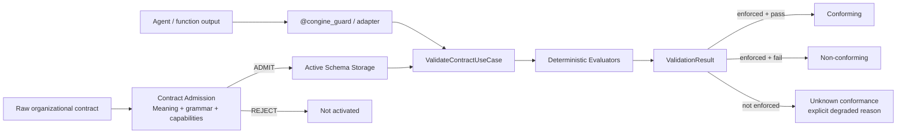
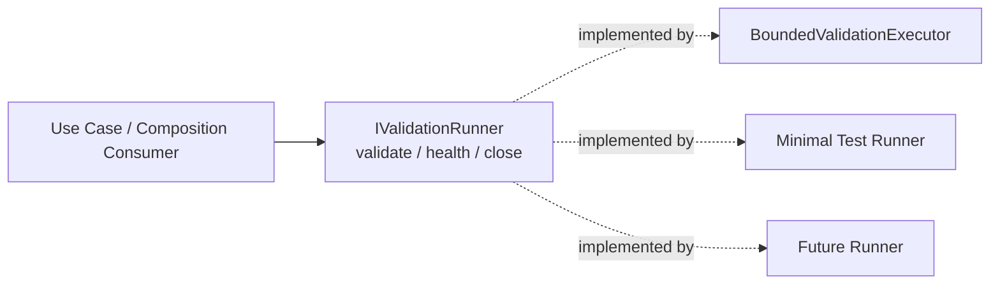
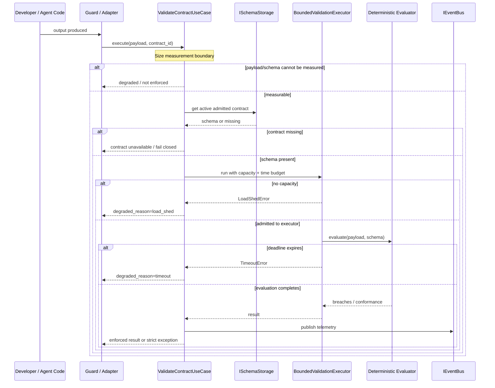
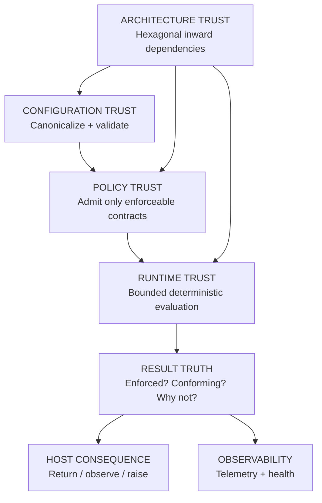

# CONGINE — THE MENTAL MODEL AFTER PHASE 0

## How to Think About CONGINE After the Trust-Critical Foundation Is Closed

### Conceptual foundation for developers, reviewers, and future phase work

> **Read this before the study plan, before P1, and before reading implementation files.**
>
> The purpose of this document is not to list classes. It is to give you the mental scaffolding that makes the classes obvious.
>
> The pre-hardening mental model was useful, but it was too simple in one dangerous way: it treated CONGINE as if the only important question were *"did this output match this schema?"*
>
> After P0, the correct question is broader:
>
> **Was the configuration valid? Was the contract itself admissible under the evaluators that are actually active? Was the payload actually evaluated? If it was evaluated, did it conform? And what enforcement consequence should follow?**
>
> That is the post-P0 mental model.

---

# 1. THE ONE TRUTH ABOUT CONGINE

CONGINE is a **deterministic organizational-policy enforcement boundary**.

Its job is not merely to inspect data. Its job is to make a trustworthy statement about whether a governed output was actually checked against an organizational contract, and to make failure to evaluate impossible to confuse with successful enforcement.

The central product promise is:

> **Outputs conform to our rules, or they are stopped.**

The trust rule underneath that promise is:

> **The agent or application may propose. CONGINE decides.**

And the most important engineering invariant established by P0 is:

> **CONGINE must never appear to have enforced a policy that it did not actually evaluate.**

Everything else follows from that.

A useful one-sentence runtime description is now:

> **CONGINE accepts only contracts whose meaning the active evaluator set can enforce, evaluates governed outputs deterministically under bounded execution, distinguishes conformance from inability to evaluate, applies the configured enforcement posture, and records what happened.**

Notice how much more precise this is than:

> "Take a function return value and check it against JSON."

The post-P0 system has multiple trust boundaries, not one.

---

# 2. THE FOUR QUESTIONS CONGINE MUST ANSWER IN ORDER

When you are reading any CONGINE file, ask which of these questions it helps answer.

## Question 1 — Is the configuration itself trustworthy?

Before CONGINE can govern anything, its own configuration must be canonical and valid.

Examples:

- `"strict"` must mean `FailMode.STRICT`, not an arbitrary string that happens to look right.
- `"multi_tenant"` must activate the multi-tenant guard.
- `"file"` must select the file repository.
- malformed booleans must not silently become `False`.
- a non-local cleartext control-plane URL must satisfy the existing HTTPS / `allow_cleartext` policy.
- a region declaration must not invent an unverified remote hostname.

After P0 closeout, `CongineConfig` owns this boundary:

```text
environment variables ─────┐
direct Python construction ├──> CongineConfig.__post_init__()
future CLI configuration ──┤        │
future API configuration ──┘        ├─ normalize enum-backed values
                                     └─ run the existing validate()
                                              │
                                              ▼
                                   canonical + validated config
```

The composition root should not need to ask:

> "Is this string supposed to be an enum?"

That decision has already happened.

---

## Question 2 — Is the contract itself safe to activate?

A contract is not trusted merely because it is syntactically JSON.

Before P0, a contract could contain:

```json
{
  "type": "str"
}
```

or:

```json
{
  "properties": {
    "user.email": {
      "type": "string",
      "pattern": "^.+@.+$"
    }
  }
}
```

and still create false confidence.

The first contains an unknown type.

The second is ambiguous: does `"user.email"` mean a literal key or a nested path?

P0 introduced a **contract admission boundary**.

A contract must now be admissible before the normal production loader writes it into active schema storage.

Conceptually:

```text
Raw contract
     │
     ▼
Contract Admission
     │
     ├─ grammar structurally valid?
     ├─ type names understood?
     ├─ regex valid?
     ├─ dotted property semantics unambiguous?
     ├─ keywords understood?
     └─ every claimed constraint enforced by the active evaluator set?
     │
     ├───────────────┐
     ▼               ▼
   ADMIT           REJECT
     │               │
     ▼               └─ never activate this incoming contract
active schema
storage/cache
```

This is one of the most important conceptual changes in the entire P0 hardening effort.

---

## Question 3 — Was the payload actually evaluated?

Once a valid contract is active, runtime validation still may fail for reasons unrelated to policy conformance:

- the payload cannot be measured safely;
- the schema cannot be measured safely;
- the validation executor is saturated;
- the deadline expires;
- a resource error occurs;
- an internal error occurs.

P0 made one critical distinction explicit:

```python
result.is_enforced()
```

You must think of this before `is_pass()`.

The trust table is:

| `is_enforced()` | `is_pass()` | Meaning |
|---|---|---|
| `True` | `True` | The policy was evaluated and the payload conformed |
| `True` | `False` | The policy was evaluated and the payload violated it |
| `False` | not sufficient by itself | CONGINE could not complete enforcement; conformance is unknown |

That third row is the important one.

**Not evaluated is not the same as conforming.**

**Not evaluated is not the same as violating.**

It is its own trust condition.

---

## Question 4 — What consequence should follow?

Only after CONGINE knows what happened should it decide what the host experiences.

There are two related but distinct controls in the current SDK:

1. the **use-case fail mode**;
2. the **guard return/raise mode**.

They are not the same thing.

The current fail-mode ladder is:

- `silent`
- `degrade`
- `strict`

`strict` is the hard-enforcement posture: an actual breach raises `CongineValidationError`.

The decorator/guard mode controls the outer return behavior, such as returning an envelope, returning the raw output, or raising.

A key mental rule:

> **Validation semantics and presentation/return-shape semantics are separate.**

Do not interpret `mode="output"` as "validation disabled."

Do not interpret `fail_mode="silent"` as "the guard can never raise."

The two raise sites are independent.

---

# 3. MENTAL MODEL ONE — THE POLICY FIREWALL, NOW WITH A RULESET GATE

The original "output firewall" analogy is still useful, but after P0 it needs one upgrade.

A real firewall does not only inspect packets.

It also needs a valid ruleset.

Loading a malformed or partially understood ruleset into a firewall would be dangerous because the operator might believe traffic is protected when the firewall is silently ignoring part of the policy.

CONGINE now behaves like a firewall with **two gates**.

## Gate A — Ruleset admission

Before a contract becomes active:

```text
Contract
   │
   ▼
Can CONGINE understand and enforce the claimed semantics?
   │
   ├─ NO  → reject contract
   │
   └─ YES → activate contract
```

## Gate B — Runtime output enforcement

Once an admitted contract is active:

```text
Function / agent output
        │
        ▼
Can CONGINE actually evaluate it?
        │
        ├─ NO  → explicit not-enforced/degraded state
        │
        └─ YES
             │
             ├─ conforms     → pass
             └─ violates     → fail
```

Then the enforcement posture decides what the caller sees.



The new mental model is therefore not:

> "A firewall that checks outputs."

It is:

> **A firewall that refuses unsafe rulesets, then distinguishes an actual packet decision from the inability to make one.**

That is a much stronger trust model.

---

# 4. WHY DETERMINISM STILL SITS AT THE CENTER

CONGINE is deliberately not an LLM-based reviewer in the verdict path.

An LLM can help an engineer write a contract in the future.

An LLM can help explain a breach in the future.

An LLM can help an agent propose a correction in the future.

But the final governance decision must remain deterministic.

The product equation is:

```text
probabilistic authoring
        +
deterministic enforcement
```

not:

```text
probabilistic authoring
        +
probabilistic reviewer
        +
"probably compliant"
```

For the same effective configuration, same admitted contract, and same payload, the deterministic judgment must remain stable.

At P0 closure, the determinism evidence was re-run at:

```text
N = 5000
```

with exactly one canonical verdict and the same recorded verdict hash.

The important part is not the number 5000 by itself.

The important part is the invariant it is checking:

> **The governance decision is not allowed to drift because of model randomness, network timing, or evaluator mood.**

---

# 5. MENTAL MODEL TWO — THE HEXAGONAL ARCHITECTURE IS A TRUST BOUNDARY

"Hexagonal architecture" is not decoration.

It is what allows CONGINE to grow without contaminating the deterministic core with framework, storage, transport, or agent-specific knowledge.

The six layers are:

| Layer | Role | Mental description |
|---|---|---|
| **L0 — Kernel** | configuration, core exceptions, security/default primitives | universal facts the rest of the system may depend on |
| **L1 — Ports** | abstract capabilities | promises the core is allowed to rely on |
| **L2 — Domain** | deterministic rules and pure policy-domain logic | what conformance means |
| **L3 — Use Cases** | orchestration | how a complete validation/sync operation is coordinated |
| **L4 — Infrastructure** | concrete mechanisms | caches, HTTP repositories, bounded execution, queues, circuit breakers |
| **L5 — Adapters / Composition** | entry points and construction | decorator, framework adapters, dependency assembly |

The dependency direction is:

```text
L5 ───────────────┐
L4 ────────────┐  │
L3 ─────────┐  │  │
L2 ──────┐  │  │  │
L1 ───┐  │  │  │  │
L0 ◄──┴──┴──┴──┴──┘
```

Dependencies point inward.

An inner layer must not need an outer implementation detail.

---

## What P0 taught us about this rule

During hardening, two potential layering violations were caught manually:

1. `LoadShedError` was initially going to live in infrastructure, which would have forced an inward use case to import an outer implementation concern.
2. `ContractAdmissionMode` was initially going to move from domain into configuration incorrectly, which would have made L0 depend outward on L2.

Both were corrected.

That produced an important post-P0 lesson:

> **The architecture is correct as a design, but its dependency direction is not yet mechanically enforced strongly enough.**

This is why P1 needs both:

```text
blocking mypy
```

and:

```text
a separate import/layer dependency gate
```

Mypy can tell you that a type is wrong.

Mypy cannot know that `L3 -> L4` is architecturally forbidden if the import is otherwise type-correct.

That is a separate structural rule.

---

# 6. MENTAL MODEL THREE — PORTS ARE CONTRACTS BETWEEN LAYERS

A port is a promise.

An adapter is one implementation of that promise.

This is still the correct way to think about CONGINE, but P0 gave us a concrete example of what happens when code forgets that rule.

Before P0, `ServiceContainer.health()` accessed concrete runner attributes:

```python
validation_executor.in_flight
validation_executor.rejected_total
```

But those attributes were not part of the `IValidationRunner` promise.

A minimal object that correctly implemented the port could therefore still crash health reporting.

P0 corrected that.

The composition root now asks the runner through the declared capability:

```python
validation_executor.health()
```

and maps the returned data into the public health shape.

This is a perfect ports-and-adapters lesson:

> **If the core or composition logic needs a capability, that capability must be expressed by the port. Do not reach behind the port because the current adapter happens to expose something convenient.**

Conceptually:



The abstraction is only real if all valid implementations can be substituted without hidden knowledge.

---

# 7. MENTAL MODEL FOUR — CONFIGURATION IS PART OF THE SECURITY MODEL

Before P0 closeout, configuration looked like setup plumbing.

After P0, you should think about it as **policy input**.

Why?

Because these two values:

```python
CongineConfig(fail_mode=FailMode.STRICT)
```

and:

```python
CongineConfig(fail_mode="strict")
```

used to behave differently.

The second could bypass the identity branch and silently lose hard enforcement.

Likewise, a raw `"multi_tenant"` string could bypass the multi-tenant guard.

That means configuration typing was not just an ergonomics problem.

It was an enforcement problem.

---

## The post-P0 rule

Every `CongineConfig` instance now owns its own canonicalization and validation.

The path is:

```text
construct CongineConfig
        │
        ▼
__post_init__
        │
        ├─ normalize five enum-backed fields
        │
        └─ validate all existing configuration invariants
        │
        ▼
valid canonical config or exception
```

The five enum-backed fields normalized at the boundary are:

- `contract_source`
- `contract_admission`
- `fail_mode`
- `deployment_mode`
- `region`

Valid strings are normalized consistently.

Invalid strings fail loudly.

Direct construction and environment construction now share the same instance-validation boundary.

No caller should need to remember:

```python
config.validate()
```

after constructing a configuration object.

---

## Why `from_env()` still exists

`from_env()` is still useful because it understands environment-variable concerns:

- variable names;
- parsing;
- environment-specific error messages.

But it is no longer the owner of whether the resulting configuration is valid.

Think of it this way:

```text
from_env()
    = input adapter

CongineConfig.__post_init__()
    = canonical trust boundary
```

That distinction will matter later when CLI/API configuration adapters are introduced.

---

# 8. MENTAL MODEL FIVE — CONTRACT ADMISSION IS A COMPILER-LIKE BOUNDARY

The new `domain/contract_admission.py` should be understood as the seed of a future compiler boundary.

Do not confuse it with runtime validation.

Runtime validation asks:

> "Does this payload satisfy this active contract?"

Contract admission asks:

> "Is this contract meaningful and enforceable enough to become active at all?"

Those are different questions.

---

## What admission currently checks

Admission validates CONGINE's admitted contract grammar rather than pretending to implement all JSON Schema.

It rejects or evaluates issues such as:

- root structure is malformed;
- `properties` is not a mapping;
- `required` is not a list of strings;
- `null_forbidden` has invalid structure;
- a property rule is not a mapping;
- `type` is invalid;
- a union contains an unknown type;
- a type union is empty;
- a regex pattern is invalid;
- a dotted property key is ambiguous;
- a keyword is recognized but not enforced by the active evaluator set.

The central rule is:

> **A contract must not be activated when CONGINE cannot determine what it means or cannot enforce what it claims.**

---

## Native vocabulary versus semantic vocabulary

The native deterministic engine currently understands a deliberately small contract vocabulary.

Top-level structure includes concepts such as:

```text
properties
required
null_forbidden
```

Property-level native rules include:

```text
type
enum
min / minimum
max / maximum
pattern
```

Semantic validation can add support for JSON-Schema-style constraints such as:

```text
minLength
maxLength
```

but those constraints are admissible only when the active evaluator set can actually enforce them.

That means the same contract can be:

```text
REJECTED in native-only mode
```

and:

```text
ADMITTED when semantic validation is active
```

This is intentional.

The P0 migration preflight proved that behavior with the shipped examples.

---

# 9. `STRICT` AND `WARN` ADMISSION MODES DO NOT MEAN "SAFE" AND "UNSAFE"

Do not think of `ContractAdmissionMode.WARN` as a bypass mode.

After hardening, `warn` is intentionally conservative.

It does **not** mean:

> "Load dangerous contracts but print a warning."

Invalid, ambiguous, or actually unenforced semantics are still rejected.

The mental rule is:

```text
warn may soften advisory compatibility messaging
warn may NOT turn unknown enforcement semantics into active policy
```

Why?

Because otherwise this can happen:

```text
contract says minLength=10
        │
        ▼
native evaluator ignores minLength
        │
        ▼
contract loads anyway because "warn"
        │
        ▼
payload of length 2 returns PASS
```

That is the exact false-safety condition P0 was designed to eliminate.

Partial enforcement is not approximated.

It is deferred until CONGINE has a real model for carrying enforcement-coverage metadata into results.

---

# 10. THE CONTROL/SYNC PATH — WHAT HAPPENS BEFORE REQUESTS

The old mental model started too late.

The request hot path is only half the system.

Before a governed output can be validated, CONGINE must establish trustworthy runtime state.

A useful setup narrative is:

## Step 0 — Canonical configuration

The host constructs `CongineConfig`.

It normalizes and validates itself.

If configuration is malformed, CONGINE fails before assembling a misleading runtime.

Examples of fail-loud behavior include:

- malformed boolean text;
- unknown `contract_source`;
- empty configured contract directory;
- region without an explicit base URL;
- non-local cleartext URL that violates the existing HTTPS policy;
- missing required credentials for a non-local control plane.

---

## Step 1 — Composition

`ServiceContainer` is the composition root.

It chooses and constructs concrete implementations for ports.

This is where configuration becomes an assembled runtime.

The composition root is allowed to know concrete classes.

The use cases and domain should not.

---

## Step 2 — Contract synchronization

`SyncContractsUseCase` obtains contracts through the configured repository path.

Before P0, loading and caching were too close conceptually.

After P0, remember the order:

```text
retrieve
   ↓
inspect/admit
   ↓
only then cache
```

not:

```text
retrieve
   ↓
cache
   ↓
hope the rules are meaningful
```

---

## Step 3 — Contract admission

The incoming contract passes through `admit_contract(...)`.

Admission is pure domain logic.

It is passed a capability view of what the currently active evaluator set can enforce.

The public abstraction is not:

```text
semantic_validation_enabled = True/False
```

because one boolean is not a future-proof description of evaluator capabilities.

The conceptual abstraction is:

```text
enforced_keywords / enforceable capabilities
```

This matters because future evaluator sets may contain different deterministic evaluators.

---

## Step 4 — Activate or refuse

If admitted:

```text
schema_storage.put(...)
```

activates the contract in the current production loading path.

If refused:

- the incoming contract is not written;
- stable issue codes identify why;
- the failure is logged;
- admission health/status reflects the refusal.

On a cold cache, the guarded contract is unavailable and the request fails closed rather than returning a false pass.

---

# 11. LAST-KNOWN-GOOD IS AVAILABILITY, NOT POLICY VERSION PROOF

P0 added an important behavior around rejected contract updates.

Suppose:

```text
v6 is valid and active
v7 arrives but is invalid
```

P0 ensures:

```text
v7 is rejected
v7 does not overwrite v6
rejection is observable
v7 is never reported as successfully activated
```

This is correct.

But do not mentally upgrade this into a guarantee that does not yet exist.

The schema cache is currently **version-blind**.

Today CONGINE cannot fully prove:

```text
caller requested v7
        ↓
exactly v7 was the contract evaluated
```

because the storage identity does not include contract version.

So remember the distinction:

> **P0 protects last-known-good from invalid replacement. It does not yet provide version-aware enforcement identity.**

That is a later port/cache evolution.

---

# 12. THE RUNTIME HOT PATH IN PLAIN LANGUAGE

Once configuration is valid and an admitted contract is active, the runtime path begins.

A decorated function or adapter presents a payload to `ValidateContractUseCase`.

Think about the runtime in six conceptual steps.

---

## Runtime Step 1 — Measure the input safely

Before expensive work, CONGINE applies size guards.

There are two different outcomes you must not confuse.

### Measurable and too large

If CONGINE successfully measures the payload and it exceeds the configured bound:

```text
evaluation happened
→ INPUT_BOUNDS breach
→ is_enforced() == True
```

That is a real policy/input-bound violation.

### Cannot be measured safely

If serialization/measurement itself fails:

```text
evaluation cannot safely proceed
→ INVALID_PAYLOAD or INVALID_CONTRACT
→ degraded
→ is_enforced() == False
→ zero fabricated breaches
```

The mental rule is:

> **"Could not measure" is not the same statement as "measured and exceeded."**

P0 deliberately made this fail closed.

The broad exception is narrowly scoped around the single measurement statement, so unrelated orchestration errors are not intentionally converted into input errors.

---

## Runtime Step 2 — Resolve the active contract

The use case looks up the active schema through `ISchemaStorage`.

If the production loader rejected the contract, it will not be present as an active new contract.

A missing contract therefore does not become an empty policy.

It follows the contract-unavailable/fail-closed path.

---

## Runtime Step 3 — Acquire bounded validation capacity

Validation work is scheduled through `BoundedValidationExecutor`.

It has bounded capacity.

If no capacity is available, CONGINE rejects the work immediately rather than building an unbounded queue.

This is **load shedding**.

P0 made it observably different from a deadline timeout.

```text
capacity unavailable
→ LoadShedError
→ degraded_reason = "load_shed"
```

while:

```text
work admitted but deadline exceeded
→ TimeoutError
→ degraded_reason = "timeout"
```

`LoadShedError` subclasses `TimeoutError`, preserving compatibility for callers already catching the broader exception type.

---

## Runtime Step 4 — Run deterministic validation

When capacity exists, validation executes the active evaluator path.

The native `RuleEngine` remains pure deterministic domain logic.

It performs no network access and no storage I/O.

Its native rule families cover:

- field presence / required fields;
- type;
- enum membership;
- range constraints;
- regex pattern;
- null-forbidden behavior.

If semantic validation is enabled, the semantic validator can enforce additional admitted constraints.

The key post-P0 rule is:

> **The loader should not activate a contract that claims constraints no active evaluator can enforce.**

---

## Runtime Step 5 — Produce a truthful result

The result does not merely say pass/fail.

You must read it in this order:

```python
if not result.is_enforced():
    # conformance is unknown; inspect degraded_reason
elif result.is_pass():
    # evaluated and conforming
else:
    # evaluated and non-conforming
```

Do not reverse that order.

`is_pass()` alone is intentionally not enough to answer:

> "Was this policy actually enforced?"

---

## Runtime Step 6 — Emit telemetry, then apply host consequence

The use case emits its telemetry event before hard-enforcement exception behavior.

That means a strict violation remains observable even when the request is blocked.

Then fail-mode enforcement applies.

The guard can also independently control return shape or raise behavior.

---

# 13. THE RUNTIME SEQUENCE AFTER P0



This sequence diagram is intentionally conceptual.

Do not infer that every failure occurs at exactly one physical line.

The important part is the trust ordering.

---

# 14. THE RESULT MODEL — THREE THINGS THAT MUST NEVER BE CONFLATED

Long term, CONGINE may eventually expose three explicit axes:

```text
Evaluation State
Conformance
Enforcement Action
```

P0 does not perform that major API redesign yet.

But you should already think in those three dimensions.

---

## Dimension A — Evaluation

Was the policy actually evaluated?

Current bridge:

```python
ValidationResult.is_enforced()
```

---

## Dimension B — Conformance

If it was evaluated, did the payload satisfy the contract?

Current bridge:

```python
ValidationResult.is_pass()
```

plus breach details.

---

## Dimension C — Action

What should happen to the host?

Examples:

```text
allow return
return envelope
return raw output
raise
warn / observe
```

This is controlled by fail mode and guard mode.

The post-P0 mental discipline is:

> **Never derive all three dimensions from one `status` string.**

That would recreate the ambiguity P0 was designed to remove.

---

# 15. DEGRADED REASONS ARE MACHINE-FACING SEMANTICS

A degraded reason is not just a log message.

It is part of the machine-readable explanation for why enforcement did not complete.

At P0 closure, the typed vocabulary includes concrete paths such as:

| Wire value | Meaning |
|---|---|
| `"timeout"` | admitted work exceeded the validation deadline |
| `"load_shed"` | work was refused because bounded validation capacity was saturated |
| `"resource_error"` | validation encountered resource exhaustion such as `MemoryError` / `RecursionError` |
| `"internal_error"` | internal evaluation failure |
| `"invalid_payload"` | payload could not be safely measured/evaluated at the input boundary |
| `"invalid_contract"` | contract/schema could not be safely measured/evaluated at the input boundary |

The rule established during P0 is:

> **Name the concrete emitting path, or do not add the enum member.**

This prevents speculative wire values from becoming accidental API commitments.

---

# 16. MACHINE-FACING ENUM VALUES ARE PROTOCOL, NOT PRESENTATION

P0 caught a subtle bug:

```text
ContractAdmissionMode.STRICT
```

was leaking into health output where the intended wire value was:

```text
strict
```

The important lesson is broader than Python enums.

Any value consumed by:

- health endpoints;
- telemetry;
- logs intended for machines;
- future MCP responses;
- future durable evidence records;
- future control-plane APIs;

must be treated as a protocol value.

Human-facing prose can change.

Machine-facing codes should be stable.

This is why new machine-facing enums use string-safe serialization behavior and why serialization is tested through the real boundaries, not only by comparing Python objects.

---

# 17. CONTRACT ADMISSION CODES ARE FOR MACHINES; MESSAGES ARE FOR HUMANS

`ContractAdmissionIssue` separates:

```text
code
path
message
level
```

This matters.

Future automation should inspect something like:

```text
unknown_type
invalid_pattern
ambiguous_property_path
unsupported_keyword
invalid_structure
```

not scrape English prose.

The mental rule is:

> **Machines branch on stable codes. Humans read messages.**

That same principle should guide future breach codes, evidence events, CLI exit behavior, and MCP responses.

---

# 18. THE CURRENT "NO SILENT NON-ENFORCEMENT" CHAIN

P0 created a much stronger end-to-end trust chain.

Think about it as five locks.

```text
Lock 1 — Configuration
invalid configuration cannot silently choose weaker behavior

Lock 2 — Admission
unknown / ambiguous / unenforced contract semantics cannot silently activate

Lock 3 — Runtime truth
failure to evaluate cannot silently look like conformance

Lock 4 — Capacity reason
load shed cannot silently look identical to timeout

Lock 5 — Machine output
enum/code serialization cannot silently change meaning at a boundary
```

No one lock is sufficient by itself.

The product promise depends on the chain.

---

# 19. WHAT "FAIL CLOSED" MEANS IN CONGINE

"Fail closed" is often used too casually.

In CONGINE it does **not** mean:

> "Every internal problem should generate a fake breach."

That would be dishonest.

Instead:

### If the policy was evaluated and violated

```text
enforced = True
pass = False
breach details exist
```

### If the policy could not be evaluated

```text
enforced = False
degraded reason explains why
no fabricated policy breach
```

### If an incoming contract cannot safely become policy

```text
reject before activation
```

This is the post-P0 definition of fail closed:

> **Do not allow uncertainty to masquerade as permission. But also do not invent a policy judgment that never occurred.**

That distinction is fundamental.

---

# 20. CURRENT SAFETY PROPERTIES — WHAT IS STRONG, AND WHAT MUST BE SCOPED

The old mental model called several things "guarantees" too broadly.

After P0, use more precise language.

---

## Property 1 — Deterministic judgment

The deterministic evaluator produces stable judgments for the same effective inputs.

P0 closure re-ran N=5000 with one verdict.

This is one of the strongest verified properties.

---

## Property 2 — Bounded validation execution

`BoundedValidationExecutor` limits concurrency and applies a validation deadline.

Default validation timeout is now sourced consistently from one constant at 100ms.

Do **not** interpret this as:

> "Every line of `ValidateContractUseCase.execute()` is guaranteed to complete in exactly 100ms."

Pre-validation measurement, orchestration, semantic-validator behavior, and post-processing are separate concerns.

The correct claim is:

> **The bounded executor applies a finite validation budget and bounded capacity.**

P1.5 still needs better semantic-cost budgeting.

---

## Property 3 — Honest capacity accounting

A timed-out worker may keep running because Python cannot safely kill that thread.

The executor therefore keeps the permit until the worker actually finishes.

This prevents the system from claiming capacity it does not really have.

That is honest accounting.

---

## Property 4 — Explicit load shedding

When all permits are occupied, work is refused instead of queued indefinitely.

This protects the host from unbounded validation backlog.

The closeout evidence classified 2000/2000 saturated calls as `LoadShedError`.

The measured microsecond latency is evidence, not a permanent SLA.

---

## Property 5 — Contract admission before production activation

The normal production sync path refuses ambiguous, invalid, or actually unenforced contracts before writing them into active storage.

This is now a major trust property.

But read the residual caveat later in this document: direct `schema_storage.put()` is not universally wrapped by admission yet.

---

## Property 6 — Configuration parity

Direct construction and environment construction now reach the same `CongineConfig` normalization + validation boundary.

This closes previously silent differences in:

- strict enforcement;
- multi-tenant mode;
- contract source;
- admission mode;
- region handling;
- HTTPS/credential validation.

---

## Property 7 — Contract regex safety is scoped to contract evaluation

Contract regex/pattern handling uses RE2-compatible validation/evaluation paths to avoid catastrophic backtracking in governed pattern rules.

However, do not generalize this into:

> "CONGINE uses RE2 for every regex everywhere."

The telemetry PII sanitizer still contains a backreference pattern that RE2 cannot compile.

That sanitizer requires a separate P1 redesign.

---

## Property 8 — Snapshot and resilience mechanisms exist, but lifecycle hardening is not finished

The system has snapshot, circuit-breaker, file-lock, and local/offline resilience mechanisms.

Those are real architectural capabilities.

But P1 still contains lifecycle work such as:

- transactional composition-root construction;
- `atexit` cleanup;
- telemetry shutdown ordering.

Therefore do not describe the entire lifecycle as fully enterprise-hardened yet.

---

# 21. PII-SAFE TELEMETRY — CORRECT MENTAL MODEL

The old mental model said:

> "the system never transmits data it has not explicitly sanitized."

That is too absolute for the current state.

A more accurate post-P0 statement is:

> **CONGINE contains telemetry sanitization/redaction mechanisms, but the PII sanitizer itself still needs a P1 regex redesign before it should be treated as a fully hardened enterprise guarantee.**

The specific reason matters:

- the sanitizer currently uses a regex with a backreference;
- RE2 does not support that backreference;
- therefore "just switch it to RE2" is not a valid implementation plan;
- the pattern must be redesigned and equivalence-tested.

This is exactly why mental models must distinguish:

```text
capability exists
```

from:

```text
capability is fully hardened
```

---

# 22. MULTI-TENANT MODE — CONFIGURATION NOW CANNOT SILENTLY BYPASS IT

One of the P0 closeout discoveries was that:

```python
CongineConfig(deployment_mode="multi_tenant")
```

could previously remain a raw string.

Because downstream logic used enum identity, the multi-tenant guard could be bypassed.

After closeout, the configuration boundary normalizes it to the canonical enum or rejects it.

The lesson is:

> **Tenant isolation controls are only as strong as the configuration path that activates them.**

Future multi-tenant hardening should build on canonical configuration, not duplicate parsing at every adapter.

Do not use this one fix as proof that every multi-tenant isolation concern is complete.

---

# 23. THE CURRENT CONTRACT LANGUAGE — THINK "CONGINE CONTRACT", NOT "FULL JSON SCHEMA"

A CONGINE contract may look JSON-Schema-like, but the native engine does not implement the entire JSON Schema specification.

This distinction matters.

The native engine has a deliberately bounded vocabulary.

The optional semantic validator can enforce additional JSON Schema semantics.

Contract admission then asks whether the current active evaluator set covers the semantics the contract claims.

Therefore the correct mental model is:

```text
CONGINE Contract
    │
    ├─ native enforceable subset
    ├─ optional semantic-enforceable subset
    └─ CONGINE-specific compatibility semantics such as null_forbidden
```

Do not assume:

```text
valid JSON Schema == automatically valid active CONGINE contract
```

and do not assume:

```text
JSON-looking document == enforced policy
```

Admission exists precisely because those statements are unsafe.

---

# 24. `null_forbidden` IS A LEGACY CONGINE EXTENSION

`null_forbidden` remains intentionally supported.

It is not standard JSON Schema.

Think of it as:

```text
legacy CONGINE-specific contract syntax
```

not:

```text
portable JSON Schema semantics
```

The more portable way to represent nullable type semantics is through a type union such as:

```json
{
  "type": ["string", "null"]
}
```

P0 did not remove `null_forbidden` because backward compatibility matters.

The mental model should therefore distinguish:

- supported;
- portable;
- preferred for new authoring.

Those are not identical.

---

# 25. DOTTED PROPERTY NAMES ARE REJECTED BECAUSE AMBIGUITY IS WORSE THAN INCONVENIENCE

Before P0, dotted property behavior was inconsistent across rules.

A dotted path could appear to work for one presence check while type/pattern checks behaved as flat lookups.

That created false safety.

P0 chose the conservative rule:

> **Dotted property keys are rejected as ambiguous at admission.**

Why not just implement nested traversal immediately?

Because JSON can legitimately contain a literal key named:

```text
"user.email"
```

and a nested structure:

```json
{
  "user": {
    "email": "..."
  }
}
```

Those are different data models.

A plain dotted string cannot safely represent both.

The future solution should use explicit path semantics, such as a dedicated path rule or JSON Pointer, rather than silently assigning meaning to punctuation.

---

# 26. LAST-KNOWN-GOOD AND REJECTED UPDATES ARE DIFFERENT FROM CONTROL-PLANE OUTAGES

This distinction matters operationally.

### Control-plane unavailable

The system may need to continue using last-known-good state for availability.

### New contract arrives but admission rejects it

The system must not claim the new policy became active.

P0 preserves the old valid cache entry and exposes the refusal.

That means operators can conceptually distinguish:

```text
"still on old policy because dependency unavailable"
```

from:

```text
"still on old policy because the new policy was invalid"
```

This distinction will become even more important once durable history and a real control plane exist.

---

# 27. THE COMPOSITION ROOT IS THE MAP OF THE RUNNING SYSTEM

If you want to understand what CONGINE actually does in one deployment, read the composition root.

Current location:

```text
adapters/dependency_injection.py
```

Why it matters:

- it selects concrete repository implementations;
- it wires the cache;
- it wires the validation runner;
- it wires semantic validation;
- it wires telemetry;
- it constructs use cases;
- it exposes health.

The composition root is where configuration becomes topology.

But after P0, remember:

> **The composition root should assemble canonical components. It should not reinterpret malformed configuration or reach through abstractions to concrete implementation details.**

Those responsibilities belong elsewhere.

---

# 28. HEALTH IS A DECLARED CAPABILITY, NOT A DEBUGGING SIDE CHANNEL

P0 also changed how to think about health.

Health reporting is not allowed to scrape private implementation state simply because it is convenient.

If the system wants to expose:

```text
validation_in_flight
validation_rejected_total
contracts_rejected_total
last_admission_failure
```

those values should come from declared read-only capabilities.

The principle is:

> **Observability must respect architecture too.**

Otherwise health code becomes a hidden backdoor through the port boundaries.

---

# 29. CONTRACT ADMISSION HEALTH IS NOT THE SAME AS VALIDATION HEALTH

This is a useful operational distinction.

### Validation health

Questions like:

- Is the executor saturated?
- How much validation work is in flight?
- Are validations timing out?

### Admission/synchronization health

Questions like:

- Did an incoming contract get rejected?
- What issue codes caused refusal?
- Is last-known-good still active because the update was rejected?

These are different failure domains.

Future control-plane UI should not collapse them into one generic red/green "healthy" light.

---

# 30. THE CURRENT RESIDUAL ADMISSION BYPASS — DO NOT FORGET IT

P0 admission protects the normal production writer.

But `ISchemaStorage.put()` still accepts raw schema dictionaries.

Therefore a test or external embedder can still do:

```python
schema_storage.put(...)
```

and bypass admission directly.

P0 mitigates this in two ways:

1. an AST guard prevents new production writers from appearing without the designated admission path;
2. `admit_contract` is public so embedders can invoke the same safety check.

But this is **not** a universal enforcement boundary yet.

The future stronger shape is conceptually:

```text
RawContract
    ↓
ContractCompiler / Admission
    ↓
AdmittedContract
    ↓
Storage
```

rather than:

```text
dict
 ↓
Storage
```

Do not implement that mentally as if it already exists.

---

# 31. PARTIAL ENFORCEMENT IS DELIBERATELY NOT REPRESENTED YET

Suppose a future contract contains ten constraints and only eight are actively enforceable.

P0 does not pretend that this is fine.

It also does not yet carry detailed coverage metadata such as:

```text
8/10 constraints enforced
```

into every `ValidationResult`.

That would require a richer result/admission model.

Therefore P0 takes the conservative route:

> **Do not activate a contract that claims semantics the active evaluator set will not execute.**

`WARN` remains near-no-op by design.

This is safer than inventing partial-enforcement semantics without an explicit data model.

---

# 32. THE BOUNDED EXECUTOR — THINK CAPACITY + DEADLINE, NOT "MAGIC TIMEOUT"

The bounded executor protects the host in two different dimensions.

## Dimension 1 — Capacity

How many validations may execute concurrently?

Controlled by permits/semaphore.

No permit:

```text
load shed immediately
```

## Dimension 2 — Time

How long may the caller wait for admitted validation work?

Controlled by the timeout budget.

Deadline expires:

```text
caller stops waiting
worker may continue
permit remains held until real completion
```

This is why permit release happens in the future's done-callback rather than at timeout.

If the permit were released when the caller timed out, CONGINE would lie about actual resource usage.

---

# 33. TELEMETRY IS OBSERVABILITY, NOT YET THE DURABLE EVIDENCE STORE

Current telemetry is useful for runtime observability.

But do not confuse it with the future durable organizational evidence plane.

The current `QueueEventBus` is an asynchronous telemetry mechanism.

Phase C later introduces the durable history/evidence spine.

The mental distinction is:

```text
current telemetry
    = best-effort runtime observability

future evidence store
    = durable, queryable governance record
```

Those are different reliability contracts.

P0 does not make the current queue a compliance ledger.

---

# 34. MACHINE RESPONSE SEMANTICS MUST STAY IDENTICAL ACROSS FUTURE ENTRY POINTS

Today the primary paths are the Python SDK, decorator, and existing framework adapter.

Future phases will add:

- CLI;
- MCP;
- CI enforcement;
- more framework/agent adapters.

The mental rule for all of them is:

> **Entry points may differ. Policy meaning may not.**

All future surfaces must ultimately consume the same deterministic evaluator and contract semantics.

MCP is not allowed to invent a different definition of violation.

CLI is not allowed to interpret degraded state differently.

CI is not allowed to use a different contract language.

The adapters change.

The judgment does not.

---

# 35. WHAT P0 CLOSED

P0 did not make CONGINE a complete enterprise product.

It closed the **trust-critical deterministic foundation**.

The strongest conceptual achievements are:

### 1. Configuration cannot silently weaken enforcement

Canonical normalization and validation now live on `CongineConfig` itself.

### 2. Unsafe contracts are refused before production activation

Unknown types, ambiguous dotted paths, malformed structures, invalid patterns, and unenforced semantics are not silently cached.

### 3. Inability to evaluate is visible

`is_enforced()` makes runtime truth explicit.

### 4. Load shedding and deadline timeout are different

The operator and caller can tell capacity rejection from slow work.

### 5. Size guards fail closed honestly

Unmeasurable does not fabricate a breach and does not bypass the control.

### 6. Port health no longer depends on hidden concrete attributes

The abstraction became real.

### 7. Placeholder region routing was removed

Region is metadata; explicit base URL controls the actual endpoint.

### 8. Machine-facing codes were hardened

Serialization uses stable wire values rather than enum representation accidents.

---

# 36. P0 CLOSURE EVIDENCE — WHAT WAS ACTUALLY RE-RUN

At final P0 closure, the reported evidence included:

```text
478 passed
1 skipped
Ruff format/check clean
```

Determinism:

```text
N = 5000
1 canonical verdict
verdict hash unchanged
```

Admission migration preflight:

```text
3 / 3 shipped contracts
100% admitted under their documented configuration
```

Load shedding:

```text
2000 / 2000 saturation attempts
classified as LoadShedError
deadline remained plain TimeoutError
```

False-safety examples:

```text
dotted property semantics        → refused
unknown type                     → refused
unenforced semantic keyword
without capable evaluator        → refused
```

Configuration invariant parity:

```text
6 / 6 existing validation invariants
PASS on direct construction and from_env paths
```

Treat this as a **baseline snapshot**, not an eternal claim.

Future changes must preserve or deliberately revise these facts with new evidence.

---

# 37. WHAT P0 DID NOT CLOSE

A strong mental model includes the boundary of what is *not* solved.

The following remain explicitly deferred.

---

## Deferred 1 — Universal admission behind storage

Direct raw `schema_storage.put()` can bypass admission outside the designated production path.

Future structural fix:

```text
admitted/compiled contract type
or admission behind storage boundary
```

---

## Deferred 2 — Version-aware enforcement

The cache is version-blind.

Future requirement:

```text
(contract_id, version)
```

must participate in storage identity and lookup if CONGINE wants to guarantee exact-version enforcement.

---

## Deferred 3 — Partial-enforcement metadata

CONGINE does not yet represent per-contract enforcement coverage in every result.

Future richer model may need explicit:

```text
evaluation state
conformance
coverage
action
```

---

## Deferred 4 — Mechanical type and architecture gates

P1 needs:

```text
blocking mypy
```

for type/Protocol correctness and:

```text
separate import/layer enforcement
```

for hexagonal dependency direction.

They solve different problems.

---

## Deferred 5 — Composition/lifecycle hardening

Still ahead:

- transactional composition-root construction;
- cleanup on constructor failure;
- `atexit.unregister`;
- telemetry shutdown ordering.

---

## Deferred 6 — PII sanitizer redesign

The telemetry sanitizer's backreference pattern is not directly RE2-compatible.

It needs semantic redesign plus equivalence testing.

---

## Deferred 7 — Semantic validation cost architecture

Semantic validation is much more expensive than the native engine.

Future work needs:

- separate native/semantic budgets;
- complexity admission;
- honest cost warnings;
- possible compiled-validator caching only after thread-safety proof.

---

# 38. WHAT P1 SHOULD CHANGE ABOUT THE WAY DEVELOPMENT HAPPENS

The next phase is not only "more fixes."

P1 should make certain mistakes mechanically harder to introduce.

The post-P0 sequence should be thought of as:

```text
P0
trust-critical runtime semantics
        CLOSED
          │
          ▼
P1
mechanical structural enforcement
          │
          ├─ blocking mypy
          ├─ import/layer dependency gate
          ├─ runtime Protocol/composition checks
          ├─ lifecycle hardening
          └─ cleanup of known structural debt
          │
          ▼
Phase A/B/C+
safe product expansion
```

This matters because P0 found bugs through careful review that the repository should eventually catch automatically.

---

# 39. THE MOST IMPORTANT DEVELOPMENT INVARIANTS AFTER P0

When adding future functionality, preserve these rules.

## Invariant 1 — Deterministic judgment

No probabilistic model enters the final verdict path.

## Invariant 2 — No silent non-enforcement

If a claimed policy cannot be evaluated, CONGINE must say so.

## Invariant 3 — Admission before activation

Raw policy text is not automatically active policy.

## Invariant 4 — Configuration is canonical before composition

Adapters should not pass ambiguous config into runtime wiring.

## Invariant 5 — Failure to evaluate is not a breach

Do not fabricate organizational violations to represent infrastructure failure.

## Invariant 6 — Same semantics across entry points

SDK, MCP, CLI, CI, and future agent adapters must converge on the same core meaning.

## Invariant 7 — Dependencies point inward

Future features attach around the core rather than infecting it.

## Invariant 8 — Evidence over claims

If a property is not measured or tested, describe it as a design intent or partial capability, not a guarantee.

---

# 40. HOW THE FUTURE PRODUCT FITS WITHOUT REWRITING THE CORE

The long-term architecture should grow around the deterministic foundation.

Conceptually:

```text
Human / Organization
        │
        ▼
Contract Authoring
JSON / UI / future DSL
        │
        ▼
Contract Compiler / Admission
        │
        ▼
Versioned admitted policy representation
        │
        ▼
Deterministic Evaluator
        │
        ▼
Evaluation truth + conformance
        │
        ▼
Enforcement action
        │
        ├─ SDK
        ├─ MCP
        ├─ CLI
        ├─ CI
        └─ API / agent adapters
        │
        ▼
Evidence / History
        │
        ▼
Control Plane / intelligence
```

P0 currently implements only part of this future picture.

That is fine.

The architecture is valuable precisely because later pieces should not require rewriting the deterministic evaluator.

---

# 41. THE POLICY IR MENTAL MODEL — FUTURE BRIDGE, NOT CURRENT FEATURE

A future Business Policy DSL should not create a second evaluator.

The intended future shape is:

```text
JSON Contract ─────┐
UI Authoring ──────┤
Business DSL ──────┤
API Policy ────────┘
        │
        ▼
canonical Policy / Contract IR
        │
        ▼
deterministic evaluator
```

P0's admission boundary is the seed of that compiler-like shape.

But do not call the current admission result a full Policy IR.

That would overstate what exists.

---

# 42. CORRECTION HINTS AND AGENT INTEGRATION MUST REMAIN OUTSIDE THE VERDICT

When MCP and agent-loop integration arrive, the visible workflow may become:

```text
agent proposes change
        ↓
CONGINE validates
        ↓
BLOCK
        ↓
machine-readable breach + deterministic correction hint
        ↓
agent repairs
        ↓
revalidate
        ↓
PASS
```

The correction mechanism can become richer.

The verdict must remain boring.

That is a feature, not a limitation.

---

# 43. THE THREE PLANES YOU SHOULD KEEP SEPARATE

A helpful post-P0 abstraction is to separate:

## Policy meaning

What constraints exist?

```text
contract grammar
admission
native/semantic capabilities
```

## Runtime judgment

What happened for this payload?

```text
is_enforced
is_pass
breaches
degraded_reason
```

## Host consequence

What did the application do because of the judgment?

```text
return
envelope
raise
warn
block
```

Many governance bugs come from collapsing these planes.

P0 mostly hardened the first two.

Future product surfaces will expand the third.

---

# 44. THE THREE MOST DANGEROUS FALSE ASSUMPTIONS AFTER P0

## False assumption 1

> "If `is_pass()` is false, the policy was violated."

Not necessarily.

Read `is_enforced()` first.

---

## False assumption 2

> "If a JSON contract exists in memory, CONGINE must have admitted it."

Not universally.

The normal production writer is guarded, but direct raw storage writes remain a documented bypass.

---

## False assumption 3

> "If `contract_version` appears in telemetry, that version must have been the one enforced."

Not yet.

The cache is version-blind.

Do not build enterprise evidence claims on a field that storage does not yet enforce.

---

# 45. THE THREE MOST IMPORTANT FILES TO READ FIRST AFTER P0

If you are studying the closed P0 codebase, begin with these conceptual anchors.

## 1. `config.py`

Why first now?

Because configuration is no longer plumbing.

It is the first trust boundary.

Understand:

- enum normalization;
- `__post_init__`;
- `validate()`;
- strict boolean parsing;
- region/base-url rules;
- timeout default;
- admission mode.

---

## 2. `domain/contract_admission.py`

This is the largest conceptual addition from P0.

Understand:

- admitted grammar;
- stable issue codes;
- evaluator capability set;
- strict/warn behavior;
- unknown type handling;
- dotted-key rejection;
- unsupported keyword handling.

---

## 3. `usecases/validate_contract_usecase.py`

Then study the runtime truth path:

- size guard;
- schema lookup;
- bounded execution;
- `is_enforced`;
- degraded reasons;
- telemetry;
- fail mode.

Only after those three should you dive into infrastructure details.

---

# 46. THEN READ THE SUPPORTING FILES IN THIS ORDER

A useful post-P0 study order is:

```text
1. config.py
2. domain/contract_admission.py
3. usecases/validate_contract_usecase.py
4. usecases/sync_contracts_usecase.py
5. domain/validator.py
6. domain/models.py
7. ports/
8. infrastructure/bounded_executor.py
9. infrastructure schema/cache/repository implementations
10. adapters/dependency_injection.py
11. guard/decorator + framework adapters
12. telemetry/event bus + snapshot/circuit-breaker lifecycle code
13. P0 regression tests
```

The tests are especially important after P0 because several semantics are clearer in tests than in prose.

---

# 47. WHAT THE P0 TEST SUITE IS REALLY TEACHING YOU

The new tests are not merely regression guards.

They encode the product philosophy.

When you read them, look for these statements:

```text
evaluation failure never fabricates a breach
```

```text
unknown contract semantics never silently activate
```

```text
load shedding is not timeout
```

```text
direct configuration and environment configuration mean the same thing
```

```text
machine-facing enum values serialize as stable wire strings
```

```text
the production contract writer cannot bypass admission
```

```text
last-known-good survives a rejected incoming update
```

Tests are now part of the mental model.

---

# 48. HOW TO THINK ABOUT `RuleEngine` AFTER P0

The `RuleEngine` did **not** become smarter during P0.

That is intentional.

P0 did not solve unknown contract semantics by stuffing more conditional logic into the validator.

Instead:

```text
authoring/activation problem
        ↓
contract admission
```

and:

```text
runtime payload-conformance problem
        ↓
RuleEngine
```

remain separate.

This is good architecture.

The runtime evaluator stays small, deterministic, bounded, and auditable.

The surrounding system becomes better at deciding what the evaluator is allowed to see.

---

# 49. THE MOST IMPORTANT ARCHITECTURAL SENTENCE

If you remember only one architecture sentence, remember this:

> **Everything around the evaluator may become richer; the evaluator must remain boring.**

Future features may add:

- MCP;
- CLI;
- durable event storage;
- architecture graphs;
- correction hints;
- agent adapters;
- control-plane APIs;
- Business Policy DSL;
- Policy IR;
- history intelligence.

Those features should not turn the core judgment into a probabilistic distributed system.

---

# 50. WHAT A PRINCIPAL ENGINEER SHOULD NOTICE NOW

The pre-P0 version of this document asked five questions.

After P0, a principal engineer should ask at least eight.

---

## Question 1 — Where is configuration canonicalized?

Answer:

```text
CongineConfig.__post_init__()
```

Why it matters:

configuration can directly change enforcement semantics.

---

## Question 2 — Where is the composition root?

Answer:

```text
adapters/dependency_injection.py
```

Why it matters:

this is the topology of the running system.

---

## Question 3 — Where does raw policy become active policy?

Answer:

```text
domain/contract_admission.py
        +
SyncContractsUseCase
```

Why it matters:

a governance system must distrust its own rulesets before activating them.

---

## Question 4 — Where is deterministic conformance decided?

Answer:

```text
domain/validator.py / RuleEngine
```

Why it matters:

this is the protected center.

---

## Question 5 — Where is inability to evaluate represented?

Answer:

```text
ValidationResult.is_enforced()
        +
DegradedReason
```

Why it matters:

without this, "not checked" can look like "checked."

---

## Question 6 — What protects host capacity?

Answer:

```text
BoundedValidationExecutor
```

Why it matters:

governance cannot become a denial-of-service vector.

---

## Question 7 — Which guarantees are actually measured?

Answer:

look at P0 closure evidence and regression tests.

Why it matters:

claims without evidence are architecture fiction.

---

## Question 8 — What is intentionally still incomplete?

Answer:

- storage-level universal admission;
- version-aware contract identity;
- partial-enforcement metadata;
- P1 structural gates;
- lifecycle hardening;
- PII sanitizer redesign;
- semantic-cost hardening.

Why it matters:

a principal engineer knows the boundary of the system as clearly as its strengths.

---

# 51. HOW ALL THE MENTAL MODELS CONNECT

The post-P0 mental models are different views of one system.



Configuration trust decides whether the system is assembled honestly.

Policy trust decides whether a contract deserves to become active.

Architecture trust keeps external mechanisms from contaminating the deterministic center.

Runtime trust decides whether actual evaluation can occur safely.

Result truth distinguishes conformance from inability to evaluate.

Host consequence decides what the application experiences.

Observability records what happened.

That is CONGINE after P0.

---

# 52. THE POST-P0 MENTAL MODEL IN ONE BREATH

If you need to explain the current system to another engineer in thirty seconds, say this:

> **CONGINE is a deterministic organizational-policy enforcement boundary. It first canonicalizes and validates its own configuration. Contracts retrieved by the production sync path are not trusted automatically: a pure admission layer rejects malformed, ambiguous, unknown, or currently unenforceable policy before it becomes active. At runtime, an admitted contract is used by a bounded deterministic validation path. The result explicitly distinguishes "evaluated and conforming," "evaluated and violating," and "could not enforce." Load shedding, timeout, resource errors, and invalid inputs are machine-readable reasons rather than fabricated breaches. The hexagonal architecture keeps this judgment independent of repositories, queues, frameworks, and future MCP/CLI adapters. P0 closes the trust-critical foundation; P1 is responsible for mechanically enforcing the architecture and lifecycle rules that are still partly protected by tests and review rather than full structural gates.**

If that paragraph is clear, the codebase should no longer feel like a collection of unrelated mechanisms.

Every major file belongs to one of these responsibilities:

```text
make configuration trustworthy
make contracts trustworthy
make evaluation deterministic
make inability explicit
make enforcement bounded
make consequences predictable
make failures observable
keep external mechanisms outside the core
```

---

# 53. FINAL RULES TO CARRY INTO P1 AND BEYOND

When you modify CONGINE after P0, ask these questions before merging anything:

1. **Could this change make a policy look enforced when it was not?**
2. **Could this change activate a contract whose semantics are not actually executable?**
3. **Could this change make direct config and adapter config mean different things?**
4. **Could this change turn infrastructure failure into a fabricated breach?**
5. **Could this change collapse two operationally different failure reasons into one?**
6. **Could this change leak a Python representation where a stable wire value is required?**
7. **Could this change make an inner layer depend on an outer mechanism?**
8. **Could this change bypass a declared port because one concrete adapter exposes more?**
9. **Could this change create a claim that is stronger than the evidence?**
10. **Does this feature belong around the deterministic evaluator rather than inside it?**

If the answer to any of the first nine is "yes," stop and redesign.

If the answer to the tenth is "yes," keep it out of the evaluator.

That is the mental discipline P0 established.

---

# 54. STATUS AT THE END OF THIS DOCUMENT

```text
PHASE 0 — TRUST-CRITICAL DETERMINISTIC FOUNDATION
STATUS: CLOSED

Core judgment:
    deterministic

Configuration boundary:
    canonical + self-validating

Production contract activation:
    admission-gated

Runtime evaluation truth:
    explicit through is_enforced()

Load shed vs timeout:
    distinct

False-safety cases closed in production loader:
    dotted-path ambiguity
    unknown types
    unenforced semantic keywords

Machine-facing enum/code serialization:
    hardened

Known structural deferrals:
    documented

Next:
    P1 structural/mechanical enforcement
```

The correct mindset going forward is not:

> "Phase 0 is done, so the foundation can be ignored."

It is:

> **Phase 0 is now the constitutional layer of CONGINE. Future phases are allowed to build on it, not quietly redefine it.**
