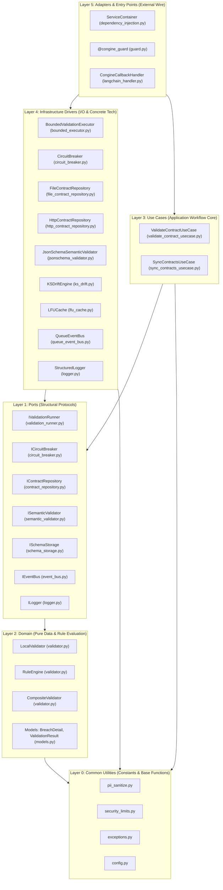

# ENTERPRISE-GRADE ARCHITECTURAL AUDIT & ONBOARDING GUIDE
**To:** Enterprise Infrastructure & Systems Engineering Teams  
**From:** Senior Principal AI Systems Architect & Enterprise Infrastructure Auditor  
**Subject:** Deterministic Enforcement Engine Codebase Audit & Architectural Analysis

---

# PART 1: Comprehensive Codebase Audit & Functional Status

## 1.1 Core Architecture Map
The **Congine SDK** is architected using a strict dependency-injected **Hexagonal (Clean) Architecture** model consisting of five logical layers designed to separate pure business logic from infrastructure concerns. The dependency graph points strictly inwards, ensuring that core validation rules and entities remain free of framework dependencies and I/O pollution.

Below is the architectural layout mapped directly from the codebase structure:



*   **Layer 0: Core Shared Utilities:** Provides types, exceptions, and security constants (e.g., **[security_limits.py](file:///d:/AMCE_MVP/congine_workspace/libs/congine-sdk/src/congine_core/security_limits.py)** and **[pii_sanitize.py](file:///d:/AMCE_MVP/congine_workspace/libs/congine-sdk/src/congine_core/pii_sanitize.py)**) usable by all layers.
*   **Layer 1: Ports (Ports Module):** Exposes structural protocols (`typing.Protocol`) defining abstract capabilities (I/O boundaries, execution contexts).
*   **Layer 2: Domain Logic (Domain Module):** Houses pure, stateless functional execution rules (e.g., `RuleEngine` in **[validator.py](file:///d:/AMCE_MVP/congine_workspace/libs/congine-sdk/src/congine_core/domain/validator.py)**) and immutable models (e.g., `BreachDetail` and `ValidationResult` in **[models.py](file:///d:/AMCE_MVP/congine_workspace/libs/congine-sdk/src/congine_core/domain/models.py)**).
*   **Layer 3: Use Cases (Usecases Module):** Orchestrates application workflows, coordinating models and ports.
*   **Layer 4: Infrastructure (Infrastructure Module):** Provides concrete adapters implementing Layer 1 ports (network interfaces, cache stores, system threads).
*   **Layer 5: Application Adapters (Adapters Module):** Integrates with external frameworks (LangChain, decorators, DI container).

---

## 1.2 Mechanisms of Determinism
To act as a reliable gateway over stochastic AI agents, the engine implements five programmatic mechanisms to guarantee runtime determinism, prevent resource starvation, and avoid catastrophic failure:

1.  **Linear-Time Regular Expression Evaluation:**
    In **[validator.py](file:///d:/AMCE_MVP/congine_workspace/libs/congine-sdk/src/congine_core/domain/validator.py)**, the rule `RuleEngine.REGEX_PATTERN` (Lines 230–290) compiles and caches regex strings using `google-re2` via `_compiled_pattern` (Line 42). By avoiding traditional backtracking engines, the SDK guarantees $O(N)$ execution time relative to input length, neutralizing Regular Expression Denial of Service (ReDoS) vectors.
2.  **Strict Resource Budgeting:**
    The SDK enforces structural limits defined in **[security_limits.py](file:///d:/AMCE_MVP/congine_workspace/libs/congine-sdk/src/congine_core/security_limits.py)** at ingress. In **[validate_contract_usecase.py](file:///d:/AMCE_MVP/congine_workspace/libs/congine-sdk/src/congine_core/usecases/validate_contract_usecase.py)**:
    *   `_check_payload_size` (Lines 125–141) rejects payloads exceeding `max_payload_bytes` (Default: 1MB).
    *   `_check_schema_size` (Lines 143–159) rejects schemas exceeding `max_schema_bytes` (Default: 1MB).
    *   `RuleEngine.REGEX_PATTERN` enforces `MAX_PATTERN_LENGTH` (1,000 characters) and `MAX_REGEX_VALUE_LENGTH` (50,000 characters) to prevent CPU resource exhaustion.
3.  **Semaphore-Governed Load Shedding:**
    In **[bounded_executor.py](file:///d:/AMCE_MVP/congine_workspace/libs/congine-sdk/src/congine_core/infrastructure/bounded_executor.py)**, the `BoundedValidationExecutor` caps outstanding validation requests using a `threading.BoundedSemaphore` initialized to `max_workers + max_pending` (Line 60). Rather than allowing request queues to grow unboundedly, the executor sheds load immediately (`raise TimeoutError`) when the semaphore is fully acquired (Line 161).
4.  **Zombie Thread Capacity Allocation:**
    In Python, running OS threads cannot be forcibly killed. If a validation execution exceeds `timeout_ms`, the caller receives a `TimeoutError` and degrades gracefully. Crucially, the permit in `BoundedValidationExecutor` is released only via a future done-callback:
    ```python
    future.add_done_callback(lambda _f: self._release())
    ```
    This ensures that a slow/hung "zombie" thread continues to occupy pool capacity until it completes, preventing the application from hiding resource starvation.
5.  **Re-entrancy Protection:**
    To prevent deadlocks when validation is invoked re-entrantly from a pool worker thread, `BoundedValidationExecutor` tags threads using a thread-local variable:
    ```python
    def _init_worker(self) -> None:
        self._local.is_worker = True
    ```
    If `run_with_timeout` detects it is running on a pool worker, it executes the payload inline (`return func()`) rather than deadlocking on a secondary submission permit (Lines 100–101, 137–138).

---

## 1.3 State & Data Flow Analysis
The runtime state is divided between in-memory caches, transient queue buffers, and persistent local snapshots. 

### Data Flow Lifecycle Diagram
```
[Untrusted Payload Ingress]
           │
           ▼
┌──────────────────────────────────────┐
│  ValidateContractUseCase.execute()   │
│  - Enforce payload / schema limits   │
│  - Resolve schema from LFUCache      │
└──────────────────┬───────────────────┘
                   │
                   ▼
┌──────────────────────────────────────┐
│      BoundedValidationExecutor       │
│  - Acquire Semaphore permit          │
│  - Thread Pool dispatch (or inline)  │
└──────────────────┬───────────────────┘
                   │
                   ▼
┌──────────────────────────────────────┐
│         CompositeValidator           │
│  - LocalValidator (RuleEngine check)  │
│  - JsonSchemaSemanticValidator       │
└──────────────────┬───────────────────┘
                   │
                   ▼
┌──────────────────────────────────────┐
│  Telemetry Outbox & PII Sanitizer    │
│  - Redact PII in breach messages     │
│  - Publish to QueueEventBus (async)  │
└──────────────────┬───────────────────┘
                   │
         ┌─────────┴─────────┐
         ▼                   ▼
    [Pass Route]       [Fail Route]
    Return Output      Evaluate FailMode:
                       - STRICT: Raise Error
                       - DEGRADE: Warn & Return
                       - SILENT: Return Output
```

*   **Ingress & Limit Checks:** The payload and target contract details enter the usecase via `@congine_guard`. The payload is checked for size limits.
*   **Cache Resolution:** The schema is fetched from the thread-safe `LFUCache` (**[lfu_cache.py](file:///d:/AMCE_MVP/congine_workspace/libs/congine-sdk/src/congine_core/infrastructure/lfu_cache.py)**). On a cache miss or TTL expiry, a `CongineContractNotFoundError` is raised, forcing the caller to handle the missing schema.
*   **Timed Execution:** The payload is processed by the validator through the `BoundedValidationExecutor`. If execution exceeds `timeout_ms`, a `TimeoutError` is thrown, and the use case evaluates degradation.
*   **Validation:** The `CompositeValidator` merges the results of the fast `LocalValidator` and the full `JsonSchemaSemanticValidator`.
*   **Telemetry Shipping:** The raw breaches are sanitized using `sanitize_breach_message` (**[pii_sanitize.py](file:///d:/AMCE_MVP/congine_workspace/libs/congine-sdk/src/congine_core/pii_sanitize.py)**), which redacts quoted string patterns and long numbers to prevent logging PII. The sanitized telemetry event is published to `QueueEventBus` (**[queue_event_bus.py](file:///d:/AMCE_MVP/congine_workspace/libs/congine-sdk/src/congine_core/infrastructure/queue_event_bus.py)**), placing it in a `queue.Queue` with a capacity of 10,000 events. A background daemon thread drains the queue in batches (default: 100) and posts them to `/api/v1/telemetry`.
*   **Breach Enforcement:** The use case evaluates the `FailMode` configuration:
    *   `STRICT`: Raises `CongineValidationError`.
    *   `DEGRADE`: Logs a warning and returns the payload.
    *   `SILENT`: Silently returns the validation result.

---

## 1.4 Technical Debt & Bottlenecks

### 1. Blocking I/O inside Async Contexts
In **[file_contract_repository.py](file:///d:/AMCE_MVP/congine_workspace/libs/congine-sdk/src/congine_core/infrastructure/file_contract_repository.py)**, the method `fetch_active_contracts` is declared `async` (Line 53) but executes synchronous blocking file reads (`open()` and `glob.glob`) on the event loop:
```python
def _read_json_file(self, path: str) -> object:
    with open(path, "rb") as fh:
        raw = fh.read(self.max_file_bytes + 1)
```
This halts the asyncio loop, blocking concurrent tasks during local-first operations.

### 2. High-Overhead CPU Operations on the Hot Path
In **[validate_contract_usecase.py](file:///d:/AMCE_MVP/congine_workspace/libs/congine-sdk/src/congine_core/usecases/validate_contract_usecase.py)**, payload size enforcement relies on `json.dumps(payload)` (Line 127). For large, deeply nested payloads, this serialization block runs synchronously on the thread pool, consuming CPU cycles and increasing latency.

### 3. Eviction-Related Latency Spikes in Multi-Tenant Environments
In **[dependency_injection.py](file:///d:/AMCE_MVP/congine_workspace/libs/congine-sdk/src/congine_core/adapters/dependency_injection.py)**, the multi-tenant registry (`_tenant_registry`) has a hardcoded limit of 128 active tenants. When this limit is exceeded, the oldest tenant's container is popped and torn down via `.close()` (Lines 108–114). Under high-volume, multi-tenant loads, this leads to thrashing—where containers are repeatedly destroyed and re-initialized, causing severe latency spikes during the bootstrapping phase of cold tenants.

### 4. Lock Contention on Shared Cloud Filesystems
The `HttpContractRepository` (**[http_contract_repository.py](file:///d:/AMCE_MVP/congine_workspace/libs/congine-sdk/src/congine_core/infrastructure/http_contract_repository.py)**) coordinates file access using a shared lock (`.lock` file via `portalocker`). When deploying to container platforms like Kubernetes using shared volumes (e.g., AWS EFS or NFS), file locking operations introduce significant I/O latency. This contention can stall container startup times during scaling events.

---

# PART 2: Zero-to-Hero Architectural Onboarding Guide

## 2.1 The Reading Order
To quickly master the codebase, follow this sequential reading path:

```
[Layer 0: Core Shared]
   - security_limits.py  --> Understand global constraints and security boundaries
   - pii_sanitize.py     --> Inspect PII redaction regular expressions
   - exceptions.py       --> Understand the error classification tree
          │
          ▼
[Layer 1: Port Protocols]
   - ports/              --> Review the IValidationRunner, ICircuitBreaker, and IEventBus protocols
          │
          ▼
[Layer 2: Domain Logic]
   - domain/models.py    --> Inspect core immutable value objects (BreachDetail, ValidationResult)
   - domain/validator.py --> Study the stateless RuleEngine static methods
          │
          ▼
[Layer 3: Use Cases]
   - usecases/validate_contract_usecase.py --> Study the core validation orchestration flow
   - usecases/sync_contracts_usecase.py     --> Understand the cache syncing policies
          │
          ▼
[Layer 4: Infrastructure]
   - infrastructure/bounded_executor.py   --> Study the semaphore and thread pooling mechanics
   - infrastructure/lfu_cache.py          --> Examine the O(1) cache storage implementation
   - infrastructure/queue_event_bus.py    --> Study the background daemon queue and client pooling
          │
          ▼
[Layer 5: Application Adapters]
   - adapters/dependency_injection.py --> Analyze container lifecycle and multi-tenancy limits
   - adapters/guard.py                --> Review the decorator pattern implementation
```

---

## 2.2 The Lifecycle Trace
To watch the validation engine in action, set breakpoints at the following locations and step through a request:

### Step-by-Step Execution Path & Breakpoint Guide
```
1. Function Call Intercepted
   └─► guard.py:L76 (sync_wrapper)
       └─► Resolves default container & extracts payload
2. Use Case Invocation
   └─► validate_contract_usecase.py:L49 (execute)
       └─► Evaluates payload size boundaries
3. Cache Schema Resolution
   └─► lfu_cache.py:L79 (get)
       └─► Looks up schema in cache and increments LFU frequency
4. Concurrency Guard & Submission
   └─► bounded_executor.py:L84 (run_with_timeout)
       └─► Acquires semaphore permit; dispatches thread to pool
5. Validation Run
   └─► validator.py:L436 (validate)
       ├─► validator.py:L369 (LocalValidator) -> Runs pure RuleEngine rules
       └─► jsonschema_validator.py:L99 (JsonSchemaSemanticValidator) -> Runs jsonschema validation
6. Telemetry Logging & Sanitization
   └─► validate_contract_usecase.py:L205 (_finalize)
       ├─► pii_sanitize.py:L17 (sanitize_breach_message) -> Redacts PII
       └─► queue_event_bus.py:L99 (publish) -> Enqueues telemetry asynchronously
7. Enforcement Policy Execution
   └─► validate_contract_usecase.py:L232 (_handle_failure)
       └─► Raises CongineValidationError if FailMode is STRICT
```

---

## 2.3 Mental Model Blueprint
To reason about the codebase effectively, keep these core architectural patterns in mind:

### 1. Hexagonal Architecture (Ports and Adapters)
The application core (Domain & Use Cases) is decoupled from external concerns. Ports (Layer 1 protocols) define the interface requirements, while Infrastructure (Layer 4) adapts external libraries and I/O to match these protocols. This separation allows you to swap out components (e.g., replacing `JsonSchemaSemanticValidator` with a Pydantic-based validator) without altering the core validation flow.

### 2. Stateless Policy vs. Stateful Mechanism
The domain validator and rule engines are stateless, side-effect-free, and CPU-bound. State management—such as the schema cache and telemetry queue—is deferred to infrastructure adapters. This ensures that the core validation logic remains deterministic and easy to test.

### 3. Outbox Pattern for Telemetry
To maintain sub-millisecond execution times, the system offloads telemetry. Writing to the network is handled asynchronously by placing events in a background queue (`QueueEventBus`), decoupling logging from the main request flow.

### 4. Coordinated Bootstrapping (Single-Flight)
Under high concurrency (e.g., when launching many container replicas), the boot process coordinates schema fetching via a shared lock. The first process to acquire the lock fetches the schemas and writes a local snapshot, while other processes wait and read from this snapshot, protecting the control plane from database herd issues.

---

# PART 3: Enterprise Market Readiness & Feature Gap Strategy

## 3.1 Enterprise Gap Analysis

| Feature Area | Current Implementation Status | Vulnerability / Impact | Enterprise Requirement |
| :--- | :--- | :--- | :--- |
| **Multi-Tenant Scaling** | Registry with a hard limit of 128 tenants. Re-initializes containers on cache eviction. | Container initialization overhead causes latency spikes for cold tenants under load. | Shared thread pools and caches with dynamically routed tenant credentials. |
| **Durable Telemetry** | Telemetry events are stored in an in-memory `queue.Queue`. | Telemetry events are lost if the application container crashes before they are shipped. | Write-Ahead Log (WAL) backed by a local store like SQLite or RocksDB. |
| **Non-Repudiation** | Raw JSON payloads are transmitted over standard HTTP channels. | Validation results can be tampered with or fabricated in transit. | Cryptographically signed validation results using HMAC or asymmetric keys. |
| **Isolation Mechanics** | Validations run in thread pools sharing the same process memory. | A memory leak or segmentation fault in one tenant can crash the entire engine. | WebAssembly (WASM) or sub-process isolation for executing validation scripts. |
| **Access Control** | The SDK relies on a static global API key header. | No mechanism to restrict which services or tenants can access specific schemas. | Attribute-Based Access Control (ABAC) integrating with OPA or Keycloak. |

---

## 3.2 Next-Phase Feature Roadmap

### 1. WASM-Based Validation Sandbox
To isolate tenant execution and prevent malicious code from crashing the main process, transition the validation runner to a WebAssembly (WASM) host (such as `wasmer` or `wasmtime`). This allows the engine to set hard limits on memory usage and CPU cycles, terminating execution immediately on timeout without leaving orphan threads.

```python
# Proposed Architecture for WASM Validation Execution
class WASMValidationRunner(IValidationRunner):
    def __init__(self, wasm_module_bytes: bytes):
        self.engine = Engine()
        self.store = Store(self.engine)
        self.module = Module(self.store, wasm_module_bytes)
        
    def run_with_timeout(self, payload: dict, timeout_ms: int) -> dict:
        # Set CPU and memory bounds on the WASM store
        self.store.set_epoch_deadline(timeout_ms)
        instance = Instance(self.store, self.module, [])
        # Call the exported validation function inside the sandbox
        return instance.exports.validate(payload)
```

### 2. Durable Local Outbox (Write-Ahead Log)
Replace the transient in-memory queue with an embedded database (e.g., SQLite in WAL mode) to prevent telemetry loss during unexpected application crashes.

```python
# Proposed SQLite-Backed Durable Outbox
class SQLiteDurableEventBus(IEventBus):
    def __init__(self, db_path: str):
        self.db_path = db_path
        self._init_db()
        
    def publish(self, event: TelemetryEvent) -> None:
        # Commit to local SQLite database synchronously
        with sqlite3.connect(self.db_path) as conn:
            conn.execute(
                "INSERT INTO telemetry_outbox (payload, status) VALUES (?, 'PENDING')",
                (json.dumps(event),)
            )
```

### 3. Cryptographic Validation Receipts
Generate signed validation receipts to provide non-repudiation for audit logs, ensuring that validation records cannot be altered.

```python
# Proposed Cryptographic Signing Block
def generate_signed_receipt(result: ValidationResult, private_key_pem: bytes) -> str:
    payload = json.dumps(result.__dict__, sort_keys=True).encode('utf-8')
    private_key = serialization.load_pem_private_key(private_key_pem, password=None)
    signature = private_key.sign(
        payload,
        padding.PSS(mgf=padding.MGF1(hashes.SHA256()), salt_length=padding.PSS.MAX_LENGTH),
        hashes.SHA256()
    )
    return base64.b64encode(signature).decode('utf-8')
```

---

## 3.3 Scalability Strategy

```
[Edge Layer: Cloudflare / Lambda]
        │ (Pure Python / JS WASM Build)
        ▼
[Horizontal Scale: K8s Pods] ──(Dynamic Registry)──► [Shared Redis Lock Manager]
        │                                                     │
        ▼ (Single Tenant Instance)                            ▼
[Local SQLite Outbox] ──(Network Batch Sync)────────► [Distributed Telemetry Sink]
```

### 1. Edge Deployment Compatibility
The dependency on native C-extensions like `google-re2` prevents the SDK from running in constrained edge environments (e.g., Cloudflare Workers or AWS Lambda). To support these environments, update the packaging to offer a pure Python fallback (with warnings) or compile the engine core to WASM using Pyodide.

### 2. Distributed Boot Coordination
The current boot synchronization uses file-based locking (`portalocker`), which is inefficient on shared network filesystems. For large-scale container deployments, replace this with a distributed lock coordinator using the Kubernetes Lease API or Redis.

### 3. Dynamic Multi-Tenant Registry Routing
To prevent container eviction loops in multi-tenant environments, refactor the `ServiceContainer` to decouple tenant configuration from container lifetime. Use a single shared thread pool and cache instance, passing tenant credentials dynamically as context metadata with each validation request.
